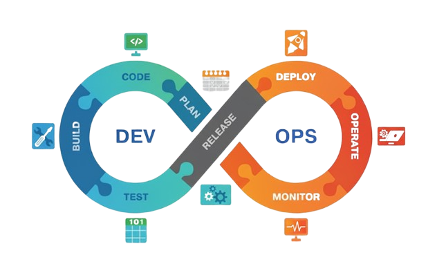

# DevOps Learning Path

Este repositorio documenta un **viaje de aprendizaje completo y moderno en DevOps**, desde los conceptos básicos hasta temas avanzados incluyendo **ciberseguridad, inteligencia artificial, arquitectura de software y liderazgo técnico**.

El curso ha sido **completamente renovado y expandido**para incluir las competencias más demandadas en el mercado actual, preparando para roles senior y de liderazgo en tecnología.

> **NOVEDAD!**La **Fase 1 - Fundamentos DevOps**está **100% completada**con 46+ páginas de contenido técnico detallado, laboratorios prácticos y ejemplos de código real. **Ya puedes comenzar tu viaje DevOps!**

## Empieza Ahora

### Tu Primer Paso: Fase 1 Completa

#### LISTA PARA ESTUDIAR

La [**Fase 1 - Fundamentos de DevOps**](resources/fase1/) está **completamente desarrollada**y lista para tu aprendizaje:

- **8 archivos completos**con contenido profesional
- **46+ páginas**de material técnico detallado
- **Laboratorios hands-on**con ejemplos reales
- **Scripts y automatización**incluidos
- **Progresión gradual**de básico a avanzado

**[Comenzar con Fase 1](resources/fase1/01-que-es-devops.md)**

## Acceso Rápido

| Enlace | Descripción | Estado |
|--------|-------------|--------|
| [Roadmap Completo](roadmap.md) | Plan de estudio de las 14 fases |  |
| [Fase 1 - Fundamentos](resources/fase1/) | Tu punto de inicio (COMPLETA) |  |
| [Proyectos Prácticos](projects/) | Implementaciones hands-on |  |
| [Recursos por Fase](resources/) | Materiales organizados |  |
| [Notas Especializadas](notes/) | Guías técnicas avanzadas |  |
| [Scripts](scripts/) | Automatización y herramientas |  |

### **Tiempo de Dedicación Recomendado**

- **Fase 1**: 3-4 semanas (8-12 horas/semana)
- **Curso completo**: 46+ semanas (10-15 horas/semana)
- **Modalidad**: Flexible, a tu ritmo

## Novedades del Curso Actualizado

### **Nuevas Fases Agregadas (2024-2025)**

- **7 nuevas fases especializadas**en tecnologías de vanguardia
- **Proyecto final integrador**de 7 semanas con microservicios, IA y seguridad
- **+40 horas de contenido**adicional estimado
- **Enfoque en habilidades senior**y liderazgo técnico

### **Ciberseguridad Integral**

- Principios de seguridad de la información (CIA)
- OWASP Top 10 para desarrolladores .NET
- Seguridad en la nube (Azure/AWS)
- APIs seguras con JWT y OAuth2

### **Inteligencia Artificial Aplicada**

- Fundamentos de Machine Learning
- ML.NET y integración con Python
- Procesamiento de lenguaje natural (NLP)
- Ética e impacto responsable de la IA

### **Arquitectura Avanzada**

- Arquitectura limpia y principios SOLID
- Patrones hexagonales y microservicios
- Observabilidad y monitoreo avanzado
- Diseño de sistemas distribuidos

### **Liderazgo Técnico**

- Comunicación efectiva y storytelling técnico
- Mentoría y desarrollo de equipos
- Pensamiento sistémico y visión estratégica
- Gestión del cambio organizacional

# Ruta de Aprendizaje DevOps

Bienvenido a la Ruta de Aprendizaje DevOps! Este repositorio es una guía completa y estructurada para aprender DevOps desde los fundamentos hasta un nivel avanzado, combinando teoría y práctica.

---

> Este diagrama muestra las fases clave del viaje completo de aprendizaje en DevOps moderno.

## ¿A Quién va Dirigido este Repositorio?

Esta guía está diseñada principalmente para:

- [Plan de Estudio Completo](roadmap.md)
- [Proyectos Prácticos](projects/)
- [Recursos Útiles](resources/)
- [Notas Personales](notes/)
- [Scripts de Automatización](scripts/)

- **Desarrolladores de Software**que buscan hacer la transición a un rol de DevOps o simplemente quieren entender mejor el ciclo de vida completo del software.
- **Administradores de Sistemas (SysAdmins)**que desean modernizar sus habilidades y adoptar prácticas de automatización e infraestructura como código.
- **Estudiantes y Recién Graduados**que quieren construir una base sólida de conocimientos en DevOps.
- **Cualquier persona con curiosidad**por aprender sobre la cultura, las prácticas y las herramientas que están transformando la industria del software.

Se asume una familiaridad básica con la informática, pero la **Fase 0**está diseñada para poner a todos al día con la herramienta más fundamental: la línea de comandos.

---

## ¿Cómo Empezar?

La mejor manera de usar este repositorio es seguir el plan de estudio.

1. **Consulta el `roadmap.md`: **El archivo [**roadmap.md**](./roadmap.md) es el corazón de esta guía. Contiene la ruta de aprendizaje completa, dividida en fases progresivas.
2. **Empieza por la Fase 0: **No subestimes los fundamentos. La [**Fase 0: Dominio de la Terminal**](./roadmap.md#fase-0-dominio-de-la-terminal) te dará la fluidez necesaria en la línea de comandos para tener éxito en las fases posteriores.
3. **Avanza a tu propio ritmo: **Cada fase está diseñada para construir sobre la anterior. Explora los recursos, lee las notas y, lo más importante, practica!

---

## Estructura del Repositorio

- [**roadmap.md**](./roadmap.md): El plan de estudio detallado, dividido en fases. **Empieza aquí!**
- [**resources/**](./resources/): Contiene todo el material de aprendizaje, organizado por fases.
- [**notes/**](./notes/): Apuntes y resúmenes personales sobre herramientas específicas como Docker, Git y Kubernetes.
- [**assets/**](./assets/): Recursos multimedia como audios y videos mencionados en la guía.
- [**images/**](./images/): Imágenes y diagramas utilizados en la documentación.

---

## Estructura del Curso

### Fases Fundamentales (1-6)

Duración estimada: 20-24 semanas_

- **Fase 1**: [Fundamentos de DevOps](resources/fase1/) - Principios, cultura y herramientas básicas
- **Fase 2**: [Automatización y CI/CD](resources/fase2/) - Pipelines y flujos automatizados
- **Fase 3**: [Contenedores y Orquestación](resources/fase3/) - Docker, Kubernetes y Helm
- **Fase 4**: [Infraestructura como Código](resources/fase4/) - Terraform, Ansible y mejores prácticas
- **Fase 5**: [Monitoreo y Observabilidad](resources/fase5/) - Prometheus, Grafana y DevSecOps básico
- **Fase 6**: [Nube y Arquitectura Moderna](resources/fase6/) - Cloud services, serverless y microservicios

### Fases Avanzadas (7-12)

- Proveer una ruta de aprendizaje en DevOps clara, estructurada y en español.
- Documentar mi propio progreso y descubrimientos en DevOps.
- Compartir conocimientos y recursos valiosos con la comunidad.
- Crear un espacio para experimentar con herramientas y tecnologías.

## Cómo Contribuir

Si encuentras errores, tienes sugerencias para mejorar el contenido o quieres añadir algo, siéntete libre de abrir un issue o enviar un pull request! Toda contribución es bienvenida.

*Duración estimada: 19 semanas_

- **Fase 7**: [Ciberseguridad en DevOps](resources/fase7/) _(7 semanas)_
  - Principios de seguridad de la información y modelo CIA
  - OWASP Top 10 con ejemplos prácticos en .NET
  - Seguridad en cloud (Azure/AWS) y gestión de secretos
  - APIs seguras con JWT, OAuth2 y rate limiting

- **Fase 8**: [Inteligencia Artificial aplicada](resources/fase8/) _(7 semanas)_
  - Fundamentos de Machine Learning y algoritmos
  - ML.NET, integración con Python y modelos preentrenados
  - NLP, chatbots y análisis de sentimiento
  - IA ética, sesgos y privacidad de datos

- **Fase 9**: [Arquitectura de Software y Microservicios](resources/fase9/) _(8 semanas)_
  - Clean Architecture y principios SOLID
  - Patrón hexagonal y separación de responsabilidades
  - Microservicios en .NET con comunicación y resiliencia
  - Observabilidad avanzada con logging, tracing y métricas

- **Fase 10**: [DevOps y Automatización Avanzada](resources/fase10/) _(5 semanas)_
  - CI/CD enterprise con GitHub Actions y Azure DevOps
  - Kubernetes avanzado con operators y service mesh
  - IaC avanzado con Bicep y ARM Templates

- **Fase 11**: [Metodologías Ágiles Avanzadas](resources/fase11/) _(3 semanas)_
  - Scrum y Kanban optimizados con métricas
  - Escalado ágil (SAFe, LeSS) para organizaciones
  - Lean Software Development y eliminación de desperdicios

- **Fase 12**: [Habilidades Blandas y Liderazgo](resources/fase12/) _(4 semanas)_
  - Comunicación efectiva, feedback y negociación técnica
  - Liderazgo técnico, mentoría y gestión de conflictos
  - Pensamiento sistémico y gestión del cambio

### Fases de Aplicación (13-14)

*Duración estimada: 7+ semanas_

- **Fase 13**: [Proyecto Final Integrador](projects/proyecto-final-integrador/) _(7 semanas)_
  - Microservicio completo con IA integrada
  - Arquitectura segura end-to-end
  - Despliegue en Azure con CI/CD completo
  - Monitoreo, alertas y observabilidad

- **Fase 14**: [Certificaciones y Carrera](resources/fase14/) _(Variable)_
  - Certificaciones cloud (AWS, Azure, GCP)
  - Especializaciones (Kubernetes, Docker, Terraform)
  - Desarrollo de carrera y networking profesional

## Características del Curso

### **Metodología de Aprendizaje**

- **Teoría + Práctica**: Cada fase combina conceptos con proyectos hands-on
- **Progresión gradual**: De básico a avanzado con prerrequisitos claros
- **Proyectos reales**: Casos de uso empresariales y escenarios productivos
- **Evaluación continua**: Tests, proyectos y presentaciones

### **Stack Tecnológico Completo**

**Backend & APIs: **

- .NET 8, ASP.NET Core, Entity Framework
- Node.js, Python (integración)
- GraphQL, gRPC, REST APIs

**Frontend & UI: **

- React, Angular, Blazor
- Micro-frontends, PWAs

**Bases de Datos: **

- SQL Server, PostgreSQL, MySQL
- MongoDB, Cosmos DB, Redis

**Cloud & Infrastructure: **

- Azure, AWS, Google Cloud
- Docker, Kubernetes, Helm
- Terraform, Bicep, ARM Templates

**DevOps & Monitoring: **

- GitHub Actions, Azure DevOps
- Prometheus, Grafana, ELK Stack
- Application Insights, Jaeger

**Security & AI: **

- Azure Security Center, HashiCorp Vault
- ML.NET, Azure Cognitive Services
- OpenAI API, TensorFlow.NET

### **Niveles de Competencia**

- **Básico (Fases 1-3)**: Fundamentos y primeras prácticas
- **Intermedio (Fases 4-8)**: Especialización y profundización
- **Avanzado (Fases 9-12)**: Arquitectura y liderazgo
- **Experto (Fases 13-14)**: Aplicación integral y certificación

### **Objetivos de Carrera**

Al completar el curso estarás preparado para roles como:

- **Senior DevOps Engineer**
- **Platform Engineer**
- **Cloud Architect**
- **Site Reliability Engineer (SRE)**
- **DevSecOps Specialist**
- **Technical Lead / Engineering Manager**

## Objetivos del Repositorio

Este repositorio ha sido **completamente renovado**para proporcionar:

### **Aprendizaje Integral**

- **Viaje completo**: Desde principiante hasta experto senior
- **Tecnologías modernas**: Stack actualizado a 2024-2025
- **Competencias transversales**: Técnicas + blandas + liderazgo
- **Preparación profesional**: Para roles de alta responsabilidad

### **Innovación y Vanguardia**

- **IA aplicada**: Machine Learning y NLP en soluciones reales
- **Seguridad integral**: DevSecOps desde el diseño
- **Arquitectura moderna**: Microservicios y sistemas distribuidos
- **Liderazgo técnico**: Habilidades para guiar equipos y organizaciones

### **Comunidad y Colaboración**

- **Conocimiento abierto**: Compartir experiencias y mejores prácticas
- **Experimentación**: Laboratorio para nuevas tecnologías
- **Mentorización**: Recursos para enseñar y aprender
- **Networking**: Conexión con profesionales del sector

## Índice de Recursos

- [Plan de Estudio Completo](roadmap.md) - Roadmap detallado con todas las fases
- [Proyectos Prácticos](projects/) - Implementaciones hands-on
- [Recursos de Aprendizaje](resources/) - Materiales por fase
- [Notas Técnicas Avanzadas](notes/) - Guías especializadas:
  - [Ciberseguridad en DevOps](notes/cybersecurity-notes.md)
  - [IA y Machine Learning](notes/ai-ml-notes.md)
  - [ Liderazgo Técnico](notes/leadership-notes.md)
  - [ Docker y Contenedores](notes/docker-notes.md)
  - [ Kubernetes](notes/kubernetes-notes.md)
  - [Git y Control de Versiones](notes/git-notes.md)
- [Scripts de Automatización](scripts/) - Herramientas de productividad

## Empezar el Viaje

### **Prerrequisitos Recomendados**

- Experiencia básica en programación (preferiblemente .NET/C#)
- Conocimientos fundamentales de sistemas operativos
- Familiaridad con línea de comandos
- Acceso a una suscripción de Azure (estudiante o trial)

### **Primer Paso**

1. **Revisa el [Plan de Estudio](roadmap.md)**para entender el scope completo
2. **Comienza con [Fase 1](resources/fase1/)**- Fundamentos de DevOps
3. **Configura tu entorno**de desarrollo y cloud
4. **Únete a la comunidad**y comparte tu progreso

### **Tiempo de Dedicación**

- **Tiempo total estimado**: 46+ semanas (casi 1 año)
- **Dedicación recomendada**: 10-15 horas por semana
- **Modalidad flexible**: Puedes ajustar el ritmo según tu disponibilidad

## Métricas del Curso

### **Estadísticas del Contenido Actual**

| Estado | Fase | Archivos | Páginas | Progreso |
|--------|------|----------|---------|----------|
|  | Fase 1 - Fundamentos DevOps | 8/8 | 46+ | 100% |
|  | Fase 2 - Automatización CI/CD | 0/6 | 0 | 0% |
|  | Fase 3 - Docker & Contenedores | 1/8 | 12 | 12% |
|  | Fases 4-14 | Estructura | - | Preparado |

**Total disponible para estudiar: **58+ páginas de contenido técnico

### **Estadísticas del Contenido**

- **14 fases**de aprendizaje estructurado
- **46+ semanas**de contenido estimado
- **3 categorías**de especialización (Fundamental, Avanzado, Aplicación)
- **1 proyecto integrador**de nivel empresarial
- **20+ tecnologías**cubiertas en profundidad

### **Certificaciones Preparadas**

- AWS Certified DevOps Engineer
- Azure DevOps Engineer Expert
- Kubernetes Administrator (CKA)
- Docker Certified Associate
- Terraform Associate
- Security+ y especializaciones en ciberseguridad

## Cómo Contribuir

### **Formas de Colaborar**

- **Issues**: Reportar errores o sugerir mejoras
- **Pull Requests**: Contribuir con contenido o correcciones
- **Discusiones**: Compartir experiencias y casos de uso
- **Recursos**: Recomendar herramientas, libros o cursos

### **Comunidad**

Si estás siguiendo este curso:

- Comparte tu progreso con #DevOpsLearningPath
- Conecta con otros estudiantes
- Contribuye con tus proyectos y soluciones
- Mentoriza a nuevos participantes

## Licencia

Este proyecto está bajo la licencia [MIT](LICENSE).

## Estado Actual del Curso

### **Fase 1 - COMPLETADA (100%)**

**Fundamentos de DevOps Totalmente Listos!**

La Fase 1 ha sido **completamente desarrollada**con todo el contenido necesario para comenzar tu viaje en DevOps:

#### **Contenido Disponible (8 archivos completos): **

- **[01-que-es-devops.md](resources/fase1/01-que-es-devops.md)**- Introducción y definición completa
- **[02-beneficios-devops.md](resources/fase1/02-beneficios-debops.md)**- Ventajas y casos de éxito
- **[03-devops-agile-waterfall.md](resources/fase1/03-devops-agile-waterfall.md)**- Metodologías comparadas
- **[04-ciclo-de-vida-devops.md](resources/fase1/04-ciclo-de-vida-devops.md)**- Proceso completo SDLC
- **[05-herramientas-tecnologias-clave.md](resources/fase1/05-herramientas-tecnologias-clave.md)**- Stack tecnológico esencial
- **[06-introduccion-nube.md](resources/fase1/06-introduccion-nube.md)**- Fundamentos cloud
- **[07-conceptos-clave.md](resources/fase1/07-conceptos-clave.md)**- CI/CD, IaC y observabilidad
- **[08-primeros-pasos-git.md](resources/fase1/08-primeros-pasos-git.md)**- Git mastery completo

#### **Lo que obtienes en la Fase 1: **

- **46+ páginas**de contenido técnico detallado
- **Ejemplos prácticos**con código real
- **Laboratorios hands-on**para cada herramienta
- **Troubleshooting guides**y mejores prácticas
- **Ejercicios graduales**de básico a avanzado
- **Scripts de automatización**listos para usar

#### **Próximo paso recomendado: **

**Ya puedes comenzar con la [Fase 1](resources/fase1/) completa!**Todo el contenido está listo para tu aprendizaje.

### **Estado de Otras Fases: **

- **Fases 2-14**: Estructura creada, contenido en desarrollo
- **Proyectos**: Directorio base configurado
- **Recursos**: Organizados por fase y tema
- **Scripts**: Área preparada para automatización

---

### **Última Actualización: 12 de Octubre 2025**

**Changelog v2.1: **

- **Fase 1 completamente terminada**(8 archivos con 46+ páginas)
- Contenido técnico detallado con ejemplos prácticos
- Laboratorios hands-on y ejercicios graduales
- 7 nuevas fases especializadas agregadas
- Proyecto final integrador completo
- Notas técnicas avanzadas para ciberseguridad, IA y liderazgo
- Stack tecnológico actualizado a 2024-2025
- Preparación para roles senior y liderazgo

**Próximas mejoras planificadas: **

- Completar contenido de Fases 2-6 (Fundamentos)
- Desarrollar Fases 7-12 (Especializaciones avanzadas)
- Ejemplos de código interactivos
- Videos explicativos para conceptos complejos
- Laboratorios virtuales automatizados
- Sistema de tracking de progreso

Este proyecto está bajo la licencia [MIT](./LICENSE).
