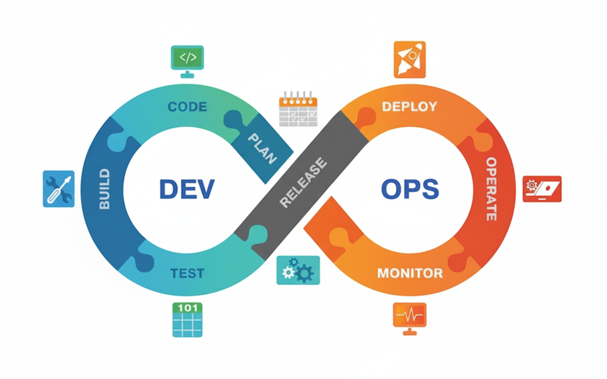

# DevOps Learning Path 🚀

Este repositorio documenta un viaje de aprendizaje en DevOps, desde los conceptos básicos hasta temas avanzados. Incluye un plan de estudio detallado, proyectos prácticos, recursos útiles y notas personales.

## Diagrama de Aprendizaje

_Este diagrama muestra las fases clave de mi viaje de aprendizaje en DevOps._

## Índice

- [Plan de Estudio](roadmap.md)
- [Proyectos Prácticos](projects/)
- [Recursos Útiles](resources/)
- [Notas Personales](notes/)

## Objetivo

El objetivo de este repositorio es:

- Documentar mi progreso en DevOps.
- Compartir conocimientos con la comunidad.
- Crear un espacio para experimentar con herramientas y tecnologías.

## Cómo contribuir

Si encuentras errores o tienes sugerencias o tienes algo que aportar, ¡siéntete libre de abrir un issue o enviar un pull request!

## Licencia

Este proyecto está bajo la licencia [MIT](LICENSE).
