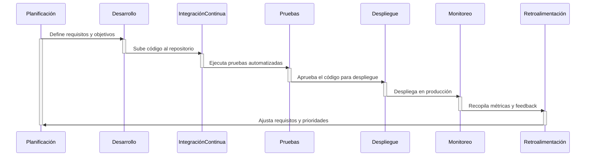

# El ciclo de vida de DevOps

El ciclo de vida de DevOps es un proceso continuo que integra desarrollo, operaciones y automatización para entregar software de manera rápida, eficiente y confiable. A continuación, te explico las etapas clave del ciclo de vida de DevOps y sus componentes principales:

---

## **1. Planificación (Plan)**

- **Objetivo**: Definir los requisitos del software, priorizar tareas y establecer objetivos.
- **Actividades**:
  - Colaboración entre equipos de desarrollo, operaciones y stakeholders.
  - Uso de herramientas como Jira, Trello o Azure DevOps para gestionar tareas y backlogs.
- **Importancia**: Asegura que todos los equipos estén alineados con los objetivos del proyecto.

---

## **2. Desarrollo (Code)**

- **Objetivo**: Escribir el código del software de manera colaborativa y eficiente.
- **Actividades**:
  - Uso de sistemas de control de versiones como Git, GitHub, GitLab o Bitbucket.
  - Implementación de prácticas como code reviews y pair programming.
- **Importancia**: Facilita la colaboración y el seguimiento de cambios en el código.

---

## **3. Integración Continua (Continuous Integration - CI)**

- **Objetivo**: Integrar el código de múltiples desarrolladores en un repositorio compartido de manera frecuente y automatizada.
- **Actividades**:
  - Automatización de compilaciones y pruebas con herramientas como Jenkins, GitLab CI/CD, CircleCI o Travis CI.
  - Detección temprana de errores mediante pruebas automatizadas (unitarias, de integración).
- **Importancia**: Reduce conflictos y asegura la calidad del código.

---

## **4. Pruebas Continuas (Continuous Testing)**

- **Objetivo**: Validar la funcionalidad, rendimiento y seguridad del software.
- **Actividades**:
  - Automatización de pruebas funcionales, de rendimiento y de seguridad con herramientas como Selenium, JUnit, LoadRunner o OWASP ZAP.
  - Integración de pruebas en el pipeline de CI/CD.
- **Importancia**: Garantiza que el software cumpla con los requisitos y estándares de calidad.

---

## **5. Despliegue Continuo (Continuous Deployment - CD)**

- **Objetivo**: Automatizar el despliegue del software en entornos de prueba y producción.
- **Actividades**:
  - Uso de herramientas como Jenkins, GitLab CI/CD, ArgoCD o Spinnaker.
  - Implementación de estrategias de despliegue como blue-green deployment, canary releases o rolling updates.
- **Importancia**: Permite entregar software de manera rápida y confiable.

---

## **6. Infraestructura como Código (Infrastructure as Code - IaC)**

- **Objetivo**: Gestionar y provisionar infraestructura de manera automatizada y reproducible.
- **Actividades**:
  - Uso de herramientas como Terraform, Ansible, Puppet o Chef para definir infraestructura en código.
  - Automatización de la creación y configuración de servidores, redes y otros recursos.
- **Importancia**: Reduce errores humanos, mejora la consistencia y permite escalar rápidamente.

---

## **7. Monitoreo y Logging (Monitoring and Logging)**

- **Objetivo**: Supervisar el rendimiento del software y la infraestructura en tiempo real.
- **Actividades**:
  - Uso de herramientas como Prometheus, Grafana, ELK Stack (Elasticsearch, Logstash, Kibana) o Splunk.
  - Configuración de alertas para detectar y resolver problemas proactivamente.
- **Importancia**: Proporciona visibilidad del estado del sistema y ayuda a identificar y resolver incidencias rápidamente.

---

## **8. Operaciones y Mantenimiento (Operate and Maintain)**

- **Objetivo**: Garantizar que el software funcione correctamente en producción.
- **Actividades**:
  - Gestión de incidentes y resolución de problemas.
  - Actualizaciones y parches continuos.
- **Importancia**: Asegura la estabilidad y disponibilidad del software.

---

## **9. Retroalimentación y Mejora Continua (Feedback and Continuous Improvement)**

- **Objetivo**: Recopilar feedback de usuarios y métricas para mejorar el software y los procesos.
- **Actividades**:
  - Análisis de métricas de rendimiento, errores y satisfacción del usuario.
  - Implementación de mejoras en el código, la infraestructura y los procesos.
- **Importancia**: Fomenta la innovación y la optimización continua.

---

## **Resumen del Ciclo de Vida de DevOps**

1. **Planificación**: Definir objetivos y requisitos.
2. **Desarrollo**: Escribir y gestionar el código.
3. **Integración Continua (CI)**: Integrar y probar el código de manera automatizada.
4. **Pruebas Continuas**: Validar la calidad del software.
5. **Despliegue Continuo (CD)**: Automatizar el despliegue en producción.
6. **Infraestructura como Código (IaC)**: Gestionar infraestructura de manera automatizada.
7. **Monitoreo y Logging**: Supervisar el rendimiento y resolver problemas.
8. **Operaciones y Mantenimiento**: Garantizar la estabilidad del software.
9. **Retroalimentación y Mejora Continua**: Optimizar procesos y productos.

A continuación te muestro un diagrama de secuencia en Mermaid que ilustra cómo se integran las prácticas de DevOps con las fases del ciclo de vida del software. Este diagrama muestra la interacción entre los equipos de desarrollo, operaciones y las herramientas automatizadas en cada fase.

---

### **Explicación del Diagrama**

1. **Planificación**:
   - Los equipos definen los requisitos y objetivos del software.
   - Esta fase alimenta el inicio del ciclo de desarrollo.

2. **Desarrollo**:
   - Los desarrolladores escriben el código y lo suben a un repositorio compartido (por ejemplo, GitHub o GitLab).

3. **Integración Continua (CI)**:
   - El código se integra automáticamente en un repositorio central.
   - Se ejecutan pruebas automatizadas (unitarias, de integración) para detectar errores tempranamente.

4. **Pruebas**:
   - Las pruebas automatizadas validan la funcionalidad, rendimiento y seguridad del software.
   - Si las pruebas son exitosas, el código se aprueba para el despliegue.

5. **Despliegue**:
   - El código se despliega automáticamente en entornos de prueba o producción.
   - Se utilizan estrategias como blue-green deployment o canary releases para minimizar riesgos.

6. **Monitoreo**:
   - Se supervisa el rendimiento del software en producción.
   - Herramientas como Prometheus o Grafana recopilan métricas en tiempo real.

7. **Retroalimentación**:
   - Los datos de monitoreo y el feedback de los usuarios se utilizan para identificar áreas de mejora.
   - Esta información se retroalimenta a la fase de planificación para ajustar requisitos y prioridades.

---

## **Herramientas Comunes en el Ciclo de Vida de DevOps**

- **Control de Versiones**: Git, GitHub, GitLab.
- **CI/CD**: Jenkins, GitLab CI/CD, CircleCI.
- **Infraestructura como Código**: Terraform, Ansible, Puppet.
- **Contenedores y Orquestación**: Docker, Kubernetes.
- **Monitoreo**: Prometheus, Grafana, ELK Stack.
- **Pruebas**: Selenium, JUnit, LoadRunner.

---

> El ciclo de vida de DevOps es un proceso iterativo y colaborativo que permite a las organizaciones entregar software de alta calidad de manera rápida y eficiente, adaptándose a las necesidades cambiantes del mercado y los usuarios.
