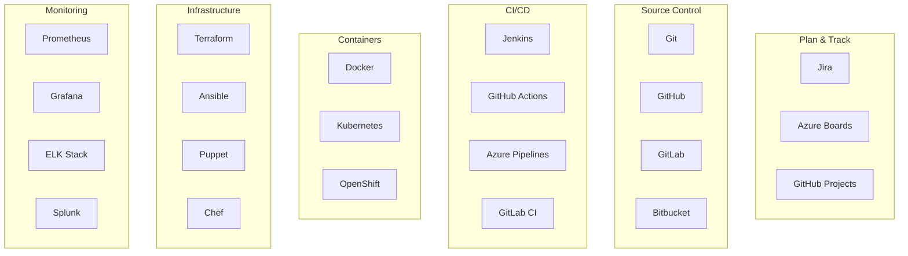

# Herramientas y Tecnologías Clave en DevOps

## Objetivos

Al completar este módulo serás capaz de:

- Identificar las herramientas fundamentales del ecosistema DevOps
- Comprender el propósito y casos de uso de cada herramienta
- Evaluar qué herramientas son apropiadas para diferentes escenarios
- Planificar la adopción de herramientas en tu organización

## El Ecosistema DevOps

DevOps no es una herramienta específica, sino una filosofía que se apoya en un ecosistema de tecnologías que automatizan y optimizan el ciclo de vida del software.

### Categorías de Herramientas DevOps



## Control de Versiones

### Git - El Estándar Universal

**¿Qué es?**Sistema de control de versiones distribuido que rastrea cambios en archivos y coordina el trabajo entre múltiples desarrolladores.

**¿Por qué es esencial?**

- Base de todo flujo de trabajo DevOps
- Permite colaboración efectiva
- Historial completo de cambios
- Branching y merging sofisticados

**Comandos fundamentales: **

```bash
# Configuración inicial
git config --global user.name "Tu Nombre"
git config --global user.email "tu.email@ejemplo.com"

# Flujo básico
git init                    # Inicializar repositorio
git add .                   # Agregar archivos al staging
git commit -m "mensaje"     # Confirmar cambios
git push origin main        # Enviar al repositorio remoto

# Branching
git branch feature/nueva-funcionalidad
git checkout feature/nueva-funcionalidad
git merge feature/nueva-funcionalidad
```

### Plataformas de Hosting

**GitHub**

-  Más popular, gran comunidad
-  GitHub Actions integrado
-  Excelente para open source
-  Limitaciones en planes gratuitos

**GitLab**

-  CI/CD integrado poderoso
-  Self-hosted disponible
-  DevOps completo en una plataforma
-  Interfaz menos intuitiva

**Azure DevOps**

-  Integración perfecta con Microsoft
-  Azure Boards para gestión de proyectos
-  Escalabilidad empresarial
-  Menos adoption en comunidad open source

## Integración y Entrega Continua (CI/CD)

### Jenkins - El Veterano Confiable

**¿Qué es?**Servidor de automatización open source que permite implementar CI/CD através de pipelines.

**Ventajas: **

- Ecosistema de plugins gigantesco (+1800)
- Altamente personalizable
- Self-hosted (control total)
- Comunidad madura

**Ejemplo de Pipeline Jenkins: **

```groovy
pipeline {
    agent any

    stages {
        stage('Build') {
            steps {
                sh 'dotnet build'
            }
        }

        stage('Test') {
            steps {
                sh 'dotnet test --collect:"XPlat Code Coverage"'
            }
        }

        stage('Deploy') {
            when {
                branch 'main'
            }
            steps {
                sh 'docker build -t mi-app .'
                sh 'docker push mi-registro/mi-app'
            }
        }
    }
}
```

### GitHub Actions - El Moderno

**¿Qué es?**Plataforma de CI/CD nativa de GitHub que automatiza workflows directamente en el repositorio.

**Ventajas: **

- Integración perfecta con GitHub
- Sintaxis YAML sencilla
- Marketplace de acciones
- Gratis para repositorios públicos

**Ejemplo de Workflow: **

```yaml
name: CI/CD Pipeline

on:
  push:
    branches: [ main, develop ]
  pull_request:
    branches: [ main ]

jobs:
  build-and-test:
    runs-on: ubuntu-latest

    steps:
    - uses: actions/checkout@v4

    - name: Setup .NET
      uses: actions/setup-dotnet@v3
      with:
        dotnet-version: '8.0.x'

    - name: Restore dependencies
      run: dotnet restore

    - name: Build
      run: dotnet build --no-restore

    - name: Test
      run: dotnet test --no-build --verbosity normal
```

### Otras Alternativas CI/CD

**GitLab CI/CD**

```yaml
# .gitlab-ci.yml
stages:
  - build
  - test
  - deploy

build-job:
  stage: build
  script:
    - dotnet build
  artifacts:
    paths:
      - bin/

test-job:
  stage: test
  script:
    - dotnet test
  coverage: '/TOTAL_COVERAGE=(\d+\.\d+)%/'
```

**Azure Pipelines**

```yaml
# azure-pipelines.yml
trigger:
- main

pool:
  vmImage: 'ubuntu-latest'

variables:
  buildConfiguration: 'Release'

steps:
- task: DotNetCoreCLI@2
  inputs:
    command: 'restore'
    projects: '**/*.csproj'

- task: DotNetCoreCLI@2
  inputs:
    command: 'build'
    projects: '**/*.csproj'
    arguments: '--configuration $(buildConfiguration)'
```

## Containerización

### Docker - Revolución en Deployment

**¿Qué es?**Plataforma que utiliza containerización para empaquetar aplicaciones con todas sus dependencias.

**Conceptos clave: **

- **Imagen**: Template inmutable de una aplicación
- **Container**: Instancia ejecutable de una imagen
- **Dockerfile**: Instrucciones para construir una imagen
- **Registry**: Repositorio de imágenes (Docker Hub, ECR, ACR)

**Ejemplo Dockerfile para .NET: **

```dockerfile
FROM mcr.microsoft.com/dotnet/aspnet:8.0 AS base
WORKDIR /app
EXPOSE 80

FROM mcr.microsoft.com/dotnet/sdk:8.0 AS build
WORKDIR /src
COPY ["MiApp.csproj", "."]
RUN dotnet restore "MiApp.csproj"
COPY . .
RUN dotnet build "MiApp.csproj" -c Release -o /app/build

FROM build AS publish
RUN dotnet publish "MiApp.csproj" -c Release -o /app/publish

FROM base AS final
WORKDIR /app
COPY --from=publish /app/publish .
ENTRYPOINT ["dotnet", "MiApp.dll"]
```

**Comandos esenciales: **

```bash
# Gestión de imágenes
docker build -t mi-app:1.0 .
docker images
docker rmi mi-app:1.0

# Gestión de containers
docker run -d -p 8080:80 mi-app:1.0
docker ps
docker stop container-id
docker rm container-id

# Registry
docker push mi-registro/mi-app:1.0
docker pull nginx:latest
```

### Kubernetes - Orquestación de Containers

**¿Qué es?**Sistema de orquestación que automatiza el deployment, scaling y gestión de aplicaciones containerizadas.

**Conceptos fundamentales: **

- **Pod**: Unidad mínima deployable
- **Service**: Abstracción de red para Pods
- **Deployment**: Gestiona réplicas de Pods
- **Namespace**: Aislamiento lógico de recursos

**Ejemplo de Deployment: **

```yaml
apiVersion: apps/v1
kind: Deployment
metadata:
  name: mi-app
spec:
  replicas: 3
  selector:
    matchLabels:
      app: mi-app
  template:
    metadata:
      labels:
        app: mi-app
    spec:
      containers:
      - name: mi-app
        image: mi-registro/mi-app:1.0
        ports:
        - containerPort: 80
        resources:
          requests:
            memory: "256Mi"
            cpu: "250m"
          limits:
            memory: "512Mi"
            cpu: "500m"
```

## Infraestructura como Código (IaC)

### Terraform - El Estándar Multi-Cloud

**¿Qué es?**Herramienta que permite definir y provisionar infraestructura usando código declarativo.

**Ventajas: **

- Multi-cloud (AWS, Azure, GCP)
- Estado de infraestructura (state file)
- Plan y apply seguro
- Ecosistema de providers extenso

**Ejemplo de configuración Azure: **

```hcl
# main.tf
terraform {
  required_providers {
    azurerm = {
      source  = "hashicorp/azurerm"
      version = "~>3.0"
    }
  }
}

provider "azurerm" {
  features {}
}

resource "azurerm_resource_group" "main" {
  name     = "rg-mi-app"
  location = "East US"
}

resource "azurerm_container_registry" "acr" {
  name                = "acrmiapp"
  resource_group_name = azurerm_resource_group.main.name
  location            = azurerm_resource_group.main.location
  sku                 = "Basic"
  admin_enabled       = false
}

resource "azurerm_kubernetes_cluster" "k8s" {
  name                = "aks-mi-app"
  location            = azurerm_resource_group.main.location
  resource_group_name = azurerm_resource_group.main.name
  dns_prefix          = "aksmiapp"

  default_node_pool {
    name       = "default"
    node_count = 2
    vm_size    = "Standard_D2_v2"
  }

  identity {
    type = "SystemAssigned"
  }
}
```

### Ansible - Automatización Simple

**¿Qué es?**Herramienta de automatización que gestiona configuración y deployment usando YAML.

**Características: **

- Agentless (sin agentes en servidores)
- Idempotente (mismo resultado al ejecutar múltiples veces)
- Sintaxis YAML legible
- Módulos extensos

**Ejemplo de Playbook: **

```yaml
---
- name: Deploy aplicación web
  hosts: webservers
  become: yes

  tasks:
    - name: Instalar Docker
      apt:
        name: docker.io
        state: present
        update_cache: yes

    - name: Iniciar servicio Docker
      service:
        name: docker
        state: started
        enabled: yes

    - name: Pull imagen de aplicación
      docker_image:
        name: mi-registro/mi-app:latest
        source: pull

    - name: Ejecutar container
      docker_container:
        name: mi-app
        image: mi-registro/mi-app:latest
        ports:
          - "80:80"
        state: started
        restart_policy: always
```

## Monitoreo y Observabilidad

### Prometheus + Grafana - El Stack de Monitoreo

**Prometheus**- Sistema de monitoreo y alertas:

- Base de datos de time series
- Pull-based metrics collection
- Potente lenguaje de queries (PromQL)
- Alerting integrado

**Grafana**- Plataforma de visualización:

- Dashboards interactivos
- Múltiples data sources
- Alerting visual
- Compartición de dashboards

**Ejemplo de configuración Prometheus: **

```yaml
# prometheus.yml
global:
  scrape_interval: 15s

scrape_configs:
  - job_name: 'mi-aplicacion'
    static_configs:
      - targets: ['localhost:8080']
    metrics_path: '/metrics'
    scrape_interval: 5s
```

**Ejemplo de métricas en aplicación .NET: **

```csharp
using Prometheus;

public class MetricsController : ControllerBase
{
    private static readonly Counter RequestCount = Metrics
        .CreateCounter("http_requests_total", "Total HTTP requests", new[] { "method", "endpoint" });

    private static readonly Histogram RequestDuration = Metrics
        .CreateHistogram("http_request_duration_seconds", "HTTP request duration");

    [HttpGet("metrics")]
    public async Task<IActionResult> GetMetrics()
    {
        RequestCount.WithLabels(HttpContext.Request.Method, HttpContext.Request.Path).Inc();

        using (RequestDuration.NewTimer())
        {
            // Simular procesamiento
            await Task.Delay(100);
        }

        return Ok();
    }
}
```

### ELK Stack - Gestión Centralizada de Logs

**Elasticsearch**- Motor de búsqueda y análisis
**Logstash**- Procesamiento de logs
**Kibana**- Visualización y exploración

**Ejemplo de configuración Logstash: **

```ruby
# logstash.conf
input {
  file {
    path => "/var/log/aplicacion/*.log"
    start_position => "beginning"
  }
}

filter {
  grok {
    match => { "message" => "%{TIMESTAMP_ISO8601:timestamp} %{LOGLEVEL:level} %{GREEDYDATA:message}" }
  }

  date {
    match => [ "timestamp", "ISO8601" ]
  }
}

output {
  elasticsearch {
    hosts => ["localhost:9200"]
    index => "aplicacion-logs-%{+YYYY.MM.dd}"
  }
}
```

## Proveedores de Nube

### Amazon Web Services (AWS)

**Servicios clave para DevOps: **

- **EC2**: Máquinas virtuales
- **ECS/EKS**: Container orchestration
- **CodePipeline**: CI/CD nativo
- **CloudFormation**: Infrastructure as Code
- **CloudWatch**: Monitoreo y logs

### Microsoft Azure

**Servicios clave para DevOps: **

- **Azure Virtual Machines**: Compute
- **AKS**: Kubernetes managed
- **Azure DevOps**: Suite completa DevOps
- **ARM Templates**: Infrastructure as Code
- **Azure Monitor**: Observabilidad

### Google Cloud Platform (GCP)

**Servicios clave para DevOps: **

- **Compute Engine**: VMs
- **GKE**: Kubernetes managed
- **Cloud Build**: CI/CD
- **Deployment Manager**: IaC
- **Cloud Monitoring**: Observabilidad

## Selección de Herramientas: Matriz de Decisión

### Criterios de Evaluación

| Criterio | Peso | Descripción |
|----------|------|-------------|
| **Facilidad de uso**| 20% | Curva de aprendizaje y usabilidad |
| **Integración**| 25% | Compatibilidad con stack existente |
| **Escalabilidad**| 20% | Capacidad de crecer con la organización |
| **Comunidad**| 15% | Support y ecosystem |
| **Costo**| 10% | Licencias y operational costs |
| **Seguridad**| 10% | Features de seguridad |

### Recomendaciones por Tamaño de Organización

**Startup/Pequeña empresa: **

```markdown
 Recomendado:
- GitHub + GitHub Actions
- Docker + Docker Compose
- Heroku/Vercel para hosting
- Basic monitoring (UptimeRobot)

 Evitar por ahora:
- Kubernetes (overkill)
- Enterprise tools (Jenkins, Splunk)
- Multi-cloud complexity
```

**Mediana empresa: **

```markdown
 Recomendado:
- GitLab/GitHub + CI/CD integrado
- Docker + Kubernetes (managed)
- Terraform para IaC
- Prometheus + Grafana
- Single cloud provider

 Considerar:
- Jenkins si hay requerimientos específicos
- Multi-cloud si hay compliance requirements
```

**Gran empresa: **

```markdown
 Recomendado:
- Enterprise Git solution
- Jenkins/Azure DevOps/GitLab Premium
- Kubernetes + Service Mesh
- Comprehensive monitoring stack
- Multi-cloud strategy
- Security-first approach

 Requerido:
- Governance y compliance
- Disaster recovery
- High availability
```

## Laboratorio Práctico: Stack Básico

### Ejercicio 1: Setup de Desarrollo Local

1. **Instalar herramientas base: **

```bash
# Git
sudo apt install git

# Docker
curl -fsSL https://get.docker.com -o get-docker.sh
sh get-docker.sh

# Docker Compose
sudo curl -L "https://github.com/docker/compose/releases/download/v2.20.0/docker-compose-$(uname -s)-$(uname -m)" -o /usr/local/bin/docker-compose
sudo chmod +x /usr/local/bin/docker-compose

# Terraform
wget https://releases.hashicorp.com/terraform/1.5.0/terraform_1.5.0_linux_amd64.zip
unzip terraform_1.5.0_linux_amd64.zip
sudo mv terraform /usr/local/bin/
```

2. **Crear aplicación de ejemplo: **

```bash
# Crear proyecto .NET
dotnet new webapi -n MiAppDevOps
cd MiAppDevOps

# Agregar métricas
dotnet add package prometheus-net.AspNetCore
```

3. **Dockerizar aplicación: **

```dockerfile
FROM mcr.microsoft.com/dotnet/aspnet:8.0
WORKDIR /app
COPY bin/Release/net8.0/publish/ .
EXPOSE 80
ENTRYPOINT ["dotnet", "MiAppDevOps.dll"]
```

4. **Crear docker-compose.yml: **

```yaml
version: '3.8'
services:
  app:
    build: .
    ports:
      - "8080:80"

  prometheus:
    image: prom/prometheus
    ports:
      - "9090:9090"
    volumes:
      - ./prometheus.yml:/etc/prometheus/prometheus.yml

  grafana:
    image: grafana/grafana
    ports:
      - "3000:3000"
    environment:
      - GF_SECURITY_ADMIN_PASSWORD=admin
```

### Ejercicio 2: Pipeline Básico con GitHub Actions

Crear `.github/workflows/ci.yml`:

```yaml
name: CI Pipeline

on: [push, pull_request]

jobs:
  build-and-test:
    runs-on: ubuntu-latest

    steps:
    - uses: actions/checkout@v4

    - name: Setup .NET
      uses: actions/setup-dotnet@v3
      with:
        dotnet-version: '8.0.x'

    - name: Build
      run: dotnet build

    - name: Test
      run: dotnet test

    - name: Build Docker image
      run: docker build -t mi-app .
```

## Próximos Pasos

Una vez que tengas una comprensión sólida de estas herramientas fundamentales:

1. **Profundiza en 2-3 herramientas**que sean relevantes para tu contexto
2. **Experimenta con integraciones**entre herramientas
3. **Construye un pipeline end-to-end**simple
4. **Aprende sobre seguridad**en cada herramienta
5. **Explora herramientas emergentes**en el ecosistema

## Recursos Adicionales

- [DevOps Roadmap](https://roadmap.sh/devops) - Roadmap visual completo
- [CNCF Landscape](https://landscape.cncf.io/) - Ecosistema cloud native
- [DevOps Tools Comparison](https://xebialabs.com/periodic-table-of-devops-tools/) - Tabla periódica de herramientas

## Siguiente Paso

[Introducción a la nube (AWS, Azure, Google Cloud)](./06-introduccion-nube.md)
