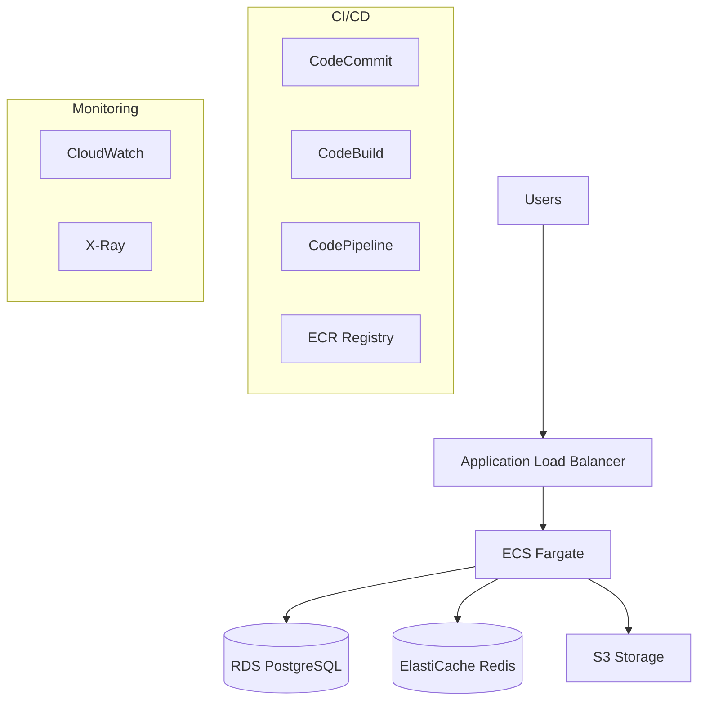

# Introducción a la Nube (AWS, Azure, Google Cloud)

## Objetivos

Al completar este módulo serás capaz de:

- Comprender los conceptos fundamentales de cloud computing
- Identificar los principales modelos de servicio (IaaS, PaaS, SaaS)
- Comparar los tres proveedores principales de nube
- Seleccionar servicios apropiados para diferentes casos de uso DevOps

## ¿Qué es Cloud Computing?

**Cloud Computing**es la entrega bajo demanda de recursos de TI través de Internet con un modelo de precios de pago por uso.

### Características Fundamentales

**On-Demand Self-Service**

- Provisionar recursos automáticamente sin interacción humana
- Escalado instantáneo según necesidades

**Broad Network Access**

- Acceso através de Internet desde cualquier dispositivo
- APIs y interfaces web estándar

**Resource Pooling**

- Recursos compartidos entre múltiples usuarios
- Abstracción de la ubicación física

**Rapid Elasticity**

- Escalado automático hacia arriba y abajo
- Parece infinito desde la perspectiva del usuario

**Measured Service**

- Monitoreo, control y reporte automático
- Transparencia para proveedor y consumidor

## Modelos de Servicio en la Nube

### Infrastructure as a Service (IaaS)

**¿Qué obtienes?**

- Máquinas virtuales
- Almacenamiento
- Redes virtuales
- Load balancers

**¿Qué gestionas tú?**

- Sistema operativo
- Middleware
- Runtime
- Aplicaciones
- Datos

**Ejemplos:**

- **AWS**: EC2, S3, VPC
- **Azure**: Virtual Machines, Storage Accounts, Virtual Networks
- **GCP**: Compute Engine, Cloud Storage, VPC

```bash
# Ejemplo: Crear VM en Azure CLI
az vm create \
  --resource-group myResourceGroup \
  --name myVM \
  --image Ubuntu2204 \
  --admin-username azureuser \
  --generate-ssh-keys \
  --size Standard_B2s
```

### Platform as a Service (PaaS)

**¿Qué obtienes?**

- Plataforma de desarrollo completa
- Base de datos managed
- Servicios de aplicación
- Runtime environment

**¿Qué gestionas tú?**

- Aplicaciones
- Datos
- Configuración

**Ejemplos:**

- **AWS**: Elastic Beanstalk, RDS, Lambda
- **Azure**: App Service, SQL Database, Functions
- **GCP**: App Engine, Cloud SQL, Cloud Functions

```yaml
# Ejemplo: Deploy en Azure App Service
name: Deploy to Azure App Service

on:
  push:
    branches: [ main ]

jobs:
  deploy:
    runs-on: ubuntu-latest

    steps:
    - uses: actions/checkout@v4

    - name: Setup .NET
      uses: actions/setup-dotnet@v3
      with:
        dotnet-version: '8.0.x'

    - name: Build and publish
      run: |
        dotnet build --configuration Release
        dotnet publish -c Release -o ./publish

    - name: Deploy to Azure App Service
      uses: azure/webapps-deploy@v2
      with:
        app-name: 'mi-app-service'
        publish-profile: ${{ secrets.AZURE_WEBAPP_PUBLISH_PROFILE }}
        package: './publish'
```

### Software as a Service (SaaS)

**¿Qué obtienes?**

- Aplicación completa lista para usar
- Acceso web o API
- Mantenimiento incluido

**¿Qué gestionas tú?**

- Configuración de la aplicación
- Datos de usuario

**Ejemplos:**

- **Microsoft 365**: Productividad
- **Salesforce**: CRM
- **GitHub**: Control de versiones
- **Jira**: Gestión de proyectos

## Comparación de Proveedores

### Amazon Web Services (AWS)

**Fortalezas:**

- Pionero del mercado (2006)
- Mayor variedad de servicios (+200)
- Ecosistema maduro y extenso
- Mejor para startups y empresas tech-first

**Debilidades:**

- Curva de aprendizaje empinada
- Pricing complejo
- Interfaz puede ser abrumadora

**Servicios clave para DevOps:**

```bash
# EC2 - Compute
aws ec2 run-instances \
    --image-id ami-0abcdef1234567890 \
    --count 1 \
    --instance-type t3.micro \
    --key-name MyKeyPair

# S3 - Storage
aws s3 cp localfile.txt s3://mybucket/
aws s3 sync ./local-folder s3://mybucket/remote-folder

# ECS - Container Service
aws ecs create-cluster --cluster-name my-cluster
aws ecs register-task-definition --cli-input-json file://task-def.json
```

**Arquitectura típica AWS:**



### Microsoft Azure

**Fortalezas:**

- Integración perfecta con Microsoft stack
- Híbrido cloud líder
- Enterprise-friendly
- Fuerte en PaaS offerings

**Debilidades:**

- Menos servicios que AWS
- Documentación inconsistente
- Cambios frecuentes en productos

**Servicios clave para DevOps:**

```bash
# Azure CLI basics
az login
az account set --subscription "My Subscription"

# Resource Groups
az group create --name myResourceGroup --location eastus

# App Service
az appservice plan create --name myAppServicePlan --resource-group myResourceGroup
az webapp create --name myWebApp --resource-group myResourceGroup --plan myAppServicePlan

# Container Instances
az container create \
    --resource-group myResourceGroup \
    --name mycontainer \
    --image nginx \
    --dns-name-label mycontainer-dns \
    --ports 80
```

**Azure DevOps Pipeline example:**

```yaml
# azure-pipelines.yml
trigger:
- main

variables:
  azureSubscription: 'My Service Connection'
  webAppName: 'myWebApp'
  resourceGroupName: 'myResourceGroup'

stages:
- stage: Build
  displayName: Build stage
  jobs:
  - job: Build
    displayName: Build
    pool:
      vmImage: 'ubuntu-latest'

    steps:
    - task: DotNetCoreCLI@2
      displayName: Build
      inputs:
        command: 'build'
        projects: '**/*.csproj'
        arguments: '--configuration Release'

    - task: DotNetCoreCLI@2
      displayName: Publish
      inputs:
        command: 'publish'
        publishWebProjects: true
        arguments: '--configuration Release --output $(Build.ArtifactStagingDirectory)'
        zipAfterPublish: true

    - task: PublishBuildArtifacts@1
      inputs:
        PathtoPublish: '$(Build.ArtifactStagingDirectory)'
        ArtifactName: 'drop'

- stage: Deploy
  displayName: Deploy stage
  dependsOn: Build
  condition: succeeded()

  jobs:
  - deployment: Deploy
    displayName: Deploy
    environment: 'production'
    pool:
      vmImage: 'ubuntu-latest'

    strategy:
      runOnce:
        deploy:
          steps:
          - task: AzureWebApp@1
            displayName: 'Azure Web App Deploy'
            inputs:
              azureSubscription: $(azureSubscription)
              appType: 'webApp'
              appName: $(webAppName)
              package: '$(Pipeline.Workspace)/drop/*.zip'
```

### Google Cloud Platform (GCP)

**Fortalezas:**

- Fuerte en AI/ML e innovación
- Networking superior
- Kubernetes nativo (inventores de K8s)
- Pricing más simple y predecible

**Debilidades:**

- Menor market share
- Menos servicios enterprise
- Documentación limitada comparado con AWS

**Servicios clave para DevOps:**

```bash
# gcloud CLI basics
gcloud auth login
gcloud config set project my-project-id

# Compute Engine
gcloud compute instances create my-instance \
    --image-family ubuntu-2004-lts \
    --image-project ubuntu-os-cloud \
    --machine-type e2-micro

# Cloud Run (serverless containers)
gcloud run deploy my-service \
    --image gcr.io/my-project/my-image \
    --platform managed \
    --region us-central1 \
    --allow-unauthenticated

# GKE (Kubernetes)
gcloud container clusters create my-cluster \
    --zone us-central1-a \
    --num-nodes 3
```

**Cloud Build configuration:**

```yaml
# cloudbuild.yaml
steps:
# Build the container image
- name: 'gcr.io/cloud-builders/docker'
  args: ['build', '-t', 'gcr.io/$PROJECT_ID/my-app:$COMMIT_SHA', '.']

# Push the container image to Container Registry
- name: 'gcr.io/cloud-builders/docker'
  args: ['push', 'gcr.io/$PROJECT_ID/my-app:$COMMIT_SHA']

# Deploy container image to Cloud Run
- name: 'gcr.io/cloud-builders/gcloud'
  args:
  - 'run'
  - 'deploy'
  - 'my-app'
  - '--image'
  - 'gcr.io/$PROJECT_ID/my-app:$COMMIT_SHA'
  - '--region'
  - 'us-central1'
  - '--platform'
  - 'managed'
  - '--allow-unauthenticated'

images:
- gcr.io/$PROJECT_ID/my-app:$COMMIT_SHA
```

## Servicios Fundamentales por Categoría

### Compute Services

| Categoría | AWS | Azure | GCP |
|-----------|-----|-------|-----|
| **Virtual Machines**| EC2 | Virtual Machines | Compute Engine |
| **Containers**| ECS, EKS, Fargate | ACI, AKS | Cloud Run, GKE |
| **Serverless Functions**| Lambda | Functions | Cloud Functions |
| **Batch Processing**| Batch | Batch | Dataflow |

### Storage Services

| Categoría | AWS | Azure | GCP |
|-----------|-----|-------|-----|
| **Object Storage**| S3 | Blob Storage | Cloud Storage |
| **File Storage**| EFS | Files | Filestore |
| **Block Storage**| EBS | Disk Storage | Persistent Disk |
| **Archive**| Glacier | Archive Storage | Coldline/Nearline |

### Database Services

| Categoría | AWS | Azure | GCP |
|-----------|-----|-------|-----|
| **Relational**| RDS | SQL Database | Cloud SQL |
| **NoSQL**| DynamoDB | Cosmos DB | Firestore |
| **Data Warehouse**| Redshift | Synapse Analytics | BigQuery |
| **Cache**| ElastiCache | Cache for Redis | Memorystore |

### Networking

| Categoría | AWS | Azure | GCP |
|-----------|-----|-------|-----|
| **Virtual Network**| VPC | Virtual Network | VPC |
| **Load Balancer**| ALB/NLB | Load Balancer | Cloud Load Balancing |
| **CDN**| CloudFront | CDN | Cloud CDN |
| **DNS**| Route 53 | DNS | Cloud DNS |

### DevOps Tools

| Categoría | AWS | Azure | GCP |
|-----------|-----|-------|-----|
| **Source Control**| CodeCommit | Azure Repos | Cloud Source Repositories |
| **CI/CD**| CodePipeline | Azure Pipelines | Cloud Build |
| **Container Registry**| ECR | Container Registry | Container Registry |
| **Monitoring**| CloudWatch | Monitor | Cloud Monitoring |

## Estrategias de Adopción

### Single Cloud vs Multi-Cloud vs Hybrid

**Single Cloud**

```markdown
 Pros:
- Simplicidad operacional
- Deep integration entre servicios
- Menos complejidad de networking
- Costo optimizado

 Cons:
- Vendor lock-in
- Single point of failure
- Limitado por capabilities del proveedor
```

**Multi-Cloud**

```markdown
 Pros:
- Avoid vendor lock-in
- Best-of-breed services
- Disaster recovery cross-cloud
- Compliance requirements

 Cons:
- Complexity management
- Networking challenges
- Higher costs
- Skills requirements
```

**Hybrid Cloud**

```markdown
 Pros:
- Gradual migration
- Regulatory compliance
- Legacy system integration
- Cost optimization

 Cons:
- Complex networking
- Security challenges
- Management overhead
```

### Cloud Migration Strategies (6 R's)

**Rehost (Lift & Shift)**

- Migrar aplicaciones sin cambios
- Rápido pero no optimizado para cloud

**Replatform (Lift, Tinker & Shift)**

- Optimizaciones básicas sin cambiar core architecture
- Balance entre velocidad y beneficios

**Repurchase (Drop & Shop)**

- Migrar a SaaS solution
- Reduce maintenance overhead

**Refactor/Re-architect**

- Rediseñar para cloud-native
- Máximo beneficio pero mayor esfuerzo

**Retire**

- Decommission aplicaciones no necesarias
- Reduce costos y complexity

**Retain**

- Mantener on-premises por ahora
- Revisitar en el futuro

## Consideraciones de Costos

### Modelos de Pricing

**Pay-as-you-go**

```bash
# Ejemplo de cálculo AWS EC2
# t3.medium: $0.0416/hour
# 24/7 por mes: $0.0416 * 24 * 30 = $29.95/mes

# Con Reserved Instance (1 año):
# Ahorro ~30-40%: $20.97/mes
```

**Reserved Instances**

- Compromiso a 1-3 años
- Descuentos 30-75%
- Upfront, partial upfront, o no upfront

**Spot Instances**

- Hasta 90% de descuento
- Para workloads fault-tolerant
- Pueden ser interrumpidas

### Cost Optimization Best Practices

```yaml
# Ejemplo de Auto Scaling para optimización
apiVersion: autoscaling/v2
kind: HorizontalPodAutoscaler
metadata:
  name: mi-app-hpa
spec:
  scaleTargetRef:
    apiVersion: apps/v1
    kind: Deployment
    name: mi-app
  minReplicas: 2
  maxReplicas: 10
  metrics:
  - type: Resource
    resource:
      name: cpu
      target:
        type: Utilization
        averageUtilization: 70
  - type: Resource
    resource:
      name: memory
      target:
        type: Utilization
        averageUtilization: 80
```

**Herramientas de Cost Management:**

- **AWS**: Cost Explorer, Budgets, Trusted Advisor
- **Azure**: Cost Management + Billing, Advisor
- **GCP**: Cloud Billing, Recommender

## Seguridad en la Nube

### Shared Responsibility Model

**Cloud Provider Responsibility:**

- Seguridad de la infraestructura física
- Hypervisor security
- Network infrastructure
- Hardware maintenance

**Customer Responsibility:**

- OS patches y updates
- Application security
- Identity y access management
- Data encryption
- Network traffic protection

### Servicios de Seguridad

| Categoría | AWS | Azure | GCP |
|-----------|-----|-------|-----|
| **Identity**| IAM | Active Directory | Identity & Access Management |
| **Encryption**| KMS | Key Vault | Cloud KMS |
| **Network Security**| Security Groups | Network Security Groups | Firewall Rules |
| **Compliance**| Config, CloudTrail | Policy, Monitor | Security Command Center |

```json
{
  "Version": "2012-10-17",
  "Statement": [
    {
      "Effect": "Allow",
      "Principal": {
        "Service": "ecs-tasks.amazonaws.com"
      },
      "Action": "sts:AssumeRole"
    }
  ]
}
```

## Laboratorio Práctico: Primer Deploy en Cloud

### Ejercicio 1: Deploy Simple en Azure

1. **Crear Resource Group:**

```bash
az group create --name rg-mi-primer-app --location eastus
```

2. **Crear App Service Plan:**

```bash
az appservice plan create \
  --name plan-mi-app \
  --resource-group rg-mi-primer-app \
  --sku B1 \
  --is-linux
```

3. **Crear Web App:**

```bash
az webapp create \
  --name mi-primera-webapp-devops \
  --resource-group rg-mi-primer-app \
  --plan plan-mi-app \
  --runtime "DOTNETCORE:8.0"
```

4. **Deploy desde código local:**

```bash
# Preparar aplicación
dotnet publish -c Release -o ./publish

# Deploy
az webapp deployment source config-zip \
  --resource-group rg-mi-primer-app \
  --name mi-primera-webapp-devops \
  --src ./publish.zip
```

### Ejercicio 2: Deploy con GitHub Actions

```yaml
# .github/workflows/azure-deploy.yml
name: Deploy to Azure

on:
  push:
    branches: [ main ]

jobs:
  deploy:
    runs-on: ubuntu-latest

    steps:
    - uses: actions/checkout@v4

    - name: Setup .NET
      uses: actions/setup-dotnet@v3
      with:
        dotnet-version: '8.0.x'

    - name: Build
      run: dotnet build --configuration Release

    - name: Publish
      run: dotnet publish -c Release -o ./publish

    - name: Deploy to Azure
      uses: azure/webapps-deploy@v2
      with:
        app-name: 'mi-primera-webapp-devops'
        publish-profile: ${{ secrets.AZURE_WEBAPP_PUBLISH_PROFILE }}
        package: './publish'
```

### Ejercicio 3: Monitoreo Básico

```bash
# Habilitar Application Insights
az monitor app-insights component create \
  --app mi-app-insights \
  --location eastus \
  --resource-group rg-mi-primer-app \
  --application-type web

# Conectar con Web App
az webapp config appsettings set \
  --name mi-primera-webapp-devops \
  --resource-group rg-mi-primer-app \
  --settings APPINSIGHTS_INSTRUMENTATIONKEY=<instrumentation-key>
```

## Decision Framework: ¿Qué Cloud Elegir?

### Cuestionario de Evaluación

**1. ¿Cuál es tu stack tecnológico principal?**

- **Microsoft (.NET, SQL Server, Office)** → Azure
- **Open Source/Mixed** → AWS o GCP
- **AI/ML Heavy** → GCP
- **Enterprise Java** → Cualquiera

**2. ¿Cuál es tu nivel de experiencia en cloud?**

- **Principiante**→ Azure (integración familiar)
- **Intermedio**→ AWS (más recursos de aprendizaje)
- **Avanzado**→ GCP (innovación cutting-edge)

**3. ¿Cuáles son tus requerimientos de compliance?**

- **Alto (financiero, salud)**→ Azure o AWS
- **Moderado**→ Cualquiera
- **Bajo**→ GCP

**4. ¿Cuál es tu presupuesto?**

- **Ajustado**→ GCP (pricing predecible)
- **Flexible**→ AWS (más opciones)
- **Enterprise**→ Azure (descuentos empresariales)

## Próximos Pasos

Después de completar esta introducción:

1. **Elige un proveedor**para profundizar
2. **Crea una cuenta gratuita**y explora
3. **Completa tutoriales oficiales**del proveedor elegido
4. **Implementa un proyecto pequeño**end-to-end
5. **Aprende sobre billing y cost optimization**

## Recursos Adicionales

### Documentación Oficial

- [AWS Documentation](https://docs.aws.amazon.com/)
- [Azure Documentation](https://docs.microsoft.com/azure/)
- [Google Cloud Documentation](https://cloud.google.com/docs)

### Certificaciones Recomendadas

- **AWS**: Cloud Practitioner → Solutions Architect Associate
- **Azure**: Fundamentals (AZ-900) → Azure Administrator (AZ-104)
- **GCP**: Cloud Digital Leader → Associate Cloud Engineer

### Herramientas de Comparación

- [Cloud Comparison Tool](https://comparecloud.in/)
- [AWS vs Azure vs GCP Services Comparison](https://cloud.google.com/docs/compare/aws)

## Siguiente Paso

[Conceptos clave: CI/CD, IaC, Automatización](./07-conceptos-clave.md)
