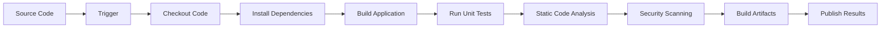

# Conceptos Clave: CI/CD, IaC, Automatización y Observabilidad

## Objetivos

Al completar este módulo serás capaz de:

- Dominar los conceptos fundamentales que definen DevOps
- Distinguir entre Integración Continua, Entrega Continua y Despliegue Continuo
- Comprender los principios de Infraestructura como Código
- Aplicar estrategias de automatización efectivas
- Implementar observabilidad en aplicaciones

## Integración Continua (CI)

### ¿Qué es la Integración Continua?

**Definición**: Práctica de desarrollo donde los desarrolladores integran código en un repositorio compartido frecuentemente (múltiples veces al día), donde cada integración es verificada por builds automatizados.

### Principios Fundamentales

**Frecuencia de Integración**

- Commits pequeños y frecuentes
- Idealmente múltiples integraciones por día
- Reducir el tamaño de los cambios para minimizar riesgos

**Automatización del Build**

- Compilación automática en cada commit
- Ejecución de tests automáticamente
- Feedback rápido sobre el estado del código

**Entorno de Integración Dedicado**

- Servidor o servicio dedicado para CI
- Aislado del entorno de desarrollo local
- Reproduce condiciones de producción

### Componentes de un Pipeline CI



### Ejemplo Práctico: Pipeline CI con GitHub Actions

```yaml
# .github/workflows/ci.yml
name: Continuous Integration

on:
  push:
    branches: [ main, develop ]
  pull_request:
    branches: [ main ]

jobs:
  continuous-integration:
    runs-on: ubuntu-latest

    strategy:
      matrix:
        dotnet-version: ['6.0.x', '8.0.x']

    steps:
    # 1. Checkout del código
    - name: Checkout repository
      uses: actions/checkout@v4
      with:
        fetch-depth: 0  # Fetch full history for GitVersion

    # 2. Setup del entorno
    - name: Setup .NET ${{ matrix.dotnet-version }}
      uses: actions/setup-dotnet@v3
      with:
        dotnet-version: ${{ matrix.dotnet-version }}

    # 3. Cache de dependencias
    - name: Cache NuGet packages
      uses: actions/cache@v3
      with:
        path: ~/.nuget/packages
        key: ${{ runner.os }}-nuget-${{ hashFiles('**/*.csproj') }}
        restore-keys: |
          ${{ runner.os }}-nuget-

    # 4. Restaurar dependencias
    - name: Restore dependencies
      run: dotnet restore

    # 5. Build de la aplicación
    - name: Build application
      run: dotnet build --no-restore --configuration Release

    # 6. Ejecutar tests unitarios
    - name: Run unit tests
      run: |
        dotnet test \
          --no-build \
          --configuration Release \
          --collect:"XPlat Code Coverage" \
          --logger trx \
          --results-directory ./test-results

    # 7. Análisis de código con SonarQube
    - name: Static code analysis
      if: matrix.dotnet-version == '8.0.x'
      env:
        GITHUB_TOKEN: ${{ secrets.GITHUB_TOKEN }}
        SONAR_TOKEN: ${{ secrets.SONAR_TOKEN }}
      run: |
        dotnet sonarscanner begin \
          /k:"mi-proyecto" \
          /o:"mi-org" \
          /d:sonar.login="${{ secrets.SONAR_TOKEN }}" \
          /d:sonar.host.url="https://sonarcloud.io" \
          /d:sonar.cs.opencover.reportsPaths="./test-results/*/coverage.opencover.xml"

        dotnet build --configuration Release

        dotnet sonarscanner end /d:sonar.login="${{ secrets.SONAR_TOKEN }}"

    # 8. Security scanning con Trivy
    - name: Security vulnerability scan
      uses: aquasecurity/trivy-action@master
      with:
        scan-type: 'fs'
        scan-ref: '.'
        format: 'sarif'
        output: 'trivy-results.sarif'

    # 9. Upload de resultados
    - name: Upload test results
      uses: actions/upload-artifact@v3
      if: always()
      with:
        name: test-results-${{ matrix.dotnet-version }}
        path: ./test-results

    - name: Upload security scan results
      uses: github/codeql-action/upload-sarif@v2
      if: always()
      with:
        sarif_file: 'trivy-results.sarif'

    # 10. Publicar artifacts
    - name: Publish build artifacts
      if: matrix.dotnet-version == '8.0.x' && success()
      run: |
        dotnet publish \
          --configuration Release \
          --output ./publish \
          --no-build

    - name: Upload build artifacts
      if: matrix.dotnet-version == '8.0.x' && success()
      uses: actions/upload-artifact@v3
      with:
        name: build-artifacts
        path: ./publish
```

### Métricas de CI

**Build Success Rate**

```csharp
public class CIMetrics
{
    public double BuildSuccessRate { get; set; }  // Target: >95%
    public TimeSpan AverageBuildTime { get; set; }  // Target: <10 minutes
    public double TestCoverage { get; set; }  // Target: >80%
    public int FailedBuildsPerWeek { get; set; }  // Target: <5
}
```

## Entrega Continua vs Despliegue Continuo

### Entrega Continua (Continuous Delivery)

**Definición**: Extensión de CI donde el código siempre está en un estado deployable, pero el deploy a producción requiere aprobación manual.

**Características:**

- Automatización hasta pre-producción
- Deployment manual a producción
- Todas las features pasan por staging
- Release cuando el negocio lo decide

### Despliegue Continuo (Continuous Deployment)

**Definición**: Cada cambio que pasa por el pipeline automatizado se deploya automáticamente a producción sin intervención manual.

**Características:**

- Automatización completa end-to-end
- No hay aprobaciones manuales
- Deploy inmediato tras pasar tests
- Requiere alta confianza en tests y monitoreo

### Comparación CD vs CD

| Aspecto | Continuous Delivery | Continuous Deployment |
|---------|-------------------|---------------------|
| **Automatización** | Hasta pre-producción | Completa |
| **Deploy a Prod** | Manual/Scheduled | Automático |
| **Frecuencia** | Según negocio | Con cada commit |
| **Risk** | Medio | Alto |
| **Madurez Requerida** | Media | Alta |

### Pipeline de Entrega Continua

```yaml
# Ejemplo de pipeline CD con múltiples entornos
name: Continuous Delivery

on:
  workflow_run:
    workflows: ["Continuous Integration"]
    types:
      - completed
    branches: [main]

jobs:
  deploy-staging:
    if: ${{ github.event.workflow_run.conclusion == 'success' }}
    runs-on: ubuntu-latest
    environment: staging

    steps:
    - name: Download artifacts
      uses: actions/download-artifact@v3
      with:
        name: build-artifacts
        path: ./artifacts

    - name: Deploy to staging
      run: |
        # Deployment a staging automático
        az webapp deployment source config-zip \
          --resource-group rg-staging \
          --name app-staging \
          --src ./artifacts/app.zip

    - name: Run integration tests
      run: |
        # Tests de integración en staging
        dotnet test IntegrationTests/ \
          --configuration Release \
          --environment Staging

    - name: Run performance tests
      run: |
        # Performance tests
        k6 run performance-tests/load-test.js \
          --env BASE_URL=${{ secrets.STAGING_URL }}

  deploy-production:
    needs: deploy-staging
    runs-on: ubuntu-latest
    environment: production  # Requiere aprobación manual

    steps:
    - name: Deploy to production (Blue-Green)
      run: |
        # Implementar blue-green deployment
        ./scripts/blue-green-deploy.sh \
          --artifact-path ./artifacts \
          --environment production \
          --health-check-url ${{ secrets.PROD_URL }}/health
```

## Infraestructura como Código (IaC)

### ¿Qué es Infrastructure as Code?

**Definición**: Práctica de gestionar y provisionar infraestructura através de código legible por máquinas, en lugar de procesos manuales.

### Principios de IaC

**Declarativo vs Imperativo**

**Declarativo** (¿Qué queremos?)

```hcl
# Terraform - Declarativo
resource "azurerm_virtual_machine" "main" {
  name                = "vm-production"
  location            = "East US"
  resource_group_name = azurerm_resource_group.main.name
  vm_size             = "Standard_B2s"

  storage_os_disk {
    name              = "osdisk"
    caching           = "ReadWrite"
    create_option     = "FromImage"
    managed_disk_type = "Premium_LRS"
  }
}
```

**Imperativo** (¿Cómo hacerlo?)

```bash
# Script imperativo
az vm create \
  --resource-group myResourceGroup \
  --name vm-production \
  --image Ubuntu2204 \
  --size Standard_B2s \
  --storage-sku Premium_LRS
```

### Herramientas de IaC

**Terraform** - Multi-cloud, declarativo

```hcl
# variables.tf
variable "environment" {
  description = "Environment name"
  type        = string
  default     = "production"
}

variable "location" {
  description = "Azure region"
  type        = string
  default     = "East US"
}

# main.tf
terraform {
  required_providers {
    azurerm = {
      source  = "hashicorp/azurerm"
      version = "~>3.0"
    }
  }

  backend "azurerm" {
    resource_group_name  = "rg-terraform-state"
    storage_account_name = "stterraformstate"
    container_name       = "tfstate"
    key                  = "prod.terraform.tfstate"
  }
}

provider "azurerm" {
  features {}
}

# Resource Group
resource "azurerm_resource_group" "main" {
  name     = "rg-${var.environment}"
  location = var.location

  tags = {
    Environment = var.environment
    Project     = "DevOps Learning"
    ManagedBy   = "Terraform"
  }
}

# Virtual Network
resource "azurerm_virtual_network" "main" {
  name                = "vnet-${var.environment}"
  address_space       = ["10.0.0.0/16"]
  location            = azurerm_resource_group.main.location
  resource_group_name = azurerm_resource_group.main.name

  tags = azurerm_resource_group.main.tags
}

# Subnet
resource "azurerm_subnet" "internal" {
  name                 = "internal"
  resource_group_name  = azurerm_resource_group.main.name
  virtual_network_name = azurerm_virtual_network.main.name
  address_prefixes     = ["10.0.2.0/24"]
}

# Kubernetes Cluster
resource "azurerm_kubernetes_cluster" "main" {
  name                = "aks-${var.environment}"
  location            = azurerm_resource_group.main.location
  resource_group_name = azurerm_resource_group.main.name
  dns_prefix          = "aks${var.environment}"

  default_node_pool {
    name       = "default"
    node_count = 2
    vm_size    = "Standard_D2_v2"
    vnet_subnet_id = azurerm_subnet.internal.id
  }

  identity {
    type = "SystemAssigned"
  }

  tags = azurerm_resource_group.main.tags
}

# Output values
output "kube_config" {
  value = azurerm_kubernetes_cluster.main.kube_config_raw
  sensitive = true
}

output "cluster_ca_certificate" {
  value = azurerm_kubernetes_cluster.main.kube_config.0.cluster_ca_certificate
  sensitive = true
}
```

**Ansible** - Configuración y deployment

```yaml
---
# site.yml
- name: Configure Kubernetes cluster
  hosts: k8s_masters
  become: yes

  vars:
    k8s_version: "1.28.0"
    pod_network_cidr: "10.244.0.0/16"

  tasks:
    - name: Install Docker
      apt:
        name: docker.io
        state: present
        update_cache: yes

    - name: Add Kubernetes apt key
      apt_key:
        url: https://packages.cloud.google.com/apt/doc/apt-key.gpg
        state: present

    - name: Add Kubernetes repository
      apt_repository:
        repo: deb https://apt.kubernetes.io/ kubernetes-xenial main
        state: present

    - name: Install Kubernetes components
      apt:
        name:
          - kubelet={{ k8s_version }}-00
          - kubeadm={{ k8s_version }}-00
          - kubectl={{ k8s_version }}-00
        state: present
        allow_downgrade: yes

    - name: Initialize Kubernetes cluster
      command: |
        kubeadm init \
          --pod-network-cidr={{ pod_network_cidr }} \
          --apiserver-advertise-address={{ ansible_default_ipv4.address }}
      register: kubeadm_init
      when: inventory_hostname == groups['k8s_masters'][0]

    - name: Setup kubeconfig for root
      shell: |
        mkdir -p /root/.kube
        cp -i /etc/kubernetes/admin.conf /root/.kube/config
        chown root:root /root/.kube/config
      when: inventory_hostname == groups['k8s_masters'][0]

    - name: Install Calico network plugin
      shell: |
        kubectl apply -f https://docs.projectcalico.org/manifests/calico.yaml
      when: inventory_hostname == groups['k8s_masters'][0]
```

### Versionado de Infraestructura

```bash
# Git workflow para IaC
git checkout -b feature/add-monitoring

# Modificar infraestructura
terraform plan -out=tfplan

# Review del plan
git add .
git commit -m "Add Prometheus monitoring stack"
git push origin feature/add-monitoring

# PR Review + Merge
git checkout main
git pull origin main

# Deploy
terraform apply tfplan
```

## Automatización

### Filosofía de la Automatización

**"Automate Everything"**

- Si lo haces más de una vez, automatízalo
- Eliminar tareas repetitivas y propensas a errores
- Liberar tiempo para trabajo de valor agregado

### Niveles de Automatización

**Nivel 1: Scripts Básicos**

```bash
#!/bin/bash
# deploy.sh - Script básico de deployment

set -e  # Exit on any error

echo "Starting deployment..."

# Variables
APP_NAME="mi-aplicacion"
VERSION=$1
ENVIRONMENT=${2:-"staging"}

if [ -z "$VERSION" ]; then
    echo "Error: Version parameter required"
    echo "Usage: ./deploy.sh <version> [environment]"
    exit 1
fi

# Pre-deployment checks
echo "Running pre-deployment checks..."
if ! curl -f http://health-check.example.com/ready; then
    echo "Health check failed. Aborting deployment."
    exit 1
fi

# Backup current version
echo "Creating backup..."
kubectl get deployment $APP_NAME -o yaml > backup-$APP_NAME-$(date +%Y%m%d-%H%M%S).yaml

# Deploy new version
echo "Deploying version $VERSION to $ENVIRONMENT..."
kubectl set image deployment/$APP_NAME app=$APP_NAME:$VERSION

# Wait for rollout
echo "Waiting for rollout to complete..."
kubectl rollout status deployment/$APP_NAME --timeout=300s

# Post-deployment verification
echo "Running post-deployment tests..."
sleep 30  # Wait for app to be ready

if curl -f http://$APP_NAME.$ENVIRONMENT.example.com/health; then
    echo " Deployment successful!"
else
    echo " Post-deployment health check failed. Rolling back..."
    kubectl rollout undo deployment/$APP_NAME
    exit 1
fi
```

**Nivel 2: Herramientas de Automatización**

```yaml
# ansible-playbook.yml
---
- name: Complete Application Deployment
  hosts: app_servers
  become: yes

  vars:
    app_name: "{{ app_name }}"
    app_version: "{{ app_version }}"
    environment: "{{ environment | default('staging') }}"

  pre_tasks:
    - name: Validate required variables
      fail:
        msg: "{{ item }} is required"
      when: vars[item] is undefined
      loop:
        - app_name
        - app_version

  tasks:
    - name: Health check before deployment
      uri:
        url: "http://{{ inventory_hostname }}:8080/health"
        method: GET
        status_code: 200
      delegate_to: localhost
      retries: 3
      delay: 10

    - name: Stop application service
      systemd:
        name: "{{ app_name }}"
        state: stopped

    - name: Backup current version
      archive:
        path: "/opt/{{ app_name }}"
        dest: "/opt/backups/{{ app_name }}-{{ ansible_date_time.epoch }}.tar.gz"

    - name: Download new version
      get_url:
        url: "https://releases.example.com/{{ app_name }}/{{ app_version }}/{{ app_name }}.tar.gz"
        dest: "/tmp/{{ app_name }}-{{ app_version }}.tar.gz"
        mode: '0644'

    - name: Extract new version
      unarchive:
        src: "/tmp/{{ app_name }}-{{ app_version }}.tar.gz"
        dest: "/opt/{{ app_name }}"
        remote_src: yes
        owner: app
        group: app

    - name: Update configuration
      template:
        src: "{{ app_name }}.conf.j2"
        dest: "/opt/{{ app_name }}/config/app.conf"
        owner: app
        group: app
        mode: '0644'
      notify: restart application

    - name: Start application service
      systemd:
        name: "{{ app_name }}"
        state: started
        enabled: yes

    - name: Wait for application to be ready
      uri:
        url: "http://{{ inventory_hostname }}:8080/health"
        method: GET
        status_code: 200
      register: health_check
      until: health_check.status == 200
      retries: 30
      delay: 10

  handlers:
    - name: restart application
      systemd:
        name: "{{ app_name }}"
        state: restarted
```

**Nivel 3: Orquestación Avanzada**

```python
# deployment_orchestrator.py
import asyncio
import aiohttp
import logging
from typing import List, Dict
from dataclasses import dataclass
from enum import Enum

class DeploymentStatus(Enum):
    PENDING = "pending"
    RUNNING = "running"
    SUCCESS = "success"
    FAILED = "failed"
    ROLLBACK = "rollback"

@dataclass
class DeploymentTarget:
    name: str
    url: str
    health_endpoint: str
    weight: int = 100

class AdvancedDeploymentOrchestrator:
    def __init__(self, targets: List[DeploymentTarget]):
        self.targets = targets
        self.logger = logging.getLogger(__name__)

    async def deploy_canary(self, app_name: str, version: str, canary_percentage: int = 10):
        """
        Implements canary deployment strategy
        """
        try:
            # Phase 1: Deploy to canary targets
            canary_targets = self._select_canary_targets(canary_percentage)
            await self._deploy_to_targets(canary_targets, app_name, version)

            # Phase 2: Monitor canary metrics
            if await self._monitor_canary_health(canary_targets, duration_minutes=15):
                self.logger.info("Canary deployment healthy, proceeding with full deployment")

                # Phase 3: Full deployment
                remaining_targets = [t for t in self.targets if t not in canary_targets]
                await self._deploy_to_targets(remaining_targets, app_name, version)

                return DeploymentStatus.SUCCESS
            else:
                self.logger.error("Canary deployment unhealthy, rolling back")
                await self._rollback_targets(canary_targets, app_name)
                return DeploymentStatus.ROLLBACK

        except Exception as e:
            self.logger.error(f"Deployment failed: {e}")
            await self._emergency_rollback_all(app_name)
            return DeploymentStatus.FAILED

    async def _deploy_to_targets(self, targets: List[DeploymentTarget], app_name: str, version: str):
        """Deploy to specified targets in parallel"""
        tasks = []
        for target in targets:
            task = self._deploy_single_target(target, app_name, version)
            tasks.append(task)

        results = await asyncio.gather(*tasks, return_exceptions=True)

        for i, result in enumerate(results):
            if isinstance(result, Exception):
                raise Exception(f"Deployment to {targets[i].name} failed: {result}")

    async def _deploy_single_target(self, target: DeploymentTarget, app_name: str, version: str):
        """Deploy to a single target"""
        async with aiohttp.ClientSession() as session:
            deploy_url = f"{target.url}/api/deploy"
            payload = {
                "application": app_name,
                "version": version,
                "strategy": "rolling_update"
            }

            async with session.post(deploy_url, json=payload) as response:
                if response.status != 200:
                    raise Exception(f"Deploy request failed: {await response.text()}")

                deployment_id = (await response.json())["deployment_id"]

                # Poll deployment status
                while True:
                    status_url = f"{target.url}/api/deploy/{deployment_id}/status"
                    async with session.get(status_url) as status_response:
                        status_data = await status_response.json()

                        if status_data["status"] == "completed":
                            break
                        elif status_data["status"] == "failed":
                            raise Exception(f"Deployment failed: {status_data['error']}")

                        await asyncio.sleep(10)

    async def _monitor_canary_health(self, targets: List[DeploymentTarget], duration_minutes: int) -> bool:
        """Monitor canary deployment health"""
        end_time = asyncio.get_event_loop().time() + (duration_minutes * 60)

        while asyncio.get_event_loop().time() < end_time:
            try:
                # Check health of all canary targets
                health_checks = []
                async with aiohttp.ClientSession() as session:
                    for target in targets:
                        health_check = self._check_target_health(session, target)
                        health_checks.append(health_check)

                    results = await asyncio.gather(*health_checks)

                    if all(results):
                        self.logger.info("All canary targets healthy")
                    else:
                        self.logger.warning("Some canary targets unhealthy")
                        return False

                await asyncio.sleep(30)  # Check every 30 seconds

            except Exception as e:
                self.logger.error(f"Health check failed: {e}")
                return False

        return True

    async def _check_target_health(self, session: aiohttp.ClientSession, target: DeploymentTarget) -> bool:
        """Check health of a single target"""
        try:
            async with session.get(f"{target.url}{target.health_endpoint}", timeout=10) as response:
                return response.status == 200
        except Exception as e:
            self.logger.error(f"Health check failed for {target.name}: {e}")
            return False

# Usage
async def main():
    targets = [
        DeploymentTarget("prod-1", "https://prod-1.example.com", "/health"),
        DeploymentTarget("prod-2", "https://prod-2.example.com", "/health"),
        DeploymentTarget("prod-3", "https://prod-3.example.com", "/health"),
    ]

    orchestrator = AdvancedDeploymentOrchestrator(targets)
    result = await orchestrator.deploy_canary("mi-app", "v2.1.0", canary_percentage=30)

    print(f"Deployment result: {result}")

if __name__ == "__main__":
    asyncio.run(main())
```

## Observabilidad

### Los Tres Pilares de la Observabilidad

**Métricas** - Datos numéricos agregados en el tiempo
**Logs** - Eventos discretos con timestamp
**Traces** - Seguimiento de requests través de sistemas distribuidos

### Implementación de Observabilidad

**Métricas con Prometheus**

```csharp
// Program.cs
using Prometheus;

var builder = WebApplication.CreateBuilder(args);

// Add Prometheus metrics
builder.Services.AddSingleton<IMetrics, PrometheusMetrics>();

var app = builder.Build();

// Expose metrics endpoint
app.UseMetricServer();  // /metrics endpoint

// Custom metrics middleware
app.UseMiddleware<MetricsMiddleware>();

// Application setup...
app.Run();

// MetricsMiddleware.cs
public class MetricsMiddleware
{
    private readonly RequestDelegate _next;
    private readonly ILogger<MetricsMiddleware> _logger;

    // Prometheus metrics
    private static readonly Counter RequestCount = Metrics
        .CreateCounter("http_requests_total", "Total HTTP requests", new[] { "method", "endpoint", "status" });

    private static readonly Histogram RequestDuration = Metrics
        .CreateHistogram("http_request_duration_seconds", "HTTP request duration", new[] { "method", "endpoint" });

    private static readonly Gauge ActiveConnections = Metrics
        .CreateGauge("http_active_connections", "Active HTTP connections");

    public MetricsMiddleware(RequestDelegate next, ILogger<MetricsMiddleware> logger)
    {
        _next = next;
        _logger = logger;
    }

    public async Task InvokeAsync(HttpContext context)
    {
        ActiveConnections.Inc();

        using var timer = RequestDuration
            .WithLabels(context.Request.Method, context.Request.Path)
            .NewTimer();

        try
        {
            await _next(context);
        }
        finally
        {
            RequestCount
                .WithLabels(context.Request.Method, context.Request.Path, context.Response.StatusCode.ToString())
                .Inc();

            ActiveConnections.Dec();
        }
    }
}
```

**Structured Logging con Serilog**

```csharp
// Program.cs
using Serilog;
using Serilog.Events;

Log.Logger = new LoggerConfiguration()
    .MinimumLevel.Information()
    .MinimumLevel.Override("Microsoft", LogEventLevel.Warning)
    .Enrich.FromLogContext()
    .Enrich.WithProperty("ApplicationName", "DevOpsLearningApp")
    .Enrich.WithProperty("Environment", Environment.GetEnvironmentVariable("ASPNETCORE_ENVIRONMENT"))
    .WriteTo.Console(outputTemplate: "[{Timestamp:HH:mm:ss} {Level:u3}] {Message:lj} {Properties:j}{NewLine}{Exception}")
    .WriteTo.File("logs/app-.log",
        rollingInterval: RollingInterval.Day,
        retainedFileCountLimit: 7,
        outputTemplate: "{Timestamp:yyyy-MM-dd HH:mm:ss.fff zzz} [{Level:u3}] {Message:lj} {Properties:j}{NewLine}{Exception}")
    .WriteTo.Elasticsearch(new ElasticsearchSinkOptions(new Uri("http://localhost:9200"))
    {
        IndexFormat = "devops-learning-app-{0:yyyy.MM.dd}",
        AutoRegisterTemplate = true,
    })
    .CreateLogger();

var builder = WebApplication.CreateBuilder(args);
builder.Host.UseSerilog();

// Example controller with structured logging
[ApiController]
[Route("api/[controller]")]
public class OrdersController : ControllerBase
{
    private readonly ILogger<OrdersController> _logger;

    [HttpPost]
    public async Task<IActionResult> CreateOrder([FromBody] CreateOrderRequest request)
    {
        using var activity = _logger.BeginScope(new Dictionary<string, object>
        {
            ["OrderId"] = Guid.NewGuid(),
            ["UserId"] = request.UserId,
            ["Amount"] = request.Amount
        });

        _logger.LogInformation("Processing order creation for user {UserId} with amount {Amount:C}",
            request.UserId, request.Amount);

        try
        {
            var order = await _orderService.CreateOrderAsync(request);

            _logger.LogInformation("Order {OrderId} created successfully", order.Id);

            return CreatedAtAction(nameof(GetOrder), new { id = order.Id }, order);
        }
        catch (InsufficientFundsException ex)
        {
            _logger.LogWarning(ex, "Order creation failed due to insufficient funds for user {UserId}", request.UserId);
            return BadRequest("Insufficient funds");
        }
        catch (Exception ex)
        {
            _logger.LogError(ex, "Unexpected error creating order for user {UserId}", request.UserId);
            return StatusCode(500, "Internal server error");
        }
    }
}
```

**Distributed Tracing con OpenTelemetry**

```csharp
// Program.cs
using OpenTelemetry;
using OpenTelemetry.Resources;
using OpenTelemetry.Trace;

var builder = WebApplication.CreateBuilder(args);

// Configure OpenTelemetry
builder.Services.AddOpenTelemetry()
    .WithTracing(tracerProviderBuilder =>
        tracerProviderBuilder
            .AddSource("DevOpsLearningApp")
            .SetResourceBuilder(
                ResourceBuilder.CreateDefault()
                    .AddService(serviceName: "DevOpsLearningApp", serviceVersion: "1.0.0"))
            .AddHttpClientInstrumentation()
            .AddAspNetCoreInstrumentation()
            .AddSqlClientInstrumentation()
            .AddJaegerExporter(options =>
            {
                options.AgentHost = "jaeger";
                options.AgentPort = 6831;
            }));

// Service with custom tracing
public class OrderService
{
    private static readonly ActivitySource ActivitySource = new("DevOpsLearningApp");
    private readonly ILogger<OrderService> _logger;
    private readonly IPaymentService _paymentService;
    private readonly IInventoryService _inventoryService;

    public async Task<Order> CreateOrderAsync(CreateOrderRequest request)
    {
        using var activity = ActivitySource.StartActivity("CreateOrder");
        activity?.SetTag("user.id", request.UserId);
        activity?.SetTag("order.amount", request.Amount);

        // Check inventory
        using (var inventoryActivity = ActivitySource.StartActivity("CheckInventory"))
        {
            var availability = await _inventoryService.CheckAvailabilityAsync(request.ProductId);
            inventoryActivity?.SetTag("product.id", request.ProductId);
            inventoryActivity?.SetTag("inventory.available", availability.Available);

            if (!availability.Available)
            {
                activity?.SetStatus(ActivityStatusCode.Error, "Product not available");
                throw new ProductNotAvailableException();
            }
        }

        // Process payment
        using (var paymentActivity = ActivitySource.StartActivity("ProcessPayment"))
        {
            try
            {
                var payment = await _paymentService.ProcessPaymentAsync(request.PaymentDetails);
                paymentActivity?.SetTag("payment.id", payment.Id);
                paymentActivity?.SetTag("payment.status", payment.Status);

                if (payment.Status != PaymentStatus.Successful)
                {
                    activity?.SetStatus(ActivityStatusCode.Error, "Payment failed");
                    throw new PaymentFailedException();
                }
            }
            catch (Exception ex)
            {
                paymentActivity?.SetStatus(ActivityStatusCode.Error, ex.Message);
                throw;
            }
        }

        // Create order
        var order = new Order
        {
            Id = Guid.NewGuid(),
            UserId = request.UserId,
            Amount = request.Amount,
            Status = OrderStatus.Created,
            CreatedAt = DateTime.UtcNow
        };

        activity?.SetTag("order.id", order.Id);
        activity?.SetStatus(ActivityStatusCode.Ok);

        return order;
    }
}
```

## Integración de Conceptos: Pipeline Completo

```yaml
# complete-pipeline.yml
name: Complete DevOps Pipeline

on:
  push:
    branches: [main]
  pull_request:
    branches: [main]

env:
  REGISTRY: ghcr.io
  IMAGE_NAME: ${{ github.repository }}

jobs:
  # 1. Continuous Integration
  ci:
    runs-on: ubuntu-latest
    outputs:
      image-tag: ${{ steps.meta.outputs.tags }}
      image-digest: ${{ steps.build.outputs.digest }}

    steps:
    - name: Checkout
      uses: actions/checkout@v4

    - name: Setup .NET
      uses: actions/setup-dotnet@v3
      with:
        dotnet-version: '8.0.x'

    - name: Restore, Build, Test
      run: |
        dotnet restore
        dotnet build --no-restore
        dotnet test --no-build --collect:"XPlat Code Coverage"

    - name: Extract metadata
      id: meta
      uses: docker/metadata-action@v5
      with:
        images: ${{ env.REGISTRY }}/${{ env.IMAGE_NAME }}

    - name: Build and push Docker image
      id: build
      uses: docker/build-push-action@v5
      with:
        context: .
        push: ${{ github.event_name != 'pull_request' }}
        tags: ${{ steps.meta.outputs.tags }}
        labels: ${{ steps.meta.outputs.labels }}

  # 2. Infrastructure as Code
  infrastructure:
    needs: ci
    runs-on: ubuntu-latest
    if: github.ref == 'refs/heads/main'

    steps:
    - name: Checkout
      uses: actions/checkout@v4

    - name: Setup Terraform
      uses: hashicorp/setup-terraform@v3

    - name: Terraform Plan
      run: |
        cd infrastructure/
        terraform init
        terraform plan -out=tfplan

    - name: Terraform Apply
      run: |
        cd infrastructure/
        terraform apply -auto-approve tfplan

  # 3. Continuous Deployment
  deploy:
    needs: [ci, infrastructure]
    runs-on: ubuntu-latest
    if: github.ref == 'refs/heads/main'
    environment: production

    steps:
    - name: Deploy to Kubernetes
      run: |
        echo "${{ secrets.KUBECONFIG }}" | base64 -d > kubeconfig
        export KUBECONFIG=kubeconfig

        # Update deployment with new image
        kubectl set image deployment/app \
          app=${{ needs.ci.outputs.image-tag }}

        # Wait for rollout
        kubectl rollout status deployment/app --timeout=300s

    - name: Run smoke tests
      run: |
        # Basic health check
        curl -f https://app.production.example.com/health

        # Run automated smoke tests
        dotnet test SmokeTests/ --environment Production

  # 4. Observability Setup
  observability:
    needs: deploy
    runs-on: ubuntu-latest
    if: github.ref == 'refs/heads/main'

    steps:
    - name: Update monitoring configuration
      run: |
        # Update Prometheus targets
        kubectl apply -f monitoring/prometheus-config.yml

        # Update Grafana dashboards
        kubectl apply -f monitoring/grafana-dashboards.yml

        # Setup alerts
        kubectl apply -f monitoring/alerting-rules.yml
```

## Próximos Pasos

Después de dominar estos conceptos fundamentales:

1. **Practica implementando** un pipeline simple end-to-end
2. **Experimenta con diferentes herramientas** para cada concepto
3. **Mide y optimiza** tu pipeline (tiempo, calidad, frecuencia)
4. **Aprende sobre advanced patterns** (GitOps, Service Mesh, etc.)
5. **Explora emerging practices** (AI-powered DevOps, etc.)

## Recursos Adicionales

- [DevOps Handbook](https://itrevolution.com/book/the-devops-handbook/) - Fundamentos teóricos
- [Site Reliability Engineering](https://sre.google/books/) - Observabilidad avanzada
- [Infrastructure as Code](https://www.terraform.io/docs) - Terraform documentation
- [CNCF Landscape](https://landscape.cncf.io/) - Herramientas cloud native

## Siguiente Paso

[Primeros pasos con Git](./08-primeros-pasos-git.md)
