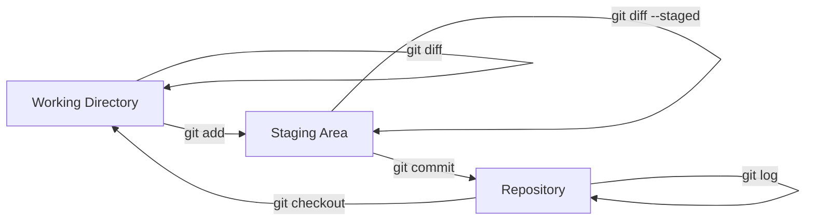

# Primeros Pasos con Git

## Objetivos

Al completar este módulo serás capaz de:

- Configurar Git correctamente en tu entorno de desarrollo
- Dominar el flujo básico de trabajo con Git
- Implementar branching strategies efectivas
- Colaborar eficientemente usando GitHub/GitLab
- Resolver conflictos de merge de manera profesional

## ¿Qué es Git?

**Git**es un sistema de control de versiones distribuido diseñado para manejar proyectos de cualquier tamaño con velocidad y eficiencia.

### Características Fundamentales

**Distribuido**: Cada desarrollador tiene una copia completa del historial del proyecto
**Integridad**: Todo es verificado con checksums antes de ser almacenado
**Velocidad**: Operaciones locales son instantáneas
**Branching**: Creación y merge de ramas es lightweight y rápido

## Configuración Inicial

### Instalación de Git

**Windows: **

```powershell
# Usando Chocolatey
choco install git

# Usando winget
winget install Git.Git

# O descargar desde https://git-scm.com/
```

**macOS: **

```bash
# Usando Homebrew
brew install git

# O usando Xcode Command Line Tools
xcode-select --install
```

**Linux (Ubuntu/Debian): **

```bash
sudo apt update
sudo apt install git
```

### Configuración Básica

```bash
# Configuración global de usuario
git config --global user.name "Tu Nombre Completo"
git config --global user.email "tu.email@ejemplo.com"

# Editor predeterminado
git config --global core.editor "code --wait"  # VS Code
# git config --global core.editor "nano"       # Nano
# git config --global core.editor "vim"        # Vim

# Configuración de line endings
git config --global core.autocrlf true   # Windows
git config --global core.autocrlf input  # macOS/Linux

# Configuración de push por defecto
git config --global push.default simple

# Habilitar colores en output
git config --global color.ui auto

# Configurar merge tool
git config --global merge.tool vscode
git config --global mergetool.vscode.cmd 'code --wait $MERGED'

# Ver toda la configuración
git config --list

# Ver configuración específica
git config user.name
git config user.email
```

### Configuración de SSH para GitHub

```bash
# Generar nueva llave SSH
ssh-keygen -t ed25519 -C "tu.email@ejemplo.com"

# Agregar llave al ssh-agent
eval "$(ssh-agent -s)"
ssh-add ~/.ssh/id_ed25519

# Copiar llave pública al clipboard
cat ~/.ssh/id_ed25519.pub

# En GitHub: Settings > SSH and GPG keys > New SSH key
# Pegar la llave pública

# Probar conexión
ssh -T git@github.com
```

## Conceptos Fundamentales

### Estados de Archivos en Git



**Working Directory**: Archivos en tu directorio de trabajo
**Staging Area**: Archivos preparados para commit
**Repository**: Historial permanente de commits

### Comandos Básicos

```bash
# Inicializar repositorio
git init
git init mi-proyecto

# Clonar repositorio existente
git clone https://github.com/usuario/repositorio.git
git clone git@github.com:usuario/repositorio.git

# Estado del repositorio
git status
git status --short  # Versión compacta

# Agregar archivos al staging
git add archivo.txt
git add .                    # Todos los archivos
git add *.js                 # Todos los archivos .js
git add src/                 # Todo el directorio src/

# Commit de cambios
git commit -m "Mensaje descriptivo del commit"
git commit -am "Add y commit en un comando"  # Solo archivos tracked

# Ver historial
git log
git log --oneline
git log --graph --oneline --all
git log --since="2 weeks ago"
git log --author="Tu Nombre"

# Ver diferencias
git diff                     # Working vs Staging
git diff --staged           # Staging vs Repository
git diff HEAD               # Working vs Repository
git diff commit1 commit2    # Entre dos commits
```

## Flujo de Trabajo Básico

### Día a Día con Git

```bash
# 1. Comenzar el día - Actualizar código
git pull origin main

# 2. Crear nueva feature branch
git checkout -b feature/nueva-funcionalidad

# 3. Realizar cambios
# ... editar archivos ...

# 4. Ver qué cambió
git status
git diff

# 5. Preparar cambios para commit
git add src/nuevaFuncionalidad.js
git add tests/nuevaFuncionalidad.test.js

# 6. Verificar qué está en staging
git status
git diff --staged

# 7. Commit con mensaje descriptivo
git commit -m "feat: agregar nueva funcionalidad de autenticación

- Implementar login con JWT
- Agregar middleware de autenticación
- Incluir tests unitarios
- Actualizar documentación API"

# 8. Push de la rama
git push origin feature/nueva-funcionalidad

# 9. Crear Pull Request en GitHub
# (Se hace desde la web interface)

# 10. Después de merge, limpiar
git checkout main
git pull origin main
git branch -d feature/nueva-funcionalidad
```

### Conventional Commits

Usar un formato estándar para commits mejora la legibilidad y permite automatización:

```bash
# Formato: <tipo>[scope opcional]: <descripción>
# [cuerpo opcional]
# [footer opcional]

# Ejemplos:
git commit -m "feat: agregar autenticación OAuth2"
git commit -m "fix: corregir bug en validación de emails"
git commit -m "docs: actualizar README con instrucciones de instalación"
git commit -m "style: formatear código según ESLint"
git commit -m "refactor: extraer lógica de validación a clase separada"
git commit -m "test: agregar tests para módulo de pagos"
git commit -m "chore: actualizar dependencias"

# Con breaking change:
git commit -m "feat!: cambiar API de autenticación

BREAKING CHANGE: el endpoint /auth/login ahora requiere
header Content-Type: application/json"
```

## Branching y Merging

### Estrategias de Branching

**Git Flow**- Para proyectos con releases programados

```bash
# Branches principales
main        # Producción
develop     # Integración

# Branches de soporte
feature/*   # Nuevas funcionalidades
release/*   # Preparación de releases
hotfix/*    # Fixes urgentes en producción

# Ejemplo de flujo:
git checkout develop
git checkout -b feature/user-registration
# ... desarrollo ...
git checkout develop
git merge feature/user-registration
git branch -d feature/user-registration
```

**GitHub Flow**- Para deployment continuo

```bash
# Solo dos tipos de branches:
main           # Producción - siempre deployable
feature/*      # Features - corta duración

# Ejemplo:
git checkout main
git pull origin main
git checkout -b feature/payment-integration
# ... desarrollo ...
git push origin feature/payment-integration
# Crear PR, review, merge
```

**GitLab Flow**- Híbrido con environment branches

```bash
main           # Desarrollo principal
pre-production # Testing
production     # Producción

# Features se mergean a main
# main se mergea a pre-production para testing
# pre-production se mergea a production para deploy
```

### Comandos de Branching

```bash
# Listar branches
git branch                  # Locales
git branch -r              # Remotas
git branch -a              # Todas

# Crear branches
git branch nueva-rama
git checkout -b nueva-rama         # Crear y cambiar
git switch -c nueva-rama           # Mismo que anterior (Git 2.23+)

# Cambiar entre branches
git checkout main
git switch main                    # Git 2.23+

# Mergear branches
git checkout main
git merge feature/nueva-funcionalidad

# Tipos de merge
git merge --no-ff feature/branch   # Crear merge commit siempre
git merge --squash feature/branch  # Squash commits en uno solo

# Eliminar branches
git branch -d feature/completed    # Solo si está mergeada
git branch -D feature/unwanted     # Forzar eliminación

# Branches remotas
git push origin nueva-rama         # Push nueva rama
git push origin --delete old-rama  # Eliminar rama remota
```

## Resolución de Conflictos

### ¿Cuándo Ocurren Conflictos?

Los conflictos surgen cuando:

- Dos branches modifican las mismas líneas
- Un branch modifica y otro elimina el mismo archivo
- Cambios en binary files

### Ejemplo de Conflicto

```bash
# Situación: dos developers modifican el mismo archivo
git merge feature/conflict-branch

# Output:
Auto-merging src/config.js
CONFLICT (content): Merge conflict in src/config.js
Automatic merge failed; fix conflicts and then commit the result.
```

**Archivo con conflicto: **

```javascript
// src/config.js
const config = {
  apiUrl: 'https://api.ejemplo.com',

  timeout: 5000,
  retries: 3

  timeout: 10000,
  maxRetries: 5
>>>>>>> feature/conflict-branch
};
```

### Resolución Manual

```javascript
// Resolución - elegir la mejor opción o combinar:
const config = {
  apiUrl: 'https://api.ejemplo.com',
  timeout: 10000,     // Usar valor de feature branch
  retries: 5,         // Renombrar y usar valor de feature
  maxRetries: 5       // Mantener consistencia de nombres
};
```

```bash
# Después de resolver:
git add src/config.js
git commit -m "resolve: merge conflict in config.js

- Usar timeout de 10000ms para mejor UX
- Estandarizar nombre de propiedad a 'retries'"
```

### Herramientas de Merge

**VS Code (integrado): **

```bash
# Configurar VS Code como merge tool
git config --global merge.tool vscode
git config --global mergetool.vscode.cmd 'code --wait $MERGED'

# Usar merge tool
git mergetool
```

**Otras herramientas populares: **

```bash
# KDiff3
git config --global merge.tool kdiff3

# Meld (Linux)
git config --global merge.tool meld

# P4Merge
git config --global merge.tool p4merge
```

## Colaboración con GitHub/GitLab

### Workflow de Pull Requests

**1. Fork del repositorio (para contribuciones externas)**

```bash
# En GitHub: hacer fork desde la web
git clone git@github.com:tu-usuario/repositorio-forked.git
cd repositorio-forked

# Agregar upstream para mantener sincronizado
git remote add upstream git@github.com:usuario-original/repositorio.git

# Verificar remotes
git remote -v
```

**2. Mantener fork actualizado**

```bash
# Fetch cambios del upstream
git fetch upstream

# Mergear main del upstream
git checkout main
git merge upstream/main

# Push al tu fork
git push origin main
```

**3. Crear Pull Request**

```bash
# Crear branch para feature
git checkout -b feature/mi-contribucion

# Realizar cambios y commits
git add .
git commit -m "feat: implementar nueva funcionalidad"

# Push de la rama
git push origin feature/mi-contribucion

# En GitHub: crear Pull Request desde la interfaz web
```

### Code Review Best Practices

**Para el autor del PR: **

```markdown
# Template de Pull Request
## Descripción
Breve descripción de los cambios realizados.

## Tipo de cambio
- [ ] Bug fix (cambio que corrige un issue)
- [ ] Nueva feature (cambio que agrega funcionalidad)
- [ ] Breaking change (fix o feature que causaría breaking changes)
- [ ] Documentación

## ¿Cómo se ha probado?
- [ ] Tests unitarios pasan
- [ ] Tests de integración pasan
- [ ] Probado manualmente en ambiente local
- [ ] Probado en ambiente de staging

## Checklist:
- [ ] Mi código sigue las convenciones del proyecto
- [ ] He realizado self-review de mi código
- [ ] He comentado mi código en partes difíciles de entender
- [ ] He agregado tests que prueban mi fix/feature
- [ ] Tests nuevos y existentes pasan localmente
- [ ] He actualizado la documentación según necesario
```

**Para reviewers: **

```bash
# Checkout del PR para testing local
git fetch origin pull/123/head:pr-123
git checkout pr-123

# O usando GitHub CLI
gh pr checkout 123

# Testing local
npm test
npm run lint
npm run build

# Volver a main después del review
git checkout main
git branch -d pr-123
```

## Comandos Avanzados

### Reescribir Historia

**Git Reset**

```bash
# Soft reset - mantiene cambios en staging
git reset --soft HEAD~1

# Mixed reset (default) - mantiene cambios en working directory
git reset HEAD~1
git reset --mixed HEAD~1

# Hard reset - ELIMINA todos los cambios
git reset --hard HEAD~1

# Reset a commit específico
git reset --hard abc123
```

**Git Revert**

```bash
# Crear commit que deshace otro commit (recomendado)
git revert HEAD         # Deshace último commit
git revert abc123       # Deshace commit específico
git revert HEAD~2..HEAD # Deshace múltiples commits
```

**Git Rebase**

```bash
# Rebase interactivo para limpiar historia
git rebase -i HEAD~3

# En el editor:
pick abc123 Primer commit
squash def456 Fix typo
squash ghi789 Agregar tests

# Rebase de branch sobre main
git checkout feature/mi-branch
git rebase main

# Resolver conflictos si existen
git add .
git rebase --continue

# Abortar rebase si es necesario
git rebase --abort
```

### Stashing

```bash
# Guardar cambios temporalmente
git stash
git stash push -m "Cambios temporales antes de pull"

# Incluir archivos untracked
git stash -u

# Aplicar stash
git stash pop           # Aplica y elimina del stash
git stash apply         # Aplica pero mantiene en stash

# Gestionar múltiples stashes
git stash list
git stash apply stash@{1}
git stash drop stash@{0}
git stash clear         # Eliminar todos los stashes
```

### Cherry Pick

```bash
# Aplicar commit específico a branch actual
git cherry-pick abc123

# Cherry pick múltiples commits
git cherry-pick abc123 def456

# Cherry pick con modificaciones
git cherry-pick -n abc123  # No hacer commit automático
```

## Flujos de Trabajo Avanzados

### GitOps Workflow

```bash
# Repositorio separado para configuración
git clone git@github.com:mi-org/k8s-config.git
cd k8s-config

# Estructura típica:
apps/
  production/
    deployment.yaml
    service.yaml
  staging/
    deployment.yaml
    service.yaml

# Cambio de imagen tras CI/CD
git checkout -b update-app-image
sed -i 's|image: myapp:v1.0|image: myapp:v1.1|' apps/production/deployment.yaml
git add apps/production/deployment.yaml
git commit -m "prod: update myapp to v1.1"
git push origin update-app-image

# ArgoCD detecta cambios y aplica automáticamente
```

### Monorepo Strategy

```bash
# Estructura de monorepo
project/
 services/
    api/
    web/
    mobile/
 shared/
    models/
    utils/
 tools/
     build/
     deploy/

# Comandos específicos de path
git log -- services/api/          # Log solo de API
git diff HEAD~1 -- shared/        # Diff solo de shared
git checkout HEAD~5 -- shared/models/user.js  # Restore archivo específico
```

## Herramientas y Aliases Útiles

### Git Aliases

```bash
# Configurar aliases útiles
git config --global alias.co checkout
git config --global alias.br branch
git config --global alias.ci commit
git config --global alias.st status

# Aliases más avanzados
git config --global alias.unstage 'reset HEAD --'
git config --global alias.last 'log -1 HEAD'
git config --global alias.visual '!gitk'

# Log bonito
git config --global alias.lg "log --color --graph --pretty=format:'%Cred%h%Creset -%C(yellow)%d%Creset %s %Cgreen(%cr) %C(bold blue)<%an>%Creset' --abbrev-commit"

# Branch cleanup
git config --global alias.cleanup "!git branch --merged | grep -v '\\*\\|main\\|develop' | xargs -n 1 git branch -d"
```

### Herramientas CLI

**GitHub CLI (gh)**

```bash
# Instalación
brew install gh  # macOS
choco install gh  # Windows

# Autenticación
gh auth login

# Comandos útiles
gh repo clone usuario/repo
gh pr create --title "Nueva feature" --body "Descripción"
gh pr list
gh pr checkout 123
gh pr merge 123 --squash
gh issue create --title "Bug report" --label bug
```

**GitLab CLI (glab)**

```bash
# Instalación
brew install glab

# Comandos similares a gh
glab auth login
glab mr create --title "Nueva feature"
glab mr list
glab mr checkout 42
```

## Scripts de Automatización

### Hook de Pre-commit

```bash
#!/bin/sh
# .git/hooks/pre-commit

echo "Ejecutando verificaciones pre-commit..."

# Verificar formato de commit message
commit_regex='^(feat|fix|docs|style|refactor|test|chore)(\(.+\))?: .{1,50}'

commit_msg_file=".git/COMMIT_EDITMSG"
if [ -f "$commit_msg_file" ]; then
    commit_msg=$(head -n1 "$commit_msg_file")
    if ! echo "$commit_msg" | grep -qE "$commit_regex"; then
        echo " Commit message no sigue Conventional Commits format"
        echo "Formato esperado: tipo(scope): descripción"
        echo "Ejemplo: feat(auth): agregar login con OAuth2"
        exit 1
    fi
fi

# Ejecutar tests
echo "Ejecutando tests..."
npm test
if [ $? -ne 0 ]; then
    echo " Tests fallaron"
    exit 1
fi

# Verificar lint
echo "Verificando code style..."
npm run lint
if [ $? -ne 0 ]; then
    echo " Lint check falló"
    exit 1
fi

echo " Todas las verificaciones pasaron"
exit 0
```

### Script de Setup de Proyecto

```bash
#!/bin/bash
# setup-git.sh

echo " Configurando Git para proyecto DevOps..."

# Verificar si Git está instalado
if ! command -v git &> /dev/null; then
    echo " Git no está instalado. Por favor instálalo primero."
    exit 1
fi

# Configuración básica si no existe
if [ -z "$(git config --global user.name)" ]; then
    read -p "Ingresa tu nombre completo: " name
    git config --global user.name "$name"
fi

if [ -z "$(git config --global user.email)" ]; then
    read -p "Ingresa tu email: " email
    git config --global user.email "$email"
fi

# Configurar aliases útiles
git config --global alias.co checkout
git config --global alias.br branch
git config --global alias.ci commit
git config --global alias.st status
git config --global alias.lg "log --oneline --graph --all"

# Configurar editor
git config --global core.editor "code --wait"

# Configurar merge tool
git config --global merge.tool vscode
git config --global mergetool.vscode.cmd 'code --wait $MERGED'

# Configurar push default
git config --global push.default simple

# Habilitar colores
git config --global color.ui auto

# Configurar gitignore global
cat > ~/.gitignore_global << EOF
# OS Files
.DS_Store
Thumbs.db

# IDE Files
.vscode/
.idea/
*.swp
*.swo

# Environment
.env
.env.local
.env.*.local

# Dependencies
node_modules/
venv/
env/

# Build outputs
dist/
build/
*.log
EOF

git config --global core.excludesfile ~/.gitignore_global

echo " Git configurado correctamente!"
echo " Configuración actual:"
git config --list | grep -E "(user\.|alias\.|core\.editor|merge\.tool)"
```

## Troubleshooting Común

### Problemas y Soluciones

**1. "Permission denied (publickey)"**

```bash
# Verificar llaves SSH
ls -la ~/.ssh/

# Regenerar llave si es necesario
ssh-keygen -t ed25519 -C "tu.email@ejemplo.com"

# Agregar al ssh-agent
eval "$(ssh-agent -s)"
ssh-add ~/.ssh/id_ed25519

# Probar conexión
ssh -T git@github.com
```

**2. "Your branch is ahead of origin/main by X commits"**

```bash
# Opción 1: Push de commits
git push origin main

# Opción 2: Reset si commits no son importantes
git reset --hard origin/main

# Opción 3: Rebase para limpiar historia
git rebase origin/main
```

**3. "Please tell me who you are"**

```bash
# Configurar identidad
git config --global user.email "tu.email@ejemplo.com"
git config --global user.name "Tu Nombre"
```

**4. "Merge conflict in binary file"**

```bash
# Elegir versión específica
git checkout --ours archivo.pdf    # Mantener nuestra versión
git checkout --theirs archivo.pdf  # Usar su versión

# Marcar como resuelto
git add archivo.pdf
git commit
```

## Próximos Pasos

Después de dominar Git básico:

1. **Practica workflows**en proyectos reales
2. **Aprende Git hooks**para automatización
3. **Explora Git LFS**para archivos grandes
4. **Domina Git submodules**para proyectos complejos
5. **Estudia GitOps**para deployment automatizado

## Recursos Adicionales

### Documentación y Tutoriales

- [Pro Git Book](https://git-scm.com/book) - Documentación completa gratuita
- [Git Immersion](http://gitimmersion.com/) - Tutorial hands-on
- [Learn Git Branching](https://learngitbranching.js.org/) - Tutorial visual interactivo

### Herramientas Visuales

- [GitKraken](https://www.gitkraken.com/) - GUI multiplataforma
- [SourceTree](https://www.sourcetreeapp.com/) - GUI de Atlassian
- [GitHub Desktop](https://desktop.github.com/) - GUI oficial de GitHub

### Cheat Sheets

- [Git Cheat Sheet](https://education.github.com/git-cheat-sheet-education.pdf) - Comandos esenciales
- [Interactive Git Cheat Sheet](https://ndpsoftware.com/git-cheatsheet.html) - Visual e interactivo

Felicidades! Has completado los fundamentos de DevOps. Ahora tienes una base sólida para continuar con la automatización y CI/CD en la siguiente fase.

## Siguiente Paso

[Fase 2: Automatización y CI/CD](../../fase2/README.md)
