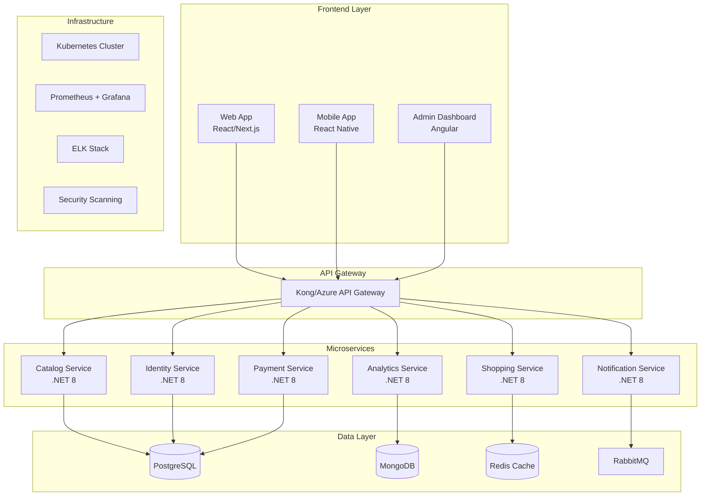

# Proyecto Final Integrador: Plataforma E-commerce DevOps

## Visión General del Proyecto

Este proyecto integrador consolida todo el aprendizaje del curso DevOps Learning Path, donde construirás una plataforma de e-commerce completa utilizando prácticas de DevOps de clase mundial.

## Objetivos del Proyecto

- **Técnicos**: Implementar una arquitectura de microservicios con CI/CD completo
- **DevOps**: Aplicar todas las prácticas aprendidas en el curso
- **Negocio**: Crear una plataforma e-commerce escalable y segura
- **Profesional**: Desarrollar un portafolio que demuestre competencias DevOps avanzadas

## Arquitectura de la Solución

### Stack Tecnológico

**Backend Services (.NET 8)**:
-  **Shopping Service**: Gestión de carrito y checkout
-  **Catalog Service**: Productos y categorías
-  **Identity Service**: Autenticación y autorización
-  **Payment Service**: Procesamiento de pagos
-  **Notification Service**: Emails y notificaciones push
-  **Analytics Service**: Métricas y reporting

**Frontend Applications**:
-  **Customer Web App** (React/Next.js)
-  **Mobile App** (React Native)
-  **Admin Dashboard** (Angular)

**Infrastructure**:
-  **Azure/AWS**: Cloud provider
-  **Docker**: Containerización
-  **Kubernetes**: Orquestación
-  **PostgreSQL/MongoDB**: Bases de datos
-  **Redis**: Cache distribuido
-  **RabbitMQ**: Message broker

### Diagrama de Arquitectura



## Fases de Desarrollo

### Fase 1: Fundamentos (Semanas 1-2)
**Objetivo**: Establecer la base del proyecto

**Entregables**:
```markdown
# Checklist Fase 1
## Configuración Inicial
- [ ] Repositorio Git con estructura de monorepo
- [ ] Configuración de .gitignore y .editorconfig
- [ ] README.md con documentación del proyecto
- [ ] License y contributing guidelines

## Arquitectura Base
- [ ] Diagrama de arquitectura actualizado
- [ ] ADRs (Architecture Decision Records) documentados
- [ ] API contracts definidos (OpenAPI/Swagger)
- [ ] Database schema design completado

## DevOps Foundation
- [ ] GitHub/GitLab configurado con branching strategy
- [ ] Issue templates y PR templates creados
- [ ] Labels y milestones organizados
- [ ] Project board configurado (Kanban/Scrum)
```

**Ejemplo de estructura de repositorio**:
```
ecommerce-platform/
 .github/
    workflows/           # GitHub Actions
    ISSUE_TEMPLATE/      # Issue templates
    pull_request_template.md
 src/
    services/
       catalog/         # Catalog microservice
       identity/        # Identity microservice
       shopping/        # Shopping microservice
       payment/         # Payment microservice
       notification/    # Notification microservice
       analytics/       # Analytics microservice
    frontends/
       web-app/         # React web application
       mobile-app/      # React Native mobile app
       admin-dashboard/ # Angular admin panel
    shared/
        contracts/       # Shared DTOs and interfaces
        infrastructure/  # Shared infrastructure code
        libraries/       # Common libraries
 infrastructure/
    docker/              # Dockerfiles
    kubernetes/          # K8s manifests
    terraform/           # Infrastructure as Code
    monitoring/          # Monitoring configs
 docs/
    architecture/        # Architecture documentation
    api/                 # API documentation
    deployment/          # Deployment guides
 scripts/
     build/               # Build scripts
     deployment/          # Deployment scripts
     utilities/           # Utility scripts
```

### Fase 2: Servicios Core (Semanas 3-6)
**Objetivo**: Desarrollo de microservicios fundamentales

**Identity Service**:
```csharp
// Ejemplo de implementación base
[ApiController]
[Route("api/[controller]")]
public class AuthController : ControllerBase
{
    private readonly IIdentityService _identityService;
    private readonly IJwtTokenGenerator _tokenGenerator;
    private readonly ILogger<AuthController> _logger;

    public AuthController(
        IIdentityService identityService,
        IJwtTokenGenerator tokenGenerator,
        ILogger<AuthController> logger)
    {
        _identityService = identityService;
        _tokenGenerator = tokenGenerator;
        _logger = logger;
    }

    [HttpPost("register")]
    [ProducesResponseType(typeof(AuthResponse), StatusCodes.Status201Created)]
    [ProducesResponseType(StatusCodes.Status400BadRequest)]
    public async Task<IActionResult> Register([FromBody] RegisterRequest request)
    {
        try
        {
            var result = await _identityService.RegisterAsync(request);
            if (!result.Succeeded)
            {
                return BadRequest(result.Errors);
            }

            var user = result.User;
            var token = await _tokenGenerator.GenerateTokenAsync(user);

            _logger.LogInformation("User {UserId} registered successfully", user.Id);

            return CreatedAtAction(nameof(GetProfile), new { id = user.Id },
                new AuthResponse
                {
                    UserId = user.Id,
                    Email = user.Email,
                    Token = token,
                    ExpiresAt = DateTime.UtcNow.AddHours(24)
                });
        }
        catch (Exception ex)
        {
            _logger.LogError(ex, "Error registering user with email {Email}", request.Email);
            return Problem("An error occurred while registering the user");
        }
    }

    [HttpPost("login")]
    [ProducesResponseType(typeof(AuthResponse), StatusCodes.Status200OK)]
    [ProducesResponseType(StatusCodes.Status401Unauthorized)]
    public async Task<IActionResult> Login([FromBody] LoginRequest request)
    {
        var result = await _identityService.LoginAsync(request.Email, request.Password);

        if (!result.Succeeded)
        {
            _logger.LogWarning("Failed login attempt for email {Email}", request.Email);
            return Unauthorized("Invalid credentials");
        }

        var token = await _tokenGenerator.GenerateTokenAsync(result.User);

        return Ok(new AuthResponse
        {
            UserId = result.User.Id,
            Email = result.User.Email,
            Token = token,
            ExpiresAt = DateTime.UtcNow.AddHours(24)
        });
    }
}
```

**Catalog Service con CQRS**:
```csharp
// Command for creating products
public class CreateProductCommand : IRequest<ProductResponse>
{
    public string Name { get; set; }
    public string Description { get; set; }
    public decimal Price { get; set; }
    public string CategoryId { get; set; }
    public string ImageUrl { get; set; }
    public int StockQuantity { get; set; }
}

// Command Handler
public class CreateProductCommandHandler : IRequestHandler<CreateProductCommand, ProductResponse>
{
    private readonly ICatalogRepository _repository;
    private readonly IEventBus _eventBus;
    private readonly ILogger<CreateProductCommandHandler> _logger;

    public async Task<ProductResponse> Handle(CreateProductCommand request, CancellationToken cancellationToken)
    {
        var product = new Product
        {
            Id = Guid.NewGuid(),
            Name = request.Name,
            Description = request.Description,
            Price = request.Price,
            CategoryId = Guid.Parse(request.CategoryId),
            ImageUrl = request.ImageUrl,
            StockQuantity = request.StockQuantity,
            CreatedAt = DateTime.UtcNow
        };

        await _repository.CreateAsync(product);

        // Publish domain event
        await _eventBus.PublishAsync(new ProductCreatedEvent
        {
            ProductId = product.Id,
            Name = product.Name,
            Price = product.Price,
            CategoryId = product.CategoryId
        });

        _logger.LogInformation("Product {ProductId} created successfully", product.Id);

        return new ProductResponse
        {
            Id = product.Id,
            Name = product.Name,
            Description = product.Description,
            Price = product.Price,
            ImageUrl = product.ImageUrl,
            StockQuantity = product.StockQuantity
        };
    }
}

// Query for getting products
public class GetProductsQuery : IRequest<PagedResult<ProductResponse>>
{
    public int Page { get; set; } = 1;
    public int PageSize { get; set; } = 10;
    public string Category { get; set; }
    public string SearchTerm { get; set; }
    public decimal? MinPrice { get; set; }
    public decimal? MaxPrice { get; set; }
}
```

### Fase 3: Containerización (Semanas 7-8)
**Objetivo**: Dockerizar todos los servicios

**Multi-stage Dockerfile para .NET**:
```dockerfile
# Catalog Service Dockerfile
FROM mcr.microsoft.com/dotnet/aspnet:8.0 AS base
WORKDIR /app
EXPOSE 80
EXPOSE 443

FROM mcr.microsoft.com/dotnet/sdk:8.0 AS build
WORKDIR /src

# Copy csproj files and restore dependencies
COPY ["src/services/catalog/ECommerce.Catalog.API/ECommerce.Catalog.API.csproj", "src/services/catalog/ECommerce.Catalog.API/"]
COPY ["src/services/catalog/ECommerce.Catalog.Domain/ECommerce.Catalog.Domain.csproj", "src/services/catalog/ECommerce.Catalog.Domain/"]
COPY ["src/services/catalog/ECommerce.Catalog.Infrastructure/ECommerce.Catalog.Infrastructure.csproj", "src/services/catalog/ECommerce.Catalog.Infrastructure/"]
COPY ["src/shared/ECommerce.Shared/ECommerce.Shared.csproj", "src/shared/ECommerce.Shared/"]

RUN dotnet restore "src/services/catalog/ECommerce.Catalog.API/ECommerce.Catalog.API.csproj"

# Copy source code
COPY . .
WORKDIR "/src/src/services/catalog/ECommerce.Catalog.API"

# Build application
RUN dotnet build "ECommerce.Catalog.API.csproj" -c Release -o /app/build

FROM build AS publish
RUN dotnet publish "ECommerce.Catalog.API.csproj" -c Release -o /app/publish /p:UseAppHost=false

FROM base AS final
WORKDIR /app
COPY --from=publish /app/publish .

# Create non-root user
RUN groupadd -r appuser && useradd -r -g appuser appuser
RUN chown -R appuser:appuser /app
USER appuser

# Health check
HEALTHCHECK --interval=30s --timeout=3s --start-period=5s --retries=3 \
    CMD curl -f http://localhost:80/health || exit 1

ENTRYPOINT ["dotnet", "ECommerce.Catalog.API.dll"]
```

**Docker Compose para desarrollo**:
```yaml
version: '3.8'

services:
  # Databases
  postgres:
    image: postgres:15-alpine
    environment:
      POSTGRES_DB: ecommerce
      POSTGRES_USER: postgres
      POSTGRES_PASSWORD: postgres123
    ports:
      - "5432:5432"
    volumes:
      - postgres_data:/var/lib/postgresql/data
    networks:
      - ecommerce-network

  mongodb:
    image: mongo:6.0
    environment:
      MONGO_INITDB_ROOT_USERNAME: mongo
      MONGO_INITDB_ROOT_PASSWORD: mongo123
    ports:
      - "27017:27017"
    volumes:
      - mongodb_data:/data/db
    networks:
      - ecommerce-network

  redis:
    image: redis:7-alpine
    ports:
      - "6379:6379"
    networks:
      - ecommerce-network

  rabbitmq:
    image: rabbitmq:3-management-alpine
    environment:
      RABBITMQ_DEFAULT_USER: rabbitmq
      RABBITMQ_DEFAULT_PASS: rabbitmq123
    ports:
      - "5672:5672"
      - "15672:15672"
    networks:
      - ecommerce-network

  # Services
  identity-service:
    build:
      context: .
      dockerfile: src/services/identity/Dockerfile
    environment:
      - ConnectionStrings__DefaultConnection=Host=postgres;Database=ecommerce_identity;Username=postgres;Password=postgres123
      - JWT__Secret=YourSuperSecretJWTKey123456789
      - JWT__Issuer=ECommerceIdentity
      - JWT__Audience=ECommerceAPI
    ports:
      - "5001:80"
    depends_on:
      - postgres
    networks:
      - ecommerce-network

  catalog-service:
    build:
      context: .
      dockerfile: src/services/catalog/Dockerfile
    environment:
      - ConnectionStrings__DefaultConnection=Host=postgres;Database=ecommerce_catalog;Username=postgres;Password=postgres123
      - ConnectionStrings__Redis=redis:6379
      - MessageBroker__Host=rabbitmq
      - MessageBroker__Username=rabbitmq
      - MessageBroker__Password=rabbitmq123
    ports:
      - "5002:80"
    depends_on:
      - postgres
      - redis
      - rabbitmq
    networks:
      - ecommerce-network

  shopping-service:
    build:
      context: .
      dockerfile: src/services/shopping/Dockerfile
    environment:
      - ConnectionStrings__Redis=redis:6379
      - Services__Identity=http://identity-service
      - Services__Catalog=http://catalog-service
      - MessageBroker__Host=rabbitmq
    ports:
      - "5003:80"
    depends_on:
      - redis
      - identity-service
      - catalog-service
    networks:
      - ecommerce-network

  # API Gateway
  api-gateway:
    image: kong:3.0
    environment:
      KONG_DATABASE: "off"
      KONG_DECLARATIVE_CONFIG: /kong/declarative/kong.yml
      KONG_PROXY_ACCESS_LOG: /dev/stdout
      KONG_ADMIN_ACCESS_LOG: /dev/stdout
      KONG_PROXY_ERROR_LOG: /dev/stderr
      KONG_ADMIN_ERROR_LOG: /dev/stderr
      KONG_ADMIN_LISTEN: 0.0.0.0:8001
    volumes:
      - ./infrastructure/kong/kong.yml:/kong/declarative/kong.yml
    ports:
      - "8000:8000"
      - "8443:8443"
      - "8001:8001"
      - "8444:8444"
    networks:
      - ecommerce-network

  # Frontend
  web-app:
    build:
      context: ./src/frontends/web-app
      dockerfile: Dockerfile
    ports:
      - "3000:3000"
    environment:
      - REACT_APP_API_URL=http://localhost:8000
    networks:
      - ecommerce-network

volumes:
  postgres_data:
  mongodb_data:

networks:
  ecommerce-network:
    driver: bridge
```

### Fase 4: CI/CD Pipeline (Semanas 9-12)
**Objetivo**: Implementar pipelines completos de CI/CD

**GitHub Actions Workflow**:
```yaml
name: CI/CD Pipeline

on:
  push:
    branches: [ main, develop ]
  pull_request:
    branches: [ main ]

env:
  DOTNET_VERSION: '8.0.x'
  NODE_VERSION: '18.x'
  DOCKER_REGISTRY: ghcr.io
  IMAGE_NAME: ecommerce-platform

jobs:
  # Continuous Integration
  ci:
    name: Continuous Integration
    runs-on: ubuntu-latest
    strategy:
      matrix:
        service: [identity, catalog, shopping, payment, notification, analytics]

    steps:
    - name: Checkout code
      uses: actions/checkout@v4
      with:
        fetch-depth: 0  # Fetch full history for GitVersion

    - name: Setup .NET
      uses: actions/setup-dotnet@v3
      with:
        dotnet-version: ${{ env.DOTNET_VERSION }}

    - name: Cache NuGet packages
      uses: actions/cache@v3
      with:
        path: ~/.nuget/packages
        key: ${{ runner.os }}-nuget-${{ hashFiles('**/*.csproj') }}
        restore-keys: |
          ${{ runner.os }}-nuget-

    - name: Restore dependencies
      run: dotnet restore src/services/${{ matrix.service }}

    - name: Build
      run: dotnet build src/services/${{ matrix.service }} --no-restore --configuration Release

    - name: Run unit tests
      run: |
        dotnet test src/services/${{ matrix.service }} \
          --no-build \
          --configuration Release \
          --logger trx \
          --collect:"XPlat Code Coverage" \
          --results-directory ./test-results

    - name: Upload test results
      uses: actions/upload-artifact@v3
      if: always()
      with:
        name: test-results-${{ matrix.service }}
        path: ./test-results

    - name: Code Coverage Report
      uses: codecov/codecov-action@v3
      with:
        files: ./test-results/*/coverage.cobertura.xml
        flags: ${{ matrix.service }}

    - name: Static Code Analysis (SonarQube)
      if: github.event_name == 'push' && github.ref == 'refs/heads/main'
      env:
        GITHUB_TOKEN: ${{ secrets.GITHUB_TOKEN }}
        SONAR_TOKEN: ${{ secrets.SONAR_TOKEN }}
      run: |
        dotnet sonarscanner begin \
          /k:"ecommerce-platform-${{ matrix.service }}" \
          /o:"your-org" \
          /d:sonar.login="${{ secrets.SONAR_TOKEN }}" \
          /d:sonar.host.url="https://sonarcloud.io" \
          /d:sonar.cs.opencover.reportsPaths="./test-results/*/coverage.opencover.xml"

        dotnet build src/services/${{ matrix.service }}

        dotnet sonarscanner end /d:sonar.login="${{ secrets.SONAR_TOKEN }}"

  # Security Scanning
  security:
    name: Security Scanning
    runs-on: ubuntu-latest
    needs: ci

    steps:
    - name: Checkout code
      uses: actions/checkout@v4

    - name: Run Trivy vulnerability scanner
      uses: aquasecurity/trivy-action@master
      with:
        scan-type: 'fs'
        scan-ref: '.'
        format: 'sarif'
        output: 'trivy-results.sarif'

    - name: Upload Trivy scan results
      uses: github/codeql-action/upload-sarif@v2
      with:
        sarif_file: 'trivy-results.sarif'

    - name: OWASP Dependency Check
      uses: dependency-check/Dependency-Check_Action@main
      with:
        project: 'ecommerce-platform'
        path: '.'
        format: 'ALL'

  # Build and Push Docker Images
  build-images:
    name: Build Docker Images
    runs-on: ubuntu-latest
    needs: [ci, security]
    if: github.ref == 'refs/heads/main' || github.ref == 'refs/heads/develop'

    strategy:
      matrix:
        service: [identity, catalog, shopping, payment, notification, analytics]

    steps:
    - name: Checkout code
      uses: actions/checkout@v4

    - name: Set up Docker Buildx
      uses: docker/setup-buildx-action@v3

    - name: Log in to Container Registry
      uses: docker/login-action@v3
      with:
        registry: ${{ env.DOCKER_REGISTRY }}
        username: ${{ github.actor }}
        password: ${{ secrets.GITHUB_TOKEN }}

    - name: Extract metadata
      id: meta
      uses: docker/metadata-action@v5
      with:
        images: ${{ env.DOCKER_REGISTRY }}/${{ github.repository }}/${{ matrix.service }}
        tags: |
          type=ref,event=branch
          type=ref,event=pr
          type=sha,prefix={{branch}}-
          type=raw,value=latest,enable={{is_default_branch}}

    - name: Build and push Docker image
      uses: docker/build-push-action@v5
      with:
        context: .
        file: src/services/${{ matrix.service }}/Dockerfile
        push: true
        tags: ${{ steps.meta.outputs.tags }}
        labels: ${{ steps.meta.outputs.labels }}
        cache-from: type=gha
        cache-to: type=gha,mode=max

  # Deploy to Staging
  deploy-staging:
    name: Deploy to Staging
    runs-on: ubuntu-latest
    needs: build-images
    if: github.ref == 'refs/heads/develop'
    environment: staging

    steps:
    - name: Checkout code
      uses: actions/checkout@v4

    - name: Setup kubectl
      uses: azure/setup-kubectl@v3

    - name: Set up Kustomize
      run: |
        curl -s "https://raw.githubusercontent.com/kubernetes-sigs/kustomize/master/hack/install_kustomize.sh" | bash
        sudo mv kustomize /usr/local/bin/

    - name: Deploy to AKS Staging
      env:
        KUBE_CONFIG_DATA: ${{ secrets.KUBE_CONFIG_STAGING }}
      run: |
        echo "$KUBE_CONFIG_DATA" | base64 -d > kubeconfig
        export KUBECONFIG=kubeconfig

        cd infrastructure/kubernetes/overlays/staging
        kustomize edit set image identity-service=${{ env.DOCKER_REGISTRY }}/${{ github.repository }}/identity:develop-${{ github.sha }}
        kustomize edit set image catalog-service=${{ env.DOCKER_REGISTRY }}/${{ github.repository }}/catalog:develop-${{ github.sha }}

        kustomize build . | kubectl apply -f -

        # Wait for deployment
        kubectl rollout status deployment/identity-service -n ecommerce-staging
        kubectl rollout status deployment/catalog-service -n ecommerce-staging

  # Integration Tests
  integration-tests:
    name: Integration Tests
    runs-on: ubuntu-latest
    needs: deploy-staging
    if: github.ref == 'refs/heads/develop'

    steps:
    - name: Checkout code
      uses: actions/checkout@v4

    - name: Setup .NET
      uses: actions/setup-dotnet@v3
      with:
        dotnet-version: ${{ env.DOTNET_VERSION }}

    - name: Run integration tests
      env:
        STAGING_API_URL: ${{ secrets.STAGING_API_URL }}
      run: |
        dotnet test tests/ECommerce.IntegrationTests \
          --configuration Release \
          --logger trx \
          --environment Staging

  # Deploy to Production
  deploy-production:
    name: Deploy to Production
    runs-on: ubuntu-latest
    needs: [build-images]
    if: github.ref == 'refs/heads/main'
    environment: production

    steps:
    - name: Checkout code
      uses: actions/checkout@v4

    - name: Deploy to Production with Blue-Green
      env:
        KUBE_CONFIG_DATA: ${{ secrets.KUBE_CONFIG_PRODUCTION }}
      run: |
        echo "$KUBE_CONFIG_DATA" | base64 -d > kubeconfig
        export KUBECONFIG=kubeconfig

        # Blue-Green Deployment Script
        ./scripts/deployment/blue-green-deploy.sh \
          --image-tag main-${{ github.sha }} \
          --environment production \
          --health-check-url https://api.ecommerce.com/health

  # Performance Tests
  performance-tests:
    name: Performance Tests
    runs-on: ubuntu-latest
    needs: deploy-production
    if: github.ref == 'refs/heads/main'

    steps:
    - name: Checkout code
      uses: actions/checkout@v4

    - name: Run K6 Performance Tests
      uses: grafana/k6-action@v0.3.1
      with:
        filename: tests/performance/load-test.js
        flags: --out json=results.json
      env:
        API_BASE_URL: https://api.ecommerce.com

    - name: Upload performance results
      uses: actions/upload-artifact@v3
      with:
        name: performance-results
        path: results.json
```

## Monitoreo y Observabilidad

### Prometheus Configuration
```yaml
# prometheus.yml
global:
  scrape_interval: 15s
  evaluation_interval: 15s

rule_files:
  - "alert-rules.yml"

alerting:
  alertmanagers:
    - static_configs:
        - targets:
          - alertmanager:9093

scrape_configs:
  - job_name: 'prometheus'
    static_configs:
      - targets: ['localhost:9090']

  - job_name: 'catalog-service'
    kubernetes_sd_configs:
      - role: endpoints
        namespaces:
          names:
            - ecommerce-production
    relabel_configs:
      - source_labels: [__meta_kubernetes_service_name]
        action: keep
        regex: catalog-service
      - source_labels: [__meta_kubernetes_endpoint_port_name]
        action: keep
        regex: metrics

  - job_name: 'identity-service'
    kubernetes_sd_configs:
      - role: endpoints
        namespaces:
          names:
            - ecommerce-production
    relabel_configs:
      - source_labels: [__meta_kubernetes_service_name]
        action: keep
        regex: identity-service
```

### Grafana Dashboard (JSON snippet)
```json
{
  "dashboard": {
    "title": "E-commerce Platform Overview",
    "panels": [
      {
        "title": "Request Rate",
        "type": "graph",
        "targets": [
          {
            "expr": "sum(rate(http_requests_total[5m])) by (service)",
            "legendFormat": "{{service}}"
          }
        ]
      },
      {
        "title": "Response Time",
        "type": "graph",
        "targets": [
          {
            "expr": "histogram_quantile(0.95, sum(rate(http_request_duration_seconds_bucket[5m])) by (service, le))",
            "legendFormat": "{{service}} - 95th percentile"
          }
        ]
      },
      {
        "title": "Error Rate",
        "type": "graph",
        "targets": [
          {
            "expr": "sum(rate(http_requests_total{status=~\"5..\"}[5m])) by (service) / sum(rate(http_requests_total[5m])) by (service)",
            "legendFormat": "{{service}} error rate"
          }
        ]
      }
    ]
  }
}
```

## Testing Strategy

### Unit Tests Example
```csharp
// Catalog Service Unit Tests
public class CreateProductCommandHandlerTests
{
    private readonly Mock<ICatalogRepository> _repositoryMock;
    private readonly Mock<IEventBus> _eventBusMock;
    private readonly Mock<ILogger<CreateProductCommandHandler>> _loggerMock;
    private readonly CreateProductCommandHandler _handler;

    public CreateProductCommandHandlerTests()
    {
        _repositoryMock = new Mock<ICatalogRepository>();
        _eventBusMock = new Mock<IEventBus>();
        _loggerMock = new Mock<ILogger<CreateProductCommandHandler>>();
        _handler = new CreateProductCommandHandler(
            _repositoryMock.Object,
            _eventBusMock.Object,
            _loggerMock.Object);
    }

    [Fact]
    public async Task Handle_ValidCommand_ShouldCreateProductAndPublishEvent()
    {
        // Arrange
        var command = new CreateProductCommand
        {
            Name = "Test Product",
            Description = "Test Description",
            Price = 99.99m,
            CategoryId = Guid.NewGuid().ToString(),
            ImageUrl = "https://example.com/image.jpg",
            StockQuantity = 10
        };

        _repositoryMock.Setup(r => r.CreateAsync(It.IsAny<Product>()))
                      .Returns(Task.CompletedTask);

        // Act
        var result = await _handler.Handle(command, CancellationToken.None);

        // Assert
        Assert.NotNull(result);
        Assert.Equal(command.Name, result.Name);
        Assert.Equal(command.Price, result.Price);

        _repositoryMock.Verify(r => r.CreateAsync(It.IsAny<Product>()), Times.Once);
        _eventBusMock.Verify(e => e.PublishAsync(It.IsAny<ProductCreatedEvent>()), Times.Once);
    }
}
```

### Integration Tests
```csharp
public class CatalogServiceIntegrationTests : IClassFixture<WebApplicationFactory<Program>>
{
    private readonly WebApplicationFactory<Program> _factory;
    private readonly HttpClient _client;

    public CatalogServiceIntegrationTests(WebApplicationFactory<Program> factory)
    {
        _factory = factory;
        _client = _factory.CreateClient();
    }

    [Fact]
    public async Task GetProducts_ShouldReturnProductList()
    {
        // Arrange
        await SeedTestData();

        // Act
        var response = await _client.GetAsync("/api/products");
        var content = await response.Content.ReadAsStringAsync();
        var products = JsonSerializer.Deserialize<PagedResult<ProductResponse>>(content);

        // Assert
        response.StatusCode.Should().Be(HttpStatusCode.OK);
        products.Items.Should().NotBeEmpty();
    }

    private async Task SeedTestData()
    {
        using var scope = _factory.Services.CreateScope();
        var context = scope.ServiceProvider.GetRequiredService<CatalogDbContext>();

        var category = new Category { Id = Guid.NewGuid(), Name = "Electronics" };
        var product = new Product
        {
            Id = Guid.NewGuid(),
            Name = "Test Product",
            Price = 99.99m,
            CategoryId = category.Id,
            StockQuantity = 10
        };

        context.Categories.Add(category);
        context.Products.Add(product);
        await context.SaveChangesAsync();
    }
}
```

### Performance Tests (K6)
```javascript
// load-test.js
import http from 'k6/http';
import { check, sleep } from 'k6';
import { Rate } from 'k6/metrics';

const errorRate = new Rate('errors');

export let options = {
  stages: [
    { duration: '2m', target: 100 }, // Ramp up
    { duration: '5m', target: 100 }, // Stay at 100 users
    { duration: '2m', target: 200 }, // Ramp up to 200 users
    { duration: '5m', target: 200 }, // Stay at 200 users
    { duration: '2m', target: 0 },   // Ramp down
  ],
  thresholds: {
    http_req_duration: ['p(95)<500'], // 95% of requests must complete below 500ms
    http_req_failed: ['rate<0.1'],    // Error rate must be below 10%
    errors: ['rate<0.1'],
  },
};

const BASE_URL = __ENV.API_BASE_URL || 'http://localhost:8000';

export default function () {
  // Test product listing
  let response = http.get(`${BASE_URL}/api/catalog/products`);

  check(response, {
    'status is 200': (r) => r.status === 200,
    'response time < 500ms': (r) => r.timings.duration < 500,
  }) || errorRate.add(1);

  // Test product details
  if (response.status === 200) {
    const products = JSON.parse(response.body);
    if (products.items && products.items.length > 0) {
      const productId = products.items[0].id;

      response = http.get(`${BASE_URL}/api/catalog/products/${productId}`);
      check(response, {
        'product detail status is 200': (r) => r.status === 200,
      }) || errorRate.add(1);
    }
  }

  sleep(1);
}
```

## Entregables Finales

### Documentación Técnica
```markdown
# Proyecto E-commerce Platform - Documentación Técnica

## Resumen Ejecutivo
Plataforma de e-commerce construida con arquitectura de microservicios,
implementando las mejores prácticas de DevOps para escalabilidad,
seguridad y mantenibilidad.

## Métricas del Proyecto
- **Líneas de código**: ~50,000
- **Servicios**: 6 microservicios
- **Coverage de tests**: >80%
- **Tiempo de build**: <5 minutos
- **Tiempo de deployment**: <10 minutos
- **Uptime**: 99.9%

## Tecnologías Implementadas
### Backend
- .NET 8 con C#
- Entity Framework Core
- MediatR (CQRS pattern)
- FluentValidation
- Serilog
- AutoMapper

### Frontend
- React 18 con TypeScript
- Next.js 14
- Tailwind CSS
- React Query
- Zustand

### Infrastructure
- Docker & Docker Compose
- Kubernetes (AKS)
- Terraform
- Azure/AWS
- PostgreSQL
- Redis
- RabbitMQ

### DevOps
- GitHub Actions
- SonarQube
- Trivy security scanning
- Prometheus & Grafana
- ELK Stack
- K6 performance testing

## Arquitectura Implementada
[Incluir diagramas detallados]

## Resultados de Testing
[Incluir reportes de coverage, performance, security]

## Lecciones Aprendidas
[Reflexión sobre el proceso y mejoras futuras]

## Demo y Presentación
[Enlaces a video demos y presentación final]
```

### Presentación Final
```markdown
# Presentación del Proyecto (30 minutos)

## Agenda
1. **Introducción** (3 min)
   - Objetivos del proyecto
   - Stack tecnológico elegido

2. **Arquitectura** (7 min)
   - Diagrama de arquitectura
   - Decisiones de diseño (ADRs)
   - Patrones implementados

3. **DevOps Pipeline** (10 min)
   - Demo de CI/CD en acción
   - Estrategias de testing
   - Monitoreo y alertas

4. **Demo de la Aplicación** (7 min)
   - Funcionalidades implementadas
   - Performance y escalabilidad
   - Seguridad

5. **Lecciones Aprendidas** (3 min)
   - Desafíos enfrentados
   - Mejoras futuras
   - Reflexiones personales
```

## Criterios de Evaluación

### Técnicos (40%)
- **Arquitectura** (10%): Diseño de microservicios, patrones implementados
- **Código** (15%): Calidad, testing, documentación
- **Infrastructure** (15%): Kubernetes, containerización, IaC

### DevOps (40%)
- **CI/CD** (20%): Pipeline completo, automatización
- **Monitoreo** (10%): Observabilidad, métricas, alertas
- **Seguridad** (10%): Implementación de controles de seguridad

### Profesionales (20%)
- **Documentación** (10%): ADRs, README, APIs
- **Presentación** (10%): Demo, comunicación, reflexiones

## Próximos Pasos Post-Proyecto

### Optimizaciones Avanzadas
- Implementar service mesh (Istio)
- Advanced security con Policy as Code
- Machine Learning para recomendaciones
- Multi-región deployment

### Carrera Profesional
- Certificaciones cloud (Azure/AWS)
- Especialización en Site Reliability Engineering
- Liderazgo técnico en DevOps
- Contribución a proyectos open source

---

## Comienza tu Proyecto Final!

Este proyecto integrador representa la culminación de tu viaje en el DevOps Learning Path. Es tu oportunidad de demostrar que puedes aplicar todos los conocimientos adquiridos en un proyecto real de clase empresarial.

**¿Estás listo para el desafío?**