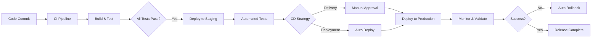

# Entrega/Despliegue Continuo (CD)

La **Entrega/Despliegue Continuo**es la extensión natural de la Integración Continua, automatizando la entrega de software a diferentes entornos de forma segura, confiable y repetible. En este módulo aprenderás las estrategias y técnicas para desplegar aplicaciones con **cero downtime**, **rollbacks automáticos**y **confianza total**en tus releases.

---

## **¿Qué es Entrega/Despliegue Continuo?**

### **Continuous Delivery vs Continuous Deployment**

**Continuous Delivery (Entrega Continua): **
- Código **siempre listo**para producción
- Despliegue **manual**con un click
- **Validación humana**antes de producción
- **Control total**sobre releases

**Continuous Deployment (Despliegue Continuo): **
- Despliegue **totalmente automatizado**
- **Sin intervención humana**
- Cambios van **directo a producción**
- **Confianza absoluta**en automatización



### **Los pilares de CD exitoso**

1. **Testing confiable**: Cobertura de tests que da confianza total
2. **Deployment automatizado**: Procesos repetibles sin errores humanos
3. **Monitoring proactivo**: Detección inmediata de problemas
4. **Rollback instantáneo**: Capacidad de revertir cambios rápidamente
5. **Feature flags**: Control granular de funcionalidades
6. **Métricas continuas**: Visibilidad del impacto de cambios

---

## **1. Estrategias de Despliegue**

### **Blue-Green Deployment**

**Concepto: **Mantener **dos entornos idénticos**(Blue y Green). Uno sirve tráfico de producción mientras el otro recibe el nuevo despliegue.

#### **Ventajas: **
-  **Cero downtime**- Cambio instantáneo
-  **Rollback rápido**- Solo cambiar el router
-  **Testing completo**- Validar en ambiente idéntico
-  **Baja complejidad**- Fácil de entender

#### **Desventajas: **
-  **Costo alto**- Doble infraestructura
-  **Datos complejos**- Migrations pueden ser problemáticas
-  **Recursos intensivo**- Duplicar todo el stack

#### **Implementación con Docker y Nginx**

```bash
#!/bin/bash
# blue-green-deploy.sh

set -e

APP_NAME="my-web-app"
NEW_VERSION=$1
CURRENT_COLOR=$(docker ps --format "table {{.Names}}" | grep $APP_NAME | grep -o 'blue\|green' | head -1)

# Determinar el próximo color
if [ "$CURRENT_COLOR" = "blue" ]; then
    NEW_COLOR="green"
    OLD_COLOR="blue"
else
    NEW_COLOR="blue"
    OLD_COLOR="green"
fi

echo " Blue-Green Deployment Started"
echo " Current: $OLD_COLOR → New: $NEW_COLOR"
echo "  Version: $NEW_VERSION"

# 1. Pull nueva imagen
echo " Pulling new image..."
docker pull $APP_NAME:$NEW_VERSION

# 2. Parar container anterior del nuevo color (si existe)
echo " Stopping previous $NEW_COLOR container..."
docker stop ${APP_NAME}-${NEW_COLOR} 2>/dev/null || true
docker rm ${APP_NAME}-${NEW_COLOR} 2>/dev/null || true

# 3. Ejecutar nueva versión en el nuevo color
echo " Starting $NEW_COLOR environment..."
docker run -d \
  --name ${APP_NAME}-${NEW_COLOR} \
  --network app-network \
  -e ENV=production \
  -e VERSION=$NEW_VERSION \
  $APP_NAME:$NEW_VERSION

# 4. Health check del nuevo ambiente
echo " Health checking $NEW_COLOR environment..."
for i in {1..30}; do
  if docker exec ${APP_NAME}-${NEW_COLOR} curl -f http://localhost:3000/health >/dev/null 2>&1; then
    echo " $NEW_COLOR environment is healthy"
    break
  fi

  if [ $i -eq 30 ]; then
    echo " Health check failed, rolling back..."
    docker stop ${APP_NAME}-${NEW_COLOR}
    docker rm ${APP_NAME}-${NEW_COLOR}
    exit 1
  fi

  echo "⏳ Waiting for health check... ($i/30)"
  sleep 2
done

# 5. Smoke tests
echo " Running smoke tests..."
docker exec ${APP_NAME}-${NEW_COLOR} npm run test:smoke

# 6. Switch traffic (actualizar nginx)
echo " Switching traffic to $NEW_COLOR..."
cat > /etc/nginx/conf.d/app.conf <<EOF
upstream app_backend {
    server ${APP_NAME}-${NEW_COLOR}:3000;
}

server {
    listen 80;
    server_name example.com;

    location / {
        proxy_pass http://app_backend;
        proxy_set_header Host \$host;
        proxy_set_header X-Real-IP \$remote_addr;
        proxy_set_header X-Forwarded-For \$proxy_add_x_forwarded_for;
    }

    location /health {
        access_log off;
        proxy_pass http://app_backend;
    }
}
EOF

# 7. Reload nginx
nginx -t && nginx -s reload

# 8. Wait and validate new deployment
echo "⏳ Validating new deployment for 30 seconds..."
sleep 30

# 9. Check error rates
ERROR_RATE=$(curl -s http://localhost/metrics | grep error_rate | awk '{print $2}')
if (( $(echo "$ERROR_RATE > 0.05" | bc -l) )); then
    echo " High error rate detected: $ERROR_RATE"
    echo " Rolling back to $OLD_COLOR..."

    # Rollback nginx config
    cat > /etc/nginx/conf.d/app.conf <<EOF
upstream app_backend {
    server ${APP_NAME}-${OLD_COLOR}:3000;
}
EOF
    nginx -s reload
    exit 1
fi

# 10. Cleanup old version
echo " Cleaning up $OLD_COLOR environment..."
docker stop ${APP_NAME}-${OLD_COLOR} || true
docker rm ${APP_NAME}-${OLD_COLOR} || true

echo " Blue-Green deployment completed successfully!"
echo " $APP_NAME:$NEW_VERSION is now serving traffic"
```

#### **Blue-Green con Kubernetes**

```yaml
# blue-green-k8s.yml
apiVersion: v1
kind: Service
metadata:
  name: app-service
spec:
  selector:
    app: myapp
    version: blue  # Cambiar a 'green' para switch
  ports:
    - port: 80
      targetPort: 3000

---
# Blue Deployment
apiVersion: apps/v1
kind: Deployment
metadata:
  name: myapp-blue
spec:
  replicas: 3
  selector:
    matchLabels:
      app: myapp
      version: blue
  template:
    metadata:
      labels:
        app: myapp
        version: blue
    spec:
      containers:
      - name: app
        image: myapp:v1.0.0
        ports:
        - containerPort: 3000
        livenessProbe:
          httpGet:
            path: /health
            port: 3000
          initialDelaySeconds: 30
        readinessProbe:
          httpGet:
            path: /health
            port: 3000
          initialDelaySeconds: 5

---
# Green Deployment
apiVersion: apps/v1
kind: Deployment
metadata:
  name: myapp-green
spec:
  replicas: 3
  selector:
    matchLabels:
      app: myapp
      version: green
  template:
    metadata:
      labels:
        app: myapp
        version: green
    spec:
      containers:
      - name: app
        image: myapp:v2.0.0
        ports:
        - containerPort: 3000
        livenessProbe:
          httpGet:
            path: /health
            port: 3000
          initialDelaySeconds: 30
        readinessProbe:
          httpGet:
            path: /health
            port: 3000
          initialDelaySeconds: 5
```

```bash
#!/bin/bash
# k8s-blue-green.sh

NEW_VERSION=$1
CURRENT_VERSION=$(kubectl get service app-service -o jsonpath='{.spec.selector.version}')

if [ "$CURRENT_VERSION" = "blue" ]; then
    NEW_COLOR="green"
    OLD_COLOR="blue"
else
    NEW_COLOR="blue"
    OLD_COLOR="green"
fi

echo " Kubernetes Blue-Green Deployment"
echo " Current: $OLD_COLOR → New: $NEW_COLOR"

# 1. Update deployment image
kubectl set image deployment/myapp-$NEW_COLOR app=myapp:$NEW_VERSION

# 2. Wait for rollout
kubectl rollout status deployment/myapp-$NEW_COLOR --timeout=300s

# 3. Run pre-switch validation
kubectl run validator --rm -i --image=curlimages/curl -- \
  curl -f http://myapp-$NEW_COLOR:80/health

# 4. Switch service selector
kubectl patch service app-service -p '{"spec":{"selector":{"version":"'$NEW_COLOR'"}}}'

# 5. Wait and validate
echo "⏳ Validating deployment for 60 seconds..."
sleep 60

# 6. Scale down old version
kubectl scale deployment myapp-$OLD_COLOR --replicas=0

echo " Blue-Green deployment completed!"
```

### **Canary Deployment**

**Concepto: **Desplegar nueva versión gradualmente a un **subconjunto pequeño**de usuarios/tráfico, monitoreando métricas antes de full rollout.

#### **Ventajas: **
-  **Riesgo minimizado**- Solo afecta pequeño porcentaje
-  **Feedback temprano**- Detectar issues antes de full rollout
-  **A/B Testing**- Comparar versiones en producción
-  **Costo eficiente**- No necesita doble infraestructura

#### **Desventajas: **
-  **Complejidad alta**- Requires traffic splitting
-  **Monitoring intensivo**- Necesita métricas detalladas
-  **Testing parcial**- No todo el flujo se prueba inicialmente

#### **Implementación con Nginx y Docker**

```nginx
# nginx-canary.conf
upstream app_stable {
    server app-stable-1:3000;
    server app-stable-2:3000;
    server app-stable-3:3000;
}

upstream app_canary {
    server app-canary-1:3000;
}

# Split configuration - 10% canary, 90% stable
split_clients $remote_addr $variant {
    10%     canary;
    *       stable;
}

server {
    listen 80;
    server_name example.com;

    location / {
        # Custom header for canary identification
        add_header X-Canary-Version $variant;

        if ($variant = "canary") {
            proxy_pass http://app_canary;
            break;
        }

        proxy_pass http://app_stable;

        proxy_set_header Host $host;
        proxy_set_header X-Real-IP $remote_addr;
        proxy_set_header X-Forwarded-For $proxy_add_x_forwarded_for;
        proxy_set_header X-Canary-User $variant;
    }

    # Health checks
    location /health {
        access_log off;
        proxy_pass http://app_stable;
    }

    location /canary/health {
        access_log off;
        proxy_pass http://app_canary;
    }
}
```

#### **Script de Canary Deployment automatizado**

```bash
#!/bin/bash
# canary-deploy.sh

set -e

APP_NAME="my-web-app"
NEW_VERSION=$1
CANARY_PERCENTAGE=${2:-10}
VALIDATION_PERIOD=${3:-300} # 5 minutes

echo "  Canary Deployment Started"
echo "  Version: $NEW_VERSION"
echo " Canary Traffic: $CANARY_PERCENTAGE%"
echo "  Validation Period: ${VALIDATION_PERIOD}s"

# 1. Deploy canary version
echo " Deploying canary version..."
docker run -d \
  --name ${APP_NAME}-canary-1 \
  --network app-network \
  -e ENV=production \
  -e VERSION=$NEW_VERSION \
  -e CANARY=true \
  $APP_NAME:$NEW_VERSION

# 2. Health check canary
echo " Health checking canary..."
for i in {1..30}; do
  if docker exec ${APP_NAME}-canary-1 curl -f http://localhost:3000/health >/dev/null 2>&1; then
    echo " Canary is healthy"
    break
  fi

  if [ $i -eq 30 ]; then
    echo " Canary health check failed"
    docker stop ${APP_NAME}-canary-1
    docker rm ${APP_NAME}-canary-1
    exit 1
  fi

  echo "⏳ Waiting for canary health check... ($i/30)"
  sleep 2
done

# 3. Update nginx to route traffic
echo " Configuring traffic split ($CANARY_PERCENTAGE% to canary)..."
cat > /etc/nginx/conf.d/canary.conf <<EOF
split_clients \$remote_addr \$variant {
    ${CANARY_PERCENTAGE}%     canary;
    *       stable;
}
EOF

nginx -s reload

# 4. Monitor canary during validation period
echo " Monitoring canary deployment..."
MONITOR_INTERVAL=30
ITERATIONS=$((VALIDATION_PERIOD / MONITOR_INTERVAL))

for i in $(seq 1 $ITERATIONS); do
    echo "⏳ Monitoring iteration $i/$ITERATIONS..."

    # Collect metrics
    STABLE_ERROR_RATE=$(curl -s http://localhost/metrics?version=stable | grep error_rate | awk '{print $2}')
    CANARY_ERROR_RATE=$(curl -s http://localhost/metrics?version=canary | grep error_rate | awk '{print $2}')

    STABLE_RESPONSE_TIME=$(curl -s http://localhost/metrics?version=stable | grep avg_response_time | awk '{print $2}')
    CANARY_RESPONSE_TIME=$(curl -s http://localhost/metrics?version=canary | grep avg_response_time | awk '{print $2}')

    echo " Metrics:"
    echo "   Stable - Error Rate: $STABLE_ERROR_RATE, Response Time: ${STABLE_RESPONSE_TIME}ms"
    echo "   Canary - Error Rate: $CANARY_ERROR_RATE, Response Time: ${CANARY_RESPONSE_TIME}ms"

    # Validation rules
    if (( $(echo "$CANARY_ERROR_RATE > $STABLE_ERROR_RATE * 2" | bc -l) )); then
        echo " Canary error rate is significantly higher than stable"
        echo " Rolling back canary deployment..."

        # Remove canary from nginx config
        cat > /etc/nginx/conf.d/canary.conf <<EOF
split_clients \$remote_addr \$variant {
    *       stable;
}
EOF
        nginx -s reload

        # Stop canary container
        docker stop ${APP_NAME}-canary-1
        docker rm ${APP_NAME}-canary-1

        exit 1
    fi

    if (( $(echo "$CANARY_RESPONSE_TIME > $STABLE_RESPONSE_TIME * 1.5" | bc -l) )); then
        echo " Canary response time is significantly slower than stable"
    fi

    sleep $MONITOR_INTERVAL
done

# 5. Canary validation passed, promote to full deployment
echo " Canary validation passed! Promoting to full deployment..."

# Scale up canary
docker run -d --name ${APP_NAME}-canary-2 --network app-network -e ENV=production $APP_NAME:$NEW_VERSION
docker run -d --name ${APP_NAME}-canary-3 --network app-network -e ENV=production $APP_NAME:$NEW_VERSION

# Wait for new instances
sleep 30

# Update nginx to route 100% to canary (now called stable)
cat > /etc/nginx/conf.d/app.conf <<EOF
upstream app_backend {
    server ${APP_NAME}-canary-1:3000;
    server ${APP_NAME}-canary-2:3000;
    server ${APP_NAME}-canary-3:3000;
}
EOF

nginx -s reload

# Clean up old stable version
docker stop ${APP_NAME}-stable-1 ${APP_NAME}-stable-2 ${APP_NAME}-stable-3 || true
docker rm ${APP_NAME}-stable-1 ${APP_NAME}-stable-2 ${APP_NAME}-stable-3 || true

# Rename canary to stable
docker rename ${APP_NAME}-canary-1 ${APP_NAME}-stable-1
docker rename ${APP_NAME}-canary-2 ${APP_NAME}-stable-2
docker rename ${APP_NAME}-canary-3 ${APP_NAME}-stable-3

echo " Canary deployment completed successfully!"
echo " $APP_NAME:$NEW_VERSION is now serving 100% of traffic"
```

#### **Canary con Kubernetes e Istio**

```yaml
# canary-k8s-istio.yml
apiVersion: networking.istio.io/v1beta1
kind: VirtualService
metadata:
  name: myapp-canary
spec:
  hosts:
  - myapp
  http:
  - match:
    - headers:
        canary:
          exact: "true"
    route:
    - destination:
        host: myapp
        subset: canary
  - route:
    - destination:
        host: myapp
        subset: stable
      weight: 90
    - destination:
        host: myapp
        subset: canary
      weight: 10  # 10% canary traffic

---
apiVersion: networking.istio.io/v1beta1
kind: DestinationRule
metadata:
  name: myapp-destination
spec:
  host: myapp
  subsets:
  - name: stable
    labels:
      version: stable
  - name: canary
    labels:
      version: canary

---
apiVersion: apps/v1
kind: Deployment
metadata:
  name: myapp-canary
spec:
  replicas: 1  # Start small for canary
  selector:
    matchLabels:
      app: myapp
      version: canary
  template:
    metadata:
      labels:
        app: myapp
        version: canary
    spec:
      containers:
      - name: app
        image: myapp:v2.0.0
        ports:
        - containerPort: 3000
```

### **Rolling Updates**

**Concepto: **Reemplazar instancias de la aplicación **gradualmente**, una por una, manteniendo la aplicación disponible durante todo el proceso.

#### **Ventajas: **
-  **Cero downtime**- Siempre hay instancias disponibles
-  **Uso eficiente de recursos**- No duplica infraestructura
-  **Simple de implementar**- Estrategia por defecto en Kubernetes
-  **Rollback rápido**- Fácil revertir cambios

#### **Desventajas: **
-  **Mixing versions**- Múltiples versiones corriendo simultáneamente
-  **Database migrations**- Pueden ser complicadas
-  **Slower rollout**- Toma más tiempo completar deployment

#### **Rolling Update con Docker Swarm**

```yaml
# docker-compose.yml
version: '3.8'
services:
  app:
    image: myapp:v2.0.0
    deploy:
      replicas: 6
      update_config:
        parallelism: 2        # Update 2 containers at a time
        delay: 30s           # Wait 30s between batches
        failure_action: rollback
        monitor: 60s         # Monitor for 60s before next batch
        max_failure_ratio: 0.2
        order: start-first   # Start new before stopping old
      restart_policy:
        condition: on-failure
        delay: 5s
        max_attempts: 3
    networks:
      - app-network
    healthcheck:
      test: ["CMD", "curl", "-f", "http://localhost:3000/health"]
      interval: 30s
      timeout: 10s
      retries: 3
      start_period: 60s

networks:
  app-network:
    external: true
```

```bash
#!/bin/bash
# rolling-update-swarm.sh

NEW_VERSION=$1
SERVICE_NAME="myapp_app"

echo " Rolling Update Started"
echo "  Version: $NEW_VERSION"

# 1. Update service image
echo " Updating service image..."
docker service update --image myapp:$NEW_VERSION $SERVICE_NAME

# 2. Monitor rollout progress
echo " Monitoring rollout progress..."
while true; do
    # Get service status
    STATUS=$(docker service ps $SERVICE_NAME --filter desired-state=running --format "table {{.ID}}\t{{.Image}}\t{{.CurrentState}}" | grep -v ID)

    # Count instances by version
    OLD_COUNT=$(echo "$STATUS" | grep -v $NEW_VERSION | wc -l)
    NEW_COUNT=$(echo "$STATUS" | grep $NEW_VERSION | grep Running | wc -l)
    TOTAL=$(echo "$STATUS" | wc -l)

    echo " Progress: $NEW_COUNT/$TOTAL instances updated"

    # Check if rollout is complete
    if [ $OLD_COUNT -eq 0 ]; then
        echo " Rolling update completed successfully!"
        break
    fi

    # Check for failed instances
    FAILED_COUNT=$(echo "$STATUS" | grep Failed | wc -l)
    if [ $FAILED_COUNT -gt 0 ]; then
        echo " Rolling update failed! $FAILED_COUNT instances failed"
        echo " Rolling back..."
        docker service rollback $SERVICE_NAME
        exit 1
    fi

    sleep 10
done

echo " Rolling update to $NEW_VERSION completed!"
```

#### **Rolling Update con Kubernetes**

```yaml
# rolling-update-k8s.yml
apiVersion: apps/v1
kind: Deployment
metadata:
  name: myapp
spec:
  replicas: 6
  strategy:
    type: RollingUpdate
    rollingUpdate:
      maxUnavailable: 1      # Max 1 pod unavailable during update
      maxSurge: 2           # Max 2 extra pods during update
  selector:
    matchLabels:
      app: myapp
  template:
    metadata:
      labels:
        app: myapp
    spec:
      containers:
      - name: app
        image: myapp:v2.0.0
        ports:
        - containerPort: 3000
        livenessProbe:
          httpGet:
            path: /health
            port: 3000
          initialDelaySeconds: 30
          periodSeconds: 10
        readinessProbe:
          httpGet:
            path: /health
            port: 3000
          initialDelaySeconds: 5
          periodSeconds: 5
        resources:
          requests:
            memory: "128Mi"
            cpu: "250m"
          limits:
            memory: "256Mi"
            cpu: "500m"

---
apiVersion: v1
kind: Service
metadata:
  name: myapp-service
spec:
  selector:
    app: myapp
  ports:
    - port: 80
      targetPort: 3000
  type: LoadBalancer
```

```bash
#!/bin/bash
# rolling-update-k8s.sh

DEPLOYMENT_NAME="myapp"
NEW_VERSION=$1

echo " Kubernetes Rolling Update Started"
echo "  Version: $NEW_VERSION"

# 1. Update deployment image
echo " Updating deployment image..."
kubectl set image deployment/$DEPLOYMENT_NAME app=myapp:$NEW_VERSION

# 2. Wait for rollout to complete
echo "⏳ Waiting for rollout to complete..."
kubectl rollout status deployment/$DEPLOYMENT_NAME --timeout=600s

# 3. Verify deployment
echo " Verifying deployment..."
READY_REPLICAS=$(kubectl get deployment $DEPLOYMENT_NAME -o jsonpath='{.status.readyReplicas}')
DESIRED_REPLICAS=$(kubectl get deployment $DEPLOYMENT_NAME -o jsonpath='{.spec.replicas}')

if [ "$READY_REPLICAS" = "$DESIRED_REPLICAS" ]; then
    echo " Rolling update completed successfully!"
    echo " $READY_REPLICAS/$DESIRED_REPLICAS replicas ready"
else
    echo " Rolling update failed!"
    echo " $READY_REPLICAS/$DESIRED_REPLICAS replicas ready"

    echo " Rolling back..."
    kubectl rollout undo deployment/$DEPLOYMENT_NAME
    kubectl rollout status deployment/$DEPLOYMENT_NAME --timeout=300s
    exit 1
fi

# 4. Run post-deployment validation
echo " Running post-deployment validation..."
kubectl run validator --rm -i --image=curlimages/curl -- \
  curl -f http://myapp-service/health

echo " Rolling update to $NEW_VERSION completed successfully!"
```

---

## **2. Entornos de Despliegue**

### **Staging Environment (Pre-producción)**

El entorno de staging debe **replicar fielmente**el entorno de producción para validar cambios antes del despliegue final.

#### **Características del Staging ideal: **

```yaml
# staging-environment.yml
apiVersion: v1
kind: Namespace
metadata:
  name: staging

---
# Configuración idéntica a producción
apiVersion: apps/v1
kind: Deployment
metadata:
  name: myapp-staging
  namespace: staging
spec:
  replicas: 3  # Misma cantidad que producción
  selector:
    matchLabels:
      app: myapp
      env: staging
  template:
    metadata:
      labels:
        app: myapp
        env: staging
    spec:
      containers:
      - name: app
        image: myapp:staging-latest
        env:
        # Variables específicas de staging
        - name: ENV
          value: "staging"
        - name: DATABASE_URL
          valueFrom:
            secretKeyRef:
              name: staging-secrets
              key: database-url
        - name: API_ENDPOINT
          value: "https://api.staging.example.com"
        ports:
        - containerPort: 3000
        resources:
          # Recursos similares a producción
          requests:
            memory: "512Mi"
            cpu: "500m"
          limits:
            memory: "1Gi"
            cpu: "1000m"

---
# Base de datos staging con datos de prueba
apiVersion: apps/v1
kind: StatefulSet
metadata:
  name: postgres-staging
  namespace: staging
spec:
  serviceName: postgres-staging
  replicas: 1
  selector:
    matchLabels:
      app: postgres
      env: staging
  template:
    metadata:
      labels:
        app: postgres
        env: staging
    spec:
      containers:
      - name: postgres
        image: postgres:13
        env:
        - name: POSTGRES_DB
          value: myapp_staging
        - name: POSTGRES_USER
          value: myapp_user
        - name: POSTGRES_PASSWORD
          valueFrom:
            secretKeyRef:
              name: staging-secrets
              key: postgres-password
        volumeMounts:
        - name: postgres-data
          mountPath: /var/lib/postgresql/data
  volumeClaimTemplates:
  - metadata:
      name: postgres-data
    spec:
      accessModes: ["ReadWriteOnce"]
      resources:
        requests:
          storage: 20Gi
```

#### **Pipeline de staging automatizado**

```yaml
# .github/workflows/staging-deployment.yml
name: Deploy to Staging

on:
  push:
    branches: [ develop ]

jobs:
  staging-deployment:
    runs-on: ubuntu-latest
    environment: staging

    steps:
    - name: Checkout code
      uses: actions/checkout@v3

    - name: Build and push staging image
      env:
        REGISTRY: ghcr.io
        IMAGE_NAME: ${{ github.repository }}
      run: |
        echo ${{ secrets.GITHUB_TOKEN }} | docker login ghcr.io -u ${{ github.actor }} --password-stdin
        docker build -t $REGISTRY/$IMAGE_NAME:staging-${{ github.sha }} .
        docker push $REGISTRY/$IMAGE_NAME:staging-${{ github.sha }}

    - name: Deploy to staging
      env:
        KUBECONFIG_DATA: ${{ secrets.STAGING_KUBECONFIG }}
      run: |
        echo "$KUBECONFIG_DATA" | base64 --decode > kubeconfig
        export KUBECONFIG=kubeconfig

        # Update deployment image
        kubectl set image deployment/myapp-staging app=ghcr.io/${{ github.repository }}:staging-${{ github.sha }} -n staging

        # Wait for rollout
        kubectl rollout status deployment/myapp-staging -n staging --timeout=300s

    - name: Run staging tests
      run: |
        # Integration tests against staging
        npm run test:integration:staging

        # E2E tests
        npm run test:e2e:staging

        # Performance tests
        npm run test:performance:staging

    - name: Notify teams
      if: always()
      uses: 8398a7/action-slack@v3
      with:
        status: ${{ job.status }}
        channel: '#staging-deployments'
        text: |
          Staging deployment ${{ job.status }}
          Version: ${{ github.sha }}
          Tests: ${{ steps.tests.outcome }}
          URL: https://staging.example.com
      env:
        SLACK_WEBHOOK_URL: ${{ secrets.SLACK_WEBHOOK }}
```

### **Production Environment**

#### **Configuración de producción robusta: **

```yaml
# production-environment.yml
apiVersion: v1
kind: Namespace
metadata:
  name: production

---
apiVersion: apps/v1
kind: Deployment
metadata:
  name: myapp-production
  namespace: production
spec:
  replicas: 6  # Alta disponibilidad
  strategy:
    type: RollingUpdate
    rollingUpdate:
      maxUnavailable: 1
      maxSurge: 2
  selector:
    matchLabels:
      app: myapp
      env: production
  template:
    metadata:
      labels:
        app: myapp
        env: production
    spec:
      # Anti-affinity para distribución en nodos
      affinity:
        podAntiAffinity:
          preferredDuringSchedulingIgnoredDuringExecution:
          - weight: 100
            podAffinityTerm:
              labelSelector:
                matchExpressions:
                - key: app
                  operator: In
                  values: ["myapp"]
              topologyKey: kubernetes.io/hostname

      containers:
      - name: app
        image: myapp:v2.0.0
        env:
        - name: ENV
          value: "production"
        - name: DATABASE_URL
          valueFrom:
            secretKeyRef:
              name: production-secrets
              key: database-url
        - name: REDIS_URL
          valueFrom:
            secretKeyRef:
              name: production-secrets
              key: redis-url
        ports:
        - containerPort: 3000

        # Health checks robustos
        livenessProbe:
          httpGet:
            path: /health
            port: 3000
          initialDelaySeconds: 60
          periodSeconds: 30
          timeoutSeconds: 5
          failureThreshold: 3

        readinessProbe:
          httpGet:
            path: /ready
            port: 3000
          initialDelaySeconds: 10
          periodSeconds: 5
          timeoutSeconds: 3
          failureThreshold: 3

        # Resource limits estrictos
        resources:
          requests:
            memory: "1Gi"
            cpu: "1000m"
          limits:
            memory: "2Gi"
            cpu: "2000m"

        # Security context
        securityContext:
          runAsNonRoot: true
          runAsUser: 1001
          readOnlyRootFilesystem: true
          allowPrivilegeEscalation: false
          capabilities:
            drop:
            - ALL

---
# HPA para escalado automático
apiVersion: autoscaling/v2
kind: HorizontalPodAutoscaler
metadata:
  name: myapp-hpa
  namespace: production
spec:
  scaleTargetRef:
    apiVersion: apps/v1
    kind: Deployment
    name: myapp-production
  minReplicas: 6
  maxReplicas: 20
  metrics:
  - type: Resource
    resource:
      name: cpu
      target:
        type: Utilization
        averageUtilization: 70
  - type: Resource
    resource:
      name: memory
      target:
        type: Utilization
        averageUtilization: 80

---
# Service con LoadBalancer
apiVersion: v1
kind: Service
metadata:
  name: myapp-service
  namespace: production
  annotations:
    service.beta.kubernetes.io/aws-load-balancer-type: nlb
spec:
  type: LoadBalancer
  selector:
    app: myapp
    env: production
  ports:
  - port: 80
    targetPort: 3000
    protocol: TCP
```

---

## **3. Rollback Automático**

### **Estrategias de Rollback**

#### **Rollback basado en métricas: **

```bash
#!/bin/bash
# auto-rollback.sh

DEPLOYMENT_NAME="myapp-production"
NAMESPACE="production"
MONITORING_PERIOD=300  # 5 minutes
CHECK_INTERVAL=30     # 30 seconds

echo " Starting automated rollback monitoring..."
echo " Deployment: $DEPLOYMENT_NAME"
echo "  Monitoring Period: ${MONITORING_PERIOD}s"

# Get initial metrics baseline
BASELINE_ERROR_RATE=$(kubectl exec -n $NAMESPACE deployment/$DEPLOYMENT_NAME -- curl -s http://localhost:3000/metrics | grep error_rate | awk '{print $2}')
BASELINE_RESPONSE_TIME=$(kubectl exec -n $NAMESPACE deployment/$DEPLOYMENT_NAME -- curl -s http://localhost:3000/metrics | grep avg_response_time | awk '{print $2}')

echo " Baseline Metrics:"
echo "   Error Rate: $BASELINE_ERROR_RATE"
echo "   Response Time: ${BASELINE_RESPONSE_TIME}ms"

ITERATIONS=$((MONITORING_PERIOD / CHECK_INTERVAL))

for i in $(seq 1 $ITERATIONS); do
    echo "⏳ Monitoring iteration $i/$ITERATIONS..."

    # Collect current metrics
    CURRENT_ERROR_RATE=$(kubectl exec -n $NAMESPACE deployment/$DEPLOYMENT_NAME -- curl -s http://localhost:3000/metrics | grep error_rate | awk '{print $2}' 2>/dev/null || echo "0")
    CURRENT_RESPONSE_TIME=$(kubectl exec -n $NAMESPACE deployment/$DEPLOYMENT_NAME -- curl -s http://localhost:3000/metrics | grep avg_response_time | awk '{print $2}' 2>/dev/null || echo "0")

    # Check pod health
    READY_PODS=$(kubectl get deployment $DEPLOYMENT_NAME -n $NAMESPACE -o jsonpath='{.status.readyReplicas}')
    DESIRED_PODS=$(kubectl get deployment $DEPLOYMENT_NAME -n $NAMESPACE -o jsonpath='{.spec.replicas}')

    echo " Current Metrics:"
    echo "   Error Rate: $CURRENT_ERROR_RATE (baseline: $BASELINE_ERROR_RATE)"
    echo "   Response Time: ${CURRENT_RESPONSE_TIME}ms (baseline: ${BASELINE_RESPONSE_TIME}ms)"
    echo "   Pods Ready: $READY_PODS/$DESIRED_PODS"

    # Rollback conditions
    ROLLBACK_REQUIRED=false
    ROLLBACK_REASON=""

    # Check error rate (rollback if 3x higher)
    if (( $(echo "$CURRENT_ERROR_RATE > $BASELINE_ERROR_RATE * 3" | bc -l) )); then
        ROLLBACK_REQUIRED=true
        ROLLBACK_REASON="High error rate: $CURRENT_ERROR_RATE (threshold: $(echo "$BASELINE_ERROR_RATE * 3" | bc -l))"
    fi

    # Check response time (rollback if 2x slower)
    if (( $(echo "$CURRENT_RESPONSE_TIME > $BASELINE_RESPONSE_TIME * 2" | bc -l) )); then
        ROLLBACK_REQUIRED=true
        ROLLBACK_REASON="${ROLLBACK_REASON}; Slow response time: ${CURRENT_RESPONSE_TIME}ms (threshold: $(echo "$BASELINE_RESPONSE_TIME * 2" | bc -l)ms)"
    fi

    # Check pod availability (rollback if less than 80% pods ready)
    if [ $READY_PODS -lt $((DESIRED_PODS * 80 / 100)) ]; then
        ROLLBACK_REQUIRED=true
        ROLLBACK_REASON="${ROLLBACK_REASON}; Low pod availability: $READY_PODS/$DESIRED_PODS"
    fi

    # Execute rollback if required
    if [ "$ROLLBACK_REQUIRED" = true ]; then
        echo " Rollback conditions met: $ROLLBACK_REASON"
        echo " Initiating automatic rollback..."

        # Perform rollback
        kubectl rollout undo deployment/$DEPLOYMENT_NAME -n $NAMESPACE

        # Wait for rollback to complete
        kubectl rollout status deployment/$DEPLOYMENT_NAME -n $NAMESPACE --timeout=300s

        # Verify rollback
        ROLLBACK_READY_PODS=$(kubectl get deployment $DEPLOYMENT_NAME -n $NAMESPACE -o jsonpath='{.status.readyReplicas}')

        if [ $ROLLBACK_READY_PODS -eq $DESIRED_PODS ]; then
            echo " Automatic rollback completed successfully!"

            # Notify team
            curl -X POST -H 'Content-type: application/json' \
                --data "{\"text\":\" Automatic rollback performed for $DEPLOYMENT_NAME\nReason: $ROLLBACK_REASON\nStatus: Completed successfully\"}" \
                $SLACK_WEBHOOK_URL
        else
            echo " Rollback failed! Manual intervention required."

            # Urgent notification
            curl -X POST -H 'Content-type: application/json' \
                --data "{\"text\":\" URGENT: Automatic rollback failed for $DEPLOYMENT_NAME\nReason: $ROLLBACK_REASON\nManual intervention required immediately!\"}" \
                $SLACK_WEBHOOK_URL
        fi

        exit 1
    fi

    sleep $CHECK_INTERVAL
done

echo " Monitoring period completed. Deployment is stable."
```

#### **Rollback con feature flags: **

```javascript
// feature-flag-rollback.js
const express = require('express');
const Redis = require('redis');

const app = express();
const redis = Redis.createClient();

// Feature flag middleware
const featureFlag = (flagName, defaultValue = false) => {
    return async (req, res, next) => {
        try {
            const flagValue = await redis.get(`feature:${flagName}`);
            req.features = req.features || {};
            req.features[flagName] = flagValue !== null ? JSON.parse(flagValue) : defaultValue;
            next();
        } catch (error) {
            console.error('Feature flag error:', error);
            req.features = req.features || {};
            req.features[flagName] = defaultValue;
            next();
        }
    };
};

// Usage in routes
app.get('/api/new-feature', featureFlag('newFeature', false), (req, res) => {
    if (req.features.newFeature) {
        // New feature implementation
        res.json({ version: 'v2', feature: 'new-algorithm' });
    } else {
        // Fallback to old implementation
        res.json({ version: 'v1', feature: 'legacy-algorithm' });
    }
});

// Feature flag management endpoint
app.post('/api/admin/feature-flags/:flag', async (req, res) => {
    const { flag } = req.params;
    const { enabled } = req.body;

    try {
        await redis.set(`feature:${flag}`, JSON.stringify(enabled));
        res.json({ success: true, flag, enabled });

        // Log feature flag change
        console.log(`Feature flag '${flag}' set to ${enabled}`);

        // Optionally notify monitoring systems
        if (!enabled) {
            console.warn(` Feature flag '${flag}' was DISABLED - possible rollback scenario`);
        }
    } catch (error) {
        res.status(500).json({ success: false, error: error.message });
    }
});
```

```bash
#!/bin/bash
# feature-flag-rollback.sh

FEATURE_FLAG="newFeature"
APP_URL="https://api.example.com"
ADMIN_TOKEN="admin-secret-token"

echo " Feature Flag Rollback Script"
echo "  Flag: $FEATURE_FLAG"

# Function to disable feature flag
disable_feature() {
    echo " Disabling feature flag: $FEATURE_FLAG"

    curl -X POST \
        -H "Content-Type: application/json" \
        -H "Authorization: Bearer $ADMIN_TOKEN" \
        -d '{"enabled": false}' \
        "$APP_URL/api/admin/feature-flags/$FEATURE_FLAG"

    if [ $? -eq 0 ]; then
        echo " Feature flag disabled successfully"
        return 0
    else
        echo " Failed to disable feature flag"
        return 1
    fi
}

# Function to enable feature flag
enable_feature() {
    echo " Enabling feature flag: $FEATURE_FLAG"

    curl -X POST \
        -H "Content-Type: application/json" \
        -H "Authorization: Bearer $ADMIN_TOKEN" \
        -d '{"enabled": true}' \
        "$APP_URL/api/admin/feature-flags/$FEATURE_FLAG"

    if [ $? -eq 0 ]; then
        echo " Feature flag enabled successfully"
        return 0
    else
        echo " Failed to enable feature flag"
        return 1
    fi
}

# Monitor and auto-rollback based on metrics
monitor_and_rollback() {
    echo " Starting feature flag monitoring..."

    for i in {1..10}; do
        # Check error rate
        ERROR_RATE=$(curl -s "$APP_URL/metrics" | grep "error_rate{feature=\"$FEATURE_FLAG\"}" | awk '{print $2}')

        echo " Iteration $i/10 - Error rate: $ERROR_RATE"

        # If error rate > 5%, disable feature flag
        if (( $(echo "$ERROR_RATE > 0.05" | bc -l) )); then
            echo " High error rate detected: $ERROR_RATE"
            disable_feature

            # Notify team
            curl -X POST -H 'Content-type: application/json' \
                --data "{\"text\":\" Feature flag '$FEATURE_FLAG' automatically disabled due to high error rate: $ERROR_RATE\"}" \
                $SLACK_WEBHOOK_URL

            return 1
        fi

        sleep 30
    done

    echo " Feature flag monitoring completed - no rollback needed"
    return 0
}

# Main execution
case "${1:-monitor}" in
    enable)
        enable_feature
        ;;
    disable)
        disable_feature
        ;;
    monitor)
        monitor_and_rollback
        ;;
    *)
        echo "Usage: $0 {enable|disable|monitor}"
        exit 1
        ;;
esac
```

---

## **4. Pipelines de CD Completos**

### **Pipeline end-to-end con GitHub Actions**

```yaml
# .github/workflows/complete-cd.yml
name: Complete CD Pipeline

on:
  push:
    branches: [ main ]
    tags: [ 'v*' ]

env:
  REGISTRY: ghcr.io
  IMAGE_NAME: ${{ github.repository }}

jobs:
  # Build and test (from CI)
  ci:
    runs-on: ubuntu-latest
    outputs:
      image-tag: ${{ steps.meta.outputs.tags }}
      image-digest: ${{ steps.build.outputs.digest }}
    steps:
    - uses: actions/checkout@v3
    - name: Run CI Pipeline
      run: |
        npm ci
        npm run lint
        npm test
        npm run build

    - name: Build and push image
      id: build
      uses: docker/build-push-action@v4
      with:
        context: .
        push: true
        tags: ${{ env.REGISTRY }}/${{ env.IMAGE_NAME }}:${{ github.sha }}

  # Deploy to staging
  deploy-staging:
    needs: ci
    if: github.ref == 'refs/heads/main'
    runs-on: ubuntu-latest
    environment: staging
    steps:
    - name: Deploy to staging
      run: |
        echo " Deploying to staging..."
        # Deployment logic here

    - name: Run staging tests
      run: |
        echo " Running staging tests..."
        # Staging validation tests

    - name: Performance tests
      run: |
        echo " Running performance tests..."
        # Load testing against staging

  # Production deployment approval
  approve-production:
    needs: deploy-staging
    if: startsWith(github.ref, 'refs/tags/v')
    runs-on: ubuntu-latest
    environment: production-approval
    steps:
    - name: Manual approval required
      run: echo " Manual approval required for production deployment"

  # Canary deployment to production
  deploy-canary:
    needs: approve-production
    runs-on: ubuntu-latest
    environment: production
    steps:
    - name: Deploy canary
      run: |
        echo " Starting canary deployment..."
        # Canary deployment logic

    - name: Monitor canary
      run: |
        echo " Monitoring canary deployment..."
        # Monitoring and validation logic

  # Full production rollout
  deploy-production:
    needs: deploy-canary
    runs-on: ubuntu-latest
    environment: production
    steps:
    - name: Full production deployment
      run: |
        echo " Rolling out to full production..."
        # Full production deployment

    - name: Post-deployment validation
      run: |
        echo " Validating production deployment..."
        # Production validation tests

    - name: Notify success
      uses: 8398a7/action-slack@v3
      with:
        status: success
        text: |
           Production deployment successful!
          Version: ${{ github.ref_name }}
          Image: ${{ needs.ci.outputs.image-tag }}
      env:
        SLACK_WEBHOOK_URL: ${{ secrets.SLACK_WEBHOOK }}

  # Rollback job (manual trigger)
  rollback:
    if: failure()
    runs-on: ubuntu-latest
    environment: production
    steps:
    - name: Automatic rollback
      run: |
        echo " Initiating rollback..."
        # Rollback logic

    - name: Notify rollback
      uses: 8398a7/action-slack@v3
      with:
        status: custom
        custom_payload: |
          {
            text: " Automatic rollback initiated",
            attachments: [{
              color: "warning",
              fields: [{
                title: "Status",
                value: "Production rollback in progress",
                short: true
              }]
            }]
          }
      env:
        SLACK_WEBHOOK_URL: ${{ secrets.SLACK_WEBHOOK }}
```

---

## **5. Monitoreo y Observabilidad**

### **Métricas clave para CD**

#### **Dashboard de métricas de deployment: **

```yaml
# deployment-dashboard.yml
apiVersion: v1
kind: ConfigMap
metadata:
  name: deployment-metrics-dashboard
data:
  dashboard.json: |
    {
      "dashboard": {
        "title": "Deployment Metrics",
        "panels": [
          {
            "title": "Deployment Frequency",
            "type": "stat",
            "targets": [{
              "expr": "increase(deployments_total[7d])",
              "legendFormat": "Deployments per week"
            }]
          },
          {
            "title": "Deployment Success Rate",
            "type": "stat",
            "targets": [{
              "expr": "rate(deployments_successful[7d]) / rate(deployments_total[7d]) * 100",
              "legendFormat": "Success rate %"
            }]
          },
          {
            "title": "Lead Time for Changes",
            "type": "graph",
            "targets": [{
              "expr": "histogram_quantile(0.95, deployment_lead_time_seconds_bucket)",
              "legendFormat": "95th percentile"
            }]
          },
          {
            "title": "Mean Time to Recovery",
            "type": "graph",
            "targets": [{
              "expr": "histogram_quantile(0.95, incident_recovery_time_seconds_bucket)",
              "legendFormat": "MTTR 95th percentile"
            }]
          }
        ]
      }
    }
```

#### **Alerting para deployments: **

```yaml
# deployment-alerts.yml
apiVersion: monitoring.coreos.com/v1
kind: PrometheusRule
metadata:
  name: deployment-alerts
spec:
  groups:
  - name: deployment.rules
    rules:
    - alert: DeploymentFailed
      expr: increase(deployments_failed_total[5m]) > 0
      for: 0m
      labels:
        severity: critical
      annotations:
        summary: "Deployment failed"
        description: "Deployment for {{ $labels.app }} failed"

    - alert: HighErrorRateAfterDeployment
      expr: rate(http_requests_total{status=~"5.."}[5m]) > 0.05
      for: 2m
      labels:
        severity: warning
      annotations:
        summary: "High error rate detected after deployment"
        description: "Error rate is {{ $value }} for {{ $labels.app }}"

    - alert: SlowResponseTimeAfterDeployment
      expr: histogram_quantile(0.95, http_request_duration_seconds_bucket) > 2
      for: 5m
      labels:
        severity: warning
      annotations:
        summary: "Slow response time after deployment"
        description: "95th percentile response time is {{ $value }}s"

    - alert: LowPodAvailability
      expr: (kube_deployment_status_replicas_ready / kube_deployment_spec_replicas) < 0.8
      for: 1m
      labels:
        severity: critical
      annotations:
        summary: "Low pod availability"
        description: "Only {{ $value }}% of pods are ready for {{ $labels.deployment }}"
```

---

## **Próximos Pasos**

Una vez que domines la Entrega/Despliegue Continuo, estarás listo para:

- **Pruebas Automatizadas Avanzadas**: E2E, performance, chaos testing
- **Infraestructura como Código**: Terraform, CloudFormation
- **Monitoreo y Observabilidad**: Logs, métricas, trazas distribuidas

La **CD es la materialización**de todo el trabajo de DevOps: llevar código desde desarrollo hasta producción de forma **segura, rápida y confiable**.

---

## **Recursos y Referencias**

### **Libros recomendados**
- "Continuous Delivery" by Jez Humble & Dave Farley
- "The DevOps Handbook" by Gene Kim
- "Accelerate" by Nicole Forsgren, Jez Humble & Gene Kim

### **Herramientas de CD**
- **Kubernetes**: Orquestación de contenedores
- **Helm**: Package manager para Kubernetes
- **ArgoCD**: GitOps continuous delivery
- **Spinnaker**: Multi-cloud continuous delivery
- **Flagger**: Progressive delivery operator

### **Plataformas cloud**
- **AWS CodeDeploy**: Servicio de deployment de AWS
- **Azure DevOps**: Plataforma completa de Microsoft
- **Google Cloud Deploy**: Servicio de CD de Google Cloud

Felicidades! Has completado el módulo de **Entrega/Despliegue Continuo**. Ahora tienes las habilidades para implementar pipelines de deployment seguros, estrategias de despliegue sin downtime, y sistemas de rollback automático que te permitirán entregar software de alta calidad de forma consistente y confiable.
