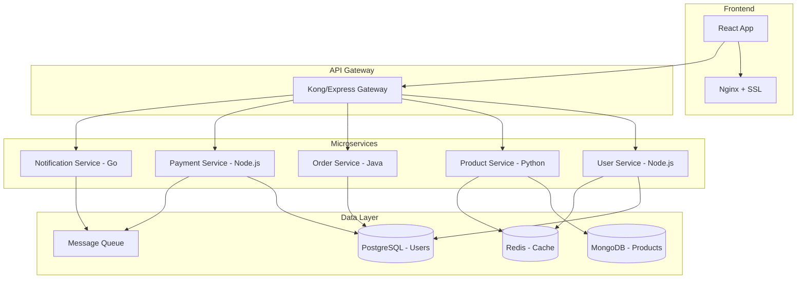

# Evaluación Fase 2: Automatización y CI/CD

Esta evaluación te permitirá **verificar y consolidar** los conocimientos adquiridos en la Fase 2 sobre automatización del flujo de trabajo de desarrollo y despliegue. Incluye preguntas teóricas, ejercicios prácticos y un proyecto final para demostrar tu dominio de CI/CD.

---

## **📋 Estructura de la Evaluación**

### **Parte 1: Conocimientos Teóricos (30%)**
- Conceptos fundamentales de CI/CD
- Estrategias de despliegue
- Herramientas y mejores prácticas

### **Parte 2: Ejercicios Prácticos (40%)**
- Configuración de pipelines
- Scripts de automatización
- Resolución de problemas

### **Parte 3: Proyecto Final (30%)**
- Implementación completa de CI/CD
- Documentación y presentación

---

## **🧠 Parte 1: Conocimientos Teóricos**

### **1.1 Preguntas de Selección Múltiple**

**1. ¿Cuál es la diferencia principal entre Continuous Delivery y Continuous Deployment?**

a) Continuous Delivery incluye testing automatizado, Deployment no
b) Continuous Delivery requiere aprobación manual para producción, Deployment es completamente automático
c) No hay diferencia, son términos sinónimos
d) Continuous Deployment solo funciona en la nube

<details>
<summary>💡 Ver respuesta</summary>

**Respuesta correcta: b)**

**Explicación:** Continuous Delivery asegura que el código siempre esté listo para despliegue, pero requiere una decisión/aprobación manual para ir a producción. Continuous Deployment va un paso más allá y despliega automáticamente a producción sin intervención humana, asumiendo que todas las validaciones automáticas pasan.
</details>

**2. ¿Cuál es la ventaja principal del despliegue Blue-Green?**

a) Menor uso de recursos de infraestructura
b) Capacidad de rollback instantáneo
c) No requiere load balancer
d) Es más económico que otras estrategias

<details>
<summary>💡 Ver respuesta</summary>

**Respuesta correcta: b)**

**Explicación:** Blue-Green deployment mantiene dos entornos idénticos y permite cambiar el tráfico instantáneamente entre ellos, proporcionando rollback inmediato si hay problemas. Sin embargo, requiere el doble de recursos (desventaja en costo).
</details>

**3. ¿En qué escenario es más apropiado usar Canary Deployment?**

a) Cuando tienes pocos usuarios
b) Cuando quieres minimizar el riesgo de impacto en usuarios
c) Cuando necesitas hacer rollback rápido
d) Cuando los recursos son limitados

<details>
<summary>💡 Ver respuesta</summary>

**Respuesta correcta: b)**

**Explicación:** Canary deployment libera cambios gradualmente a un pequeño porcentaje de usuarios primero, permitiendo detectar problemas antes de que afecten a toda la base de usuarios. Es ideal para minimizar el impacto de potenciales issues.
</details>

**4. ¿Cuál es el propósito principal de un health check en un contenedor?**

a) Mejorar el performance de la aplicación
b) Reducir el uso de memoria
c) Permitir que el orquestador determine si el contenedor está funcionando correctamente
d) Facilitar el debugging

<details>
<summary>💡 Ver respuesta</summary>

**Respuesta correcta: c)**

**Explicación:** Los health checks permiten que sistemas como Kubernetes o Docker Swarm determinen si un contenedor está healthy y listo para recibir tráfico, habilitando restart automático o traffic routing inteligente.
</details>

**5. ¿Qué caracteriza a un pipeline de CI bien diseñado?**

a) Que tarde más de 30 minutos en ejecutarse
b) Que incluya deployment a producción automáticamente
c) Que proporcione feedback rápido (menos de 10 minutos)
d) Que solo ejecute tests unitarios

<details>
<summary>💡 Ver respuesta</summary>

**Respuesta correcta: c)**

**Explicación:** Un pipeline de CI efectivo debe proporcionar feedback rápido a los desarrolladores (idealmente menos de 10 minutos) para permitir correcciones tempranas y mantener el flujo de desarrollo ágil.
</details>

### **1.2 Preguntas de Desarrollo**

**6. Explica los principios SOLID aplicados a pipelines de CI/CD. Proporciona un ejemplo práctico de cada uno.**

<details>
<summary>💡 Ver respuesta modelo</summary>

**Single Responsibility:** Cada job/stage del pipeline debe tener una responsabilidad específica.
```yaml
# ✅ Bueno - Responsabilidades separadas
stages:
  - lint      # Solo verificación de código
  - test      # Solo ejecución de tests
  - build     # Solo construcción de artefactos
  - deploy    # Solo despliegue

# ❌ Malo - Múltiples responsabilidades
stages:
  - test-and-build-and-deploy  # Hace todo junto
```

**Open/Closed:** Los pipelines deben estar abiertos para extensión pero cerrados para modificación.
```yaml
# Usar templates reutilizables
.test_template: &test_template
  script:
    - npm install
    - npm test
  
frontend_tests:
  <<: *test_template
  
backend_tests:
  <<: *test_template
```

**Liskov Substitution:** Los diferentes tipos de tests deben ser intercambiables.
```yaml
# Cualquier tipo de test puede usar la misma interfaz
- run_tests: unit
- run_tests: integration  
- run_tests: e2e
```

**Interface Segregation:** No forzar a los stages a depender de interfaces que no usan.
```yaml
# Cada servicio solo define lo que necesita
microservice_a:
  needs: [lint, unit_tests]
  
microservice_b:
  needs: [lint, integration_tests]
```

**Dependency Inversion:** Depender de abstracciones, no de implementaciones concretas.
```yaml
# Usar variables de ambiente en lugar de valores hardcodeados
deploy:
  script:
    - deploy.sh $ENVIRONMENT $DATABASE_URL
  # No hardcodear deploy.sh production postgresql://...
```
</details>

**7. Describe el concepto de "Shift Left" en DevOps y cómo se implementa en un pipeline de CI/CD.**

<details>
<summary>💡 Ver respuesta modelo</summary>

**Shift Left** significa mover las pruebas, validaciones y controles de calidad lo más temprano posible en el ciclo de desarrollo, idealmente durante la fase de desarrollo en lugar de al final.

**Implementación en CI/CD:**

1. **Pre-commit hooks:**
```bash
# .pre-commit-config.yaml
repos:
  - repo: https://github.com/pre-commit/pre-commit-hooks
    hooks:
      - id: trailing-whitespace
      - id: end-of-file-fixer
  - repo: https://github.com/psf/black
    hooks:
      - id: black
```

2. **Linting temprano:**
```yaml
# Ejecutar linting antes que tests pesados
pipeline:
  - stage: validate
    jobs: [lint, format_check, security_scan]
  - stage: test
    jobs: [unit_tests, integration_tests]
```

3. **Tests en desarrollo local:**
```json
// package.json - Scripts para desarrolladores
{
  "scripts": {
    "dev:test": "jest --watch",
    "dev:lint": "eslint --fix src/",
    "dev:security": "npm audit",
    "pre-push": "npm run lint && npm test"
  }
}
```

**Beneficios:**
- Detección temprana de bugs (más barato de fix)
- Mejor calidad de código
- Menos tiempo en code review
- Deployments más confiables
</details>

**8. ¿Cómo implementarías feature flags para facilitar deployments sin riesgo?**

<details>
<summary>💡 Ver respuesta modelo</summary>

**1. Arquitectura de Feature Flags:**

```javascript
// featureFlags.js
class FeatureFlagService {
  constructor(configSource = 'redis') {
    this.configSource = configSource;
    this.cache = new Map();
  }
  
  async isEnabled(flagName, userId = null, context = {}) {
    const flag = await this.getFlag(flagName);
    
    if (!flag) return false;
    
    // Global toggle
    if (!flag.enabled) return false;
    
    // User-based rollout
    if (flag.userRollout && userId) {
      const hash = this.hashUser(userId);
      return hash < flag.userRollout.percentage;
    }
    
    // Context-based rules
    if (flag.rules) {
      return this.evaluateRules(flag.rules, context);
    }
    
    return flag.enabled;
  }
}
```

**2. Integración en la aplicación:**

```javascript
// app.js
const featureFlags = new FeatureFlagService();

app.get('/api/todos', async (req, res) => {
  const useNewAlgorithm = await featureFlags.isEnabled(
    'new_todo_algorithm', 
    req.user.id,
    { region: req.user.region }
  );
  
  if (useNewAlgorithm) {
    return todoService.getWithNewAlgorithm(req.user.id);
  } else {
    return todoService.getLegacy(req.user.id);
  }
});
```

**3. Pipeline con feature flags:**

```yaml
deploy_production:
  script:
    # Deploy code with feature disabled
    - kubectl apply -f k8s/
    - kubectl rollout status deployment/app
    
    # Gradually enable feature
    - set_feature_flag "new_algorithm" 0%    # Deploy code
    - sleep 60
    - set_feature_flag "new_algorithm" 5%    # Enable for 5%
    - monitor_metrics 300s                   # Monitor 5min
    - set_feature_flag "new_algorithm" 25%   # Scale to 25%
    - monitor_metrics 300s
    - set_feature_flag "new_algorithm" 100%  # Full rollout
```

**4. Rollback instantáneo:**

```bash
# En caso de problema, disable inmediato
curl -X POST api/admin/feature-flags/new_algorithm \
  -d '{"enabled": false}' \
  -H "Authorization: Bearer $ADMIN_TOKEN"
```

**Beneficios:**
- Deploy de código sin activar features
- Rollback sin redeployment
- A/B testing nativo
- Canary releases granular
</details>

---

## **⚙️ Parte 2: Ejercicios Prácticos**

### **2.1 Configuración de Pipeline CI**

**Ejercicio 1: Crear un pipeline de GitHub Actions para una aplicación Node.js**

**Requisitos:**
- Instalar dependencias
- Ejecutar linting (ESLint)
- Ejecutar tests unitarios con cobertura
- Construir la aplicación
- Subir cobertura a Codecov
- Crear imagen Docker y subirla al registry

**Template inicial:**
```yaml
# .github/workflows/ci.yml
name: CI Pipeline

on:
  push:
    branches: [ main, develop ]
  pull_request:
    branches: [ main ]

jobs:
  # Completar aquí
```

<details>
<summary>💡 Ver solución</summary>

```yaml
name: CI Pipeline

on:
  push:
    branches: [ main, develop ]
  pull_request:
    branches: [ main ]

env:
  NODE_VERSION: '18'
  REGISTRY: ghcr.io
  IMAGE_NAME: ${{ github.repository }}

jobs:
  lint-and-test:
    runs-on: ubuntu-latest
    
    steps:
    - name: Checkout code
      uses: actions/checkout@v3
    
    - name: Setup Node.js
      uses: actions/setup-node@v3
      with:
        node-version: ${{ env.NODE_VERSION }}
        cache: 'npm'
    
    - name: Install dependencies
      run: npm ci
    
    - name: Run ESLint
      run: npm run lint
    
    - name: Run tests with coverage
      run: npm run test -- --coverage
    
    - name: Upload coverage to Codecov
      uses: codecov/codecov-action@v3
      with:
        file: ./coverage/lcov.info
        flags: unittests
        name: codecov-umbrella
    
    - name: Build application
      run: npm run build
    
    - name: Upload build artifacts
      uses: actions/upload-artifact@v3
      with:
        name: build-artifacts
        path: dist/

  docker-build:
    needs: lint-and-test
    runs-on: ubuntu-latest
    if: github.event_name != 'pull_request'
    
    permissions:
      contents: read
      packages: write
    
    steps:
    - name: Checkout
      uses: actions/checkout@v3
    
    - name: Login to Container Registry
      uses: docker/login-action@v2
      with:
        registry: ${{ env.REGISTRY }}
        username: ${{ github.actor }}
        password: ${{ secrets.GITHUB_TOKEN }}
    
    - name: Extract metadata
      id: meta
      uses: docker/metadata-action@v4
      with:
        images: ${{ env.REGISTRY }}/${{ env.IMAGE_NAME }}
        tags: |
          type=ref,event=branch
          type=ref,event=pr
          type=sha,prefix={{branch}}-
    
    - name: Build and push Docker image
      uses: docker/build-push-action@v4
      with:
        context: .
        push: true
        tags: ${{ steps.meta.outputs.tags }}
        labels: ${{ steps.meta.outputs.labels }}
```
</details>

### **2.2 Script de Automatización**

**Ejercicio 2: Crear un script de deployment Blue-Green**

**Requisitos:**
- Detectar el color actual (blue/green)
- Desplegar nueva versión en el color inactivo
- Ejecutar health checks
- Cambiar el tráfico al nuevo color
- Limpiar el color anterior

**Template inicial:**
```bash
#!/bin/bash
# blue-green-deploy.sh

APP_NAME="my-app"
NEW_VERSION=$1

# Tu implementación aquí
```

<details>
<summary>💡 Ver solución</summary>

```bash
#!/bin/bash
# blue-green-deploy.sh

set -e

APP_NAME="my-app"
NEW_VERSION=$1
HEALTH_CHECK_RETRIES=30
HEALTH_CHECK_INTERVAL=5

if [ -z "$NEW_VERSION" ]; then
    echo "Usage: $0 <new-version>"
    exit 1
fi

# Función para logging con timestamp
log() {
    echo "[$(date '+%Y-%m-%d %H:%M:%S')] $1"
}

# Función para health check
health_check() {
    local container_name=$1
    local retries=$2
    
    for i in $(seq 1 $retries); do
        if docker exec $container_name curl -f http://localhost:3000/health >/dev/null 2>&1; then
            log "✅ Health check passed for $container_name"
            return 0
        fi
        log "⏳ Health check attempt $i/$retries for $container_name..."
        sleep $HEALTH_CHECK_INTERVAL
    done
    
    log "❌ Health check failed for $container_name"
    return 1
}

# Detectar color actual
CURRENT_COLOR=$(docker ps --format "table {{.Names}}" | grep $APP_NAME | grep -o 'blue\|green' | head -1)

if [ -z "$CURRENT_COLOR" ]; then
    log "No existing deployment found, starting with blue"
    CURRENT_COLOR="green"  # Para que NEW_COLOR sea blue
fi

# Determinar nuevo color
if [ "$CURRENT_COLOR" = "blue" ]; then
    NEW_COLOR="green"
    OLD_COLOR="blue"
else
    NEW_COLOR="blue"
    OLD_COLOR="green"
fi

log "🔄 Blue-Green Deployment Started"
log "📊 Current: $OLD_COLOR → New: $NEW_COLOR"
log "🏷️  Version: $NEW_VERSION"

# Limpiar contenedor anterior del nuevo color (si existe)
if docker ps -a --format "table {{.Names}}" | grep -q "${APP_NAME}-${NEW_COLOR}"; then
    log "🛑 Stopping previous $NEW_COLOR container..."
    docker stop ${APP_NAME}-${NEW_COLOR} >/dev/null 2>&1 || true
    docker rm ${APP_NAME}-${NEW_COLOR} >/dev/null 2>&1 || true
fi

# Desplegar nueva versión
log "🚀 Deploying $NEW_VERSION to $NEW_COLOR environment..."
docker run -d \
    --name ${APP_NAME}-${NEW_COLOR} \
    --network app-network \
    -e NODE_ENV=production \
    -e VERSION=$NEW_VERSION \
    -p $([ "$NEW_COLOR" = "blue" ] && echo "3001" || echo "3002"):3000 \
    ${APP_NAME}:${NEW_VERSION}

# Health check del nuevo deployment
log "🔍 Running health checks..."
if ! health_check "${APP_NAME}-${NEW_COLOR}" $HEALTH_CHECK_RETRIES; then
    log "❌ Deployment failed, cleaning up..."
    docker stop ${APP_NAME}-${NEW_COLOR} >/dev/null 2>&1 || true
    docker rm ${APP_NAME}-${NEW_COLOR} >/dev/null 2>&1 || true
    exit 1
fi

# Cambiar tráfico al nuevo color
log "🔀 Switching traffic to $NEW_COLOR..."
cat > /etc/nginx/conf.d/app.conf <<EOF
upstream app_backend {
    server ${APP_NAME}-${NEW_COLOR}:3000;
}

server {
    listen 80;
    server_name _;
    
    location / {
        proxy_pass http://app_backend;
        proxy_set_header Host \$host;
        proxy_set_header X-Real-IP \$remote_addr;
        proxy_set_header X-Forwarded-For \$proxy_add_x_forwarded_for;
    }
    
    location /health {
        proxy_pass http://app_backend;
        access_log off;
    }
}
EOF

# Recargar nginx
if nginx -t; then
    nginx -s reload
    log "✅ Nginx configuration updated"
else
    log "❌ Nginx configuration error, rolling back..."
    exit 1
fi

# Esperar y validar nuevo deployment
log "⏳ Validating new deployment..."
sleep 30

# Verificar métricas básicas
ERROR_RATE=$(curl -s http://localhost/metrics 2>/dev/null | grep error_rate | awk '{print $2}' || echo "0")
if (( $(echo "$ERROR_RATE > 0.05" | bc -l 2>/dev/null || echo "0") )); then
    log "❌ High error rate detected: $ERROR_RATE"
    log "🔄 Rolling back..."
    # Aquí iría la lógica de rollback
    exit 1
fi

# Limpiar color anterior
if docker ps --format "table {{.Names}}" | grep -q "${APP_NAME}-${OLD_COLOR}"; then
    log "🧹 Cleaning up $OLD_COLOR environment..."
    docker stop ${APP_NAME}-${OLD_COLOR} >/dev/null 2>&1 || true
    docker rm ${APP_NAME}-${OLD_COLOR} >/dev/null 2>&1 || true
fi

log "✅ Blue-Green deployment completed successfully!"
log "🎉 $APP_NAME:$NEW_VERSION is now serving traffic on $NEW_COLOR"
```
</details>

### **2.3 Resolución de Problemas**

**Ejercicio 3: Debugging de Pipeline Fallido**

Tienes el siguiente pipeline que está fallando:

```yaml
name: Broken Pipeline

on:
  push:
    branches: [ main ]

jobs:
  test:
    runs-on: ubuntu-latest
    steps:
    - uses: actions/checkout@v2
    - uses: actions/setup-node@v2
      with:
        node-version: '16'
    - run: npm install
    - run: npm test
    - run: npm run build

  deploy:
    runs-on: ubuntu-latest
    steps:
    - run: echo "Deploying..."
    - run: kubectl apply -f k8s/
```

**Problemas a identificar y solucionar:**

<details>
<summary>💡 Ver problemas y soluciones</summary>

**Problemas identificados:**

1. **Versiones obsoletas de actions**
2. **Deploy job no depende de test**
3. **No hay cache para node_modules**
4. **kubectl no está instalado**
5. **No hay configuración de kubeconfig**
6. **Falta error handling**
7. **No hay validaciones post-deploy**

**Pipeline corregido:**

```yaml
name: Fixed Pipeline

on:
  push:
    branches: [ main ]

env:
  NODE_VERSION: '18'

jobs:
  test:
    runs-on: ubuntu-latest
    steps:
    - name: Checkout code
      uses: actions/checkout@v3
    
    - name: Setup Node.js
      uses: actions/setup-node@v3
      with:
        node-version: ${{ env.NODE_VERSION }}
        cache: 'npm'  # ✅ Cache agregado
    
    - name: Install dependencies
      run: npm ci  # ✅ Más determinístico que npm install
    
    - name: Run tests
      run: npm test
    
    - name: Build application
      run: npm run build
    
    - name: Upload build artifacts
      uses: actions/upload-artifact@v3
      with:
        name: build-artifacts
        path: dist/

  deploy:
    needs: test  # ✅ Dependencia agregada
    if: github.ref == 'refs/heads/main'  # ✅ Solo deploy desde main
    runs-on: ubuntu-latest
    environment: production  # ✅ Environment protection
    
    steps:
    - name: Checkout code
      uses: actions/checkout@v3
    
    - name: Download build artifacts
      uses: actions/download-artifact@v3
      with:
        name: build-artifacts
        path: dist/
    
    - name: Configure kubectl
      uses: azure/k8s-set-context@v3  # ✅ kubectl setup
      with:
        method: kubeconfig
        kubeconfig: ${{ secrets.KUBE_CONFIG }}
    
    - name: Deploy to Kubernetes
      run: |
        echo "🚀 Deploying to production..."
        kubectl apply -f k8s/
        
        # ✅ Wait for rollout
        kubectl rollout status deployment/my-app --timeout=300s
        
        # ✅ Verify deployment
        kubectl get pods -l app=my-app
    
    - name: Run smoke tests
      run: |
        # ✅ Post-deployment validation
        kubectl run smoke-test --rm -i --image=curlimages/curl -- \
          curl -f http://my-app-service/health
    
    - name: Notify success
      if: success()
      run: |
        echo "✅ Deployment successful!"
        # Aquí iría notificación a Slack/Teams
```
</details>

---

## **🚀 Parte 3: Proyecto Final**

### **Proyecto: E-commerce Microservices CI/CD**

**Objetivo:** Implementar un pipeline completo de CI/CD para una aplicación de e-commerce con microservicios.

### **3.1 Especificaciones del Sistema**

**Arquitectura:**


### **3.2 Requisitos del Proyecto**

#### **CI/CD Pipeline Requirements:**

1. **Multi-service build optimization**
   - Detectar cambios por servicio
   - Build paralelo de servicios modificados
   - Cache inteligente por servicio

2. **Comprehensive testing strategy**
   - Unit tests por servicio (>80% coverage)
   - Integration tests entre servicios
   - Contract testing con Pact
   - End-to-end tests con Cypress
   - Performance tests con K6

3. **Security integration**
   - Dependency vulnerability scanning
   - Container image scanning
   - SAST (Static Application Security Testing)
   - Secret scanning

4. **Progressive deployment**
   - Staging deployment automático
   - Canary deployment a producción
   - Blue-green fallback
   - Automated rollback

5. **Observability**
   - Logging centralizado (ELK Stack)
   - Metrics collection (Prometheus/Grafana)
   - Distributed tracing (Jaeger)
   - Alerting (AlertManager)

### **3.3 Entregables**

#### **Código:**
1. **Aplicación completa** con los 5 microservicios
2. **Infrastructure as Code** (Docker Compose + Kubernetes)
3. **CI/CD Pipeline** completo en GitHub Actions
4. **Monitoring stack** configurado

#### **Documentación:**
1. **README.md** con setup instructions
2. **Architecture Decision Records (ADRs)**
3. **Deployment guide** 
4. **Troubleshooting guide**

#### **Demo:**
1. **Pipeline execution** en vivo
2. **Canary deployment** demonstration
3. **Rollback scenario** handling
4. **Monitoring dashboard** walkthrough

### **3.4 Criterios de Evaluación**

| Área | Criterios | Puntos |
|------|-----------|---------|
| **Pipeline Design** | Eficiencia, paralelización, fail-fast | 25% |
| **Testing Strategy** | Cobertura, tipos de tests, calidad | 25% |
| **Security** | Vulnerability scanning, secret management | 15% |
| **Deployment** | Estrategias implementadas, zero-downtime | 20% |
| **Observability** | Logs, métricas, alerting | 10% |
| **Documentation** | Claridad, completitud, ejemplos | 5% |

### **3.5 Template de Inicio**

```bash
# Estructura inicial del proyecto
mkdir ecommerce-cicd-project
cd ecommerce-cicd-project

# Crear estructura de microservicios
mkdir -p {frontend,api-gateway}
mkdir -p services/{user-service,product-service,order-service,payment-service,notification-service}
mkdir -p infrastructure/{docker,k8s,terraform,monitoring}
mkdir -p tests/{unit,integration,e2e,performance,contract}
mkdir -p docs/{architecture,deployment,troubleshooting}
mkdir -p .github/workflows

# Archivos de configuración
touch {README.md,docker-compose.yml,docker-compose.prod.yml}
touch {.gitignore,.env.example,Makefile}
touch docs/architecture/adr-template.md
```

### **3.6 Recursos y Referencias**

#### **Herramientas sugeridas:**
- **CI/CD:** GitHub Actions, GitLab CI/CD
- **Containerization:** Docker, Kubernetes
- **Testing:** Jest, Pytest, JUnit, Cypress, K6
- **Security:** Snyk, Trivy, SonarQube
- **Monitoring:** Prometheus, Grafana, ELK Stack
- **Service Mesh:** Istio (opcional)

#### **Ejemplos de referencia:**
- [Microservices Demo](https://github.com/GoogleCloudPlatform/microservices-demo)
- [Spring Petclinic Microservices](https://github.com/spring-petclinic/spring-petclinic-microservices)
- [Sock Shop](https://github.com/microservices-demo/microservices-demo)

---

## **🎯 Autoevaluación y Próximos Pasos**

### **Checklist de Competencias Adquiridas**

Marca las habilidades que has dominado después de completar esta fase:

- [ ] **Conceptos CI/CD:** Entiendes la diferencia entre CI, CD y CD
- [ ] **Pipeline Design:** Puedes diseñar pipelines eficientes y seguros
- [ ] **Testing Automation:** Implementas strategy de testing completa
- [ ] **Deployment Strategies:** Conoces y puedes implementar Blue-Green, Canary, Rolling
- [ ] **Infrastructure as Code:** Usas Docker, Kubernetes para deployment
- [ ] **Monitoring:** Implementas observabilidad en tus aplicaciones
- [ ] **Security:** Integras security scanning en pipelines
- [ ] **Troubleshooting:** Puedes debuggear y resolver problemas de pipeline

### **Áreas para profundizar:**

Si quieres continuar desarrollando estas habilidades:

1. **GitOps:** Explorar ArgoCD/Flux para deployment declarativo
2. **Service Mesh:** Implementar Istio para microservices avanzados
3. **Chaos Engineering:** Practicar con Chaos Monkey/Litmus
4. **Advanced Kubernetes:** Operators, CRDs, Helm charts
5. **Multi-cloud:** Deployments across AWS/Azure/GCP

### **Preparación para Fase 3:**

La próxima fase cubrirá:
- **Fundamentos de Redes** (TCP/IP, DNS, Load Balancing)
- **Docker avanzado** (Multi-stage builds, Optimization)
- **Kubernetes** (Pods, Services, Ingress, Storage)

¡Felicidades por completar la Fase 2! Ahora tienes las habilidades fundamentales de automatización y CI/CD que son esenciales para cualquier role de DevOps Engineer.
