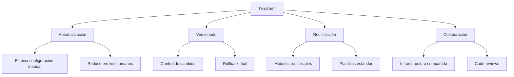
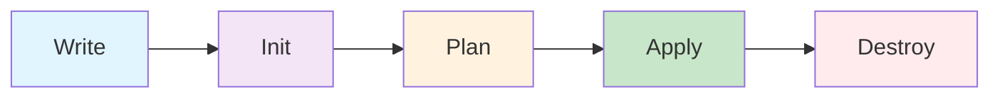

# 01. Introducción a Terraform


> **"Terraform es una herramienta de código abierto para construir, cambiar y versionar infraestructura de manera segura y eficiente"**

## 🎯 Objetivos de Aprendizaje

Al completar este módulo serás capaz de:

- [x] Comprender qué es Terraform y por qué usarlo
- [x] Instalar y configurar Terraform en tu sistema
- [x] Crear tu primer archivo de configuración Terraform
- [x] Ejecutar comandos básicos de Terraform
- [x] Entender el flujo de trabajo básico de Terraform

## 📚 ¿Qué es Terraform?

### **Definición**

**Terraform** es una herramienta de **Infraestructura como Código (IaC)** desarrollada por HashiCorp que permite definir recursos de infraestructura usando un lenguaje de configuración declarativo llamado **HCL (HashiCorp Configuration Language)**.

### **Características Principales**

| Característica | Descripción |
|----------------|-------------|
| **Declarativo** | Defines el estado deseado, no los pasos para llegar a él |
| **Multi-cloud** | Soporta múltiples proveedores (AWS, Azure, GCP, etc.) |
| **Versionable** | Los archivos de configuración se pueden versionar con Git |
| **Idempotente** | Ejecutar múltiples veces produce el mismo resultado |
| **Plan & Apply** | Vista previa de cambios antes de aplicarlos |

### **Ventajas de Terraform**



## 🔄 Flujo de Trabajo de Terraform

### **Ciclo de Vida Básico**



### **Descripción de cada Fase**

| Fase | Comando | Descripción |
|------|---------|-------------|
| **Write** | - | Escribir configuración en archivos `.tf` |
| **Init** | `terraform init` | Inicializar directorio de trabajo |
| **Plan** | `terraform plan` | Crear plan de ejecución |
| **Apply** | `terraform apply` | Aplicar cambios de infraestructura |
| **Destroy** | `terraform destroy` | Destruir infraestructura gestionada |

## 🛠️ Instalación de Terraform

### **Método 1: Descarga Directa (Windows)**

```powershell
# Descargar el binario desde HashiCorp
Invoke-WebRequest -Uri "https://releases.hashicorp.com/terraform/1.6.0/terraform_1.6.0_windows_amd64.zip" -OutFile "terraform.zip"

# Extraer y mover a PATH
Expand-Archive terraform.zip -DestinationPath C:\terraform
$env:PATH += ";C:\terraform"

# Verificar instalación
terraform version
```

### **Método 2: Chocolatey (Windows)**

```powershell
# Instalar Chocolatey si no lo tienes
Set-ExecutionPolicy Bypass -Scope Process -Force
[System.Net.ServicePointManager]::SecurityProtocol = [System.Net.ServicePointManager]::SecurityProtocol -bor 3072
iex ((New-Object System.Net.WebClient).DownloadString('https://community.chocolatey.org/install.ps1'))

# Instalar Terraform
choco install terraform

# Verificar instalación
terraform version
```

### **Método 3: Linux (Ubuntu/Debian)**

```bash
# Agregar el repositorio de HashiCorp
curl -fsSL https://apt.releases.hashicorp.com/gpg | sudo apt-key add -
sudo apt-add-repository "deb [arch=amd64] https://apt.releases.hashicorp.com $(lsb_release -cs) main"

# Instalar Terraform
sudo apt-get update && sudo apt-get install terraform

# Verificar instalación
terraform version
```

### **Método 4: macOS (Homebrew)**

```bash
# Instalar usando Homebrew
brew tap hashicorp/tap
brew install hashicorp/tap/terraform

# Verificar instalación
terraform version
```

### **Verificación de Instalación**

```bash
# Debe mostrar algo similar a:
# Terraform v1.6.0
# on windows_amd64
terraform version

# Ver comandos disponibles
terraform -help
```

## 📝 Tu Primera Configuración Terraform

### **Estructura de Proyecto**

```
mi-primer-terraform/
├── main.tf          # Configuración principal
├── variables.tf     # Definición de variables
├── outputs.tf       # Valores de salida
└── terraform.tfvars # Valores de variables
```

### **Ejemplo: Archivo EC2 en AWS**

#### **main.tf**

```hcl
# Configuración del proveedor
terraform {
  required_version = ">= 1.0"
  required_providers {
    aws = {
      source  = "hashicorp/aws"
      version = "~> 5.0"
    }
  }
}

# Configuración del proveedor AWS
provider "aws" {
  region = var.aws_region
}

# Obtener la AMI más reciente de Amazon Linux
data "aws_ami" "amazon_linux" {
  most_recent = true
  owners      = ["amazon"]

  filter {
    name   = "name"
    values = ["amzn2-ami-hvm-*-x86_64-gp2"]
  }
}

# Crear instancia EC2
resource "aws_instance" "web_server" {
  ami           = data.aws_ami.amazon_linux.id
  instance_type = var.instance_type

  tags = {
    Name        = "Mi Primer Servidor"
    Environment = "desarrollo"
    Owner       = "estudiante-devops"
  }
}
```

#### **variables.tf**

```hcl
variable "aws_region" {
  description = "Región de AWS donde crear los recursos"
  type        = string
  default     = "us-west-2"
}

variable "instance_type" {
  description = "Tipo de instancia EC2"
  type        = string
  default     = "t3.micro"
  
  validation {
    condition = contains([
      "t3.micro", 
      "t3.small", 
      "t3.medium"
    ], var.instance_type)
    error_message = "Instance type debe ser t3.micro, t3.small, o t3.medium."
  }
}
```

#### **outputs.tf**

```hcl
output "instance_id" {
  description = "ID de la instancia EC2"
  value       = aws_instance.web_server.id
}

output "instance_public_ip" {
  description = "IP pública de la instancia"
  value       = aws_instance.web_server.public_ip
}

output "instance_public_dns" {
  description = "DNS público de la instancia"
  value       = aws_instance.web_server.public_dns
}
```

#### **terraform.tfvars**

```hcl
aws_region    = "us-east-1"
instance_type = "t3.micro"
```

## 🚀 Ejecutando tu Primera Configuración

### **Paso 1: Inicialización**

```bash
# Navegar al directorio del proyecto
cd mi-primer-terraform

# Inicializar el directorio de trabajo
terraform init
```

**Salida esperada:**

```
Initializing the backend...

Initializing provider plugins...
- Finding hashicorp/aws versions matching "~> 5.0"...
- Installing hashicorp/aws v5.20.0...
- Installed hashicorp/aws v5.20.0

Terraform has been successfully initialized!
```

### **Paso 2: Configurar Credenciales AWS**

```bash
# Opción 1: Variables de entorno
export AWS_ACCESS_KEY_ID="tu-access-key"
export AWS_SECRET_ACCESS_KEY="tu-secret-key"
export AWS_DEFAULT_REGION="us-west-2"

# Opción 2: AWS CLI (recomendado)
aws configure
```

### **Paso 3: Planificar**

```bash
# Crear un plan de ejecución
terraform plan
```

**Salida esperada:**

```
Terraform will perform the following actions:

  # aws_instance.web_server will be created
  + resource "aws_instance" "web_server" {
      + ami                          = "ami-0c02fb55956c7d316"
      + instance_type                = "t3.micro"
      + id                          = (known after apply)
      + public_ip                   = (known after apply)
      + tags                        = {
          + "Environment" = "desarrollo"
          + "Name"        = "Mi Primer Servidor"
          + "Owner"       = "estudiante-devops"
        }
    }

Plan: 1 to add, 0 to change, 0 to destroy.
```

### **Paso 4: Aplicar**

```bash
# Aplicar los cambios
terraform apply

# Para aplicar sin confirmación
terraform apply -auto-approve
```

### **Paso 5: Verificar Outputs**

```bash
# Ver los outputs después del apply
terraform output

# Ver un output específico
terraform output instance_public_ip
```

### **Paso 6: Destruir (cuando termines)**

```bash
# Destruir toda la infraestructura
terraform destroy

# Destruir sin confirmación
terraform destroy -auto-approve
```

## 📁 Archivos Generados por Terraform

### **Estado de Terraform (`terraform.tfstate`)**

```json
{
  "version": 4,
  "terraform_version": "1.6.0",
  "serial": 1,
  "lineage": "unique-id",
  "outputs": {
    "instance_id": {
      "value": "i-0123456789abcdef0",
      "type": "string"
    }
  },
  "resources": [
    {
      "mode": "managed",
      "type": "aws_instance",
      "name": "web_server",
      "provider": "provider[\"registry.terraform.io/hashicorp/aws\"]",
      "instances": [
        {
          "schema_version": 1,
          "attributes": {
            "id": "i-0123456789abcdef0",
            "ami": "ami-0c02fb55956c7d316",
            "instance_type": "t3.micro"
          }
        }
      ]
    }
  ]
}
```

### **Archivos de Lock (`.terraform.lock.hcl`)**

```hcl
# This file is maintained automatically by "terraform init".
provider "registry.terraform.io/hashicorp/aws" {
  version     = "5.20.0"
  constraints = "~> 5.0"
  hashes = [
    "h1:example-hash",
  ]
}
```

## 🔧 Comandos Esenciales de Terraform

### **Comandos Básicos**

| Comando | Descripción | Ejemplo |
|---------|-------------|---------|
| `terraform init` | Inicializa directorio de trabajo | `terraform init` |
| `terraform plan` | Muestra plan de ejecución | `terraform plan -out=plan.out` |
| `terraform apply` | Aplica configuración | `terraform apply plan.out` |
| `terraform destroy` | Destruye infraestructura | `terraform destroy -target=aws_instance.web` |
| `terraform show` | Muestra estado actual | `terraform show` |
| `terraform output` | Muestra valores de salida | `terraform output -json` |

### **Comandos de Gestión de Estado**

| Comando | Descripción | Ejemplo |
|---------|-------------|---------|
| `terraform state list` | Lista recursos en estado | `terraform state list` |
| `terraform state show` | Muestra recurso específico | `terraform state show aws_instance.web` |
| `terraform state pull` | Descarga estado remoto | `terraform state pull > backup.tfstate` |
| `terraform state push` | Sube estado al backend | `terraform state push backup.tfstate` |

### **Comandos de Utilidad**

| Comando | Descripción | Ejemplo |
|---------|-------------|---------|
| `terraform fmt` | Formatea archivos .tf | `terraform fmt -recursive` |
| `terraform validate` | Valida configuración | `terraform validate` |
| `terraform version` | Muestra versión | `terraform version` |
| `terraform console` | Consola interactiva | `terraform console` |

## 💡 Mejores Prácticas Iniciales

### **Organización de Archivos**

```
proyecto-terraform/
├── main.tf          # Recursos principales
├── variables.tf     # Definiciones de variables
├── outputs.tf       # Outputs del módulo
├── versions.tf      # Required providers y versions
├── terraform.tfvars # Valores de variables (no commitear si tiene secretos)
├── .gitignore       # Archivos a ignorar en git
└── README.md        # Documentación del proyecto
```

### **Archivo .gitignore para Terraform**

```gitignore
# Local .terraform directories
**/.terraform/*

# .tfstate files
*.tfstate
*.tfstate.*

# Crash log files
crash.log

# Exclude all .tfvars files
*.tfvars

# Ignore override files
override.tf
override.tf.json
*_override.tf
*_override.tf.json

# Include override files you do wish to add to version control using negated pattern
# !example_override.tf

# Include tfplan files to ignore the plan output of command: terraform plan -out=tfplan
*tfplan*

# Ignore CLI configuration files
.terraformrc
terraform.rc
```

### **Convenciones de Nomenclatura**

| Elemento | Convención | Ejemplo |
|----------|------------|---------|
| **Recursos** | `tipo_proposito` | `aws_instance.web_server` |
| **Variables** | `snake_case` | `instance_type`, `aws_region` |
| **Outputs** | `descriptivo` | `instance_public_ip` |
| **Tags** | `PascalCase` | `Name`, `Environment`, `Owner` |

## 🧪 Laboratorio Práctico

### **Ejercicio 1: Tu Primera Instancia EC2**

**Objetivo:** Crear una instancia EC2 básica con Terraform

**Pasos:**

1. **Crear estructura de proyecto:**

   ```bash
   mkdir mi-primera-ec2
   cd mi-primera-ec2
   ```

2. **Crear archivos de configuración:**
   - Usar los ejemplos de código mostrados anteriormente
   - Personalizar tags con tu nombre

3. **Ejecutar el flujo completo:**

   ```bash
   terraform init
   terraform plan
   terraform apply
   ```

4. **Verificar en AWS Console:**
   - Ir a EC2 Dashboard
   - Verificar que la instancia existe
   - Comprobar las tags

5. **Limpiar recursos:**

   ```bash
   terraform destroy
   ```

### **Ejercicio 2: Modificar Configuración**

**Objetivo:** Practicar cambios en la configuración

**Tareas:**

1. **Cambiar tipo de instancia** de `t3.micro` a `t3.small`
2. **Agregar nueva tag:** `Project = "terraform-learning"`
3. **Aplicar cambios** y observar el plan
4. **Verificar cambios** en AWS Console

### **Ejercicio 3: Usar Datos Externos**

**Objetivo:** Utilizar data sources

**Implementar:**

```hcl
# Obtener VPC por defecto
data "aws_vpc" "default" {
  default = true
}

# Usar en security group
resource "aws_security_group" "web" {
  name_prefix = "web-sg"
  vpc_id      = data.aws_vpc.default.id

  ingress {
    from_port   = 80
    to_port     = 80
    protocol    = "tcp"
    cidr_blocks = ["0.0.0.0/0"]
  }

  egress {
    from_port   = 0
    to_port     = 0
    protocol    = "-1"
    cidr_blocks = ["0.0.0.0/0"]
  }
}
```

## 🔍 Troubleshooting Común

### **Error: No Valid Credential Sources**

```bash
Error: No valid credential sources found for AWS Provider
```

**Solución:**

```bash
# Configurar AWS CLI
aws configure

# O usar variables de entorno
export AWS_ACCESS_KEY_ID="your-key"
export AWS_SECRET_ACCESS_KEY="your-secret"
```

### **Error: Instance Type Not Supported**

```bash
Error: InvalidParameterValue: Unsupported instance type
```

**Solución:**

- Verificar que el tipo de instancia esté disponible en la región
- Usar `t3.micro` para Free Tier
- Consultar documentación AWS de tipos disponibles

### **Error: State Lock**

```bash
Error: Error locking state: Error acquiring the state lock
```

**Solución:**

```bash
# Forzar unlock (cuidado!)
terraform force-unlock LOCK_ID

# O esperar y reintentar
```

### **Error: Resource Already Exists**

```bash
Error: ResourceAlreadyExistsException
```

**Solución:**

- Verificar si el recurso ya existe en AWS
- Usar `terraform import` para importar recursos existentes
- Cambiar nombres únicos en la configuración

## 📚 Recursos Adicionales

### **Documentación Oficial**

- **[Terraform Documentation](https://www.terraform.io/docs/)**
- **[AWS Provider Documentation](https://registry.terraform.io/providers/hashicorp/aws/latest/docs)**
- **[HCL Configuration Language](https://www.terraform.io/docs/language/index.html)**

### **Tutoriales Interactivos**

- **[HashiCorp Learn](https://learn.hashicorp.com/terraform)**
- **[Terraform AWS Tutorial](https://learn.hashicorp.com/collections/terraform/aws-get-started)**
- **[Terraform Registry](https://registry.terraform.io/)**

### **Videos y Cursos**

- **[Terraform Course for Beginners](https://www.youtube.com/watch?v=SLB_c_ayRMo)**
- **[HashiCorp Terraform Associate Certification](https://www.hashicorp.com/certification/terraform-associate)**

### **Herramientas Útiles**

- **[Terraform Visual Studio Code Extension](https://marketplace.visualstudio.com/items?itemName=HashiCorp.terraform)**
- **[TFlint](https://github.com/terraform-linters/tflint)**: Linter para Terraform
- **[Checkov](https://www.checkov.io/)**: Security scanner para IaC

## ✅ Verificación de Conocimientos

### **Preguntas de Autoevaluación**

1. ¿Cuál es la diferencia entre `terraform plan` y `terraform apply`?
2. ¿Para qué sirve el archivo `terraform.tfstate`?
3. ¿Qué hace el comando `terraform init`?
4. ¿Cuál es la diferencia entre variables y outputs?
5. ¿Por qué es importante el versionado de providers?

### **Ejercicios de Validación**

1. **Crear una configuración** que incluya variables, outputs y data sources
2. **Implementar validación** en variables usando el bloque `validation`
3. **Usar diferentes tipos de datos** (string, number, bool, list, map)
4. **Aplicar tags consistentes** a todos los recursos

## 🎯 Resumen del Módulo

### **Conceptos Clave Aprendidos**

- [x] **Terraform basics**: Qué es y para qué sirve
- [x] **Instalación**: Múltiples métodos según SO
- [x] **Flujo de trabajo**: Init → Plan → Apply → Destroy
- [x] **Configuración básica**: Providers, resources, variables, outputs
- [x] **Comandos esenciales**: Los comandos más importantes
- [x] **Mejores prácticas**: Organización y convenciones

### **Habilidades Desarrolladas**

- 🛠️ **Instalación y configuración** de Terraform
- 📝 **Escritura de configuraciones** HCL básicas
- 🔧 **Ejecución de comandos** Terraform
- 🏗️ **Creación de recursos** en AWS
- 📊 **Gestión del estado** básica

### **Próximos Pasos**

Con estos fundamentos, estás listo para:

1. **[02. Sintaxis y Configuración](02-sintaxis-terraform.md)** - Profundizar en HCL
2. **[03. Providers y Recursos](03-providers-recursos.md)** - Trabajo avanzado con providers
3. **[04. Variables y Outputs](04-variables-outputs.md)** - Parametrización avanzada

---

**¡Felicitaciones! Has completado tu introducción a Terraform. 🎉**

Ahora tienes las bases para crear infraestructura como código de manera profesional y escalable.

**Próximo módulo:** [02. Sintaxis y Configuración](02-sintaxis-terraform.md)
