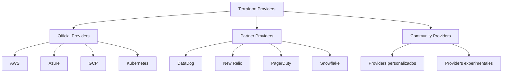

# 03. Providers y Recursos en Terraform


> **"Los providers son plugins que permiten a Terraform interactuar con APIs de servicios cloud, SaaS y otras tecnologías"**

## 🎯 Objetivos de Aprendizaje

Al completar este módulo serás capaz de:

- [x] Comprender el ecosistema de providers de Terraform
- [x] Configurar y usar múltiples providers
- [x] Gestionar versiones de providers
- [x] Crear y gestionar recursos complejos
- [x] Implementar dependencias entre recursos
- [x] Usar data sources eficientemente
- [x] Manejar providers con alias

## 🌐 Ecosistema de Providers

### **¿Qué es un Provider?**

Un **Provider** es un plugin que permite a Terraform interactuar con APIs de diferentes servicios. Los providers:

- **Traducen** recursos de Terraform a llamadas API
- **Gestionan** el ciclo de vida de recursos
- **Mantienen** el estado de la infraestructura
- **Validan** configuraciones antes de aplicar

### **Tipos de Providers**



### **Provider Registry**

El **[Terraform Registry](https://registry.terraform.io/)** es el repositorio oficial donde se publican los providers:

| Tier | Descripción | Mantenido por | Ejemplos |
|------|-------------|---------------|----------|
| **Official** | Providers principales | HashiCorp | AWS, Azure, GCP |
| **Partner** | Providers verificados | Socios de HashiCorp | DataDog, Helm |
| **Community** | Providers de la comunidad | Terceros | Providers específicos |

## ⚙️ Configuración de Providers

### **Bloque Terraform con Required Providers**

```hcl
terraform {
  required_version = ">= 1.0"
  
  required_providers {
    # Provider AWS oficial
    aws = {
      source  = "hashicorp/aws"
      version = "~> 5.0"
    }
    
    # Provider Azure oficial
    azurerm = {
      source  = "hashicorp/azurerm"
      version = "~> 3.0"
    }
    
    # Provider Random para generar valores
    random = {
      source  = "hashicorp/random"
      version = "~> 3.1"
    }
    
    # Provider Local para archivos locales
    local = {
      source  = "hashicorp/local"
      version = "~> 2.1"
    }
    
    # Provider TLS para certificados
    tls = {
      source  = "hashicorp/tls"
      version = "~> 4.0"
    }
  }
}
```

### **Configuración de Providers**

#### **Provider AWS**

```hcl
# Configuración básica
provider "aws" {
  region = "us-west-2"
}

# Configuración con perfil
provider "aws" {
  region  = "us-west-2"
  profile = "desarrollo"
}

# Configuración con credenciales explícitas (NO recomendado)
provider "aws" {
  region     = "us-west-2"
  access_key = var.aws_access_key
  secret_key = var.aws_secret_key
}

# Configuración con assume role
provider "aws" {
  region = "us-west-2"
  
  assume_role {
    role_arn     = "arn:aws:iam::123456789012:role/TerraformRole"
    session_name = "terraform-session"
  }
}

# Tags por defecto
provider "aws" {
  region = "us-west-2"
  
  default_tags {
    tags = {
      ManagedBy   = "terraform"
      Environment = var.environment
      Project     = var.project_name
    }
  }
}
```

#### **Provider Azure**

```hcl
# Configuración básica
provider "azurerm" {
  features {}
}

# Configuración con suscripción específica
provider "azurerm" {
  subscription_id = var.azure_subscription_id
  client_id       = var.azure_client_id
  client_secret   = var.azure_client_secret
  tenant_id       = var.azure_tenant_id
  
  features {
    resource_group {
      prevent_deletion_if_contains_resources = true
    }
    
    key_vault {
      purge_soft_delete_on_destroy = true
    }
  }
}
```

#### **Provider GCP**

```hcl
# Configuración básica
provider "google" {
  project = var.gcp_project_id
  region  = "us-central1"
  zone    = "us-central1-a"
}

# Configuración con archivo de credenciales
provider "google" {
  credentials = file("path/to/service-account-key.json")
  project     = var.gcp_project_id
  region      = "us-central1"
}
```

### **Providers con Alias**

```hcl
# Provider por defecto
provider "aws" {
  region = "us-west-2"
}

# Provider con alias para otra región
provider "aws" {
  alias  = "east"
  region = "us-east-1"
}

# Provider con alias para otra cuenta
provider "aws" {
  alias = "production"
  region = "us-west-2"
  
  assume_role {
    role_arn = "arn:aws:iam::prod-account:role/TerraformRole"
  }
}

# Usar provider con alias en recursos
resource "aws_s3_bucket" "west_bucket" {
  bucket = "mi-bucket-west"
  # Usa el provider por defecto (us-west-2)
}

resource "aws_s3_bucket" "east_bucket" {
  provider = aws.east
  bucket   = "mi-bucket-east"
}

resource "aws_s3_bucket" "prod_bucket" {
  provider = aws.production
  bucket   = "mi-bucket-prod"
}
```

## 📦 Gestión de Recursos

### **Anatomía de un Recurso**

```hcl
resource "resource_type" "resource_name" {
  # Argumentos requeridos
  required_argument = "value"
  
  # Argumentos opcionales
  optional_argument = "value"
  
  # Sub-bloques
  configuration_block {
    sub_argument = "value"
  }
  
  # Meta-argumentos
  count      = 2
  depends_on = [other_resource.example]
  
  lifecycle {
    create_before_destroy = true
  }
  
  tags = {
    Name = "My Resource"
  }
}
```

### **Recursos AWS Comunes**

#### **VPC y Networking**

```hcl
# VPC
resource "aws_vpc" "main" {
  cidr_block           = "10.0.0.0/16"
  enable_dns_hostnames = true
  enable_dns_support   = true
  
  tags = {
    Name = "vpc-principal"
  }
}

# Internet Gateway
resource "aws_internet_gateway" "main" {
  vpc_id = aws_vpc.main.id
  
  tags = {
    Name = "igw-principal"
  }
}

# Subnet Pública
resource "aws_subnet" "public" {
  count = length(var.public_subnet_cidrs)
  
  vpc_id                  = aws_vpc.main.id
  cidr_block              = var.public_subnet_cidrs[count.index]
  availability_zone       = data.aws_availability_zones.available.names[count.index]
  map_public_ip_on_launch = true
  
  tags = {
    Name = "subnet-publica-${count.index + 1}"
    Type = "public"
  }
}

# Subnet Privada
resource "aws_subnet" "private" {
  count = length(var.private_subnet_cidrs)
  
  vpc_id            = aws_vpc.main.id
  cidr_block        = var.private_subnet_cidrs[count.index]
  availability_zone = data.aws_availability_zones.available.names[count.index]
  
  tags = {
    Name = "subnet-privada-${count.index + 1}"
    Type = "private"
  }
}

# Route Table para subnets públicas
resource "aws_route_table" "public" {
  vpc_id = aws_vpc.main.id
  
  route {
    cidr_block = "0.0.0.0/0"
    gateway_id = aws_internet_gateway.main.id
  }
  
  tags = {
    Name = "rt-publica"
  }
}

# Asociar Route Table con subnets públicas
resource "aws_route_table_association" "public" {
  count = length(aws_subnet.public)
  
  subnet_id      = aws_subnet.public[count.index].id
  route_table_id = aws_route_table.public.id
}

# NAT Gateway para subnets privadas
resource "aws_eip" "nat" {
  count = length(aws_subnet.public)
  
  domain = "vpc"
  
  tags = {
    Name = "eip-nat-${count.index + 1}"
  }
  
  depends_on = [aws_internet_gateway.main]
}

resource "aws_nat_gateway" "main" {
  count = length(aws_subnet.public)
  
  allocation_id = aws_eip.nat[count.index].id
  subnet_id     = aws_subnet.public[count.index].id
  
  tags = {
    Name = "nat-gateway-${count.index + 1}"
  }
  
  depends_on = [aws_internet_gateway.main]
}

# Route Table para subnets privadas
resource "aws_route_table" "private" {
  count = length(aws_nat_gateway.main)
  
  vpc_id = aws_vpc.main.id
  
  route {
    cidr_block     = "0.0.0.0/0"
    nat_gateway_id = aws_nat_gateway.main[count.index].id
  }
  
  tags = {
    Name = "rt-privada-${count.index + 1}"
  }
}

# Asociar Route Tables con subnets privadas
resource "aws_route_table_association" "private" {
  count = length(aws_subnet.private)
  
  subnet_id      = aws_subnet.private[count.index].id
  route_table_id = aws_route_table.private[count.index].id
}
```

#### **Security Groups**

```hcl
# Security Group para servidores web
resource "aws_security_group" "web" {
  name_prefix = "web-sg-"
  description = "Security group para servidores web"
  vpc_id      = aws_vpc.main.id
  
  # Reglas de entrada
  ingress {
    description = "HTTP"
    from_port   = 80
    to_port     = 80
    protocol    = "tcp"
    cidr_blocks = ["0.0.0.0/0"]
  }
  
  ingress {
    description = "HTTPS"
    from_port   = 443
    to_port     = 443
    protocol    = "tcp"
    cidr_blocks = ["0.0.0.0/0"]
  }
  
  ingress {
    description     = "SSH desde bastion"
    from_port       = 22
    to_port         = 22
    protocol        = "tcp"
    security_groups = [aws_security_group.bastion.id]
  }
  
  # Reglas de salida
  egress {
    description = "All outbound traffic"
    from_port   = 0
    to_port     = 0
    protocol    = "-1"
    cidr_blocks = ["0.0.0.0/0"]
  }
  
  tags = {
    Name = "web-security-group"
  }
  
  lifecycle {
    create_before_destroy = true
  }
}

# Security Group para base de datos
resource "aws_security_group" "database" {
  name_prefix = "db-sg-"
  description = "Security group para base de datos"
  vpc_id      = aws_vpc.main.id
  
  ingress {
    description     = "MySQL/Aurora"
    from_port       = 3306
    to_port         = 3306
    protocol        = "tcp"
    security_groups = [aws_security_group.web.id]
  }
  
  tags = {
    Name = "database-security-group"
  }
  
  lifecycle {
    create_before_destroy = true
  }
}
```

#### **EC2 Instances**

```hcl
# Key Pair para EC2
resource "aws_key_pair" "deployer" {
  key_name   = "deployer-key"
  public_key = file("~/.ssh/id_rsa.pub")
}

# Launch Template
resource "aws_launch_template" "web" {
  name_prefix   = "web-template-"
  image_id      = data.aws_ami.amazon_linux.id
  instance_type = var.instance_type
  
  key_name = aws_key_pair.deployer.key_name
  
  vpc_security_group_ids = [aws_security_group.web.id]
  
  user_data = base64encode(templatefile("${path.module}/user-data.sh", {
    environment = var.environment
    app_version = var.app_version
  }))
  
  block_device_mappings {
    device_name = "/dev/xvda"
    ebs {
      volume_size           = 20
      volume_type           = "gp3"
      iops                  = 3000
      throughput            = 125
      encrypted             = true
      delete_on_termination = true
    }
  }
  
  monitoring {
    enabled = true
  }
  
  tag_specifications {
    resource_type = "instance"
    tags = {
      Name = "web-server"
      Type = "web"
    }
  }
  
  lifecycle {
    create_before_destroy = true
  }
}

# Auto Scaling Group
resource "aws_autoscaling_group" "web" {
  name             = "web-asg"
  vpc_zone_identifier = aws_subnet.private[*].id
  
  min_size         = var.min_capacity
  max_size         = var.max_capacity
  desired_capacity = var.desired_capacity
  
  launch_template {
    id      = aws_launch_template.web.id
    version = "$Latest"
  }
  
  # Health check
  health_check_type         = "ELB"
  health_check_grace_period = 300
  
  # Instance refresh
  instance_refresh {
    strategy = "Rolling"
    preferences {
      min_healthy_percentage = 50
    }
  }
  
  tag {
    key                 = "Name"
    value               = "web-asg-instance"
    propagate_at_launch = true
  }
}
```

#### **Load Balancer**

```hcl
# Application Load Balancer
resource "aws_lb" "web" {
  name               = "web-alb"
  internal           = false
  load_balancer_type = "application"
  security_groups    = [aws_security_group.alb.id]
  subnets            = aws_subnet.public[*].id
  
  enable_deletion_protection = var.environment == "production"
  
  access_logs {
    bucket  = aws_s3_bucket.alb_logs.id
    prefix  = "web-alb"
    enabled = true
  }
  
  tags = {
    Name = "web-alb"
  }
}

# Target Group
resource "aws_lb_target_group" "web" {
  name     = "web-tg"
  port     = 80
  protocol = "HTTP"
  vpc_id   = aws_vpc.main.id
  
  health_check {
    enabled             = true
    healthy_threshold   = 2
    unhealthy_threshold = 2
    timeout             = 5
    interval            = 30
    path                = "/health"
    matcher             = "200"
    port                = "traffic-port"
    protocol            = "HTTP"
  }
  
  tags = {
    Name = "web-target-group"
  }
}

# Listener
resource "aws_lb_listener" "web" {
  load_balancer_arn = aws_lb.web.arn
  port              = "80"
  protocol          = "HTTP"
  
  default_action {
    type             = "forward"
    target_group_arn = aws_lb_target_group.web.arn
  }
}

# Conectar ASG con Target Group
resource "aws_autoscaling_attachment" "web" {
  autoscaling_group_name = aws_autoscaling_group.web.id
  lb_target_group_arn    = aws_lb_target_group.web.arn
}
```

#### **RDS Database**

```hcl
# DB Subnet Group
resource "aws_db_subnet_group" "main" {
  name       = "main-db-subnet-group"
  subnet_ids = aws_subnet.private[*].id
  
  tags = {
    Name = "Main DB subnet group"
  }
}

# DB Parameter Group
resource "aws_db_parameter_group" "mysql" {
  family = "mysql8.0"
  name   = "mysql-params"
  
  parameter {
    name  = "innodb_buffer_pool_size"
    value = "{DBInstanceClassMemory*3/4}"
  }
  
  parameter {
    name  = "slow_query_log"
    value = "1"
  }
  
  tags = {
    Name = "MySQL parameter group"
  }
}

# RDS Instance
resource "aws_db_instance" "main" {
  # Basic configuration
  identifier = "main-database"
  engine     = "mysql"
  engine_version = "8.0"
  instance_class = var.db_instance_class
  
  # Storage
  allocated_storage     = var.db_allocated_storage
  max_allocated_storage = var.db_max_allocated_storage
  storage_type          = "gp3"
  storage_encrypted     = true
  
  # Database
  db_name  = var.db_name
  username = var.db_username
  password = var.db_password
  port     = 3306
  
  # Network & Security
  db_subnet_group_name   = aws_db_subnet_group.main.name
  vpc_security_group_ids = [aws_security_group.database.id]
  publicly_accessible    = false
  
  # Parameter group
  parameter_group_name = aws_db_parameter_group.mysql.name
  
  # Backup & Maintenance
  backup_retention_period = var.backup_retention_period
  backup_window          = "03:00-04:00"
  maintenance_window     = "sun:04:00-sun:05:00"
  
  # Monitoring
  monitoring_interval = 60
  monitoring_role_arn = aws_iam_role.rds_enhanced_monitoring.arn
  
  # Performance Insights
  performance_insights_enabled = true
  performance_insights_retention_period = 7
  
  # Deletion protection
  deletion_protection = var.environment == "production"
  skip_final_snapshot = var.environment != "production"
  final_snapshot_identifier = var.environment == "production" ? "main-db-final-snapshot-${formatdate("YYYY-MM-DD-hhmm", timestamp())}" : null
  
  tags = {
    Name = "main-database"
  }
}
```

## 📊 Data Sources

### **¿Qué son los Data Sources?**

Los **Data Sources** permiten a Terraform obtener información de recursos existentes sin gestionarlos:

```hcl
data "resource_type" "name" {
  # Filtros y argumentos para buscar el recurso
  filter {
    name   = "attribute_name"
    values = ["attribute_value"]
  }
}
```

### **Data Sources AWS Comunes**

```hcl
# Obtener AMI más reciente
data "aws_ami" "amazon_linux" {
  most_recent = true
  owners      = ["amazon"]
  
  filter {
    name   = "name"
    values = ["amzn2-ami-hvm-*-x86_64-gp2"]
  }
  
  filter {
    name   = "virtualization-type"
    values = ["hvm"]
  }
}

# Obtener zonas de disponibilidad
data "aws_availability_zones" "available" {
  state = "available"
  
  filter {
    name   = "opt-in-status"
    values = ["opt-in-not-required"]
  }
}

# Obtener VPC por defecto
data "aws_vpc" "default" {
  default = true
}

# Obtener subnets de una VPC
data "aws_subnets" "default" {
  filter {
    name   = "vpc-id"
    values = [data.aws_vpc.default.id]
  }
}

# Obtener información de la cuenta
data "aws_caller_identity" "current" {}

# Obtener región actual
data "aws_region" "current" {}

# Obtener certificado SSL
data "aws_acm_certificate" "example" {
  domain   = "*.example.com"
  statuses = ["ISSUED"]
}

# Obtener hosted zone de Route53
data "aws_route53_zone" "example" {
  name         = "example.com."
  private_zone = false
}
```

### **Usar Data Sources en Recursos**

```hcl
# Crear instancia usando AMI obtenida por data source
resource "aws_instance" "web" {
  ami             = data.aws_ami.amazon_linux.id
  instance_type   = "t3.micro"
  subnet_id       = data.aws_subnets.default.ids[0]
  security_groups = [aws_security_group.web.id]
  
  tags = {
    Name = "Web Server"
    AMI  = data.aws_ami.amazon_linux.name
  }
}

# Crear record DNS usando hosted zone existente
resource "aws_route53_record" "web" {
  zone_id = data.aws_route53_zone.example.zone_id
  name    = "web.${data.aws_route53_zone.example.name}"
  type    = "A"
  ttl     = 300
  records = [aws_instance.web.public_ip]
}
```

## 🔗 Dependencias entre Recursos

### **Dependencias Implícitas**

Terraform detecta automáticamente dependencias cuando un recurso referencia atributos de otro:

```hcl
# VPC
resource "aws_vpc" "main" {
  cidr_block = "10.0.0.0/16"
}

# Subnet depende implícitamente de VPC
resource "aws_subnet" "public" {
  vpc_id     = aws_vpc.main.id  # Dependencia implícita
  cidr_block = "10.0.1.0/24"
}

# Instance depende implícitamente de subnet
resource "aws_instance" "web" {
  ami       = data.aws_ami.amazon_linux.id
  subnet_id = aws_subnet.public.id  # Dependencia implícita
}
```

### **Dependencias Explícitas**

Usa `depends_on` cuando la dependencia no es obvia a través de referencias:

```hcl
# Internet Gateway
resource "aws_internet_gateway" "main" {
  vpc_id = aws_vpc.main.id
}

# Route Table
resource "aws_route_table" "public" {
  vpc_id = aws_vpc.main.id
  
  route {
    cidr_block = "0.0.0.0/0"
    gateway_id = aws_internet_gateway.main.id
  }
  
  # Dependencia explícita necesaria
  depends_on = [aws_internet_gateway.main]
}
```

### **Grafo de Dependencias**

```bash
# Ver el grafo de dependencias
terraform graph | dot -Tsvg > graph.svg

# Ver dependencias de un recurso específico
terraform graph -type=plan-destroy
```

## 🧪 Ejemplo Completo: Arquitectura Multi-Tier

### **Estructura del Proyecto**

```
infrastructure/
├── main.tf
├── variables.tf
├── outputs.tf
├── data.tf
├── network.tf
├── compute.tf
├── database.tf
└── user-data.sh
```

### **data.tf**

```hcl
# Zonas de disponibilidad
data "aws_availability_zones" "available" {
  state = "available"
}

# AMI más reciente de Amazon Linux
data "aws_ami" "amazon_linux" {
  most_recent = true
  owners      = ["amazon"]
  
  filter {
    name   = "name"
    values = ["amzn2-ami-hvm-*-x86_64-gp2"]
  }
  
  filter {
    name   = "virtualization-type"
    values = ["hvm"]
  }
}

# Account ID
data "aws_caller_identity" "current" {}

# Region
data "aws_region" "current" {}
```

### **network.tf**

```hcl
# VPC
resource "aws_vpc" "main" {
  cidr_block           = var.vpc_cidr
  enable_dns_hostnames = true
  enable_dns_support   = true
  
  tags = merge(local.common_tags, {
    Name = "${var.project_name}-vpc"
  })
}

# Internet Gateway
resource "aws_internet_gateway" "main" {
  vpc_id = aws_vpc.main.id
  
  tags = merge(local.common_tags, {
    Name = "${var.project_name}-igw"
  })
}

# Public Subnets
resource "aws_subnet" "public" {
  count = length(var.public_subnet_cidrs)
  
  vpc_id                  = aws_vpc.main.id
  cidr_block              = var.public_subnet_cidrs[count.index]
  availability_zone       = data.aws_availability_zones.available.names[count.index]
  map_public_ip_on_launch = true
  
  tags = merge(local.common_tags, {
    Name = "${var.project_name}-public-${count.index + 1}"
    Type = "public"
  })
}

# Private Subnets
resource "aws_subnet" "private" {
  count = length(var.private_subnet_cidrs)
  
  vpc_id            = aws_vpc.main.id
  cidr_block        = var.private_subnet_cidrs[count.index]
  availability_zone = data.aws_availability_zones.available.names[count.index]
  
  tags = merge(local.common_tags, {
    Name = "${var.project_name}-private-${count.index + 1}"
    Type = "private"
  })
}

# Database Subnets
resource "aws_subnet" "database" {
  count = length(var.database_subnet_cidrs)
  
  vpc_id            = aws_vpc.main.id
  cidr_block        = var.database_subnet_cidrs[count.index]
  availability_zone = data.aws_availability_zones.available.names[count.index]
  
  tags = merge(local.common_tags, {
    Name = "${var.project_name}-database-${count.index + 1}"
    Type = "database"
  })
}
```

## 🔧 Mejores Prácticas

### **Versionado de Providers**

```hcl
terraform {
  required_providers {
    aws = {
      source  = "hashicorp/aws"
      version = "~> 5.0"  # Versión flexible
    }
    
    azurerm = {
      source  = "hashicorp/azurerm"
      version = "= 3.75.0"  # Versión exacta
    }
    
    google = {
      source  = "hashicorp/google"
      version = ">= 4.84.0, < 6.0.0"  # Rango de versiones
    }
  }
}
```

### **Naming Conventions**

```hcl
# Consistencia en nombres
locals {
  name_prefix = "${var.project_name}-${var.environment}"
  
  common_tags = {
    Project     = var.project_name
    Environment = var.environment
    ManagedBy   = "terraform"
    CreatedBy   = data.aws_caller_identity.current.user_id
    CreatedDate = formatdate("YYYY-MM-DD", timestamp())
  }
}

# Aplicar convención en recursos
resource "aws_instance" "web" {
  count = var.web_instance_count
  
  ami           = data.aws_ami.amazon_linux.id
  instance_type = var.instance_type
  
  tags = merge(local.common_tags, {
    Name = "${local.name_prefix}-web-${count.index + 1}"
  })
}
```

### **Organización de Recursos**

```hcl
# Agrupar recursos relacionados
# network.tf - Recursos de red
# compute.tf - Instancias EC2, ASG, Launch Templates
# database.tf - RDS, ElastiCache
# security.tf - Security Groups, NACLs
# storage.tf - S3, EBS
# dns.tf - Route53
# monitoring.tf - CloudWatch
```

## 🧪 Laboratorio Práctico

### **Ejercicio 1: Multi-Provider Setup**

**Objetivo:** Configurar recursos en AWS y Azure simultáneamente

**Implementar:**

1. **Provider AWS** para VPC y EC2
2. **Provider Azure** para Resource Group y VM
3. **Provider Random** para generar passwords
4. **Provider TLS** para certificados

### **Ejercicio 2: Arquitectura Completa**

**Objetivo:** Crear una arquitectura web completa

**Componentes:**

1. **VPC con subnets públicas y privadas**
2. **Load Balancer público**
3. **Auto Scaling Group en subnets privadas**
4. **RDS en subnets de base de datos**
5. **Security Groups apropiados**

### **Ejercicio 3: Data Sources Avanzados**

**Objetivo:** Usar información de recursos existentes

**Implementar:**

1. **Obtener VPC existente**
2. **Usar subnets existentes**
3. **Referenciar certificados SSL**
4. **Conectar con DNS existente**

## ✅ Checklist de Mejores Prácticas

### **Configuración de Providers**

- [ ] Especificar versiones de providers
- [ ] Usar required_providers
- [ ] Configurar providers con variables
- [ ] Implementar tags por defecto
- [ ] Usar alias cuando sea necesario

### **Gestión de Recursos**

- [ ] Nombres descriptivos y consistentes
- [ ] Tags apropiados en todos los recursos
- [ ] Lifecycle rules cuando sea necesario
- [ ] Dependencias explícitas solo cuando sea requerido

### **Data Sources**

- [ ] Usar filtros específicos
- [ ] Validar que los recursos existen
- [ ] Documentar dependencias externas
- [ ] Considerar la disponibilidad en diferentes entornos

## 🎯 Resumen del Módulo

### **Conceptos Clave Aprendidos**

- [x] **Providers**: Configuración y versionado
- [x] **Recursos**: Creación y gestión
- [x] **Data Sources**: Obtención de información existente
- [x] **Dependencias**: Implícitas y explícitas
- [x] **Multi-provider**: Uso de múltiples providers

### **Habilidades Desarrolladas**

- 🔧 **Configuración de providers complejos**
- 🏗️ **Creación de arquitecturas multi-tier**
- 📊 **Uso eficiente de data sources**
- 🔗 **Gestión de dependencias**
- 🏷️ **Implementación de naming conventions**

**Próximo módulo:** [04. Variables y Outputs](04-variables-outputs.md)
