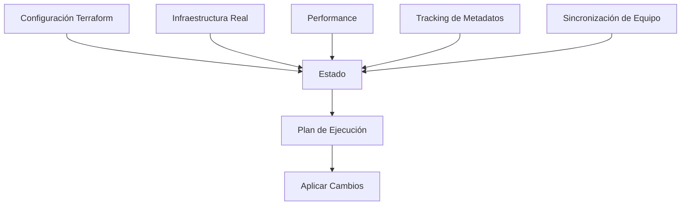
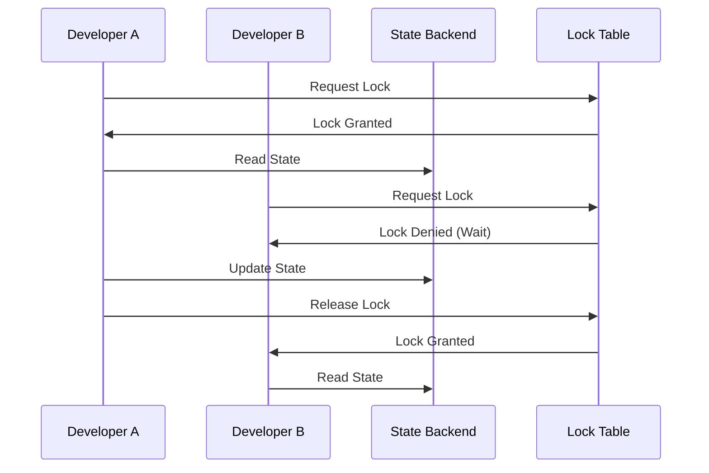

# 05. Estado de Terraform (Terraform State)


> **"El estado de Terraform es la fuente de verdad que mapea la configuración con los recursos reales en la nube"**

## 🎯 Objetivos de Aprendizaje

Al completar este módulo serás capaz de:

- [x] Comprender el concepto y importancia del estado
- [x] Gestionar el estado local vs remoto
- [x] Configurar backends remotos seguros
- [x] Implementar bloqueo de estado
- [x] Manipular el estado de forma segura
- [x] Troubleshootear problemas de estado
- [x] Migrar estados entre backends
- [x] Implementar estrategias de respaldo

## 🗄️ ¿Qué es el Estado de Terraform?

### **Conceptos Fundamentales**

El **estado de Terraform** es un archivo JSON que:

- **Mapea** recursos de configuración con recursos reales
- **Almacena** metadatos de recursos
- **Rastrea** dependencias entre recursos
- **Optimiza** el rendimiento mediante cache
- **Coordina** cambios en equipos

### **Archivo terraform.tfstate**

```json
{
  "version": 4,
  "terraform_version": "1.5.0",
  "serial": 1,
  "lineage": "38f2e9cd-69e2-4b35-9b7c-5c3d8e4f7a6b",
  "outputs": {
    "vpc_id": {
      "value": "vpc-12345abcde",
      "type": "string"
    }
  },
  "resources": [
    {
      "mode": "managed",
      "type": "aws_vpc",
      "name": "main",
      "provider": "provider[\"registry.terraform.io/hashicorp/aws\"]",
      "instances": [
        {
          "schema_version": 1,
          "attributes": {
            "id": "vpc-12345abcde",
            "cidr_block": "10.0.0.0/16",
            "enable_dns_hostnames": true,
            "enable_dns_support": true,
            "tags": {
              "Name": "main-vpc"
            }
          },
          "sensitive_attributes": [],
          "private": "base64-encoded-schema",
          "dependencies": []
        }
      ]
    }
  ]
}
```

### **¿Por qué es Importante el Estado?**



## 📁 Estado Local vs Remoto

### **Estado Local (terraform.tfstate)**

**Ventajas:**
- [x] Simplicidad inicial
- [x] No requiere configuración adicional
- [x] Ideal para desarrollo individual

**Desventajas:**
- ❌ No es seguro para equipos
- ❌ Riesgo de pérdida de datos
- ❌ No hay control de concurrencia
- ❌ Difícil de versionar

```hcl
# Configuración por defecto - estado local
# No se requiere configuración especial
# terraform.tfstate se crea automáticamente
```

### **Estado Remoto (Backends)**

**Ventajas:**
- [x] Colaboración en equipo
- [x] Seguridad y cifrado
- [x] Control de concurrencia
- [x] Backup automático
- [x] Versionado

**Desventajas:**
- ❌ Configuración adicional requerida
- ❌ Dependencia de servicios externos

## ☁️ Backends Remotos

### **Backend S3 (AWS)**

```hcl
terraform {
  backend "s3" {
    bucket         = "mi-empresa-terraform-state"
    key            = "environments/production/terraform.tfstate"
    region         = "us-west-2"
    encrypt        = true
    
    # DynamoDB para bloqueo de estado
    dynamodb_table = "terraform-state-locks"
    
    # Versionado de S3
    versioning     = true
    
    # Configuración de acceso
    profile        = "terraform"
    
    # Tags para el bucket
    tags = {
      Name        = "Terraform State"
      Environment = "production"
      Team        = "infrastructure"
    }
  }
}
```

#### **Configuración Completa de S3 Backend**

```hcl
# main.tf
terraform {
  required_version = ">= 1.0"
  
  required_providers {
    aws = {
      source  = "hashicorp/aws"
      version = "~> 5.0"
    }
  }
  
  backend "s3" {
    # Bucket configuration
    bucket = "mi-empresa-terraform-state-prod"
    key    = "infrastructure/vpc/terraform.tfstate"
    region = "us-west-2"
    
    # Security
    encrypt                     = true
    server_side_encryption_configuration {
      rule {
        apply_server_side_encryption_by_default {
          sse_algorithm = "AES256"
        }
      }
    }
    
    # Locking
    dynamodb_table = "terraform-state-locks"
    
    # Access control
    acl     = "private"
    profile = "terraform-prod"
    
    # Versioning
    versioning = true
    
    # Lifecycle
    lifecycle_rule {
      enabled = true
      
      noncurrent_version_expiration {
        days = 90
      }
    }
  }
}
```

#### **Crear Infraestructura para S3 Backend**

```hcl
# backend-setup.tf
# Ejecutar primero para crear la infraestructura del backend

# S3 Bucket para estado
resource "aws_s3_bucket" "terraform_state" {
  bucket = "mi-empresa-terraform-state-prod"
  
  tags = {
    Name    = "Terraform State Bucket"
    Purpose = "Infrastructure State Storage"
  }
}

# Versionado del bucket
resource "aws_s3_bucket_versioning" "terraform_state" {
  bucket = aws_s3_bucket.terraform_state.id
  versioning_configuration {
    status = "Enabled"
  }
}

# Cifrado del bucket
resource "aws_s3_bucket_server_side_encryption_configuration" "terraform_state" {
  bucket = aws_s3_bucket.terraform_state.id
  
  rule {
    apply_server_side_encryption_by_default {
      sse_algorithm = "AES256"
    }
  }
}

# Bloquear acceso público
resource "aws_s3_bucket_public_access_block" "terraform_state" {
  bucket = aws_s3_bucket.terraform_state.id
  
  block_public_acls       = true
  block_public_policy     = true
  ignore_public_acls      = true
  restrict_public_buckets = true
}

# DynamoDB para bloqueo
resource "aws_dynamodb_table" "terraform_locks" {
  name           = "terraform-state-locks"
  billing_mode   = "PAY_PER_REQUEST"
  hash_key       = "LockID"
  
  attribute {
    name = "LockID"
    type = "S"
  }
  
  tags = {
    Name    = "Terraform State Locks"
    Purpose = "State Locking"
  }
}

# IAM Policy para acceso al backend
resource "aws_iam_policy" "terraform_backend" {
  name        = "TerraformBackendAccess"
  description = "Policy for Terraform backend access"
  
  policy = jsonencode({
    Version = "2012-10-17"
    Statement = [
      {
        Effect = "Allow"
        Action = [
          "s3:ListBucket",
          "s3:GetBucketVersioning"
        ]
        Resource = aws_s3_bucket.terraform_state.arn
      },
      {
        Effect = "Allow"
        Action = [
          "s3:GetObject",
          "s3:PutObject",
          "s3:DeleteObject"
        ]
        Resource = "${aws_s3_bucket.terraform_state.arn}/*"
      },
      {
        Effect = "Allow"
        Action = [
          "dynamodb:GetItem",
          "dynamodb:PutItem",
          "dynamodb:DeleteItem"
        ]
        Resource = aws_dynamodb_table.terraform_locks.arn
      }
    ]
  })
}
```

### **Backend Azure Storage**

```hcl
terraform {
  backend "azurerm" {
    resource_group_name  = "terraform-state-rg"
    storage_account_name = "terraformstatestg"
    container_name       = "tfstate"
    key                  = "production.terraform.tfstate"
    
    # Configuración de acceso
    subscription_id = "12345678-1234-1234-1234-123456789012"
    tenant_id       = "87654321-4321-4321-4321-210987654321"
    
    # Uso de Managed Identity
    use_msi = true
  }
}
```

### **Backend Google Cloud Storage**

```hcl
terraform {
  backend "gcs" {
    bucket = "mi-empresa-terraform-state"
    prefix = "terraform/state"
    
    # Configuración de acceso
    credentials = "path/to/service-account-key.json"
    
    # Encryption
    encryption_key = "base64-encoded-encryption-key"
  }
}
```

### **Backend Terraform Cloud**

```hcl
terraform {
  cloud {
    organization = "mi-empresa"
    
    workspaces {
      name = "production-infrastructure"
    }
  }
}

# O para múltiples workspaces
terraform {
  cloud {
    organization = "mi-empresa"
    
    workspaces {
      tags = ["production", "infrastructure"]
    }
  }
}
```

### **Backend Consul**

```hcl
terraform {
  backend "consul" {
    address = "consul.example.com:8500"
    scheme  = "https"
    path    = "terraform/production/state"
    
    # Configuración de acceso
    access_token = var.consul_token
    
    # Configuración adicional
    gzip = true
  }
}
```

## 🔒 Bloqueo de Estado (State Locking)

### **¿Por qué es Importante el Bloqueo?**



### **Configuración de Bloqueo**

```hcl
# Backend con bloqueo automático
terraform {
  backend "s3" {
    bucket         = "terraform-state-bucket"
    key            = "infrastructure/terraform.tfstate"
    region         = "us-west-2"
    encrypt        = true
    dynamodb_table = "terraform-state-locks"  # Habilita bloqueo
  }
}
```

### **Gestión Manual de Bloqueos**

```bash
# Ver información de bloqueo
terraform force-unlock LOCK_ID

# Forzar desbloqueo (usar con precaución)
terraform force-unlock -force LOCK_ID

# Ver estado actual del bloqueo
aws dynamodb get-item \
  --table-name terraform-state-locks \
  --key '{"LockID":{"S":"bucket/path/terraform.tfstate-md5"}}'
```

## 🛠️ Comandos de Estado

### **Comandos de Inspección**

```bash
# Ver lista de recursos en el estado
terraform state list

# Ver detalles de un recurso específico
terraform state show aws_instance.web

# Ver todo el estado
terraform show

# Ver estado en formato JSON
terraform show -json | jq '.'

# Actualizar estado desde la infraestructura real
terraform refresh
```

### **Comandos de Manipulación**

```bash
# Mover un recurso en el estado
terraform state mv aws_instance.old aws_instance.new

# Remover un recurso del estado (sin destruir)
terraform state rm aws_instance.web

# Importar recurso existente al estado
terraform import aws_instance.web i-1234567890abcdef0

# Reemplazar un recurso (fuerza recreación)
terraform state replace-provider registry.terraform.io/hashicorp/aws hashicorp/aws
```

### **Ejemplos Prácticos de Manipulación**

#### **Reorganizar Recursos**

```bash
# Mover instancia a nuevo nombre
terraform state mv aws_instance.web aws_instance.web_server

# Mover módulo completo
terraform state mv module.networking module.network

# Mover recurso con count
terraform state mv 'aws_instance.web[0]' 'aws_instance.web_servers[0]'

# Mover recursos de módulo a raíz
terraform state mv module.web.aws_instance.server aws_instance.web_server
```

#### **Importar Recursos Existentes**

```bash
# Importar VPC existente
terraform import aws_vpc.main vpc-12345abcde

# Importar con index
terraform import 'aws_instance.web[0]' i-1234567890abcdef0

# Importar desde módulo
terraform import module.database.aws_db_instance.main mydb-instance
```

#### **Limpiar Estado**

```bash
# Remover recursos sin destruir
terraform state rm aws_instance.temporary

# Remover recursos con count
terraform state rm 'aws_instance.web[1]'

# Remover módulo completo
terraform state rm module.legacy_infrastructure
```

## 🔄 Migración de Estados

### **Migrar entre Backends**

#### **Paso 1: Estado Actual (Local)**

```hcl
# main.tf - configuración actual sin backend
resource "aws_vpc" "main" {
  cidr_block = "10.0.0.0/16"
}
```

#### **Paso 2: Configurar Nuevo Backend**

```hcl
# main.tf - agregar configuración de backend
terraform {
  backend "s3" {
    bucket = "mi-terraform-state"
    key    = "production/terraform.tfstate"
    region = "us-west-2"
  }
}

resource "aws_vpc" "main" {
  cidr_block = "10.0.0.0/16"
}
```

#### **Paso 3: Migrar Estado**

```bash
# Inicializar nuevo backend
terraform init

# Terraform preguntará si quiere copiar el estado existente
# Responder 'yes' para migrar

# Verificar migración
terraform state list
```

### **Migración Manual**

```bash
# Hacer backup del estado actual
cp terraform.tfstate terraform.tfstate.backup

# Configurar nuevo backend en main.tf
# Inicializar con migración
terraform init -migrate-state

# Verificar que la migración fue exitosa
terraform plan  # No debería mostrar cambios
```

### **Migración entre Diferentes Providers de Backend**

```bash
# Ejemplo: S3 a Terraform Cloud

# 1. Backup current state
terraform state pull > backup.tfstate

# 2. Update backend configuration
# main.tf
terraform {
  cloud {
    organization = "mi-empresa"
    workspaces {
      name = "production"
    }
  }
}

# 3. Initialize new backend
terraform login  # Login to Terraform Cloud
terraform init -migrate-state

# 4. Verify migration
terraform plan
```

## 📊 Troubleshooting de Estado

### **Problemas Comunes**

#### **Estado Desincronizado**

```bash
# Síntoma: Plan muestra cambios que no deberían existir

# Solución 1: Refresh del estado
terraform refresh

# Solución 2: Importar recursos manualmente
terraform import aws_instance.web i-1234567890abcdef0

# Solución 3: Recrear recurso en estado
terraform state rm aws_instance.web
terraform import aws_instance.web i-1234567890abcdef0
```

#### **Estado Corrompido**

```bash
# Síntoma: Error al leer terraform.tfstate

# Solución 1: Restaurar desde backup
cp terraform.tfstate.backup terraform.tfstate

# Solución 2: Usar versión anterior (S3)
aws s3api list-object-versions \
  --bucket mi-terraform-state \
  --prefix terraform.tfstate

# Restaurar versión específica
aws s3api get-object \
  --bucket mi-terraform-state \
  --key terraform.tfstate \
  --version-id VERSION_ID \
  terraform.tfstate
```

#### **Bloqueo Perdido**

```bash
# Síntoma: Estado está bloqueado pero no hay operación en curso

# Ver información del bloqueo
terraform force-unlock LOCK_ID

# Si persiste, forzar desbloqueo
terraform force-unlock -force LOCK_ID

# Verificar que no hay operaciones concurrentes
ps aux | grep terraform
```

#### **Drift de Configuración**

```bash
# Síntoma: Infraestructura real difiere del estado

# Detectar drift
terraform plan -detailed-exitcode

# Actualizar estado para coincidir con realidad
terraform refresh

# Aplicar configuración para corregir drift
terraform apply

# Importar cambios manuales
terraform import aws_instance.new i-1234567890abcdef0
```

## 🔍 Monitoreo y Auditoría

### **Monitoreo de Cambios de Estado**

```bash
# Script para monitorear cambios
#!/bin/bash

# check-terraform-drift.sh
WORKSPACE_DIR="/path/to/terraform"
cd $WORKSPACE_DIR

# Ejecutar plan y capturar exit code
terraform plan -detailed-exitcode -out=planfile

case $? in
  0)
    echo "No changes needed"
    ;;
  1)
    echo "Error in plan"
    exit 1
    ;;
  2)
    echo "Changes detected - drift found"
    terraform show planfile
    # Enviar alerta
    curl -X POST -H 'Content-type: application/json' \
      --data '{"text":"Terraform drift detected in production"}' \
      $SLACK_WEBHOOK_URL
    ;;
esac
```

### **Auditoría de Cambios**

```hcl
# CloudTrail para auditar cambios en S3
resource "aws_cloudtrail" "terraform_audit" {
  name           = "terraform-state-audit"
  s3_bucket_name = aws_s3_bucket.audit_logs.bucket
  
  event_selector {
    read_write_type           = "All"
    include_management_events = true
    
    data_resource {
      type   = "AWS::S3::Object"
      values = ["${aws_s3_bucket.terraform_state.arn}/*"]
    }
  }
  
  tags = {
    Name = "Terraform State Audit"
  }
}
```

### **Backup Automatizado**

```bash
#!/bin/bash
# backup-terraform-state.sh

DATE=$(date +%Y%m%d_%H%M%S)
BACKUP_DIR="/backups/terraform-state"
STATE_BUCKET="mi-terraform-state"

# Crear directorio de backup
mkdir -p $BACKUP_DIR

# Backup del estado actual
aws s3 cp s3://$STATE_BUCKET/terraform.tfstate \
  $BACKUP_DIR/terraform.tfstate.$DATE

# Limpiar backups antiguos (mantener 30 días)
find $BACKUP_DIR -name "terraform.tfstate.*" -mtime +30 -delete

# Verificar integridad
terraform validate
```

## 🏗️ Estrategias de Organización de Estado

### **Estado por Entorno**

```
environments/
├── dev/
│   ├── main.tf
│   ├── backend.tf
│   └── terraform.tfstate
├── staging/
│   ├── main.tf
│   ├── backend.tf
│   └── terraform.tfstate
└── prod/
    ├── main.tf
    ├── backend.tf
    └── terraform.tfstate
```

```hcl
# environments/prod/backend.tf
terraform {
  backend "s3" {
    bucket = "empresa-terraform-state"
    key    = "environments/production/terraform.tfstate"
    region = "us-west-2"
    
    dynamodb_table = "terraform-locks-prod"
  }
}
```

### **Estado por Componente**

```
infrastructure/
├── networking/
│   ├── vpc/
│   │   └── terraform.tfstate (key: networking/vpc/terraform.tfstate)
│   └── security-groups/
│       └── terraform.tfstate (key: networking/sg/terraform.tfstate)
├── compute/
│   ├── ec2/
│   │   └── terraform.tfstate (key: compute/ec2/terraform.tfstate)
│   └── autoscaling/
│       └── terraform.tfstate (key: compute/asg/terraform.tfstate)
└── data/
    ├── rds/
    │   └── terraform.tfstate (key: data/rds/terraform.tfstate)
    └── elasticache/
        └── terraform.tfstate (key: data/cache/terraform.tfstate)
```

### **Estado Jerárquico**

```hcl
# Usar data sources para conectar estados
data "terraform_remote_state" "networking" {
  backend = "s3"
  config = {
    bucket = "empresa-terraform-state"
    key    = "networking/terraform.tfstate"
    region = "us-west-2"
  }
}

# Usar outputs de otro estado
resource "aws_instance" "web" {
  subnet_id = data.terraform_remote_state.networking.outputs.public_subnet_ids[0]
  vpc_security_group_ids = [data.terraform_remote_state.networking.outputs.web_sg_id]
}
```

## 🧪 Laboratorio Práctico

### **Ejercicio 1: Configurar Backend S3**

**Objetivo:** Migrar de estado local a S3 con bloqueo DynamoDB

**Tareas:**
1. Crear bucket S3 y tabla DynamoDB
2. Configurar backend en Terraform
3. Migrar estado existente
4. Verificar bloqueo funciona

### **Ejercicio 2: Manipulación de Estado**

**Objetivo:** Practicar comandos de estado

**Tareas:**
1. Importar recurso existente
2. Mover recursos en el estado
3. Remover recursos del estado
4. Recuperar de backup

### **Ejercicio 3: Troubleshooting**

**Objetivo:** Resolver problemas comunes de estado

**Escenarios:**
1. Estado desincronizado
2. Bloqueo perdido
3. Drift de configuración
4. Corrupción de estado

## ✅ Checklist de Mejores Prácticas

### **Configuración de Backend**

- [ ] Usar backend remoto para trabajo en equipo
- [ ] Habilitar cifrado en reposo
- [ ] Configurar bloqueo de estado
- [ ] Implementar versionado
- [ ] Configurar backups automáticos
- [ ] Usar IAM roles específicos

### **Gestión de Estado**

- [ ] Nunca editar terraform.tfstate manualmente
- [ ] Hacer backup antes de manipulaciones
- [ ] Usar terraform import para recursos existentes
- [ ] Mantener estados pequeños y enfocados
- [ ] Monitorear drift regularmente

### **Seguridad**

- [ ] Cifrar estado sensible
- [ ] Usar principio de menor privilegio
- [ ] Auditar cambios de estado
- [ ] Rotar credenciales regularmente
- [ ] Separar estados por sensibilidad

## 🎯 Resumen del Módulo

### **Conceptos Clave Aprendidos**

- [x] **Estado**: Importancia y estructura
- [x] **Backends**: Configuración remota segura
- [x] **Bloqueo**: Prevención de concurrencia
- [x] **Comandos**: Manipulación segura del estado
- [x] **Troubleshooting**: Resolución de problemas

### **Habilidades Desarrolladas**

- 🔧 **Configuración de backends** remotos seguros
- 📊 **Manipulación de estado** con comandos
- 🔄 **Migración de estados** entre backends
- 🔍 **Troubleshooting** de problemas de estado
- 📋 **Organización** de estados por entorno/componente

**Próximo módulo:** [06. Módulos de Terraform](06-modulos-terraform.md)