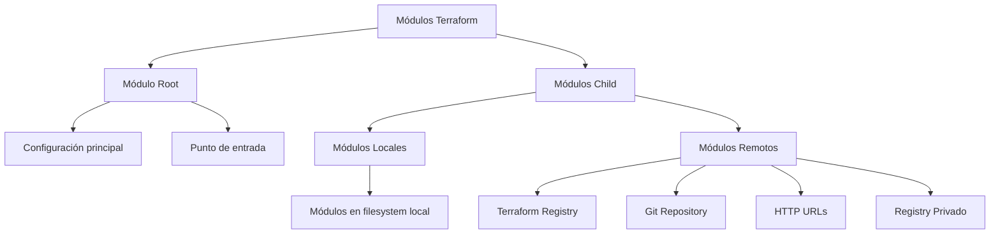
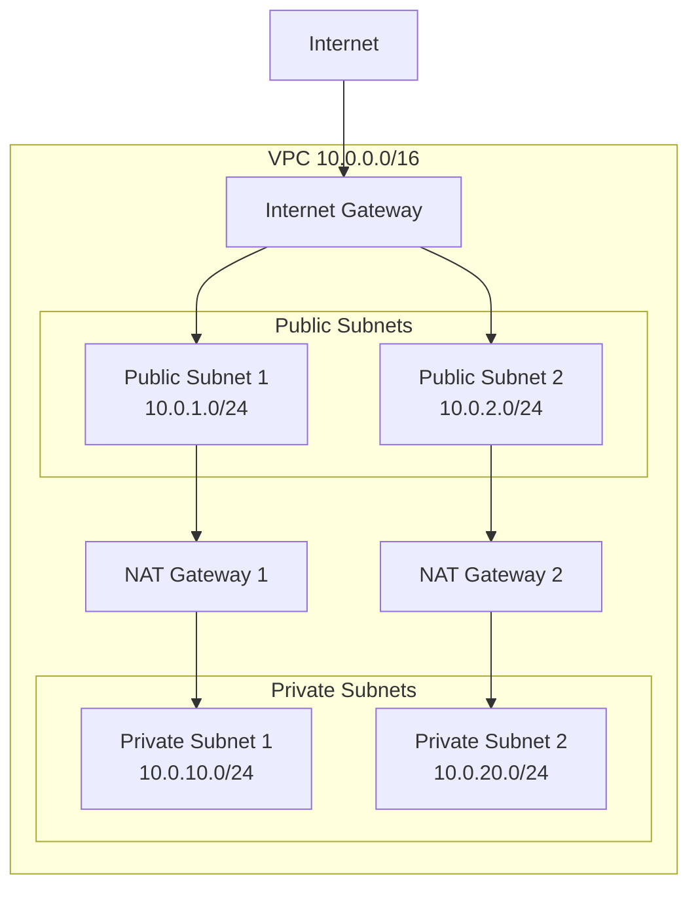

# 06. Módulos de Terraform


> **"Los módulos son la clave para crear infraestructura reutilizable, mantenible y escalable en Terraform"**

## 🎯 Objetivos de Aprendizaje

Al completar este módulo serás capaz de:

- [x] Comprender la arquitectura y beneficios de los módulos
- [x] Crear módulos reutilizables desde cero
- [x] Implementar versionado semántico para módulos
- [x] Consumir módulos del Registry y fuentes privadas
- [x] Gestionar dependencias entre módulos
- [x] Aplicar patrones de diseño avanzados
- [x] Publicar módulos en registries públicos y privados
- [x] Testear y validar módulos eficientemente

## 🧩 ¿Qué son los Módulos de Terraform?

### **Conceptos Fundamentales**

Un **módulo de Terraform** es un contenedor para múltiples recursos que se usan juntos. Los módulos permiten:

- **Reutilizar** configuraciones comunes
- **Organizar** código de manera lógica
- **Abstractar** complejidades de implementación
- **Estandarizar** patrones de infraestructura
- **Facilitar** el mantenimiento y testing

### **Anatomía de un Módulo**

```
mi-modulo/
├── main.tf          # Recursos principales
├── variables.tf     # Variables de entrada
├── outputs.tf       # Valores de salida
├── versions.tf      # Versiones de providers
├── README.md        # Documentación
├── examples/        # Ejemplos de uso
│   └── basic/
│       ├── main.tf
│       └── variables.tf
└── modules/         # Sub-módulos (opcional)
    └── database/
        ├── main.tf
        ├── variables.tf
        └── outputs.tf
```

### **Tipos de Módulos**



## 🏗️ Creación de Módulos

### **Módulo Básico: VPC AWS**

#### **Estructura del Módulo**

```
modules/aws-vpc/
├── main.tf
├── variables.tf
├── outputs.tf
├── versions.tf
└── README.md
```

#### **variables.tf**

```hcl
# variables.tf - Definición de inputs del módulo

variable "name" {
  description = "Nombre base para los recursos"
  type        = string
  
  validation {
    condition     = length(var.name) > 0 && length(var.name) <= 32
    error_message = "El nombre debe tener entre 1 y 32 caracteres."
  }
}

variable "cidr_block" {
  description = "CIDR block para la VPC"
  type        = string
  default     = "10.0.0.0/16"
  
  validation {
    condition     = can(cidrhost(var.cidr_block, 0))
    error_message = "Debe ser un CIDR block válido."
  }
}

variable "availability_zones" {
  description = "Lista de zonas de disponibilidad"
  type        = list(string)
}

variable "public_subnet_cidrs" {
  description = "CIDR blocks para subnets públicas"
  type        = list(string)
}

variable "private_subnet_cidrs" {
  description = "CIDR blocks para subnets privadas"
  type        = list(string)
}

variable "enable_nat_gateway" {
  description = "Crear NAT Gateway para subnets privadas"
  type        = bool
  default     = true
}

variable "enable_vpn_gateway" {
  description = "Crear VPN Gateway"
  type        = bool
  default     = false
}

variable "enable_dns_hostnames" {
  description = "Habilitar DNS hostnames en VPC"
  type        = bool
  default     = true
}

variable "enable_dns_support" {
  description = "Habilitar DNS support en VPC"
  type        = bool
  default     = true
}

variable "tags" {
  description = "Tags para aplicar a todos los recursos"
  type        = map(string)
  default     = {}
}
```

#### **main.tf**

```hcl
# main.tf - Recursos principales del módulo

# Data source para obtener AZs disponibles
data "aws_availability_zones" "available" {
  state = "available"
}

# Locals para cálculos y valores derivados
locals {
  # Usar AZs proporcionadas o detectar automáticamente
  azs = length(var.availability_zones) > 0 ? var.availability_zones : slice(data.aws_availability_zones.available.names, 0, 2)
  
  # Validar que hay suficientes AZs
  az_count = length(local.azs)
  
  # Tags comunes para todos los recursos
  common_tags = merge(
    var.tags,
    {
      Module    = "aws-vpc"
      Terraform = "true"
    }
  )
}

# VPC Principal
resource "aws_vpc" "main" {
  cidr_block           = var.cidr_block
  enable_dns_hostnames = var.enable_dns_hostnames
  enable_dns_support   = var.enable_dns_support
  
  tags = merge(local.common_tags, {
    Name = "${var.name}-vpc"
  })
}

# Internet Gateway
resource "aws_internet_gateway" "main" {
  vpc_id = aws_vpc.main.id
  
  tags = merge(local.common_tags, {
    Name = "${var.name}-igw"
  })
}

# Subnets Públicas
resource "aws_subnet" "public" {
  count = length(var.public_subnet_cidrs)
  
  vpc_id                  = aws_vpc.main.id
  cidr_block              = var.public_subnet_cidrs[count.index]
  availability_zone       = local.azs[count.index % local.az_count]
  map_public_ip_on_launch = true
  
  tags = merge(local.common_tags, {
    Name = "${var.name}-public-${count.index + 1}"
    Type = "public"
  })
}

# Subnets Privadas
resource "aws_subnet" "private" {
  count = length(var.private_subnet_cidrs)
  
  vpc_id            = aws_vpc.main.id
  cidr_block        = var.private_subnet_cidrs[count.index]
  availability_zone = local.azs[count.index % local.az_count]
  
  tags = merge(local.common_tags, {
    Name = "${var.name}-private-${count.index + 1}"
    Type = "private"
  })
}

# Route Table para subnets públicas
resource "aws_route_table" "public" {
  vpc_id = aws_vpc.main.id
  
  route {
    cidr_block = "0.0.0.0/0"
    gateway_id = aws_internet_gateway.main.id
  }
  
  tags = merge(local.common_tags, {
    Name = "${var.name}-public-rt"
  })
}

# Asociar Route Table con subnets públicas
resource "aws_route_table_association" "public" {
  count = length(aws_subnet.public)
  
  subnet_id      = aws_subnet.public[count.index].id
  route_table_id = aws_route_table.public.id
}

# Elastic IPs para NAT Gateways
resource "aws_eip" "nat" {
  count = var.enable_nat_gateway ? length(aws_subnet.public) : 0
  
  domain = "vpc"
  
  tags = merge(local.common_tags, {
    Name = "${var.name}-nat-eip-${count.index + 1}"
  })
  
  depends_on = [aws_internet_gateway.main]
}

# NAT Gateways
resource "aws_nat_gateway" "main" {
  count = var.enable_nat_gateway ? length(aws_subnet.public) : 0
  
  allocation_id = aws_eip.nat[count.index].id
  subnet_id     = aws_subnet.public[count.index].id
  
  tags = merge(local.common_tags, {
    Name = "${var.name}-nat-${count.index + 1}"
  })
  
  depends_on = [aws_internet_gateway.main]
}

# Route Tables para subnets privadas
resource "aws_route_table" "private" {
  count = var.enable_nat_gateway ? length(aws_nat_gateway.main) : 1
  
  vpc_id = aws_vpc.main.id
  
  dynamic "route" {
    for_each = var.enable_nat_gateway ? [1] : []
    content {
      cidr_block     = "0.0.0.0/0"
      nat_gateway_id = aws_nat_gateway.main[count.index].id
    }
  }
  
  tags = merge(local.common_tags, {
    Name = "${var.name}-private-rt-${count.index + 1}"
  })
}

# Asociar Route Tables con subnets privadas
resource "aws_route_table_association" "private" {
  count = length(aws_subnet.private)
  
  subnet_id      = aws_subnet.private[count.index].id
  route_table_id = aws_route_table.private[var.enable_nat_gateway ? count.index % length(aws_route_table.private) : 0].id
}

# VPN Gateway (opcional)
resource "aws_vpn_gateway" "main" {
  count = var.enable_vpn_gateway ? 1 : 0
  
  vpc_id = aws_vpc.main.id
  
  tags = merge(local.common_tags, {
    Name = "${var.name}-vpn-gw"
  })
}
```

#### **outputs.tf**

```hcl
# outputs.tf - Valores que el módulo expone

# VPC Outputs
output "vpc_id" {
  description = "ID de la VPC creada"
  value       = aws_vpc.main.id
}

output "vpc_arn" {
  description = "ARN de la VPC creada"
  value       = aws_vpc.main.arn
}

output "vpc_cidr_block" {
  description = "CIDR block de la VPC"
  value       = aws_vpc.main.cidr_block
}

# Internet Gateway Outputs
output "internet_gateway_id" {
  description = "ID del Internet Gateway"
  value       = aws_internet_gateway.main.id
}

# Subnet Outputs
output "public_subnet_ids" {
  description = "Lista de IDs de subnets públicas"
  value       = aws_subnet.public[*].id
}

output "private_subnet_ids" {
  description = "Lista de IDs de subnets privadas"
  value       = aws_subnet.private[*].id
}

output "public_subnet_cidrs" {
  description = "Lista de CIDR blocks de subnets públicas"
  value       = aws_subnet.public[*].cidr_block
}

output "private_subnet_cidrs" {
  description = "Lista de CIDR blocks de subnets privadas"
  value       = aws_subnet.private[*].cidr_block
}

# NAT Gateway Outputs
output "nat_gateway_ids" {
  description = "Lista de IDs de NAT Gateways"
  value       = aws_nat_gateway.main[*].id
}

output "nat_gateway_ips" {
  description = "Lista de IPs públicas de NAT Gateways"
  value       = aws_eip.nat[*].public_ip
}

# Route Table Outputs
output "public_route_table_id" {
  description = "ID de la route table pública"
  value       = aws_route_table.public.id
}

output "private_route_table_ids" {
  description = "Lista de IDs de route tables privadas"
  value       = aws_route_table.private[*].id
}

# VPN Gateway Output
output "vpn_gateway_id" {
  description = "ID del VPN Gateway (si está habilitado)"
  value       = var.enable_vpn_gateway ? aws_vpn_gateway.main[0].id : null
}

# Información del módulo
output "availability_zones" {
  description = "Zonas de disponibilidad utilizadas"
  value       = local.azs
}
```

#### **versions.tf**

```hcl
# versions.tf - Versiones de Terraform y providers requeridos

terraform {
  required_version = ">= 1.0"
  
  required_providers {
    aws = {
      source  = "hashicorp/aws"
      version = ">= 4.0"
    }
  }
}
```

#### **README.md**

```markdown
# AWS VPC Module

Este módulo crea una VPC completa en AWS con subnets públicas y privadas, NAT gateways y routing apropiado.

## Usage

```hcl
module "vpc" {
  source = "./modules/aws-vpc"
  
  name = "mi-proyecto"
  
  cidr_block             = "10.0.0.0/16"
  availability_zones     = ["us-west-2a", "us-west-2b"]
  public_subnet_cidrs    = ["10.0.1.0/24", "10.0.2.0/24"]
  private_subnet_cidrs   = ["10.0.10.0/24", "10.0.20.0/24"]
  
  enable_nat_gateway = true
  
  tags = {
    Environment = "production"
    Project     = "mi-proyecto"
  }
}
```

## Requirements

| Name | Version |
|------|---------|
| terraform | >= 1.0 |
| aws | >= 4.0 |

## Providers

| Name | Version |
|------|---------|
| aws | >= 4.0 |

## Inputs

| Name | Description | Type | Default | Required |
|------|-------------|------|---------|:--------:|
| name | Nombre base para los recursos | `string` | n/a | yes |
| cidr_block | CIDR block para la VPC | `string` | `"10.0.0.0/16"` | no |
| availability_zones | Lista de zonas de disponibilidad | `list(string)` | n/a | yes |
| public_subnet_cidrs | CIDR blocks para subnets públicas | `list(string)` | n/a | yes |
| private_subnet_cidrs | CIDR blocks para subnets privadas | `list(string)` | n/a | yes |
| enable_nat_gateway | Crear NAT Gateway para subnets privadas | `bool` | `true` | no |
| enable_vpn_gateway | Crear VPN Gateway | `bool` | `false` | no |
| tags | Tags para aplicar a todos los recursos | `map(string)` | `{}` | no |

## Outputs

| Name | Description |
|------|-------------|
| vpc_id | ID de la VPC creada |
| public_subnet_ids | Lista de IDs de subnets públicas |
| private_subnet_ids | Lista de IDs de subnets privadas |
| nat_gateway_ids | Lista de IDs de NAT Gateways |
```

## 📦 Uso de Módulos

### **Módulo Local**

```hcl
# main.tf - Usando módulo local
module "vpc" {
  source = "./modules/aws-vpc"
  
  # Variables requeridas
  name                   = "production"
  availability_zones     = ["us-west-2a", "us-west-2b", "us-west-2c"]
  public_subnet_cidrs    = ["10.0.1.0/24", "10.0.2.0/24", "10.0.3.0/24"]
  private_subnet_cidrs   = ["10.0.10.0/24", "10.0.20.0/24", "10.0.30.0/24"]
  
  # Configuración opcional
  cidr_block         = "10.0.0.0/16"
  enable_nat_gateway = true
  enable_vpn_gateway = false
  
  # Tags
  tags = {
    Environment = "production"
    Team        = "platform"
    CostCenter  = "engineering"
  }
}

# Usar outputs del módulo
resource "aws_security_group" "web" {
  name   = "web-sg"
  vpc_id = module.vpc.vpc_id
  
  ingress {
    from_port   = 80
    to_port     = 80
    protocol    = "tcp"
    cidr_blocks = ["0.0.0.0/0"]
  }
}

# Output de información del módulo
output "vpc_info" {
  value = {
    vpc_id             = module.vpc.vpc_id
    public_subnet_ids  = module.vpc.public_subnet_ids
    private_subnet_ids = module.vpc.private_subnet_ids
  }
}
```

### **Módulo desde Terraform Registry**

```hcl
# Usar módulo oficial del Registry
module "vpc" {
  source  = "terraform-aws-modules/vpc/aws"
  version = "~> 5.0"
  
  name = "my-vpc"
  cidr = "10.0.0.0/16"
  
  azs             = ["us-west-2a", "us-west-2b", "us-west-2c"]
  private_subnets = ["10.0.1.0/24", "10.0.2.0/24", "10.0.3.0/24"]
  public_subnets  = ["10.0.101.0/24", "10.0.102.0/24", "10.0.103.0/24"]
  
  enable_nat_gateway = true
  enable_vpn_gateway = true
  
  tags = {
    Terraform   = "true"
    Environment = "dev"
  }
}
```

### **Módulo desde Git Repository**

```hcl
# Usar módulo desde repositorio Git
module "vpc" {
  source = "git::https://github.com/mi-empresa/terraform-modules.git//aws-vpc?ref=v1.2.0"
  
  # Variables del módulo
  name                   = "staging"
  availability_zones     = data.aws_availability_zones.available.names
  public_subnet_cidrs    = ["10.1.1.0/24", "10.1.2.0/24"]
  private_subnet_cidrs   = ["10.1.10.0/24", "10.1.20.0/24"]
}

# Usar módulo desde subdirectorio específico
module "database" {
  source = "git::https://github.com/mi-empresa/terraform-modules.git//rds/mysql?ref=main"
  
  name    = "staging-db"
  vpc_id  = module.vpc.vpc_id
  subnets = module.vpc.private_subnet_ids
}
```

### **Módulo desde HTTP URL**

```hcl
# Usar módulo desde URL HTTP
module "s3_bucket" {
  source = "https://storage.googleapis.com/my-modules/s3-bucket.zip"
  
  bucket_name = "my-unique-bucket-name"
  environment = "production"
}
```

## 🔄 Versionado de Módulos

### **Semántico Versionado (SemVer)**

```
v1.2.3
│ │ │
│ │ └── PATCH: Bug fixes, backward compatible
│ └──── MINOR: New features, backward compatible  
└────── MAJOR: Breaking changes, not backward compatible
```

### **Estrategias de Versionado**

```hcl
# Versión exacta (más restrictivo)
module "vpc" {
  source  = "terraform-aws-modules/vpc/aws"
  version = "5.1.2"
}

# Versión flexible con constrains
module "vpc" {
  source  = "terraform-aws-modules/vpc/aws"
  version = "~> 5.1"  # >= 5.1.0, < 5.2.0
}

# Rango de versiones
module "vpc" {
  source  = "terraform-aws-modules/vpc/aws"
  version = ">= 5.0, < 6.0"
}

# Branch o tag específico en Git
module "vpc" {
  source = "git::https://github.com/terraform-aws-modules/terraform-aws-vpc.git?ref=v5.1.2"
}

# Usar rama de desarrollo (no recomendado para producción)
module "vpc" {
  source = "git::https://github.com/mi-empresa/terraform-modules.git?ref=develop"
}
```

### **Gestión de Versiones en CI/CD**

```yaml
# .github/workflows/module-release.yml
name: Release Module

on:
  push:
    tags:
      - 'v*'

jobs:
  release:
    runs-on: ubuntu-latest
    steps:
      - uses: actions/checkout@v3
      
      - name: Setup Terraform
        uses: hashicorp/setup-terraform@v2
        with:
          terraform_version: 1.5.0
          
      - name: Validate Module
        run: |
          terraform init
          terraform validate
          terraform fmt -check
          
      - name: Run Tests
        run: |
          cd tests
          go test -v ./...
          
      - name: Create Release
        uses: actions/create-release@v1
        env:
          GITHUB_TOKEN: ${{ secrets.GITHUB_TOKEN }}
        with:
          tag_name: ${{ github.ref }}
          release_name: Release ${{ github.ref }}
          body: |
            Changes in this Release
            - Feature: New functionality
            - Fix: Bug corrections
            - Breaking: API changes
          draft: false
          prerelease: false
```

## 🏛️ Patrones de Diseño para Módulos

### **Patrón Wrapper**

```hcl
# modules/app-infrastructure/main.tf
# Wrapper que combina múltiples módulos

module "vpc" {
  source = "../aws-vpc"
  
  name                   = var.name
  availability_zones     = var.availability_zones
  public_subnet_cidrs    = var.public_subnet_cidrs
  private_subnet_cidrs   = var.private_subnet_cidrs
  enable_nat_gateway     = var.enable_nat_gateway
  
  tags = local.common_tags
}

module "security_groups" {
  source = "../security-groups"
  
  name   = var.name
  vpc_id = module.vpc.vpc_id
  
  tags = local.common_tags
}

module "load_balancer" {
  source = "../application-load-balancer"
  
  name            = var.name
  vpc_id          = module.vpc.vpc_id
  public_subnets  = module.vpc.public_subnet_ids
  security_groups = [module.security_groups.alb_sg_id]
  
  tags = local.common_tags
}

module "autoscaling" {
  source = "../autoscaling-group"
  
  name                = var.name
  vpc_id              = module.vpc.vpc_id
  private_subnets     = module.vpc.private_subnet_ids
  target_group_arns   = [module.load_balancer.target_group_arn]
  security_groups     = [module.security_groups.web_sg_id]
  
  tags = local.common_tags
}
```

### **Patrón Factory**

```hcl
# modules/environment-factory/main.tf
# Factory que crea diferentes tipos de entornos

locals {
  environment_configs = {
    development = {
      instance_type     = "t3.micro"
      min_capacity      = 1
      max_capacity      = 2
      enable_monitoring = false
      backup_retention  = 1
    }
    staging = {
      instance_type     = "t3.small"
      min_capacity      = 2
      max_capacity      = 4
      enable_monitoring = true
      backup_retention  = 7
    }
    production = {
      instance_type     = "t3.large"
      min_capacity      = 3
      max_capacity      = 10
      enable_monitoring = true
      backup_retention  = 30
    }
  }
  
  config = local.environment_configs[var.environment_type]
}

module "infrastructure" {
  source = "../app-infrastructure"
  
  name        = "${var.project_name}-${var.environment_type}"
  environment = var.environment_type
  
  # Usar configuración del factory
  instance_type      = local.config.instance_type
  min_capacity       = local.config.min_capacity
  max_capacity       = local.config.max_capacity
  enable_monitoring  = local.config.enable_monitoring
  backup_retention   = local.config.backup_retention
}
```

### **Patrón Composition**

```hcl
# modules/web-application/main.tf
# Composición de módulos para aplicación web completa

# Networking Layer
module "network" {
  source = "./modules/networking"
  
  project_name = var.project_name
  environment  = var.environment
  vpc_cidr     = var.vpc_cidr
  
  tags = local.tags
}

# Security Layer
module "security" {
  source = "./modules/security"
  
  project_name = var.project_name
  vpc_id       = module.network.vpc_id
  
  tags = local.tags
}

# Compute Layer
module "compute" {
  source = "./modules/compute"
  
  project_name    = var.project_name
  vpc_id          = module.network.vpc_id
  private_subnets = module.network.private_subnet_ids
  security_groups = module.security.instance_security_groups
  
  tags = local.tags
}

# Data Layer
module "database" {
  source = "./modules/database"
  
  project_name     = var.project_name
  vpc_id           = module.network.vpc_id
  database_subnets = module.network.database_subnet_ids
  security_groups  = module.security.database_security_groups
  
  tags = local.tags
}

# Monitoring Layer
module "monitoring" {
  source = "./modules/monitoring"
  
  project_name = var.project_name
  resources = {
    load_balancer = module.compute.load_balancer_arn
    auto_scaling  = module.compute.auto_scaling_group_name
    database      = module.database.instance_id
  }
  
  tags = local.tags
}
```

## 📊 Testing de Módulos

### **Estructura de Testing**

```
modules/aws-vpc/
├── main.tf
├── variables.tf
├── outputs.tf
├── tests/
│   ├── unit/
│   │   └── vpc_test.go
│   ├── integration/
│   │   └── vpc_integration_test.go
│   └── examples/
│       ├── basic/
│       │   ├── main.tf
│       │   └── outputs.tf
│       └── complete/
│           ├── main.tf
│           └── outputs.tf
└── .github/
    └── workflows/
        └── test.yml
```

### **Unit Testing con Terratest**

```go
// tests/unit/vpc_test.go
package test

import (
    "testing"
    "github.com/gruntwork-io/terratest/modules/terraform"
    "github.com/stretchr/testify/assert"
)

func TestVPCModule(t *testing.T) {
    t.Parallel()
    
    terraformOptions := terraform.WithDefaultRetryableErrors(t, &terraform.Options{
        TerraformDir: "../examples/basic",
        Vars: map[string]interface{}{
            "name":                   "test-vpc",
            "availability_zones":     []string{"us-west-2a", "us-west-2b"},
            "public_subnet_cidrs":    []string{"10.0.1.0/24", "10.0.2.0/24"},
            "private_subnet_cidrs":   []string{"10.0.10.0/24", "10.0.20.0/24"},
        },
    })
    
    defer terraform.Destroy(t, terraformOptions)
    terraform.InitAndApply(t, terraformOptions)
    
    // Test outputs
    vpcId := terraform.Output(t, terraformOptions, "vpc_id")
    assert.NotEmpty(t, vpcId)
    
    publicSubnetIds := terraform.OutputList(t, terraformOptions, "public_subnet_ids")
    assert.Len(t, publicSubnetIds, 2)
    
    privateSubnetIds := terraform.OutputList(t, terraformOptions, "private_subnet_ids")
    assert.Len(t, privateSubnetIds, 2)
}
```

### **Integration Testing**

```go
// tests/integration/vpc_integration_test.go
package test

import (
    "testing"
    "github.com/gruntwork-io/terratest/modules/aws"
    "github.com/gruntwork-io/terratest/modules/terraform"
    "github.com/stretchr/testify/assert"
)

func TestVPCIntegration(t *testing.T) {
    t.Parallel()
    
    awsRegion := "us-west-2"
    
    terraformOptions := terraform.WithDefaultRetryableErrors(t, &terraform.Options{
        TerraformDir: "../examples/complete",
        Vars: map[string]interface{}{
            "name": "integration-test-vpc",
        },
    })
    
    defer terraform.Destroy(t, terraformOptions)
    terraform.InitAndApply(t, terraformOptions)
    
    // Verify VPC exists and has correct configuration
    vpcId := terraform.Output(t, terraformOptions, "vpc_id")
    vpc := aws.GetVpcById(t, vpcId, awsRegion)
    
    assert.Equal(t, "10.0.0.0/16", *vpc.CidrBlock)
    assert.True(t, *vpc.EnableDnsHostnames)
    assert.True(t, *vpc.EnableDnsSupport)
    
    // Verify subnets
    publicSubnetIds := terraform.OutputList(t, terraformOptions, "public_subnet_ids")
    for _, subnetId := range publicSubnetIds {
        subnet := aws.GetSubnetById(t, subnetId, awsRegion)
        assert.True(t, *subnet.MapPublicIpOnLaunch)
    }
    
    // Verify NAT Gateways
    natGatewayIds := terraform.OutputList(t, terraformOptions, "nat_gateway_ids")
    assert.Len(t, natGatewayIds, 2)
}
```

### **Policy Testing con OPA/Rego**

```rego
# tests/policies/vpc_policy.rego
package terraform.vpc

import rego.v1

# Deny if VPC doesn't have DNS hostnames enabled
deny contains msg if {
    resource := input.planned_values.root_module.resources[_]
    resource.type == "aws_vpc"
    not resource.values.enable_dns_hostnames
    msg := "VPC must have DNS hostnames enabled"
}

# Deny if public subnets are not in different AZs
deny contains msg if {
    public_subnets := [subnet |
        subnet := input.planned_values.root_module.resources[_]
        subnet.type == "aws_subnet"
        contains(subnet.name, "public")
    ]
    
    azs := {subnet.values.availability_zone | subnet := public_subnets[_]}
    count(azs) < 2
    msg := "Public subnets must be in different availability zones"
}
```

## 📝 Documentación de Módulos

### **README.md Completo**

```markdown
# AWS VPC Module

## Description

This module creates a complete AWS VPC with public and private subnets, NAT gateways, and proper routing configuration.

## Architecture



## Usage Examples

### Basic Usage

```hcl
module "vpc" {
  source = "github.com/mi-empresa/terraform-modules//aws-vpc?ref=v1.0.0"
  
  name                   = "my-project"
  availability_zones     = ["us-west-2a", "us-west-2b"]
  public_subnet_cidrs    = ["10.0.1.0/24", "10.0.2.0/24"]
  private_subnet_cidrs   = ["10.0.10.0/24", "10.0.20.0/24"]
  
  tags = {
    Environment = "production"
    Team        = "platform"
  }
}
```

### Advanced Usage

```hcl
module "vpc" {
  source = "github.com/mi-empresa/terraform-modules//aws-vpc?ref=v1.0.0"
  
  name                   = "advanced-project"
  cidr_block            = "172.16.0.0/16"
  availability_zones     = ["us-west-2a", "us-west-2b", "us-west-2c"]
  public_subnet_cidrs    = ["172.16.1.0/24", "172.16.2.0/24", "172.16.3.0/24"]
  private_subnet_cidrs   = ["172.16.10.0/24", "172.16.20.0/24", "172.16.30.0/24"]
  
  enable_nat_gateway     = true
  enable_vpn_gateway     = true
  enable_dns_hostnames   = true
  enable_dns_support     = true
  
  tags = {
    Environment = "production"
    Team        = "platform"
    CostCenter  = "engineering"
    Compliance  = "pci"
  }
}
```

## Testing

This module includes comprehensive tests:

```bash
# Run unit tests
cd tests
go test -v ./unit/...

# Run integration tests
go test -v ./integration/...

# Run all tests
go test -v ./...
```

## Contributing

1. Fork the repository
2. Create a feature branch
3. Make your changes
4. Add tests for new functionality
5. Run tests: `go test -v ./...`
6. Submit a pull request

## Requirements

| Name | Version |
|------|---------|
| terraform | >= 1.0 |
| aws | >= 4.0 |

## Inputs

| Name | Description | Type | Default | Required |
|------|-------------|------|---------|:--------:|
| name | Base name for resources | `string` | n/a | yes |
| cidr_block | CIDR block for VPC | `string` | `"10.0.0.0/16"` | no |
| availability_zones | List of availability zones | `list(string)` | n/a | yes |
| public_subnet_cidrs | CIDR blocks for public subnets | `list(string)` | n/a | yes |
| private_subnet_cidrs | CIDR blocks for private subnets | `list(string)` | n/a | yes |
| enable_nat_gateway | Create NAT Gateway for private subnets | `bool` | `true` | no |
| enable_vpn_gateway | Create VPN Gateway | `bool` | `false` | no |
| enable_dns_hostnames | Enable DNS hostnames in VPC | `bool` | `true` | no |
| enable_dns_support | Enable DNS support in VPC | `bool` | `true` | no |
| tags | Tags to apply to all resources | `map(string)` | `{}` | no |

## Outputs

| Name | Description |
|------|-------------|
| vpc_id | ID of the VPC |
| vpc_arn | ARN of the VPC |
| vpc_cidr_block | CIDR block of the VPC |
| internet_gateway_id | ID of the Internet Gateway |
| public_subnet_ids | List of IDs of public subnets |
| private_subnet_ids | List of IDs of private subnets |
| nat_gateway_ids | List of IDs of NAT Gateways |
| nat_gateway_ips | List of public IPs of NAT Gateways |
| public_route_table_id | ID of the public route table |
| private_route_table_ids | List of IDs of private route tables |
| vpn_gateway_id | ID of the VPN Gateway (if enabled) |
| availability_zones | Availability zones used |

## License

MIT Licensed. See [LICENSE](LICENSE) for full details.
```

## 🌐 Publicación de Módulos

### **Terraform Registry**

#### **Preparar Módulo para Registry**

```
terraform-aws-vpc/
├── main.tf
├── variables.tf
├── outputs.tf
├── versions.tf
├── README.md
├── LICENSE
├── examples/
│   ├── basic/
│   └── complete/
└── .github/
    └── workflows/
        └── release.yml
```

#### **Configuración de GitHub Release**

```yaml
# .github/workflows/release.yml
name: Release

on:
  push:
    tags:
      - 'v*'

jobs:
  release:
    name: Release
    runs-on: ubuntu-latest
    steps:
      - name: Checkout
        uses: actions/checkout@v3
        with:
          fetch-depth: 0
          
      - name: Setup Terraform
        uses: hashicorp/setup-terraform@v2
        
      - name: Terraform Format Check
        run: terraform fmt -check -recursive
        
      - name: Terraform Validate
        run: |
          terraform init
          terraform validate
          
      - name: Generate Changelog
        id: changelog
        run: |
          echo "## Changes" > changelog.md
          git log --pretty=format:"- %s" $(git describe --tags --abbrev=0 HEAD^)..HEAD >> changelog.md
          
      - name: Create Release
        uses: actions/create-release@v1
        env:
          GITHUB_TOKEN: ${{ secrets.GITHUB_TOKEN }}
        with:
          tag_name: ${{ github.ref }}
          release_name: ${{ github.ref }}
          body_path: changelog.md
```

### **Registry Privado**

#### **Configuración de Registry Privado**

```hcl
# .terraformrc - Configuración del cliente
provider_installation {
  network_mirror {
    url = "https://terraform.company.com/providers/"
  }
  
  direct {
    exclude = ["registry.company.com/*/*"]
  }
}

credentials "registry.company.com" {
  token = "xxxxxx.atlasv1.zzzzzzzzzzzzz"
}
```

#### **Estructura para Registry Privado**

```
private-modules/
├── aws/
│   ├── vpc/
│   │   └── 1.0.0/
│   │       ├── main.tf
│   │       ├── variables.tf
│   │       └── outputs.tf
│   └── ec2/
│       └── 1.0.0/
└── azure/
    └── resource-group/
        └── 1.0.0/
```

## 🧪 Laboratorio Práctico

### **Ejercicio 1: Crear Módulo VPC**

**Objetivo:** Crear un módulo reutilizable para VPC

**Tareas:**
1. Crear estructura de módulo
2. Implementar variables y outputs
3. Añadir validaciones
4. Crear ejemplos de uso

### **Ejercicio 2: Módulo Compuesto**

**Objetivo:** Crear módulo que use otros módulos

**Tareas:**
1. Combinar módulo VPC con módulo EC2
2. Implementar patrones de diseño
3. Crear tests automatizados
4. Documentar completamente

### **Ejercicio 3: Publicar Módulo**

**Objetivo:** Publicar módulo en registry

**Tareas:**
1. Preparar módulo para publicación
2. Crear releases con versionado semántico
3. Configurar CI/CD para testing
4. Publicar en Terraform Registry

## ✅ Checklist de Mejores Prácticas

### **Desarrollo de Módulos**

- [ ] Estructura estándar de archivos
- [ ] Variables con validaciones
- [ ] Outputs descriptivos y útiles
- [ ] Documentación completa
- [ ] Ejemplos de uso
- [ ] Tests automatizados

### **Versionado**

- [ ] Semántico versionado (SemVer)
- [ ] Tags de Git para releases
- [ ] Changelog documentado
- [ ] Compatibilidad hacia atrás
- [ ] Deprecation warnings

### **Calidad**

- [ ] Código formateado (`terraform fmt`)
- [ ] Validación sin errores (`terraform validate`)
- [ ] Tests unitarios y de integración
- [ ] Security scanning
- [ ] Performance testing

## 🎯 Resumen del Módulo

### **Conceptos Clave Aprendidos**

- [x] **Módulos**: Estructura y organización
- [x] **Reutilización**: Patrones de diseño
- [x] **Versionado**: Gestión semántica
- [x] **Testing**: Validación automatizada
- [x] **Publicación**: Registry público y privado

### **Habilidades Desarrolladas**

- 🏗️ **Creación** de módulos reutilizables
- 📦 **Consumo** de módulos externos
- 🔄 **Versionado** y gestión de releases  
- 🧪 **Testing** automatizado de infraestructura
- 📚 **Documentación** profesional de módulos

**Próximo módulo:** [07. Introducción a Ansible](07-introduccion-ansible.md)