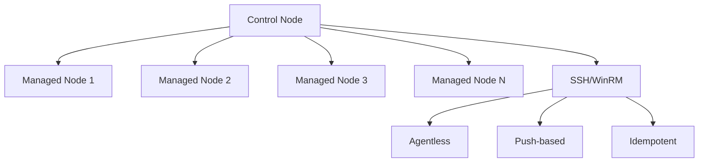
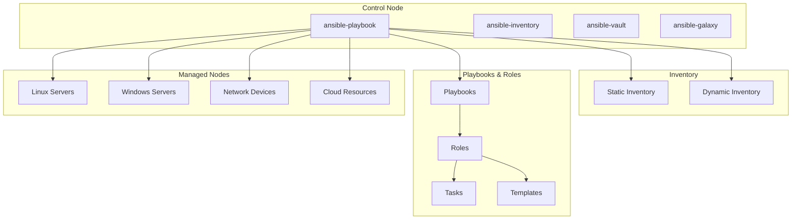

# 07. Introducción a Ansible


> **"Ansible simplifica la automatización de TI mediante la gestión de configuración, despliegue de aplicaciones y orquestación de tareas"**

## 🎯 Objetivos de Aprendizaje

Al completar este módulo serás capaz de:

- [x] Comprender la arquitectura y filosofía de Ansible
- [x] Instalar y configurar Ansible correctamente
- [x] Crear y gestionar inventarios dinámicos y estáticos
- [x] Escribir playbooks básicos e intermedios
- [x] Utilizar módulos fundamentales de Ansible
- [x] Gestionar variables y facts eficientemente
- [x] Implementar conectividad SSH segura
- [x] Ejecutar tareas ad-hoc y playbooks

## 🏗️ ¿Qué es Ansible?

### **Conceptos Fundamentales**

**Ansible** es una plataforma de automatización de TI que permite:

- **Gestión de configuración** de servidores
- **Despliegue de aplicaciones** automatizado
- **Orquestación** de tareas complejas
- **Provisioning** de infraestructura
- **Gestión de parches** y actualizaciones

### **Filosofía de Ansible**



### **Principios Clave**

1. **Agentless**: No requiere instalación de agentes en nodos gestionados
2. **Idempotente**: Ejecutar múltiples veces produce el mismo resultado
3. **Declarativo**: Describes el estado deseado, no los pasos
4. **Push-based**: Control node empuja configuraciones
5. **YAML**: Sintaxis humana legible

### **Arquitectura de Ansible**



## 🚀 Instalación y Configuración

### **Instalación en Control Node**

#### **Ubuntu/Debian**

```bash
# Actualizar repositorios
sudo apt update

# Instalar Python y pip
sudo apt install python3 python3-pip python3-venv

# Crear entorno virtual (recomendado)
python3 -m venv ansible-env
source ansible-env/bin/activate

# Instalar Ansible
pip install ansible

# Verificar instalación
ansible --version
ansible-community --version
```

#### **CentOS/RHEL/Fedora**

```bash
# Habilitar EPEL repository (CentOS/RHEL)
sudo dnf install epel-release  # Para dnf
sudo yum install epel-release  # Para yum

# Instalar Python y pip
sudo dnf install python3 python3-pip

# Crear entorno virtual
python3 -m venv ansible-env
source ansible-env/bin/activate

# Instalar Ansible
pip install ansible

# O usar paquete del sistema
sudo dnf install ansible
```

#### **macOS**

```bash
# Usando Homebrew
brew install ansible

# O usando pip
pip3 install ansible

# Verificar instalación
ansible --version
```

#### **Windows (WSL)**

```bash
# Habilitar WSL2 y instalar Ubuntu
wsl --install -d Ubuntu

# En WSL Ubuntu, seguir instrucciones de Ubuntu
sudo apt update
sudo apt install python3 python3-pip
pip3 install ansible
```

### **Configuración Inicial**

#### **Archivo de Configuración ansible.cfg**

```ini
# ansible.cfg - Configuración global de Ansible

[defaults]
# Inventario por defecto
inventory = ./inventory/hosts

# Directorio de roles
roles_path = ./roles

# Usuario remoto por defecto
remote_user = ansible

# Archivo de clave privada SSH
private_key_file = ~/.ssh/ansible_key

# Desactivar verificación de host key SSH
host_key_checking = False

# Timeout de conexión
timeout = 30

# Número de procesos paralelos
forks = 20

# Formato de log
log_path = ./ansible.log

# Directorio de módulos personalizados
library = ./library

# Directorio de plugins de lookup
lookup_plugins = ./plugins/lookup

# Directorio de plugins de filtros
filter_plugins = ./plugins/filter

# Callbacks habilitados
callbacks_enabled = timer, profile_tasks

# Política de gathering de facts
gathering = smart
fact_caching = jsonfile
fact_caching_connection = ./facts_cache
fact_caching_timeout = 86400

[inventory]
# Habilitar plugins de inventario
enable_plugins = yaml, ini, script, auto

[privilege_escalation]
# Configuración de sudo
become = True
become_method = sudo
become_user = root
become_ask_pass = False

[ssh_connection]
# Configuración SSH
ssh_args = -o ControlMaster=auto -o ControlPersist=60s -o UserKnownHostsFile=/dev/null -o IdentitiesOnly=yes
pipelining = True
control_path_dir = ~/.ansible/cp
```

#### **Estructura de Proyecto Ansible**

```
ansible-project/
├── ansible.cfg                 # Configuración de Ansible
├── inventory/                  # Inventarios
│   ├── hosts                  # Inventario estático
│   ├── group_vars/            # Variables por grupo
│   │   ├── all.yml
│   │   ├── webservers.yml
│   │   └── databases.yml
│   └── host_vars/             # Variables por host
│       ├── web1.yml
│       └── db1.yml
├── playbooks/                 # Playbooks
│   ├── site.yml              # Playbook principal
│   ├── webservers.yml
│   └── databases.yml
├── roles/                     # Roles de Ansible
│   ├── common/
│   ├── webserver/
│   └── database/
├── files/                     # Archivos estáticos
├── templates/                 # Templates Jinja2
├── vars/                      # Variables adicionales
├── vault/                     # Secretos encriptados
└── collections/               # Colecciones de Ansible
```

## 📋 Inventarios

### **Inventario Estático**

#### **Formato INI**

```ini
# inventory/hosts - Inventario en formato INI

# Hosts individuales
web1.example.com
web2.example.com

# Hosts con variables específicas
db1.example.com ansible_host=192.168.1.10 ansible_user=dbadmin
db2.example.com ansible_host=192.168.1.11 ansible_user=dbadmin

# Grupos de hosts
[webservers]
web1.example.com
web2.example.com
web3.example.com

[databases]
db1.example.com
db2.example.com

[loadbalancers]
lb1.example.com ansible_host=192.168.1.5
lb2.example.com ansible_host=192.168.1.6

# Grupos anidados
[production:children]
webservers
databases
loadbalancers

[staging]
staging-web.example.com
staging-db.example.com

# Variables de grupo
[webservers:vars]
http_port=80
https_port=443
max_clients=200

[databases:vars]
mysql_port=3306
mysql_root_password=secret123

[production:vars]
environment=production
monitoring_enabled=true
backup_enabled=true

[staging:vars]
environment=staging
monitoring_enabled=false
backup_enabled=false

# Rangos de hosts
[web_cluster]
web[01:50].example.com

[cache_servers]
cache-[a:f].example.com
```

#### **Formato YAML**

```yaml
# inventory/hosts.yml - Inventario en formato YAML

all:
  children:
    production:
      children:
        webservers:
          hosts:
            web1.example.com:
              ansible_host: 192.168.1.21
              server_role: primary
            web2.example.com:
              ansible_host: 192.168.1.22
              server_role: secondary
            web3.example.com:
              ansible_host: 192.168.1.23
              server_role: secondary
          vars:
            http_port: 80
            https_port: 443
            max_clients: 200
            nginx_version: "1.20"
            
        databases:
          hosts:
            db1.example.com:
              ansible_host: 192.168.1.10
              mysql_role: master
            db2.example.com:
              ansible_host: 192.168.1.11
              mysql_role: slave
          vars:
            mysql_port: 3306
            mysql_version: "8.0"
            max_connections: 1000
            
        loadbalancers:
          hosts:
            lb1.example.com:
              ansible_host: 192.168.1.5
              lb_role: primary
            lb2.example.com:
              ansible_host: 192.168.1.6
              lb_role: secondary
              
      vars:
        environment: production
        monitoring_enabled: true
        backup_enabled: true
        log_level: info
        
    staging:
      hosts:
        staging-web.example.com:
          ansible_host: 192.168.2.21
        staging-db.example.com:
          ansible_host: 192.168.2.10
      vars:
        environment: staging
        monitoring_enabled: false
        backup_enabled: false
        log_level: debug
        
    development:
      hosts:
        dev-all-in-one.example.com:
          ansible_host: 192.168.3.10
      vars:
        environment: development
        monitoring_enabled: false
        backup_enabled: false
        log_level: debug
```

### **Inventario Dinámico**

#### **Script de Inventario Dinámico**

```python
#!/usr/bin/env python3
# inventory/dynamic_inventory.py

import json
import subprocess
import sys

def get_aws_instances():
    """Obtener instancias EC2 dinámicamente"""
    try:
        # Comando AWS CLI para obtener instancias
        cmd = [
            'aws', 'ec2', 'describe-instances',
            '--query', '''
            Reservations[*].Instances[*].{
                InstanceId: InstanceId,
                PublicIpAddress: PublicIpAddress,
                PrivateIpAddress: PrivateIpAddress,
                State: State.Name,
                Tags: Tags
            }
            ''',
            '--output', 'json'
        ]
        
        result = subprocess.run(cmd, capture_output=True, text=True, check=True)
        instances = json.loads(result.stdout)
        
        return [instance for reservation in instances for instance in reservation if instance['State'] == 'running']
        
    except Exception as e:
        print(f"Error obteniendo instancias AWS: {e}", file=sys.stderr)
        return []

def build_inventory():
    """Construir inventario dinámico"""
    instances = get_aws_instances()
    
    inventory = {
        '_meta': {
            'hostvars': {}
        },
        'all': {
            'children': ['ungrouped']
        }
    }
    
    for instance in instances:
        instance_id = instance['InstanceId']
        public_ip = instance.get('PublicIpAddress')
        private_ip = instance.get('PrivateIpAddress')
        
        if not public_ip:
            continue
            
        # Extraer tags
        tags = {tag['Key']: tag['Value'] for tag in instance.get('Tags', [])}
        
        # Determinar grupos basados en tags
        groups = []
        if 'Environment' in tags:
            groups.append(tags['Environment'])
        if 'Role' in tags:
            groups.append(tags['Role'])
        if 'Team' in tags:
            groups.append(tags['Team'])
            
        # Añadir host a grupos
        for group in groups:
            if group not in inventory:
                inventory[group] = {'hosts': []}
            inventory[group]['hosts'].append(public_ip)
            
        # Variables del host
        inventory['_meta']['hostvars'][public_ip] = {
            'ansible_host': public_ip,
            'private_ip': private_ip,
            'instance_id': instance_id,
            'ec2_tags': tags
        }
    
    return inventory

def list_inventory():
    """Listar inventario completo"""
    return build_inventory()

def get_host_vars(host):
    """Obtener variables de un host específico"""
    inventory = build_inventory()
    return inventory['_meta']['hostvars'].get(host, {})

if __name__ == '__main__':
    if len(sys.argv) == 2 and sys.argv[1] == '--list':
        print(json.dumps(list_inventory(), indent=2))
    elif len(sys.argv) == 3 and sys.argv[1] == '--host':
        print(json.dumps(get_host_vars(sys.argv[2]), indent=2))
    else:
        print("Usage: {} --list | --host <hostname>".format(sys.argv[0]))
        sys.exit(1)
```

#### **Plugin de Inventario Dinámico AWS**

```yaml
# inventory/aws_ec2.yml - Plugin de inventario AWS EC2

plugin: amazon.aws.aws_ec2

# Configuración de AWS
aws_profile: default
regions:
  - us-west-2
  - us-east-1

# Filtros de instancias
filters:
  - tag:Environment: [production, staging]
  - instance-state-name: running

# Configuración de grupos
keyed_groups:
  # Agrupar por Environment tag
  - key: tags.Environment | default('ungrouped')
    prefix: env
  # Agrupar por tipo de instancia
  - key: instance_type
    prefix: instance_type
  # Agrupar por VPC
  - key: vpc_id
    prefix: vpc
  # Agrupar por rol
  - key: tags.Role | default('no_role')
    prefix: role

# Variables del host
hostnames:
  - ip-address
  - dns-name
  - tag:Name

# Variables personalizadas
compose:
  ansible_host: public_ip_address | default(private_ip_address)
  ec2_architecture: architecture
  ec2_instance_type: instance_type
  ec2_placement_region: placement.region
  ec2_security_groups: security_groups | map(attribute='group_name') | list
  ec2_vpc_id: vpc_id
```

## 📝 Playbooks Básicos

### **Estructura de un Playbook**

```yaml
# playbooks/basic-playbook.yml

---
- name: Configuración básica de servidores web
  hosts: webservers
  become: yes
  vars:
    http_port: 80
    https_port: 443
    document_root: /var/www/html
    
  tasks:
    - name: Actualizar cache de paquetes
      apt:
        update_cache: yes
        cache_valid_time: 3600
      when: ansible_os_family == "Debian"
      
    - name: Instalar Nginx
      package:
        name: nginx
        state: present
        
    - name: Crear directorio document root
      file:
        path: "{{ document_root }}"
        state: directory
        owner: www-data
        group: www-data
        mode: '0755'
        
    - name: Configurar Nginx
      template:
        src: nginx.conf.j2
        dest: /etc/nginx/nginx.conf
        backup: yes
      notify:
        - restart nginx
        
    - name: Crear página de inicio
      copy:
        content: |
          <!DOCTYPE html>
          <html>
          <head>
              <title>Welcome to {{ inventory_hostname }}</title>
          </head>
          <body>
              <h1>Server: {{ inventory_hostname }}</h1>
              <p>Environment: {{ environment }}</p>
              <p>Deployed at: {{ ansible_date_time.iso8601 }}</p>
          </body>
          </html>
        dest: "{{ document_root }}/index.html"
        owner: www-data
        group: www-data
        mode: '0644'
        
    - name: Habilitar y iniciar Nginx
      systemd:
        name: nginx
        enabled: yes
        state: started
        
    - name: Configurar firewall para HTTP/HTTPS
      ufw:
        rule: allow
        port: "{{ item }}"
        proto: tcp
      loop:
        - "{{ http_port }}"
        - "{{ https_port }}"
      when: ansible_os_family == "Debian"
      
  handlers:
    - name: restart nginx
      systemd:
        name: nginx
        state: restarted
```

### **Playbook Multi-Play**

```yaml
# playbooks/multi-play.yml

---
# Play 1: Configurar todos los servidores
- name: Configuración común para todos los servidores
  hosts: all
  become: yes
  vars:
    common_packages:
      - htop
      - vim
      - curl
      - wget
      - unzip
      
  tasks:
    - name: Actualizar sistema
      apt:
        upgrade: dist
        update_cache: yes
      when: ansible_os_family == "Debian"
      
    - name: Instalar paquetes comunes
      package:
        name: "{{ common_packages }}"
        state: present
        
    - name: Configurar timezone
      timezone:
        name: America/New_York
        
    - name: Crear usuario de aplicación
      user:
        name: appuser
        shell: /bin/bash
        home: /home/appuser
        create_home: yes
        groups: sudo
        append: yes

# Play 2: Configurar servidores web
- name: Configurar servidores web
  hosts: webservers
  become: yes
  vars:
    nginx_sites:
      - name: default
        server_name: "_"
        document_root: /var/www/html
        
  tasks:
    - name: Instalar Nginx y dependencias
      package:
        name:
          - nginx
          - ssl-cert
        state: present
        
    - name: Configurar sitios Nginx
      template:
        src: nginx-site.conf.j2
        dest: "/etc/nginx/sites-available/{{ item.name }}"
      loop: "{{ nginx_sites }}"
      notify: reload nginx
      
    - name: Habilitar sitios Nginx
      file:
        src: "/etc/nginx/sites-available/{{ item.name }}"
        dest: "/etc/nginx/sites-enabled/{{ item.name }}"
        state: link
      loop: "{{ nginx_sites }}"
      notify: reload nginx

# Play 3: Configurar base de datos
- name: Configurar servidores de base de datos
  hosts: databases
  become: yes
  vars:
    mysql_root_password: "{{ vault_mysql_root_password }}"
    mysql_databases:
      - name: webapp
        encoding: utf8mb4
        collation: utf8mb4_unicode_ci
        
  tasks:
    - name: Instalar MySQL Server
      package:
        name:
          - mysql-server
          - python3-pymysql
        state: present
        
    - name: Iniciar y habilitar MySQL
      systemd:
        name: mysql
        state: started
        enabled: yes
        
    - name: Configurar contraseña root de MySQL
      mysql_user:
        name: root
        password: "{{ mysql_root_password }}"
        login_unix_socket: /var/run/mysqld/mysqld.sock
        
    - name: Crear bases de datos
      mysql_db:
        name: "{{ item.name }}"
        encoding: "{{ item.encoding }}"
        collation: "{{ item.collation }}"
        state: present
        login_user: root
        login_password: "{{ mysql_root_password }}"
      loop: "{{ mysql_databases }}"
      
  handlers:
    - name: reload nginx
      systemd:
        name: nginx
        state: reloaded
```

## 🔧 Módulos Fundamentales

### **Módulos de Sistema**

```yaml
# Ejemplos de módulos de sistema

tasks:
  # Gestión de paquetes
  - name: Instalar paquetes con apt
    apt:
      name:
        - nginx
        - mysql-server
        - php-fpm
      state: present
      update_cache: yes
      
  - name: Instalar paquetes con yum
    yum:
      name:
        - httpd
        - mariadb-server
        - php
      state: present
      
  # Gestión de servicios
  - name: Controlar servicios con systemd
    systemd:
      name: nginx
      state: started
      enabled: yes
      daemon_reload: yes
      
  # Gestión de usuarios
  - name: Crear usuario del sistema
    user:
      name: webadmin
      uid: 1001
      group: www-data
      shell: /bin/bash
      home: /home/webadmin
      create_home: yes
      password: "{{ 'mypassword' | password_hash('sha512') }}"
      
  # Gestión de grupos
  - name: Crear grupo personalizado
    group:
      name: developers
      gid: 1100
      state: present
      
  # Gestión de archivos y directorios
  - name: Crear directorio con permisos específicos
    file:
      path: /opt/myapp
      state: directory
      owner: appuser
      group: appgroup
      mode: '0755'
      recurse: yes
      
  # Cron jobs
  - name: Configurar tarea cron
    cron:
      name: "backup database"
      minute: "0"
      hour: "2"
      job: "/opt/scripts/backup.sh"
      user: root
```

### **Módulos de Archivos**

```yaml
# Gestión de archivos

tasks:
  # Copiar archivos
  - name: Copiar archivo de configuración
    copy:
      src: files/app.conf
      dest: /etc/myapp/app.conf
      owner: root
      group: root
      mode: '0644'
      backup: yes
      
  # Templates con Jinja2
  - name: Generar configuración desde template
    template:
      src: templates/nginx.conf.j2
      dest: /etc/nginx/nginx.conf
      owner: root
      group: root
      mode: '0644'
      validate: 'nginx -t -c %s'
    notify: restart nginx
    
  # Descargar archivos
  - name: Descargar archivo desde URL
    get_url:
      url: https://example.com/file.tar.gz
      dest: /tmp/file.tar.gz
      mode: '0644'
      checksum: sha256:abc123...
      
  # Descomprimir archivos
  - name: Extraer archivo comprimido
    unarchive:
      src: /tmp/file.tar.gz
      dest: /opt/myapp
      remote_src: yes
      owner: appuser
      group: appgroup
      creates: /opt/myapp/bin/myapp
      
  # Buscar y reemplazar en archivos
  - name: Modificar archivo de configuración
    lineinfile:
      path: /etc/ssh/sshd_config
      regexp: '^#?Port'
      line: 'Port 2222'
      backup: yes
    notify: restart sshd
    
  # Reemplazar bloques de texto
  - name: Configurar bloque en archivo
    blockinfile:
      path: /etc/hosts
      block: |
        192.168.1.10    web1.local
        192.168.1.11    web2.local
        192.168.1.12    db1.local
      marker: "# {mark} ANSIBLE MANAGED BLOCK"
```

### **Módulos de Red**

```yaml
# Módulos de red y conectividad

tasks:
  # Verificar conectividad
  - name: Verificar conectividad a host
    wait_for:
      host: "{{ inventory_hostname }}"
      port: 22
      delay: 10
      timeout: 300
      
  - name: Verificar puerto abierto
    wait_for:
      port: 80
      timeout: 300
      
  # Configurar firewall con ufw
  - name: Configurar reglas UFW
    ufw:
      rule: allow
      port: "{{ item }}"
      proto: tcp
    loop:
      - '22'
      - '80'
      - '443'
      
  # Configurar firewall con firewalld
  - name: Configurar firewalld
    firewalld:
      service: http
      permanent: yes
      state: enabled
      immediate: yes
      
  # Realizar peticiones HTTP
  - name: Verificar aplicación web
    uri:
      url: "http://{{ inventory_hostname }}"
      method: GET
      status_code: 200
      return_content: yes
    register: web_response
    
  - name: Mostrar respuesta web
    debug:
      var: web_response.content
```

## 📊 Variables y Facts

### **Tipos de Variables**

```yaml
# playbooks/variables-example.yml

---
- name: Ejemplo de variables en Ansible
  hosts: webservers
  vars:
    # Variables simples
    app_name: mywebapp
    app_version: "1.2.3"
    
    # Variables complejas
    database_config:
      host: db.example.com
      port: 3306
      name: webapp
      user: webapp_user
      
    # Listas
    required_packages:
      - nginx
      - php-fpm
      - mysql-client
      
    # Diccionarios
    nginx_sites:
      default:
        server_name: example.com
        document_root: /var/www/html
      api:
        server_name: api.example.com
        document_root: /var/www/api
        
  vars_files:
    - vars/common.yml
    - vars/{{ environment }}.yml
    
  tasks:
    - name: Mostrar variables
      debug:
        msg: |
          App: {{ app_name }}
          Version: {{ app_version }}
          Database: {{ database_config.host }}:{{ database_config.port }}
          
    - name: Instalar paquetes requeridos
      package:
        name: "{{ required_packages }}"
        state: present
        
    - name: Configurar sitios web
      template:
        src: nginx-site.j2
        dest: "/etc/nginx/sites-available/{{ item.key }}"
      loop: "{{ nginx_sites | dict2items }}"
```

### **Facts de Sistema**

```yaml
# Usando facts del sistema

tasks:
  - name: Mostrar información del sistema
    debug:
      msg: |
        Hostname: {{ ansible_hostname }}
        FQDN: {{ ansible_fqdn }}
        OS: {{ ansible_distribution }} {{ ansible_distribution_version }}
        Kernel: {{ ansible_kernel }}
        Architecture: {{ ansible_architecture }}
        Memory: {{ ansible_memtotal_mb }} MB
        CPUs: {{ ansible_processor_vcpus }}
        IP Address: {{ ansible_default_ipv4.address }}
        
  - name: Instalar paquetes según la distribución
    package:
      name: "{{ item }}"
      state: present
    vars:
      packages_map:
        Debian:
          - apache2
          - libapache2-mod-php
        RedHat:
          - httpd
          - php
        CentOS:
          - httpd
          - php
    loop: "{{ packages_map[ansible_distribution] }}"
    
  - name: Configurar según la arquitectura
    template:
      src: "app-{{ ansible_architecture }}.conf.j2"
      dest: /etc/myapp/app.conf
    when: ansible_architecture in ['x86_64', 'aarch64']
    
  - name: Configurar memoria según recursos disponibles
    lineinfile:
      path: /etc/myapp/memory.conf
      line: "max_memory={{ (ansible_memtotal_mb * 0.8) | int }}MB"
      create: yes
```

### **Custom Facts**

```bash
#!/bin/bash
# /etc/ansible/facts.d/custom.fact

# Script que genera facts personalizados
cat << EOF
{
    "application": {
        "name": "MyWebApp",
        "version": "$(cat /opt/myapp/VERSION 2>/dev/null || echo 'unknown')",
        "status": "$(systemctl is-active myapp 2>/dev/null || echo 'unknown')"
    },
    "system": {
        "load_average": "$(uptime | cut -d',' -f3-5)",
        "disk_usage": "$(df -h / | tail -1 | awk '{print $5}')"
    }
}
EOF
```

```yaml
# Usando custom facts

tasks:
  - name: Ejecutar setup para obtener facts
    setup:
      filter: ansible_local
      
  - name: Mostrar facts personalizados
    debug:
      msg: |
        App Name: {{ ansible_local.custom.application.name }}
        App Version: {{ ansible_local.custom.application.version }}
        App Status: {{ ansible_local.custom.application.status }}
        Load Average: {{ ansible_local.custom.system.load_average }}
```

## 🔐 Conectividad SSH

### **Configuración SSH**

```bash
# Generar par de claves SSH para Ansible
ssh-keygen -t rsa -b 4096 -f ~/.ssh/ansible_key -N ""

# Copiar clave pública a servidores gestionados
ssh-copy-id -i ~/.ssh/ansible_key.pub user@server1.example.com
ssh-copy-id -i ~/.ssh/ansible_key.pub user@server2.example.com

# Configurar SSH config
cat >> ~/.ssh/config << EOF
Host *.example.com
    User ansible
    IdentityFile ~/.ssh/ansible_key
    StrictHostKeyChecking no
    UserKnownHostsFile /dev/null
EOF
```

### **Configuración de Usuario Ansible**

```bash
# En servidores gestionados, crear usuario ansible
sudo useradd -m -s /bin/bash ansible
sudo mkdir -p /home/ansible/.ssh
sudo cp ~/.ssh/authorized_keys /home/ansible/.ssh/
sudo chown -R ansible:ansible /home/ansible/.ssh
sudo chmod 700 /home/ansible/.ssh
sudo chmod 600 /home/ansible/.ssh/authorized_keys

# Configurar sudo sin contraseña
echo "ansible ALL=(ALL) NOPASSWD:ALL" | sudo tee /etc/sudoers.d/ansible
```

### **Configuración Avanzada SSH**

```yaml
# Variables SSH en inventario

[webservers]
web1.example.com ansible_host=192.168.1.21 ansible_user=centos ansible_ssh_private_key_file=~/.ssh/aws_key.pem
web2.example.com ansible_host=192.168.1.22 ansible_user=ubuntu ansible_ssh_private_key_file=~/.ssh/digital_ocean_key
web3.example.com ansible_host=192.168.1.23 ansible_user=ansible ansible_port=2222

[webservers:vars]
ansible_ssh_common_args='-o StrictHostKeyChecking=no -o UserKnownHostsFile=/dev/null'
ansible_ssh_pipelining=true

# Configuración SSH con bastion host
[production]
prod-web1 ansible_host=10.0.1.21
prod-web2 ansible_host=10.0.1.22

[production:vars]
ansible_ssh_common_args='-o ProxyCommand="ssh -W %h:%p -q bastion.example.com"'
ansible_user=ansible
```

## 🧪 Comandos Ad-hoc

### **Comandos Básicos**

```bash
# Verificar conectividad
ansible all -m ping

# Obtener información del sistema
ansible all -m setup

# Ejecutar comandos shell
ansible webservers -m command -a "uptime"
ansible webservers -m shell -a "ps aux | grep nginx"

# Gestión de paquetes
ansible webservers -m apt -a "name=nginx state=present" --become
ansible centos -m yum -a "name=httpd state=present" --become

# Gestión de servicios
ansible webservers -m systemd -a "name=nginx state=started enabled=yes" --become

# Copiar archivos
ansible webservers -m copy -a "src=./index.html dest=/var/www/html/index.html" --become

# Crear usuarios
ansible all -m user -a "name=testuser state=present" --become

# Gestión de archivos
ansible all -m file -a "path=/tmp/testfile state=touch"
ansible all -m file -a "path=/tmp/testdir state=directory mode=0755"

# Variables en ad-hoc
ansible webservers -m template -a "src=nginx.conf.j2 dest=/etc/nginx/nginx.conf" \
  -e "worker_processes=4" --become

# Comandos con filtros
ansible webservers -m setup -a "filter=ansible_distribution*"
ansible all -m command -a "df -h" --limit "production"
```

### **Comandos Avanzados**

```bash
# Ejecutar en paralelo con forks
ansible all -m command -a "sleep 30" -f 50

# Usar become con usuario específico
ansible webservers -m command -a "whoami" --become --become-user=nginx

# Verificar sintaxis sin ejecutar
ansible-playbook playbook.yml --check --diff

# Ejecutar con tags específicos
ansible-playbook playbook.yml --tags "install,configure"

# Modo debug
ansible-playbook playbook.yml -vvv

# Ejecutar paso a paso
ansible-playbook playbook.yml --step

# Limitar a hosts específicos
ansible-playbook playbook.yml --limit "webservers:&production"

# Usar vault para secretos
ansible-playbook playbook.yml --ask-vault-pass
```

## 🧪 Laboratorio Práctico

### **Ejercicio 1: Configuración Inicial**

**Objetivo:** Configurar Ansible y conectividad SSH

**Tareas:**
1. Instalar Ansible en control node
2. Configurar archivo ansible.cfg
3. Crear inventario estático
4. Configurar SSH keys
5. Verificar conectividad con ping

### **Ejercicio 2: Primer Playbook**

**Objetivo:** Crear y ejecutar playbook básico

**Tareas:**
1. Crear playbook para instalar y configurar Nginx
2. Usar variables y templates
3. Implementar handlers
4. Ejecutar y verificar resultados

### **Ejercicio 3: Inventario Dinámico**

**Objetivo:** Implementar inventario dinámico

**Tareas:**
1. Crear script de inventario dinámico
2. Configurar plugin AWS EC2
3. Usar variables de inventario dinámico
4. Ejecutar playbooks con inventario dinámico

## ✅ Checklist de Mejores Prácticas

### **Configuración**

- [ ] Ansible instalado en entorno virtual
- [ ] Archivo ansible.cfg configurado
- [ ] SSH keys configuradas correctamente
- [ ] Usuario ansible con privilegios sudo
- [ ] Inventario organizado por entornos

### **Playbooks**

- [ ] Uso de nombres descriptivos en tasks
- [ ] Implementación de idempotencia
- [ ] Gestión apropiada de variables
- [ ] Uso de handlers para servicios
- [ ] Validación con --check y --diff

### **Seguridad**

- [ ] SSH keys en lugar de contraseñas
- [ ] Uso de ansible-vault para secretos
- [ ] Principio de menor privilegio
- [ ] Validación de templates y configuraciones

## 🎯 Resumen del Módulo

### **Conceptos Clave Aprendidos**

- [x] **Arquitectura**: Control node y managed nodes
- [x] **Inventarios**: Estáticos y dinámicos
- [x] **Playbooks**: Estructura y sintaxis YAML
- [x] **Módulos**: Sistema, archivos, red
- [x] **Variables**: Facts y variables personalizadas

### **Habilidades Desarrolladas**

- 🔧 **Instalación** y configuración de Ansible
- 📋 **Creación** de inventarios flexibles
- 📝 **Escritura** de playbooks eficientes
- 🔐 **Configuración** de conectividad SSH segura
- 🧪 **Ejecución** de comandos ad-hoc y playbooks

**Próximo módulo:** [08. Playbooks Avanzados](08-playbooks-avanzados.md)