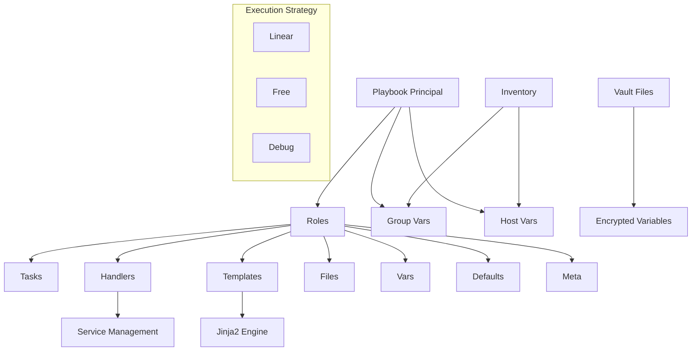

# 📚 Módulo 08: Playbooks Avanzados de Ansible

[](https://www.ansible.com/)
[](https://yaml.org/)
[](https://jinja.palletsprojects.com/)

## 🎯 Objetivos de Aprendizaje

Al completar este módulo, podrás:

- [x] Implementar roles de Ansible para organizar contenido reutilizable
- [x] Crear y usar templates con Jinja2 para configuraciones dinámicas
- [x] Configurar handlers para manejar servicios y notificaciones
- [x] Aplicar estrategias avanzadas de ejecución de playbooks
- [x] Implementar control de flujo avanzado con condicionales y loops
- [x] Gestionar variables complejas y su precedencia
- [x] Crear playbooks modulares y mantenibles
- [x] Implementar patrones de mejores prácticas en Ansible

## 📋 Prerrequisitos

- [x] Conocimiento básico de Ansible (Módulo 07)
- [x] Experiencia con playbooks simples
- [x] Comprensión de YAML
- [x] Conocimientos básicos de Jinja2

## 🏗️ Arquitectura de Playbooks Avanzados



## 🎭 Roles de Ansible

### Estructura de un Role

```
roles/
├── webserver/
│   ├── tasks/
│   │   └── main.yml
│   ├── handlers/
│   │   └── main.yml
│   ├── templates/
│   │   └── nginx.conf.j2
│   ├── files/
│   │   └── index.html
│   ├── vars/
│   │   └── main.yml
│   ├── defaults/
│   │   └── main.yml
│   ├── meta/
│   │   └── main.yml
│   └── README.md
```

### Creando un Role Completo

**1. Crear estructura del role:**

```bash
# Crear role usando ansible-galaxy
ansible-galaxy init webserver

# Estructura creada automáticamente
tree webserver/
```

**2. Definir tareas principales (tasks/main.yml):**

```yaml
---
# tasks/main.yml
- name: Instalar paquetes requeridos
  package:
    name: "{{ webserver_packages }}"
    state: present
  notify:
    - restart webserver

- name: Crear directorio de configuración
  file:
    path: "{{ webserver_config_dir }}"
    state: directory
    owner: "{{ webserver_user }}"
    group: "{{ webserver_group }}"
    mode: '0755'

- name: Generar archivo de configuración
  template:
    src: "{{ webserver_template }}"
    dest: "{{ webserver_config_path }}"
    owner: "{{ webserver_user }}"
    group: "{{ webserver_group }}"
    mode: '0644'
    backup: yes
  notify:
    - reload webserver

- name: Copiar archivos estáticos
  copy:
    src: "{{ item }}"
    dest: "{{ webserver_document_root }}/"
    owner: "{{ webserver_user }}"
    group: "{{ webserver_group }}"
    mode: '0644'
  with_fileglob:
    - "files/static/*"

- name: Asegurar que el servicio esté habilitado y ejecutándose
  service:
    name: "{{ webserver_service_name }}"
    state: started
    enabled: yes

- name: Configurar firewall
  ufw:
    rule: allow
    port: "{{ item }}"
    proto: tcp
  loop: "{{ webserver_ports }}"
  when: webserver_configure_firewall | bool
```

**3. Configurar handlers (handlers/main.yml):**

```yaml
---
# handlers/main.yml
- name: restart webserver
  service:
    name: "{{ webserver_service_name }}"
    state: restarted
  listen: restart webserver

- name: reload webserver
  service:
    name: "{{ webserver_service_name }}"
    state: reloaded
  listen: reload webserver

- name: check webserver config
  command: "{{ webserver_binary }} -t"
  register: config_check
  failed_when: config_check.rc != 0
  listen: reload webserver

- name: restart firewall
  service:
    name: ufw
    state: restarted
  when: webserver_configure_firewall | bool
```

**4. Variables por defecto (defaults/main.yml):**

```yaml
---
# defaults/main.yml
webserver_packages:
  - nginx
  - nginx-extras

webserver_service_name: nginx
webserver_binary: /usr/sbin/nginx
webserver_user: www-data
webserver_group: www-data

webserver_config_dir: /etc/nginx
webserver_config_path: "{{ webserver_config_dir }}/nginx.conf"
webserver_template: nginx.conf.j2

webserver_document_root: /var/www/html
webserver_ports:
  - 80
  - 443

webserver_configure_firewall: true
webserver_ssl_enabled: false

# Configuraciones de rendimiento
webserver_worker_processes: auto
webserver_worker_connections: 1024
webserver_keepalive_timeout: 65
webserver_client_max_body_size: 1m

# Configuraciones de seguridad
webserver_server_tokens: off
webserver_add_headers:
  - "X-Frame-Options SAMEORIGIN"
  - "X-Content-Type-Options nosniff"
  - "X-XSS-Protection '1; mode=block'"
```

**5. Metadatos del role (meta/main.yml):**

```yaml
---
# meta/main.yml
galaxy_info:
  author: DevOps Team
  description: Role para configurar servidor web nginx
  company: Mi Empresa
  license: MIT
  min_ansible_version: 2.9
  
  platforms:
    - name: Ubuntu
      versions:
        - 18.04
        - 20.04
        - 22.04
    - name: CentOS
      versions:
        - 7
        - 8
    - name: RHEL
      versions:
        - 7
        - 8

  galaxy_tags:
    - webserver
    - nginx
    - web
    - http

dependencies:
  - role: common
    vars:
      common_packages:
        - curl
        - wget
  - role: firewall
    when: webserver_configure_firewall | bool

collections:
  - community.general
  - ansible.posix
```

## 🎨 Templates con Jinja2

### Template Básico de Nginx

**templates/nginx.conf.j2:**

```jinja2
# {{ ansible_managed }}
# nginx configuration file

user {{ webserver_user }};
worker_processes {{ webserver_worker_processes }};
pid /run/nginx.pid;

events {
    worker_connections {{ webserver_worker_connections }};
    use epoll;
    multi_accept on;
}

http {
    # Basic Settings
    sendfile on;
    tcp_nopush on;
    tcp_nodelay on;
    keepalive_timeout {{ webserver_keepalive_timeout }};
    types_hash_max_size 2048;
    server_tokens {{ webserver_server_tokens }};
    client_max_body_size {{ webserver_client_max_body_size }};

    include /etc/nginx/mime.types;
    default_type application/octet-stream;

    # SSL Settings
    
    ssl_protocols TLSv1.2 TLSv1.3;
    ssl_prefer_server_ciphers on;
    ssl_ciphers ECDHE-RSA-AES256-GCM-SHA512:DHE-RSA-AES256-GCM-SHA512:ECDHE-RSA-AES256-GCM-SHA384:DHE-RSA-AES256-GCM-SHA384;
    

    # Logging Settings
    log_format main '$remote_addr - $remote_user [$time_local] "$request" '
                    '$status $body_bytes_sent "$http_referer" '
                    '"$http_user_agent" "$http_x_forwarded_for"';

    access_log /var/log/nginx/access.log main;
    error_log /var/log/nginx/error.log;

    # Gzip Settings
    gzip on;
    gzip_vary on;
    gzip_proxied any;
    gzip_comp_level 6;
    gzip_types
        text/plain
        text/css
        text/xml
        text/javascript
        application/json
        application/javascript
        application/xml+rss
        application/atom+xml
        image/svg+xml;

    # Security Headers
    
    add_header {{ header }} always;
    

    # Default server configuration
    server {
        listen 80 default_server;
        listen [::]:80 default_server;
        
        
        listen 443 ssl http2 default_server;
        listen [::]:443 ssl http2 default_server;
        

        server_name {{ inventory_hostname }} {{ ansible_fqdn }};
        root {{ webserver_document_root }};
        index index.html index.htm index.nginx-debian.html;

        # Security configurations
        location ~ /\. {
            deny all;
            access_log off;
            log_not_found off;
        }

        location ~ ~$ {
            deny all;
            access_log off;
            log_not_found off;
        }

        # Main location
        location / {
            try_files $uri $uri/ =404;
        }

        # Static files caching
        location ~* \.(jpg|jpeg|png|gif|ico|css|js)$ {
            expires 1y;
            add_header Cache-Control "public, immutable";
        }

        # Status page (only from localhost)
        location /nginx_status {
            stub_status on;
            access_log off;
            allow 127.0.0.1;
            deny all;
        }
    }

    # Include additional configurations
    
    
    # Virtual Host: {{ vhost.name }}
    server {
        listen {{ vhost.port | default(80) }};
        server_name {{ vhost.server_name }};
        root {{ vhost.document_root | default(webserver_document_root) }};

        
        
        location {{ location.path }} {
            
            {{ directive }};
            
        }
        
        
    }
    
    
}
```

### Template Avanzado con Condicionales

**templates/application.conf.j2:**

```jinja2
# {{ ansible_managed }}
# Application configuration

[application]
name = {{ app_name }}
version = {{ app_version | default('1.0.0') }}
environment = {{ app_environment }}


debug = false
log_level = INFO

debug = true
log_level = DEBUG


[database]


[database.{{ db_name }}]
host = {{ db_config.host }}
port = {{ db_config.port | default(5432) }}
database = {{ db_config.name }}
username = {{ db_config.user }}
password = {{ db_config.password }}

ssl_mode = require

pool_size = {{ db_config.pool_size | default(10) }}



[redis]

host = {{ redis_config.host }}
port = {{ redis_config.port | default(6379) }}

password = {{ redis_config.password }}

db = {{ redis_config.database | default(0) }}


[services]

[services.{{ service_name }}]
url = {{ service_config.url }}
timeout = {{ service_config.timeout | default(30) }}
retries = {{ service_config.retries | default(3) }}

auth_type = {{ service_config.auth.type }}

token = {{ service_config.auth.token }}

username = {{ service_config.auth.username }}
password = {{ service_config.auth.password }}




[monitoring]

enabled = true
metrics_port = {{ monitoring_port | default(9090) }}
health_check_path = {{ health_check_path | default('/health') }}

enabled = false

```

## 🔄 Control de Flujo Avanzado

### Condicionales Complejas

```yaml
---
- name: Playbook con condicionales avanzadas
  hosts: all
  vars:
    app_environment: production
    features:
      ssl: true
      monitoring: true
      backup: false
  
  tasks:
    - name: Instalar paquetes según el OS
      package:
        name: "{{ item }}"
        state: present
      loop: "{{ packages[ansible_os_family] }}"
      when: packages[ansible_os_family] is defined

    - name: Configurar SSL solo en producción
      block:
        - name: Generar certificado SSL
          openssl_certificate:
            path: /etc/ssl/certs/app.crt
            privatekey_path: /etc/ssl/private/app.key
            provider: selfsigned
            
        - name: Configurar nginx con SSL
          template:
            src: nginx-ssl.conf.j2
            dest: /etc/nginx/sites-available/app-ssl
          notify: reload nginx
          
      when: 
        - app_environment == 'production'
        - features.ssl | default(false)
        - ansible_os_family == 'Debian'

    - name: Configurar monitoring
      include_tasks: monitoring.yml
      when: 
        - features.monitoring | default(false)
        - "'monitoring' in group_names"

    - name: Configurar backup
      include_tasks: backup.yml
      when:
        - features.backup | default(false)
        - not (ansible_virtualization_type == 'docker')

  vars:
    packages:
      RedHat:
        - httpd
        - mod_ssl
        - firewalld
      Debian:
        - nginx
        - nginx-extras
        - ufw
      Suse:
        - apache2
        - apache2-mod_ssl
```

### Loops Avanzados

```yaml
---
- name: Configuración avanzada con loops
  hosts: webservers
  vars:
    users:
      - name: alice
        groups: ['sudo', 'docker']
        shell: /bin/bash
        ssh_keys:
          - "ssh-rsa AAAAB3NzaC1yc2E..."
          - "ssh-ed25519 AAAAC3NzaC1lZDI..."
      - name: bob
        groups: ['docker']
        shell: /bin/zsh
        ssh_keys:
          - "ssh-rsa AAAAB3NzaC1yc2E..."
    
    databases:
      - name: app_db
        user: app_user
        password: "{{ vault_app_db_password }}"
        privileges: "ALL"
      - name: analytics_db
        user: analytics_user
        password: "{{ vault_analytics_db_password }}"
        privileges: "SELECT,INSERT,UPDATE"

  tasks:
    - name: Crear usuarios con configuración completa
      user:
        name: "{{ item.name }}"
        groups: "{{ item.groups | join(',') }}"
        shell: "{{ item.shell }}"
        create_home: yes
      loop: "{{ users }}"
      loop_control:
        label: "{{ item.name }}"

    - name: Configurar claves SSH para usuarios
      authorized_key:
        user: "{{ item.0.name }}"
        key: "{{ item.1 }}"
        state: present
      loop: "{{ users | subelements('ssh_keys') }}"
      loop_control:
        label: "{{ item.0.name }} - SSH Key"

    - name: Crear bases de datos y usuarios
      block:
        - name: Crear base de datos
          postgresql_db:
            name: "{{ item.name }}"
            state: present
            
        - name: Crear usuario de base de datos
          postgresql_user:
            name: "{{ item.user }}"
            password: "{{ item.password }}"
            priv: "{{ item.name }}:{{ item.privileges }}"
            state: present
            
      loop: "{{ databases }}"
      loop_control:
        label: "{{ item.name }}"
      become_user: postgres

    - name: Configurar servicios con puertos dinámicos
      template:
        src: service.conf.j2
        dest: "/etc/services/{{ item.key }}.conf"
      loop: "{{ services | dict2items }}"
      loop_control:
        label: "{{ item.key }}"
      vars:
        services:
          web:
            port: 8080
            protocol: http
          api:
            port: 8081
            protocol: http
          metrics:
            port: 9090
            protocol: http
```

## 🎯 Estrategias de Ejecución

### Configuración de Estrategias

```yaml
---
- name: Despliegue con estrategia libre
  hosts: webservers
  strategy: free
  gather_facts: no
  
  tasks:
    - name: Actualizar caché de paquetes
      apt:
        update_cache: yes
      when: ansible_os_family == 'Debian'

    - name: Instalar aplicación
      package:
        name: myapp
        state: latest

- name: Despliegue controlado con rolling updates
  hosts: webservers
  strategy: linear
  serial: 2  # Procesar 2 hosts a la vez
  max_fail_percentage: 25
  
  pre_tasks:
    - name: Verificar salud del servicio
      uri:
        url: "http://{{ inventory_hostname }}:8080/health"
        method: GET
        status_code: 200
      delegate_to: localhost
      
  tasks:
    - name: Parar servicio
      service:
        name: myapp
        state: stopped
        
    - name: Actualizar aplicación
      package:
        name: myapp
        state: latest
      notify: restart myapp
      
    - name: Iniciar servicio
      service:
        name: myapp
        state: started
        
    - name: Esperar que el servicio esté listo
      wait_for:
        port: 8080
        host: "{{ inventory_hostname }}"
        delay: 10
        timeout: 60
        
  post_tasks:
    - name: Verificar salud después del despliegue
      uri:
        url: "http://{{ inventory_hostname }}:8080/health"
        method: GET
        status_code: 200
      delegate_to: localhost
      retries: 5
      delay: 10

  handlers:
    - name: restart myapp
      service:
        name: myapp
        state: restarted
```

### Estrategia de Debug

```yaml
---
- name: Playbook de debugging
  hosts: all
  strategy: debug
  debugger: on_failed
  
  tasks:
    - name: Comando que puede fallar
      command: /bin/false
      register: result
      failed_when: false
      
    - name: Debug del resultado
      debug:
        var: result
        verbosity: 2
        
    - name: Condicional que puede fallar
      fail:
        msg: "Error simulado para debugging"
      when: result.rc != 0
```

## 🔐 Gestión Avanzada de Variables

### Precedencia de Variables

```yaml
---
# group_vars/all.yml
app_name: myapp
app_version: 1.0.0
app_environment: development
database_host: localhost

# group_vars/production.yml
app_environment: production
database_host: prod-db.company.com
monitoring_enabled: true

# host_vars/web01.yml
app_instance_id: web01
database_pool_size: 20

# Playbook principal
- name: Demostración de precedencia de variables
  hosts: production
  vars:
    app_debug: false  # Esta variable tiene alta precedencia
    
  vars_files:
    - vars/secrets.yml
    
  tasks:
    - name: Mostrar variables y su precedencia
      debug:
        msg: |
          App: {{ app_name }}
          Version: {{ app_version }}
          Environment: {{ app_environment }}
          Debug: {{ app_debug }}
          DB Host: {{ database_host }}
          Instance: {{ app_instance_id | default('default') }}
```

### Variables Complejas y Filtros

```yaml
---
- name: Manipulación avanzada de variables
  hosts: all
  vars:
    servers:
      web:
        - { name: web01, ip: 192.168.1.10, port: 80 }
        - { name: web02, ip: 192.168.1.11, port: 80 }
      db:
        - { name: db01, ip: 192.168.1.20, port: 5432 }
        - { name: db02, ip: 192.168.1.21, port: 5432 }
    
    features:
      - ssl
      - monitoring
      - backup
      
  tasks:
    - name: Crear lista de IPs de servidores web
      set_fact:
        web_ips: "{{ servers.web | map(attribute='ip') | list }}"
        
    - name: Crear diccionario de puertos por servidor
      set_fact:
        server_ports: >-
          {{ server_ports | default({}) | 
             combine({item.name: item.port}) }}
      loop: "{{ servers.web + servers.db }}"
      
    - name: Filtrar servidores por puerto
      set_fact:
        http_servers: >-
          {{ servers.web | 
             selectattr('port', 'equalto', 80) | 
             list }}
             
    - name: Crear configuración JSON para aplicación
      set_fact:
        app_config: |
          {
            "servers": {
              "web": {{ servers.web | to_nice_json }},
              "database": {{ servers.db | to_nice_json }}
            },
            "features": {{ features | to_nice_json }},
            "timestamp": "{{ ansible_date_time.iso8601 }}"
          }
          
    - name: Generar cadena de conexión de base de datos
      set_fact:
        db_connection_string: >-
          postgresql://{{ db_user }}:{{ db_password }}@
          {{- servers.db | first | attr('ip') }}:
          {{- servers.db | first | attr('port') }}/{{ db_name }}
```

## 🎪 Playbook Modular Completo

### Playbook Principal (site.yml)

```yaml
---
- import_playbook: infrastructure.yml
- import_playbook: security.yml
- import_playbook: applications.yml
- import_playbook: monitoring.yml

# infrastructure.yml
---
- name: Configuración de infraestructura base
  hosts: all
  become: yes
  roles:
    - role: common
      tags: [common, base]
    - role: security
      tags: [security, base]
    - role: firewall
      tags: [firewall, security]

- name: Configuración de servidores web
  hosts: webservers
  become: yes
  roles:
    - role: nginx
      tags: [nginx, web]
    - role: ssl
      tags: [ssl, security]
      when: ssl_enabled | default(false)

- name: Configuración de base de datos
  hosts: database
  become: yes
  roles:
    - role: postgresql
      tags: [postgresql, database]
    - role: backup
      tags: [backup, database]

# applications.yml
---
- name: Despliegue de aplicaciones
  hosts: webservers
  become: yes
  serial: "{{ deployment_batch_size | default(1) }}"
  max_fail_percentage: "{{ max_failure_percentage | default(25) }}"
  
  pre_tasks:
    - name: Verificar conectividad
      ping:
      tags: [always]
      
    - name: Crear directorio de despliegue
      file:
        path: "{{ app_deploy_dir }}"
        state: directory
        owner: "{{ app_user }}"
        group: "{{ app_group }}"
      tags: [deploy]

  roles:
    - role: application
      tags: [application, deploy]
      
  post_tasks:
    - name: Verificar despliegue
      uri:
        url: "http://{{ inventory_hostname }}:8080/health"
        status_code: 200
      delegate_to: localhost
      tags: [verify]

  handlers:
    - name: restart application
      systemd:
        name: "{{ app_service_name }}"
        state: restarted
        daemon_reload: yes
```

## 🧪 Laboratorio Práctico

### Ejercicio 1: Role Completo de Aplicación Web

Crear un role que:

1. Instale y configure nginx
2. Use templates para configuración dinámica
3. Implemente handlers para reinicio de servicios
4. Configure SSL condicional
5. Implemente monitoreo básico

**Estructura del ejercicio:**

```bash
# Crear el role
ansible-galaxy init webapp

# Completar los archivos según los ejemplos anteriores
# Probar el role con un playbook
```

### Ejercicio 2: Despliegue con Rolling Updates

Implementar un playbook que:

1. Use estrategia linear con serial
2. Verifique salud antes y después
3. Implemente rollback automático
4. Use max_fail_percentage

### Ejercicio 3: Sistema de Variables Complejo

Crear un sistema que:

1. Use múltiples niveles de variables
2. Implemente filtros personalizados
3. Generate configuraciones dinámicas
4. Use vault para secretos

## 📊 Métricas y Monitoring

```yaml
---
# monitoring-playbook.yml
- name: Configuración de monitoring
  hosts: all
  vars:
    monitoring_services:
      - name: node_exporter
        port: 9100
        user: node_exporter
      - name: nginx_exporter  
        port: 9113
        user: nginx_exporter
        
  tasks:
    - name: Crear usuarios para servicios de monitoring
      user:
        name: "{{ item.user }}"
        system: yes
        shell: /bin/false
        home: /var/lib/{{ item.user }}
        create_home: no
      loop: "{{ monitoring_services }}"
      
    - name: Configurar servicios de monitoring
      template:
        src: "{{ item.name }}.service.j2"
        dest: "/etc/systemd/system/{{ item.name }}.service"
      loop: "{{ monitoring_services }}"
      notify: reload systemd
      
    - name: Habilitar y iniciar servicios
      systemd:
        name: "{{ item.name }}"
        enabled: yes
        state: started
      loop: "{{ monitoring_services }}"
      
  handlers:
    - name: reload systemd
      systemd:
        daemon_reload: yes
```

## 🔍 Mejores Prácticas

### 1. Organización de Código

```
ansible-project/
├── ansible.cfg
├── inventories/
│   ├── production/
│   │   ├── hosts.yml
│   │   └── group_vars/
│   └── staging/
│       ├── hosts.yml
│       └── group_vars/
├── roles/
│   ├── common/
│   ├── webserver/
│   └── database/
├── playbooks/
│   ├── site.yml
│   ├── deploy.yml
│   └── maintenance.yml
├── group_vars/
│   ├── all.yml
│   └── production.yml
├── host_vars/
└── vault/
    ├── production.yml
    └── staging.yml
```

### 2. Naming Conventions

```yaml
---
# Usar nombres descriptivos y consistentes
- name: Install and configure nginx web server
  # No: Install nginx
  
# Usar prefijos para variables del role
webserver_port: 80
webserver_user: nginx
# No: port, user

# Usar tags descriptivos
tags: [webserver, configuration, security]
# No: web, config
```

### 3. Error Handling

```yaml
---
- name: Manejo robusto de errores
  block:
    - name: Intentar operación principal
      command: risky_command
      register: result
      
  rescue:
    - name: Log del error
      debug:
        msg: "Error occurred: {{ ansible_failed_result.msg }}"
        
    - name: Operación de fallback
      command: safe_fallback_command
      
  always:
    - name: Limpieza necesaria
      file:
        path: /tmp/temp_file
        state: absent
```

## 🎓 Conclusiones

Los playbooks avanzados de Ansible permiten:

- [x] **Modularidad**: Organización con roles reutilizables
- [x] **Flexibilidad**: Templates dinámicos con Jinja2
- [x] **Control**: Estrategias de ejecución adaptables
- [x] **Robustez**: Manejo avanzado de errores y variables
- [x] **Escalabilidad**: Patrones para infraestructuras complejas

### Próximos Pasos

1. **Módulo 09**: Integración Terraform-Ansible
2. **Práctica**: Implementar roles en tu infraestructura
3. **Explorar**: Ansible Collections y Galaxy
4. **Certificación**: Ansible Certified Content Developer

---

**📚 Recursos Adicionales:**

- [Ansible Best Practices](https://docs.ansible.com/ansible/latest/user_guide/playbooks_best_practices.html)
- [Jinja2 Template Designer Documentation](https://jinja.palletsprojects.com/templates/)
- [Ansible Galaxy](https://galaxy.ansible.com/)
- [Ansible Collections](https://docs.ansible.com/ansible/latest/collections_guide/)

---

*💡 **Tip del día**: Usa `ansible-lint` para validar tus playbooks y mantener alta calidad de código. Los roles bien estructurados son la clave para infraestructuras mantenibles.*