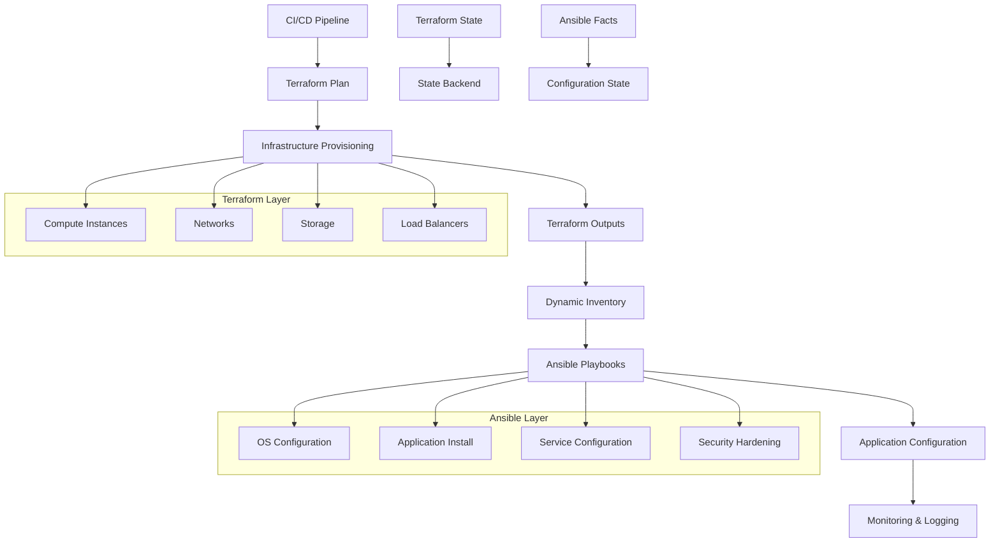

# 🔗 Módulo 09: Integración Terraform-Ansible 

[](https://www.terraform.io/)
[](https://www.ansible.com/)
[](https://aws.amazon.com/)

## 🎯 Objetivos de Aprendizaje

Al completar este módulo, podrás:

- [x] Integrar Terraform y Ansible en flujos de trabajo cohesivos
- [x] Usar provisioners de Terraform con Ansible
- [x] Implementar patrones de infraestructura inmutable y mutable
- [x] Configurar dynamic inventories con outputs de Terraform
- [x] Automatizar el aprovisionamiento y configuración en pipeline único
- [x] Implementar mejores prácticas de IaC híbrido
- [x] Gestionar el estado y la configuración de forma coordinada
- [x] Crear workflows de CI/CD con ambas herramientas

## 📋 Prerrequisitos

- [x] Conocimiento sólido de Terraform (Módulos 01-06)
- [x] Experiencia con Ansible (Módulos 07-08)
- [x] Comprensión de infraestructura como código
- [x] Conocimientos básicos de CI/CD

## 🏗️ Arquitectura de Integración



## 🔄 Patrones de Integración

### 1. Patrón Secuencial (Terraform → Ansible)

```hcl
# terraform/main.tf
terraform {
  required_providers {
    aws = {
      source  = "hashicorp/aws"
      version = "~> 5.0"
    }
  }
}

# Crear infraestructura
resource "aws_instance" "web_servers" {
  count           = var.web_server_count
  ami             = var.ami_id
  instance_type   = var.instance_type
  key_name        = aws_key_pair.deployer.key_name
  vpc_security_group_ids = [aws_security_group.web.id]
  subnet_id       = aws_subnet.public[count.index % length(aws_subnet.public)].id
  
  tags = {
    Name        = "web-server-${count.index + 1}"
    Environment = var.environment
    Role        = "webserver"
    AnsibleGroup = "webservers"
  }

  # Provisioner para ejecutar Ansible después de la creación
  provisioner "local-exec" {
    command = <<-EOT
      sleep 60  # Esperar que la instancia esté lista
      ansible-playbook -i inventory/aws_ec2.yml \
        --limit "tag_Role_webserver" \
        playbooks/configure-webserver.yml \
        --extra-vars "target_environment=${var.environment}"
    EOT
  }

  # Provisioner para configuración inicial
  provisioner "remote-exec" {
    inline = [
      "sudo apt-get update",
      "sudo apt-get install -y python3 python3-pip",
      "sudo useradd -m -s /bin/bash ansible",
      "echo 'ansible ALL=(ALL) NOPASSWD:ALL' | sudo tee /etc/sudoers.d/ansible"
    ]

    connection {
      type        = "ssh"
      user        = "ubuntu"
      private_key = file(var.private_key_path)
      host        = self.public_ip
    }
  }
}

# Outputs para Ansible
output "web_server_ips" {
  description = "Public IP addresses of web servers"
  value = {
    public_ips  = aws_instance.web_servers[*].public_ip
    private_ips = aws_instance.web_servers[*].private_ip
    instance_ids = aws_instance.web_servers[*].id
  }
}

output "load_balancer_dns" {
  description = "DNS name of the load balancer"
  value       = aws_lb.main.dns_name
}

output "database_endpoint" {
  description = "RDS instance endpoint"
  value       = aws_db_instance.main.endpoint
  sensitive   = true
}

# Generar inventario para Ansible
resource "local_file" "ansible_inventory" {
  content = templatefile("${path.module}/templates/inventory.tpl", {
    web_servers = aws_instance.web_servers
    db_endpoint = aws_db_instance.main.endpoint
    environment = var.environment
  })
  filename = "${path.module}/../ansible/inventory/terraform-generated.yml"
}
```

### 2. Template de Inventario Dinámico

```yaml
# templates/inventory.tpl
---
all:
  vars:
    ansible_user: ubuntu
    ansible_ssh_private_key_file: ~/.ssh/aws-key.pem
    environment: ${environment}
    database_host: ${db_endpoint}
    
  children:
    webservers:
      hosts:
%{ for server in web_servers ~}
        ${server.tags.Name}:
          ansible_host: ${server.public_ip}
          private_ip: ${server.private_ip}
          instance_id: ${server.id}
          availability_zone: ${server.availability_zone}
%{ endfor ~}
      vars:
        server_role: webserver
        
    databases:
      hosts:
        rds-main:
          ansible_host: ${db_endpoint}
          ansible_connection: local
      vars:
        server_role: database

production:
  children:
    webservers:
    databases:
```

### 3. Configuración de Ansible con Dynamic Inventory

```yaml
# ansible/inventory/aws_ec2.yml
---
plugin: amazon.aws.aws_ec2
regions:
  - us-west-2
filters:
  tag:Environment: 
    - production
    - staging
  instance-state-name: running

keyed_groups:
  # Agrupar por tags
  - key: tags.Role
    prefix: role
  - key: tags.Environment  
    prefix: env
  - key: placement.availability_zone
    prefix: az

compose:
  # Variables personalizadas
  ansible_host: public_ip_address
  ansible_user: ubuntu
  private_ip: private_ip_address
  instance_name: tags.Name
  server_role: tags.Role | default('undefined')

hostnames:
  - tag:Name
  - dns-name
```

## 🚀 Workflows de Integración

### Workflow 1: Provisioning Completo

```bash
#!/bin/bash
# scripts/deploy-infrastructure.sh

set -e

ENVIRONMENT=${1:-staging}
TERRAFORM_DIR="terraform"
ANSIBLE_DIR="ansible"

echo "🚀 Iniciando despliegue de infraestructura para: $ENVIRONMENT"

# 1. Terraform: Aprovisionar infraestructura
cd $TERRAFORM_DIR
echo "📦 Inicializando Terraform..."
terraform init

echo "📋 Planificando cambios..."
terraform plan -var="environment=$ENVIRONMENT" -out=tfplan

echo "🏗️ Aplicando infraestructura..."
terraform apply tfplan

# Obtener outputs de Terraform
WEB_IPS=$(terraform output -json web_server_ips | jq -r '.public_ips[]')
LB_DNS=$(terraform output -raw load_balancer_dns)

echo "✅ Infraestructura creada exitosamente"
echo "   Servidores Web: $WEB_IPS"
echo "   Load Balancer: $LB_DNS"

# 2. Esperar que las instancias estén listas
echo "⏳ Esperando que las instancias estén listas..."
sleep 90

# 3. Ansible: Configurar aplicaciones
cd ../$ANSIBLE_DIR
echo "🔧 Configurando servidores con Ansible..."

# Verificar conectividad
ansible all -i inventory/aws_ec2.yml -m ping --limit "tag_Environment_$ENVIRONMENT"

# Ejecutar playbooks
ansible-playbook -i inventory/aws_ec2.yml \
  playbooks/site.yml \
  --limit "tag_Environment_$ENVIRONMENT" \
  --extra-vars "target_environment=$ENVIRONMENT load_balancer_dns=$LB_DNS"

echo "🎉 Despliegue completado exitosamente!"
```

### Workflow 2: Actualización Rolling

```yaml
# ansible/playbooks/rolling-update.yml
---
- name: Rolling update de aplicación web
  hosts: tag_Role_webserver
  serial: 1  # Actualizar un servidor a la vez
  max_fail_percentage: 0
  
  vars:
    app_version: "{{ app_version | default('latest') }}"
    health_check_url: "http://{{ ansible_host }}:8080/health"
    
  pre_tasks:
    - name: Verificar estado actual del servidor
      uri:
        url: "{{ health_check_url }}"
        method: GET
        status_code: 200
      delegate_to: localhost
      register: health_check
      
    - name: Registrar servidor como no disponible en load balancer
      uri:
        url: "http://{{ load_balancer_dns }}/admin/server/{{ inventory_hostname }}/disable"
        method: POST
      delegate_to: localhost
      when: health_check is succeeded

  tasks:
    - name: Parar aplicación
      systemd:
        name: webapp
        state: stopped
        
    - name: Actualizar aplicación
      get_url:
        url: "https://releases.company.com/webapp/{{ app_version }}/webapp.jar"
        dest: /opt/webapp/webapp.jar
        backup: yes
        owner: webapp
        group: webapp
        mode: '0644'
      notify: restart webapp
      
    - name: Actualizar configuración
      template:
        src: webapp.conf.j2
        dest: /etc/webapp/webapp.conf
        backup: yes
      notify: restart webapp
      
  post_tasks:
    - name: Iniciar aplicación
      systemd:
        name: webapp
        state: started
        enabled: yes
        
    - name: Esperar que la aplicación esté lista
      wait_for:
        port: 8080
        host: "{{ ansible_host }}"
        delay: 10
        timeout: 300
        
    - name: Verificar salud de la aplicación
      uri:
        url: "{{ health_check_url }}"
        method: GET
        status_code: 200
      delegate_to: localhost
      retries: 10
      delay: 15
      
    - name: Registrar servidor como disponible en load balancer
      uri:
        url: "http://{{ load_balancer_dns }}/admin/server/{{ inventory_hostname }}/enable"
        method: POST
      delegate_to: localhost

  handlers:
    - name: restart webapp
      systemd:
        name: webapp
        state: restarted
        daemon_reload: yes
```

## 🔄 Provisioners de Terraform con Ansible

### Provisioner Local-Exec

```hcl
# terraform/provisioners.tf
resource "aws_instance" "app_server" {
  count         = var.instance_count
  ami           = var.ami_id
  instance_type = var.instance_type
  key_name      = aws_key_pair.deployer.key_name
  
  vpc_security_group_ids = [aws_security_group.app.id]
  subnet_id              = aws_subnet.private[count.index % length(aws_subnet.private)].id
  
  tags = {
    Name         = "app-server-${count.index + 1}"
    Environment  = var.environment
    Role         = "application"
    AnsibleGroup = "appservers"
  }
  
  # Provisioner para configuración inicial con Ansible
  provisioner "local-exec" {
    command = <<-EOT
      # Esperar que la instancia esté accesible
      until nc -z ${self.private_ip} 22; do
        echo "Esperando SSH en ${self.private_ip}..."
        sleep 10
      done
      
      # Ejecutar playbook específico para esta instancia
      ansible-playbook \
        -i "${self.private_ip}," \
        -e "target_host=${self.private_ip}" \
        -e "instance_id=${self.id}" \
        -e "environment=${var.environment}" \
        ../ansible/playbooks/initial-setup.yml
    EOT
    
    working_dir = path.module
    
    environment = {
      ANSIBLE_HOST_KEY_CHECKING = "False"
      ANSIBLE_SSH_PRIVATE_KEY   = var.private_key_path
    }
  }
  
  # Provisioner para configuración avanzada
  provisioner "local-exec" {
    when = create
    command = <<-EOT
      ansible-playbook \
        -i ../ansible/inventory/terraform-generated.yml \
        --limit "${self.tags.Name}" \
        ../ansible/playbooks/application-setup.yml \
        --extra-vars '{
          "instance_id": "${self.id}",
          "private_ip": "${self.private_ip}",
          "environment": "${var.environment}",
          "app_version": "${var.app_version}"
        }'
    EOT
  }
  
  # Cleanup al destruir
  provisioner "local-exec" {
    when = destroy
    command = <<-EOT
      ansible-playbook \
        -i ../ansible/inventory/terraform-generated.yml \
        --limit "${self.tags.Name}" \
        ../ansible/playbooks/cleanup.yml \
        --extra-vars '{"instance_id": "${self.id}"}'
    EOT
    
    on_failure = continue
  }
}
```

### Provisioner Remote-Exec Combinado

```hcl
resource "aws_instance" "web_server" {
  ami           = var.ami_id
  instance_type = var.instance_type
  key_name      = aws_key_pair.deployer.key_name
  
  vpc_security_group_ids = [aws_security_group.web.id]
  subnet_id              = aws_subnet.public[0].id
  
  # Preparación del sistema para Ansible
  provisioner "remote-exec" {
    inline = [
      "sudo apt-get update",
      "sudo apt-get install -y python3 python3-pip python3-apt",
      "sudo pip3 install boto3 botocore",
      "curl -fsSL https://get.docker.com -o get-docker.sh",
      "sudo sh get-docker.sh",
      "sudo usermod -aG docker ubuntu",
      "sudo systemctl enable docker",
      "sudo systemctl start docker"
    ]
    
    connection {
      type        = "ssh"
      user        = "ubuntu"
      private_key = file(var.private_key_path)
      host        = self.public_ip
      timeout     = "5m"
    }
  }
  
  # Ejecutar Ansible después de la preparación
  provisioner "local-exec" {
    command = <<-EOT
      sleep 30  # Permitir que los servicios se inicien
      ansible-playbook \
        -i "${self.public_ip}," \
        -u ubuntu \
        --private-key ${var.private_key_path} \
        ../ansible/playbooks/docker-setup.yml \
        --extra-vars '{
          "target_host": "${self.public_ip}",
          "docker_compose_version": "2.21.0",
          "app_environment": "${var.environment}"
        }'
    EOT
  }
}
```

## 🏭 Integración con Terraform Cloud/Enterprise

### Configuración de Workspace

```hcl
# terraform/terraform-cloud.tf
terraform {
  cloud {
    organization = "my-company"
    
    workspaces {
      name = "infrastructure-${var.environment}"
    }
  }
}

# Variables de entorno para Ansible
variable "ansible_vault_password" {
  description = "Password for Ansible Vault"
  type        = string
  sensitive   = true
}

# Output para trigger de Ansible
output "ansible_trigger" {
  value = {
    timestamp    = timestamp()
    environment  = var.environment
    infrastructure_ready = true
    web_servers  = aws_instance.web_servers[*].public_ip
    database_endpoint = aws_db_instance.main.endpoint
  }
}

# Null resource para trigger de Ansible
resource "null_resource" "ansible_provisioning" {
  depends_on = [
    aws_instance.web_servers,
    aws_db_instance.main,
    aws_lb.main
  ]
  
  triggers = {
    web_server_ids = join(",", aws_instance.web_servers[*].id)
    always_run     = timestamp()
  }
  
  provisioner "local-exec" {
    command = <<-EOT
      export ANSIBLE_HOST_KEY_CHECKING=False
      export ANSIBLE_VAULT_PASSWORD_FILE=<(echo "${var.ansible_vault_password}")
      
      cd ../ansible
      ansible-playbook \
        -i inventory/terraform-generated.yml \
        --vault-password-file <(echo "${var.ansible_vault_password}") \
        playbooks/full-deployment.yml \
        --extra-vars '{
          "environment": "${var.environment}",
          "deployment_id": "${self.triggers.always_run}",
          "web_servers": ${jsonencode(aws_instance.web_servers[*].public_ip)},
          "database_endpoint": "${aws_db_instance.main.endpoint}"
        }'
    EOT
    
    interpreter = ["/bin/bash", "-c"]
  }
}
```

## 🔐 Gestión de Secretos Integrada

### Usando AWS Systems Manager Parameter Store

```hcl
# terraform/secrets.tf
resource "aws_ssm_parameter" "db_password" {
  name  = "/${var.environment}/database/password"
  type  = "SecureString"
  value = var.db_password
  
  tags = {
    Environment = var.environment
    ManagedBy   = "terraform"
  }
}

resource "aws_ssm_parameter" "app_secret_key" {
  name  = "/${var.environment}/application/secret_key"
  type  = "SecureString"
  value = random_password.app_secret.result
  
  tags = {
    Environment = var.environment
    ManagedBy   = "terraform"
  }
}

# Output para Ansible
output "parameter_store_paths" {
  value = {
    db_password    = aws_ssm_parameter.db_password.name
    app_secret_key = aws_ssm_parameter.app_secret_key.name
  }
}
```

```yaml
# ansible/playbooks/configure-app.yml
---
- name: Configurar aplicación con secretos de AWS
  hosts: appservers
  become: yes
  
  tasks:
    - name: Obtener secretos de Parameter Store
      aws_ssm_parameter_store:
        name: "{{ item.name }}"
        decrypt: yes
      register: secrets
      loop:
        - { name: "/{{ environment }}/database/password", var: "db_password" }
        - { name: "/{{ environment }}/application/secret_key", var: "app_secret" }
      no_log: true
      
    - name: Crear archivo de configuración con secretos
      template:
        src: app-config.j2
        dest: /etc/myapp/config.yml
        owner: myapp
        group: myapp
        mode: '0600'
      vars:
        database_password: "{{ secrets.results[0].parameter_value }}"
        application_secret: "{{ secrets.results[1].parameter_value }}"
      notify: restart application
```

## 🏗️ Patrones de Infraestructura

### Patrón Blue-Green con Terraform y Ansible

```hcl
# terraform/blue-green.tf
variable "active_environment" {
  description = "Currently active environment (blue or green)"
  type        = string
  default     = "blue"
}

locals {
  environments = {
    blue = {
      name = "blue"
      weight = var.active_environment == "blue" ? 100 : 0
    }
    green = {
      name = "green"  
      weight = var.active_environment == "green" ? 100 : 0
    }
  }
}

# Crear instancias para ambos environments
resource "aws_instance" "app_servers" {
  for_each = local.environments
  
  count         = 2
  ami           = var.ami_id
  instance_type = var.instance_type
  key_name      = aws_key_pair.deployer.key_name
  
  vpc_security_group_ids = [aws_security_group.app.id]
  subnet_id              = aws_subnet.private[count.index].id
  
  tags = {
    Name        = "${each.key}-app-${count.index + 1}"
    Environment = each.key
    Role        = "application"
    Active      = var.active_environment == each.key ? "true" : "false"
  }
}

# Load Balancer con target groups
resource "aws_lb_target_group" "app" {
  for_each = local.environments
  
  name     = "${each.key}-app-tg"
  port     = 8080
  protocol = "HTTP"
  vpc_id   = aws_vpc.main.id
  
  health_check {
    enabled             = true
    healthy_threshold   = 2
    unhealthy_threshold = 2
    timeout             = 5
    interval            = 30
    path                = "/health"
    matcher             = "200"
  }
}

# Listener rule para dirigir tráfico
resource "aws_lb_listener_rule" "app" {
  for_each = local.environments
  
  listener_arn = aws_lb_listener.app.arn
  priority     = each.key == "blue" ? 100 : 200
  
  action {
    type             = "forward"
    target_group_arn = aws_lb_target_group.app[each.key].arn
  }
  
  condition {
    path_pattern {
      values = ["/*"]
    }
  }
  
  # Solo activar la regla para el environment activo
  lifecycle {
    create_before_destroy = true
  }
}
```

```yaml
# ansible/playbooks/blue-green-deploy.yml
---
- name: Blue-Green Deployment
  hosts: localhost
  connection: local
  vars:
    current_environment: "{{ ansible_environment | default('blue') }}"
    target_environment: "{{ 'green' if current_environment == 'blue' else 'blue' }}"
    
  tasks:
    - name: Obtener estado actual de Terraform
      command: terraform output -json
      register: tf_output
      changed_when: false
      
    - name: Parsear outputs de Terraform
      set_fact:
        current_servers: "{{ (tf_output.stdout | from_json).app_servers.value[current_environment] }}"
        target_servers: "{{ (tf_output.stdout | from_json).app_servers.value[target_environment] }}"
        
    - name: Desplegar aplicación en environment inactivo
      include_tasks: deploy-application.yml
      vars:
        target_hosts: "{{ target_servers }}"
        deployment_environment: "{{ target_environment }}"
        
    - name: Ejecutar smoke tests
      include_tasks: smoke-tests.yml
      vars:
        test_hosts: "{{ target_servers }}"
        
    - name: Cambiar tráfico al nuevo environment
      command: >
        terraform apply 
        -var="active_environment={{ target_environment }}"
        -auto-approve
      when: smoke_tests_passed | default(false)
      
    - name: Verificar salud después del switch
      include_tasks: health-check.yml
      vars:
        check_hosts: "{{ target_servers }}"
        
    - name: Limpiar environment anterior si todo está bien
      include_tasks: cleanup-old-environment.yml
      vars:
        cleanup_hosts: "{{ current_servers }}"
      when: health_check_passed | default(false)
```

## 🔄 CI/CD Pipeline Integrado

### Pipeline con GitHub Actions

```yaml
# .github/workflows/infrastructure-deploy.yml
name: Infrastructure Deployment

on:
  push:
    branches: [main]
    paths:
      - 'terraform/**'
      - 'ansible/**'
  workflow_dispatch:
    inputs:
      environment:
        description: 'Target environment'
        required: true
        default: 'staging'
        type: choice
        options:
          - staging
          - production

env:
  TF_VERSION: 1.6.0
  ANSIBLE_VERSION: 8.0.0

jobs:
  terraform:
    name: Terraform
    runs-on: ubuntu-latest
    outputs:
      web_servers: ${{ steps.output.outputs.web_servers }}
      database_endpoint: ${{ steps.output.outputs.database_endpoint }}
      
    steps:
      - name: Checkout
        uses: actions/checkout@v4
        
      - name: Setup Terraform
        uses: hashicorp/setup-terraform@v3
        with:
          terraform_version: ${{ env.TF_VERSION }}
          terraform_wrapper: false
          
      - name: Configure AWS credentials
        uses: aws-actions/configure-aws-credentials@v4
        with:
          aws-access-key-id: ${{ secrets.AWS_ACCESS_KEY_ID }}
          aws-secret-access-key: ${{ secrets.AWS_SECRET_ACCESS_KEY }}
          aws-region: us-west-2
          
      - name: Terraform Init
        working-directory: terraform
        run: terraform init
        
      - name: Terraform Validate
        working-directory: terraform
        run: terraform validate
        
      - name: Terraform Plan
        working-directory: terraform
        run: |
          terraform plan \
            -var="environment=${{ github.event.inputs.environment || 'staging' }}" \
            -out=tfplan
            
      - name: Terraform Apply
        working-directory: terraform
        run: terraform apply tfplan
        
      - name: Get Terraform Outputs
        id: output
        working-directory: terraform
        run: |
          echo "web_servers=$(terraform output -json web_server_ips)" >> $GITHUB_OUTPUT
          echo "database_endpoint=$(terraform output -raw database_endpoint)" >> $GITHUB_OUTPUT
          
      - name: Generate Ansible Inventory
        working-directory: terraform
        run: |
          terraform output -json web_server_ips | \
          jq -r '.public_ips[]' > ../ansible/inventory/terraform-hosts.txt

  ansible:
    name: Ansible Configuration
    runs-on: ubuntu-latest
    needs: terraform
    
    steps:
      - name: Checkout
        uses: actions/checkout@v4
        
      - name: Setup Python
        uses: actions/setup-python@v4
        with:
          python-version: '3.11'
          
      - name: Install Ansible
        run: |
          pip install ansible==${{ env.ANSIBLE_VERSION }}
          pip install boto3 botocore
          ansible-galaxy collection install amazon.aws
          ansible-galaxy collection install community.general
          
      - name: Configure AWS credentials
        uses: aws-actions/configure-aws-credentials@v4
        with:
          aws-access-key-id: ${{ secrets.AWS_ACCESS_KEY_ID }}
          aws-secret-access-key: ${{ secrets.AWS_SECRET_ACCESS_KEY }}
          aws-region: us-west-2
          
      - name: Wait for instances to be ready
        run: sleep 120
        
      - name: Test connectivity
        working-directory: ansible
        run: |
          ansible all -i inventory/aws_ec2.yml -m ping \
            --limit "tag_Environment_${{ github.event.inputs.environment || 'staging' }}"
            
      - name: Run Ansible Playbooks
        working-directory: ansible
        env:
          ANSIBLE_HOST_KEY_CHECKING: False
        run: |
          ansible-playbook -i inventory/aws_ec2.yml \
            playbooks/site.yml \
            --limit "tag_Environment_${{ github.event.inputs.environment || 'staging' }}" \
            --extra-vars '{
              "target_environment": "${{ github.event.inputs.environment || 'staging' }}",
              "database_endpoint": "${{ needs.terraform.outputs.database_endpoint }}",
              "deployment_id": "${{ github.run_id }}"
            }'
            
      - name: Run Application Tests
        working-directory: ansible
        run: |
          ansible-playbook -i inventory/aws_ec2.yml \
            playbooks/test-deployment.yml \
            --limit "tag_Environment_${{ github.event.inputs.environment || 'staging' }}"
            
  notification:
    name: Notify Deployment
    runs-on: ubuntu-latest
    needs: [terraform, ansible]
    if: always()
    
    steps:
      - name: Notify Success
        if: needs.terraform.result == 'success' && needs.ansible.result == 'success'
        run: |
          echo "✅ Deployment successful!"
          # Agregar notificación a Slack/Teams/etc.
          
      - name: Notify Failure
        if: needs.terraform.result == 'failure' || needs.ansible.result == 'failure'
        run: |
          echo "❌ Deployment failed!"
          # Agregar notificación de error
```

## 🧪 Testing de la Integración

### Tests de Infraestructura

```yaml
# ansible/playbooks/test-infrastructure.yml
---
- name: Test de infraestructura integrada
  hosts: localhost
  connection: local
  
  tasks:
    - name: Verificar que Terraform outputs están disponibles
      command: terraform output -json
      register: tf_outputs
      changed_when: false
      failed_when: tf_outputs.rc != 0
      
    - name: Validar estructura de outputs
      assert:
        that:
          - tf_outputs.stdout | from_json | json_query('web_server_ips.value.public_ips') | length > 0
          - tf_outputs.stdout | from_json | json_query('database_endpoint.value') | length > 0
        fail_msg: "Outputs de Terraform no tienen la estructura esperada"
        
    - name: Test de conectividad a servidores web
      wait_for:
        host: "{{ item }}"
        port: 22
        timeout: 30
      loop: "{{ (tf_outputs.stdout | from_json).web_server_ips.value.public_ips }}"
      
    - name: Test de conectividad HTTP
      uri:
        url: "http://{{ item }}:80"
        method: GET
        status_code: 200
      loop: "{{ (tf_outputs.stdout | from_json).web_server_ips.value.public_ips }}"
      register: http_tests
      
    - name: Verificar load balancer
      uri:
        url: "http://{{ (tf_outputs.stdout | from_json).load_balancer_dns.value }}"
        method: GET
        status_code: 200
      register: lb_test
      
    - name: Generar reporte de tests
      template:
        src: test-report.j2
        dest: "/tmp/infrastructure-test-report-{{ ansible_date_time.epoch }}.html"
      vars:
        test_results:
          terraform_outputs: "{{ tf_outputs.stdout | from_json }}"
          http_tests: "{{ http_tests }}"
          lb_test: "{{ lb_test }}"
```

### Tests de Configuración

```yaml
# ansible/playbooks/test-configuration.yml
---
- name: Test de configuración de servidores
  hosts: tag_Role_webserver
  
  tasks:
    - name: Verificar servicios críticos
      service_facts:
      
    - name: Validar que nginx está ejecutándose
      assert:
        that:
          - "'nginx' in services"
          - services['nginx']['state'] == 'running'
        fail_msg: "Nginx no está ejecutándose correctamente"
        
    - name: Verificar configuración de nginx
      command: nginx -t
      register: nginx_config_test
      failed_when: nginx_config_test.rc != 0
      
    - name: Test de endpoints de aplicación
      uri:
        url: "http://localhost:8080{{ item }}"
        method: GET
      loop:
        - /health
        - /metrics
        - /ready  
      register: endpoint_tests
      
    - name: Verificar logs de aplicación
      find:
        paths: /var/log/myapp
        patterns: "*.log"
        age: -1d
      register: log_files
      
    - name: Validar que hay logs recientes
      assert:
        that:
          - log_files.files | length > 0
        fail_msg: "No se encontraron logs recientes de la aplicación"
        
    - name: Test de conectividad a base de datos
      postgresql_ping:
        db: "{{ app_database_name }}"
        login_host: "{{ database_endpoint }}"
        login_user: "{{ app_database_user }}"
        login_password: "{{ app_database_password }}"
      register: db_connectivity
      
    - name: Generar reporte de configuración
      template:
        src: config-test-report.j2
        dest: "/tmp/config-test-{{ inventory_hostname }}-{{ ansible_date_time.epoch }}.json"
      vars:
        test_results:
          services: "{{ services }}"
          nginx_config: "{{ nginx_config_test }}"
          endpoints: "{{ endpoint_tests }}"
          database: "{{ db_connectivity }}"
```

## 🎓 Mejores Prácticas

### 1. Separación de Responsabilidades

```yaml
# Terraform: Infraestructura inmutable
- Instancias EC2
- Redes y subnets  
- Load balancers
- Bases de datos RDS
- Políticas IAM

# Ansible: Configuración mutable
- Instalación de paquetes
- Configuración de servicios
- Despliegue de aplicaciones
- Actualizaciones de configuración
- Mantenimiento del sistema
```

### 2. Gestión de Estado

```hcl
# terraform/backend.tf
terraform {
  backend "s3" {
    bucket         = "company-terraform-state"
    key            = "infrastructure/${var.environment}/terraform.tfstate"
    region         = "us-west-2"
    encrypt        = true
    dynamodb_table = "terraform-locks"
  }
}

# Compartir estado con Ansible
output "terraform_state_info" {
  value = {
    backend_bucket = "company-terraform-state"
    state_key      = "infrastructure/${var.environment}/terraform.tfstate"
    region         = "us-west-2"
  }
  sensitive = false
}
```

### 3. Versionado y Rollback

```bash
#!/bin/bash
# scripts/rollback.sh

ENVIRONMENT=$1
PREVIOUS_VERSION=$2

echo "🔄 Iniciando rollback para $ENVIRONMENT a versión $PREVIOUS_VERSION"

# 1. Rollback de Terraform
cd terraform
git checkout $PREVIOUS_VERSION -- .
terraform plan -var="environment=$ENVIRONMENT"
terraform apply -auto-approve

# 2. Rollback de configuración con Ansible
cd ../ansible
ansible-playbook -i inventory/aws_ec2.yml \
  playbooks/rollback.yml \
  --limit "tag_Environment_$ENVIRONMENT" \
  --extra-vars "rollback_version=$PREVIOUS_VERSION"

echo "✅ Rollback completado"
```

## 🎯 Conclusiones

La integración de Terraform y Ansible proporciona:

- [x] **Cobertura completa**: Infraestructura + Configuración
- [x] **Flexibilidad**: Patrones para diferentes escenarios
- [x] **Escalabilidad**: Workflows para equipos grandes
- [x] **Confiabilidad**: Testing y rollback automatizados
- [x] **Eficiencia**: Reutilización y automatización

### Próximos Pasos

1. **Módulo 10**: Seguridad y Mejores Prácticas
2. **Práctica**: Implementar pipeline integrado
3. **Explorar**: GitOps con ArgoCD/Flux
4. **Certificación**: HashiCorp Terraform Associate + Red Hat Ansible

---

**📚 Recursos Adicionales:**

- [Terraform Provisioners](https://www.terraform.io/docs/provisioners/)
- [Ansible Dynamic Inventory](https://docs.ansible.com/ansible/latest/user_guide/intro_dynamic_inventory.html)
- [AWS Systems Manager Integration](https://aws.amazon.com/systems-manager/)
- [GitOps Workflows](https://www.gitops.tech/)

---

*💡 **Tip del día**: La clave de una integración exitosa es definir claramente las responsabilidades: Terraform para infraestructura inmutable, Ansible para configuración mutable. Mantén los workflows simples y predecibles.*