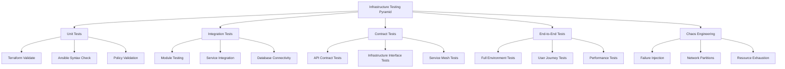
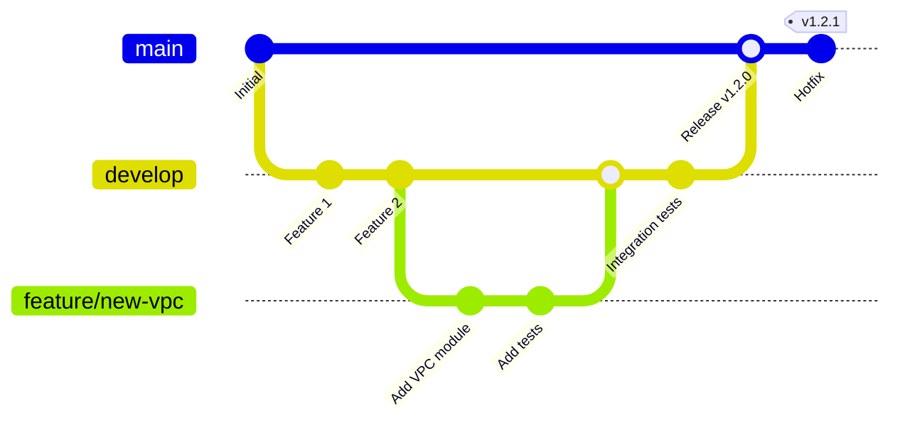

# 🧪 Módulo 11: Testing y CI/CD para Infrastructure as Code

[](https://testinglibrary.com/)
[](https://github.com/features/actions)
[](https://www.gitops.tech/)
[](https://www.sonarqube.org/)

## 🎯 Objetivos de Aprendizaje

Al completar este módulo, podrás:

- [x] Implementar testing automatizado para infraestructura
- [x] Crear pipelines de CI/CD para Terraform y Ansible
- [x] Aplicar metodologías GitOps para despliegues
- [x] Configurar gates de calidad y seguridad
- [x] Implementar testing de infraestructura a múltiples niveles
- [x] Crear estrategias de rollback y blue-green deployments
- [x] Configurar monitoreo y observabilidad de pipelines
- [x] Aplicar mejores prácticas de DevOps para IaC

## 📋 Prerrequisitos

- [x] Dominio completo de Terraform y Ansible
- [x] Conocimientos de Git y GitHub/GitLab
- [x] Comprensión de conceptos de CI/CD
- [x] Experiencia con contenedores y Kubernetes

## 🏗️ Pirámide de Testing para IaC



## 🔧 Testing de Terraform

### Unit Tests con Terratest

```go
// tests/terraform_unit_test.go
package tests

import (
    "testing"
    "github.com/gruntwork-io/terratest/modules/terraform"
    "github.com/gruntwork-io/terratest/modules/test-structure"
    "github.com/stretchr/testify/assert"
)

func TestTerraformVPCModule(t *testing.T) {
    t.Parallel()
    
    // Configurar directorio de trabajo temporal
    workingDir := test_structure.CopyTerraformFolderToTemp(t, "../", "modules/vpc")
    
    // Configurar opciones de Terraform
    terraformOptions := &terraform.Options{
        TerraformDir: workingDir,
        Vars: map[string]interface{}{
            "vpc_cidr":           "10.0.0.0/16",
            "availability_zones": []string{"us-west-2a", "us-west-2b"},
            "environment":        "test-" + random.UniqueId(),
        },
        EnvVars: map[string]string{
            "AWS_DEFAULT_REGION": "us-west-2",
        },
    }
    
    // Cleanup al final del test
    defer terraform.Destroy(t, terraformOptions)
    
    // Ejecutar terraform init y apply
    terraform.InitAndApply(t, terraformOptions)
    
    // Validar outputs
    vpcId := terraform.Output(t, terraformOptions, "vpc_id")
    assert.NotEmpty(t, vpcId)
    
    internetGatewayId := terraform.Output(t, terraformOptions, "internet_gateway_id")
    assert.NotEmpty(t, internetGatewayId)
    
    publicSubnetIds := terraform.OutputList(t, terraformOptions, "public_subnet_ids")
    assert.Len(t, publicSubnetIds, 2)
    
    privateSubnetIds := terraform.OutputList(t, terraformOptions, "private_subnet_ids")
    assert.Len(t, privateSubnetIds, 2)
}

func TestTerraformEC2Module(t *testing.T) {
    t.Parallel()
    
    workingDir := test_structure.CopyTerraformFolderToTemp(t, "../", "modules/ec2")
    
    terraformOptions := &terraform.Options{
        TerraformDir: workingDir,
        Vars: map[string]interface{}{
            "instance_type":    "t3.micro",
            "key_name":        "test-key",
            "vpc_id":          "vpc-12345678",
            "subnet_id":       "subnet-12345678",
            "environment":     "test",
        },
    }
    
    defer terraform.Destroy(t, terraformOptions)
    terraform.InitAndApply(t, terraformOptions)
    
    // Validar que la instancia esté ejecutándose
    instanceId := terraform.Output(t, terraformOptions, "instance_id")
    assert.NotEmpty(t, instanceId)
    
    // Validar conectividad
    publicIp := terraform.Output(t, terraformOptions, "public_ip")
    assert.NotEmpty(t, publicIp)
}
```

### Testing con Kitchen-Terraform

```yaml
# .kitchen.yml
---
driver:
  name: terraform
  command_timeout: 1200
  variable_files:
    - testing.tfvars

provisioner:
  name: terraform

verifier:
  name: terraform
  systems:
    - name: default
      backend: aws
      controls:
        - aws-vpc-security-groups
        - aws-ec2-instances
        - connectivity-tests

platforms:
  - name: terraform

suites:
  - name: default
    driver:
      root_module_directory: test/fixtures/wrapper
    verifier:
      systems:
        - name: default
          backend: aws
          profile_locations:
            - test/integration/default/inspec

# test/integration/default/inspec/controls/aws_resources.rb
control 'aws-vpc-security-groups' do
  title 'Verify VPC and Security Groups'
  desc 'Ensure VPC and security groups are properly configured'
  
  describe aws_vpc(vpc_id: attribute('vpc_id')) do
    it { should exist }
    its('cidr_block') { should eq '10.0.0.0/16' }
    its('state') { should eq 'available' }
  end
  
  describe aws_security_group(group_id: attribute('web_security_group_id')) do
    it { should exist }
    it { should allow_in(port: 80, ipv4_range: '0.0.0.0/0') }
    it { should allow_in(port: 443, ipv4_range: '0.0.0.0/0') }
    it { should_not allow_in(port: 22, ipv4_range: '0.0.0.0/0') }
  end
end

control 'aws-ec2-instances' do
  title 'Verify EC2 Instances'
  desc 'Ensure EC2 instances are properly configured'
  
  attribute('instance_ids').each do |instance_id|
    describe aws_ec2_instance(instance_id: instance_id) do
      it { should exist }
      its('state') { should eq 'running' }
      its('instance_type') { should eq 't3.micro' }
      it { should have_security_group(attribute('web_security_group_id')) }
    end
  end
end

control 'connectivity-tests' do
  title 'Test Application Connectivity'
  desc 'Verify applications are accessible'
  
  attribute('public_ips').each do |ip|
    describe port(80, ip) do
      it { should be_reachable }
    end
    
    describe port(443, ip) do
      it { should be_reachable }
    end
    
    describe http("http://#{ip}/health") do
      its('status') { should cmp 200 }
      its('body') { should match /healthy/ }
    end
  end
end
```

## 🎭 Testing de Ansible

### Molecule para Testing de Roles

```yaml
# molecule/default/molecule.yml
---
dependency:
  name: galaxy
  options:
    requirements-file: requirements.yml

driver:
  name: docker

platforms:
  - name: ubuntu-20-04
    image: quay.io/ansible/molecule-ubuntu:20.04
    pre_build_image: true
    privileged: true
    volumes:
      - /sys/fs/cgroup:/sys/fs/cgroup:ro
    command: /lib/systemd/systemd
    
  - name: centos-8
    image: quay.io/ansible/molecule-centos:8
    pre_build_image: true
    privileged: true
    volumes:
      - /sys/fs/cgroup:/sys/fs/cgroup:ro
    command: /lib/systemd/systemd

provisioner:
  name: ansible
  config_options:
    defaults:
      callback_whitelist: profile_tasks,timer
      stdout_callback: yaml
  playbooks:
    converge: converge.yml
    verify: verify.yml
  inventory:
    host_vars:
      ubuntu-20-04:
        ansible_python_interpreter: /usr/bin/python3
      centos-8:
        ansible_python_interpreter: /usr/bin/python3

verifier:
  name: ansible

scenario:
  test_sequence:
    - dependency
    - cleanup
    - destroy
    - syntax
    - create
    - prepare
    - converge
    - idempotence
    - side_effect
    - verify
    - cleanup
    - destroy
```

```yaml
# molecule/default/converge.yml
---
- name: Converge
  hosts: all
  become: true
  
  vars:
    nginx_version: "1.20.*"
    nginx_user: www-data
    nginx_worker_processes: auto
    nginx_sites:
      - name: default
        template: default.conf.j2
        server_name: localhost
        document_root: /var/www/html
        
  roles:
    - role: nginx
      
- name: Configure application
  hosts: all
  become: true
  
  tasks:
    - name: Create test index page
      copy:
        content: |
          <!DOCTYPE html>
          <html>
          <head><title>Test Page</title></head>
          <body><h1>Hello from Molecule Test!</h1></body>
          </html>
        dest: /var/www/html/index.html
        owner: "{{ nginx_user }}"
        group: "{{ nginx_user }}"
        mode: '0644'
```

```yaml
# molecule/default/verify.yml
---
- name: Verify
  hosts: all
  gather_facts: false
  
  tasks:
    - name: Verify nginx is installed
      package_facts:
      
    - name: Assert nginx package is present
      assert:
        that:
          - "'nginx' in ansible_facts.packages"
        fail_msg: "nginx package is not installed"
        
    - name: Verify nginx service is running
      service_facts:
      
    - name: Assert nginx service is active
      assert:
        that:
          - ansible_facts.services['nginx']['state'] == 'running'
          - ansible_facts.services['nginx']['status'] == 'enabled'
        fail_msg: "nginx service is not running or enabled"
        
    - name: Test HTTP response
      uri:
        url: http://localhost
        method: GET
        status_code: 200
      register: http_response
      
    - name: Verify HTTP response content
      assert:
        that:
          - "'Hello from Molecule Test!' in http_response.content"
        fail_msg: "Expected content not found in HTTP response"
        
    - name: Test nginx configuration syntax
      command: nginx -t
      register: nginx_syntax
      
    - name: Assert nginx configuration is valid
      assert:
        that:
          - nginx_syntax.rc == 0
        fail_msg: "nginx configuration syntax is invalid"
        
    - name: Verify log files exist and are readable
      stat:
        path: "{{ item }}"
      register: log_files
      loop:
        - /var/log/nginx/access.log
        - /var/log/nginx/error.log
        
    - name: Assert log files are present
      assert:
        that:
          - item.stat.exists
          - item.stat.readable
        fail_msg: "Log file {{ item.item }} is not accessible"
      loop: "{{ log_files.results }}"
```

### Ansible Lint y Quality Gates

```yaml
# .ansible-lint
---
profile: production

exclude_paths:
  - .cache/
  - .github/
  - molecule/
  - .ansible-lint

use_default_rules: true

rules:
  # Disable specific rules
  line-length: disable
  truthy: disable
  
  # Configure specific rules
  comments-indentation:
    level: error
  empty-string-compare:
    level: error
  no-changed-when:
    level: error
  no-handler:
    level: warning

skip_list:
  - yaml[line-length]
  - name[casing]
  - fqcn[action-core]

warn_list:
  - experimental
  - no-changed-when
  - command-instead-of-module

mock_modules:
  - custom_module

mock_roles:
  - custom.role
```

## 🚀 CI/CD Pipelines

### GitHub Actions para Terraform

```yaml
# .github/workflows/terraform-ci.yml
name: Terraform CI/CD Pipeline

on:
  push:
    branches: [main, develop]
    paths: ['terraform/**']
  pull_request:
    branches: [main]
    paths: ['terraform/**']
  workflow_dispatch:
    inputs:
      environment:
        description: 'Target environment'
        required: true
        default: 'staging'
        type: choice
        options:
          - staging
          - production

env:
  TF_VERSION: 1.6.0
  TF_IN_AUTOMATION: true
  TF_CLI_ARGS: -no-color

jobs:
  validate:
    name: Validate Terraform
    runs-on: ubuntu-latest
    
    steps:
      - name: Checkout
        uses: actions/checkout@v4
        
      - name: Setup Terraform
        uses: hashicorp/setup-terraform@v3
        with:
          terraform_version: ${{ env.TF_VERSION }}
          
      - name: Terraform Format Check
        working-directory: terraform
        run: terraform fmt -check -recursive
        
      - name: Terraform Init
        working-directory: terraform
        run: terraform init -backend=false
        
      - name: Terraform Validate
        working-directory: terraform
        run: terraform validate
        
      - name: Run tfsec Security Scan
        uses: aquasecurity/tfsec-action@v1.0.3
        with:
          working_directory: terraform
          soft_fail: true
          
      - name: Run Checkov Security Scan
        id: checkov
        uses: bridgecrewio/checkov-action@master
        with:
          directory: terraform
          framework: terraform
          soft_fail: true

  test:
    name: Unit Tests
    runs-on: ubuntu-latest
    needs: validate
    
    steps:
      - name: Checkout
        uses: actions/checkout@v4
        
      - name: Setup Go
        uses: actions/setup-go@v4
        with:
          go-version: '1.21'
          
      - name: Install Terratest Dependencies
        working-directory: tests
        run: go mod download
        
      - name: Run Unit Tests
        working-directory: tests
        env:
          AWS_ACCESS_KEY_ID: ${{ secrets.AWS_ACCESS_KEY_ID }}
          AWS_SECRET_ACCESS_KEY: ${{ secrets.AWS_SECRET_ACCESS_KEY }}
          AWS_DEFAULT_REGION: us-west-2
        run: |
          go test -v -timeout 30m -parallel 2 ./...

  plan:
    name: Terraform Plan
    runs-on: ubuntu-latest
    needs: [validate, test]
    if: github.event_name == 'pull_request'
    
    strategy:
      matrix:
        environment: [staging]
        
    steps:
      - name: Checkout
        uses: actions/checkout@v4
        
      - name: Setup Terraform
        uses: hashicorp/setup-terraform@v3
        with:
          terraform_version: ${{ env.TF_VERSION }}
          
      - name: Configure AWS credentials
        uses: aws-actions/configure-aws-credentials@v4
        with:
          aws-access-key-id: ${{ secrets.AWS_ACCESS_KEY_ID }}
          aws-secret-access-key: ${{ secrets.AWS_SECRET_ACCESS_KEY }}
          aws-region: us-west-2
          
      - name: Terraform Init
        working-directory: terraform
        run: |
          terraform init \
            -backend-config="bucket=${{ secrets.TF_STATE_BUCKET }}" \
            -backend-config="key=${{ matrix.environment }}/terraform.tfstate" \
            -backend-config="region=us-west-2"
            
      - name: Terraform Plan
        working-directory: terraform
        run: |
          terraform plan \
            -var-file="environments/${{ matrix.environment }}.tfvars" \
            -out=${{ matrix.environment }}.tfplan
            
      - name: Upload Plan Artifact
        uses: actions/upload-artifact@v3
        with:
          name: ${{ matrix.environment }}-tfplan
          path: terraform/${{ matrix.environment }}.tfplan
          retention-days: 5

  deploy:
    name: Deploy Infrastructure
    runs-on: ubuntu-latest
    needs: [validate, test]
    if: github.ref == 'refs/heads/main' || github.event_name == 'workflow_dispatch'
    
    environment: 
      name: ${{ github.event.inputs.environment || 'staging' }}
      
    steps:
      - name: Checkout
        uses: actions/checkout@v4
        
      - name: Setup Terraform
        uses: hashicorp/setup-terraform@v3
        with:
          terraform_version: ${{ env.TF_VERSION }}
          terraform_wrapper: false
          
      - name: Configure AWS credentials
        uses: aws-actions/configure-aws-credentials@v4
        with:
          aws-access-key-id: ${{ secrets.AWS_ACCESS_KEY_ID }}
          aws-secret-access-key: ${{ secrets.AWS_SECRET_ACCESS_KEY }}
          aws-region: us-west-2
          
      - name: Terraform Init
        working-directory: terraform
        run: |
          terraform init \
            -backend-config="bucket=${{ secrets.TF_STATE_BUCKET }}" \
            -backend-config="key=${{ github.event.inputs.environment || 'staging' }}/terraform.tfstate" \
            -backend-config="region=us-west-2"
            
      - name: Terraform Apply
        working-directory: terraform
        run: |
          terraform apply \
            -var-file="environments/${{ github.event.inputs.environment || 'staging' }}.tfvars" \
            -auto-approve
            
      - name: Generate Inventory for Ansible
        working-directory: terraform
        run: |
          terraform output -json > ../outputs.json
          
      - name: Upload Terraform Outputs
        uses: actions/upload-artifact@v3
        with:
          name: terraform-outputs
          path: outputs.json

  post-deploy-tests:
    name: Post-Deploy Integration Tests
    runs-on: ubuntu-latest
    needs: deploy
    
    steps:
      - name: Checkout
        uses: actions/checkout@v4
        
      - name: Download Terraform Outputs
        uses: actions/download-artifact@v3
        with:
          name: terraform-outputs
          
      - name: Setup Python
        uses: actions/setup-python@v4
        with:
          python-version: '3.11'
          
      - name: Install Test Dependencies
        run: |
          pip install pytest requests boto3
          
      - name: Run Integration Tests
        env:
          AWS_ACCESS_KEY_ID: ${{ secrets.AWS_ACCESS_KEY_ID }}
          AWS_SECRET_ACCESS_KEY: ${{ secrets.AWS_SECRET_ACCESS_KEY }}
        run: |
          python -m pytest tests/integration/ -v
```

### GitHub Actions para Ansible

```yaml
# .github/workflows/ansible-ci.yml
name: Ansible CI/CD Pipeline

on:
  push:
    branches: [main, develop]
    paths: ['ansible/**']
  pull_request:
    branches: [main]
    paths: ['ansible/**']

env:
  ANSIBLE_VERSION: 8.0.0

jobs:
  lint:
    name: Ansible Lint
    runs-on: ubuntu-latest
    
    steps:
      - name: Checkout
        uses: actions/checkout@v4
        
      - name: Setup Python
        uses: actions/setup-python@v4
        with:
          python-version: '3.11'
          
      - name: Install Ansible and Lint
        run: |
          pip install ansible==${{ env.ANSIBLE_VERSION }} ansible-lint
          ansible-galaxy collection install community.general
          
      - name: Run Ansible Lint
        working-directory: ansible
        run: ansible-lint playbooks/ roles/
        
      - name: Syntax Check
        working-directory: ansible
        run: |
          for playbook in playbooks/*.yml; do
            ansible-playbook --syntax-check "$playbook"
          done

  molecule:
    name: Molecule Tests
    runs-on: ubuntu-latest
    needs: lint
    
    strategy:
      matrix:
        role: [nginx, postgresql, monitoring]
        
    steps:
      - name: Checkout
        uses: actions/checkout@v4
        
      - name: Setup Python
        uses: actions/setup-python@v4
        with:
          python-version: '3.11'
          
      - name: Install Dependencies
        run: |
          pip install molecule[docker] ansible==${{ env.ANSIBLE_VERSION }}
          
      - name: Run Molecule Tests
        working-directory: ansible/roles/${{ matrix.role }}
        run: molecule test
        
  integration:
    name: Integration Tests
    runs-on: ubuntu-latest
    needs: [lint, molecule]
    if: github.ref == 'refs/heads/main'
    
    steps:
      - name: Checkout
        uses: actions/checkout@v4
        
      - name: Setup Python
        uses: actions/setup-python@v4
        with:
          python-version: '3.11'
          
      - name: Install Ansible
        run: |
          pip install ansible==${{ env.ANSIBLE_VERSION }} boto3
          ansible-galaxy collection install amazon.aws
          
      - name: Configure AWS credentials
        uses: aws-actions/configure-aws-credentials@v4
        with:
          aws-access-key-id: ${{ secrets.AWS_ACCESS_KEY_ID }}
          aws-secret-access-key: ${{ secrets.AWS_SECRET_ACCESS_KEY }}
          aws-region: us-west-2
          
      - name: Run Integration Playbook
        working-directory: ansible
        run: |
          ansible-playbook -i inventory/aws_ec2.yml \
            playbooks/integration-test.yml \
            --limit "tag_Environment_staging"
```

## 🔄 GitOps con ArgoCD

### Configuración de ArgoCD para IaC

```yaml
# argocd/applications/infrastructure.yaml
apiVersion: argoproj.io/v1alpha1
kind: Application
metadata:
  name: infrastructure-staging
  namespace: argocd
  labels:
    app.kubernetes.io/name: infrastructure
    app.kubernetes.io/environment: staging
spec:
  project: infrastructure
  
  source:
    repoURL: https://github.com/company/infrastructure-as-code
    targetRevision: main
    path: k8s-manifests/staging
    
  destination:
    server: https://kubernetes.default.svc
    namespace: infrastructure
    
  syncPolicy:
    automated:
      prune: true
      selfHeal: true
      allowEmpty: false
    syncOptions:
      - CreateNamespace=true
      - PrunePropagationPolicy=foreground
      - PruneLast=true
    retry:
      limit: 5
      backoff:
        duration: 5s
        factor: 2
        maxDuration: 3m
        
  revisionHistoryLimit: 3
  
  ignoreDifferences:
    - group: apps
      kind: Deployment
      jsonPointers:
        - /spec/replicas
        
---
apiVersion: argoproj.io/v1alpha1
kind: AppProject
metadata:
  name: infrastructure
  namespace: argocd
spec:
  description: Infrastructure as Code Project
  
  sourceRepos:
    - 'https://github.com/company/infrastructure-as-code'
    
  destinations:
    - namespace: 'infrastructure'
      server: https://kubernetes.default.svc
    - namespace: 'monitoring'
      server: https://kubernetes.default.svc
      
  clusterResourceWhitelist:
    - group: ''
      kind: Namespace
    - group: rbac.authorization.k8s.io
      kind: ClusterRole
    - group: rbac.authorization.k8s.io
      kind: ClusterRoleBinding
      
  namespaceResourceWhitelist:
    - group: ''
      kind: ConfigMap
    - group: ''
      kind: Secret  
    - group: apps
      kind: Deployment
    - group: ''
      kind: Service
      
  roles:
    - name: infrastructure-admin
      description: Admin access to infrastructure
      policies:
        - p, proj:infrastructure:infrastructure-admin, applications, *, infrastructure/*, allow
        - p, proj:infrastructure:infrastructure-admin, repositories, *, *, allow
      groups:
        - company:infrastructure-team
```

### Workflow GitOps Completo

```yaml
# .github/workflows/gitops-pipeline.yml
name: GitOps Infrastructure Pipeline

on:
  push:
    branches: [main]
  pull_request:
    branches: [main]

env:
  ARGOCD_SERVER: argocd.company.com
  ARGOCD_INSECURE: false

jobs:
  terraform-plan:
    name: Generate Terraform Plan
    runs-on: ubuntu-latest
    if: github.event_name == 'pull_request'
    
    steps:
      - name: Checkout
        uses: actions/checkout@v4
        
      - name: Setup Terraform
        uses: hashicorp/setup-terraform@v3
        with:
          terraform_version: 1.6.0
          
      - name: Terraform Plan
        working-directory: terraform
        run: |
          terraform init
          terraform plan -out=tfplan
          terraform show -json tfplan > plan.json
          
      - name: Generate K8s Manifests from Plan
        run: |
          python scripts/tf-to-k8s.py \
            --terraform-plan terraform/plan.json \
            --output-dir k8s-manifests/staging/
            
      - name: Commit Generated Manifests
        run: |
          git config --local user.email "action@github.com"
          git config --local user.name "GitHub Action"
          git add k8s-manifests/
          git commit -m "Update K8s manifests from Terraform plan" || exit 0
          git push

  terraform-apply:
    name: Apply Terraform Changes  
    runs-on: ubuntu-latest
    if: github.ref == 'refs/heads/main'
    
    steps:
      - name: Checkout
        uses: actions/checkout@v4
        
      - name: Setup Terraform
        uses: hashicorp/setup-terraform@v3
        with:
          terraform_version: 1.6.0
          terraform_wrapper: false
          
      - name: Configure AWS credentials
        uses: aws-actions/configure-aws-credentials@v4
        with:
          aws-access-key-id: ${{ secrets.AWS_ACCESS_KEY_ID }}
          aws-secret-access-key: ${{ secrets.AWS_SECRET_ACCESS_KEY }}
          aws-region: us-west-2
          
      - name: Terraform Apply
        working-directory: terraform
        run: |
          terraform init
          terraform apply -auto-approve
          
      - name: Generate Updated Manifests
        run: |
          terraform output -json > terraform-outputs.json
          python scripts/generate-manifests.py \
            --outputs terraform-outputs.json \
            --template-dir templates/ \
            --output-dir k8s-manifests/staging/
            
      - name: Commit and Push Manifests
        run: |
          git config --local user.email "action@github.com"
          git config --local user.name "GitHub Action"
          git add k8s-manifests/
          git commit -m "Update manifests after Terraform apply [skip ci]" || exit 0
          git push

  argocd-sync:
    name: Trigger ArgoCD Sync
    runs-on: ubuntu-latest
    needs: terraform-apply
    
    steps:
      - name: Install ArgoCD CLI
        run: |
          curl -sSL -o argocd-linux-amd64 https://github.com/argoproj/argo-cd/releases/latest/download/argocd-linux-amd64
          sudo install -m 555 argocd-linux-amd64 /usr/local/bin/argocd
          
      - name: Login to ArgoCD
        run: |
          argocd login ${{ env.ARGOCD_SERVER }} \
            --username ${{ secrets.ARGOCD_USERNAME }} \
            --password ${{ secrets.ARGOCD_PASSWORD }} \
            --insecure=${{ env.ARGOCD_INSECURE }}
            
      - name: Sync Infrastructure Application
        run: |
          argocd app sync infrastructure-staging --force
          argocd app wait infrastructure-staging --health --timeout 600
          
      - name: Get Application Status
        run: |
          argocd app get infrastructure-staging
```

## 📊 Monitoring y Observabilidad

### Métricas de Pipeline

```yaml
# prometheus/pipeline-metrics.yml
groups:
  - name: infrastructure-pipeline
    rules:
      - alert: TerraformPlanFailed
        expr: github_actions_workflow_run_conclusion{workflow="terraform-ci", conclusion="failure"} == 1
        for: 0s
        labels:
          severity: critical
          team: infrastructure
        annotations:
          summary: "Terraform plan failed"
          description: "Terraform plan failed for {{ $labels.repository }}"
          
      - alert: AnsiblePlaybookFailed  
        expr: github_actions_workflow_run_conclusion{workflow="ansible-ci", conclusion="failure"} == 1
        for: 0s
        labels:
          severity: critical
          team: infrastructure
        annotations:
          summary: "Ansible playbook failed"
          description: "Ansible playbook failed for {{ $labels.repository }}"
          
      - alert: SecurityScanFailed
        expr: github_actions_workflow_run_conclusion{workflow="security-scan", conclusion="failure"} == 1
        for: 0s
        labels:
          severity: high
          team: security
        annotations:
          summary: "Security scan detected issues"
          description: "Security scan found critical issues in {{ $labels.repository }}"
          
      - alert: DeploymentStuck
        expr: |
          (
            github_actions_workflow_run_status{workflow="infrastructure-deploy", status="in_progress"} == 1
            and
            time() - github_actions_workflow_run_created_at > 1800
          )
        for: 5m
        labels:
          severity: warning
          team: infrastructure
        annotations:
          summary: "Deployment taking too long"
          description: "Infrastructure deployment has been running for over 30 minutes"

# Pipeline Dashboard
apiVersion: v1
kind: ConfigMap
metadata:
  name: infrastructure-pipeline-dashboard
  namespace: monitoring
data:
  dashboard.json: |
    {
      "dashboard": {
        "title": "Infrastructure Pipeline Dashboard",
        "panels": [
          {
            "title": "Pipeline Success Rate",
            "type": "stat",
            "targets": [
              {
                "expr": "rate(github_actions_workflow_run_conclusion{conclusion=\"success\"}[24h]) / rate(github_actions_workflow_run_conclusion[24h]) * 100"
              }
            ]
          },
          {
            "title": "Deploy Frequency",
            "type": "graph",
            "targets": [
              {
                "expr": "increase(github_actions_workflow_run_conclusion{workflow=\"infrastructure-deploy\", conclusion=\"success\"}[1h])"
              }
            ]
          },
          {
            "title": "Mean Time to Recovery",
            "type": "stat", 
            "targets": [
              {
                "expr": "avg(github_actions_workflow_run_duration{conclusion=\"success\"}) / 60"
              }
            ]
          }
        ]
      }
    }
```

### Chaos Engineering para IaC

```yaml
---
# chaos-engineering/network-partition.yml
- name: Chaos Engineering - Network Partition Test
  hosts: "{{ target_group | default('web_servers') }}"
  vars:
    chaos_duration: "{{ chaos_duration | default(300) }}"
    recovery_timeout: "{{ recovery_timeout | default(600) }}"
    
  tasks:
    - name: Pre-chaos health check
      uri:
        url: "http://{{ inventory_hostname }}/health"
        method: GET
        status_code: 200
      register: pre_chaos_health
      
    - name: Inject network partition
      iptables:
        chain: OUTPUT
        jump: DROP
        destination: "{{ item }}"
        state: present
      loop: "{{ partition_targets }}"
      when: chaos_enabled | default(false)
      
    - name: Wait for chaos duration
      pause:
        seconds: "{{ chaos_duration }}"
      when: chaos_enabled | default(false)
      
    - name: Monitor application during chaos
      uri:
        url: "http://{{ inventory_hostname }}/health"
        method: GET
        timeout: 10
      register: chaos_health
      ignore_errors: yes
      when: chaos_enabled | default(false)
      
    - name: Remove network partition
      iptables:
        chain: OUTPUT
        jump: DROP
        destination: "{{ item }}"
        state: absent
      loop: "{{ partition_targets }}"
      when: chaos_enabled | default(false)
      
    - name: Wait for recovery
      uri:
        url: "http://{{ inventory_hostname }}/health"
        method: GET
        status_code: 200
      register: post_chaos_health
      retries: "{{ (recovery_timeout / 10) | int }}"
      delay: 10
      when: chaos_enabled | default(false)
      
    - name: Generate chaos report
      template:
        src: chaos-report.j2
        dest: "/tmp/chaos-report-{{ inventory_hostname }}-{{ ansible_date_time.epoch }}.json"
      vars:
        test_results:
          pre_chaos: "{{ pre_chaos_health }}"
          during_chaos: "{{ chaos_health }}"
          post_chaos: "{{ post_chaos_health }}"
          duration: "{{ chaos_duration }}"
          recovery_time: "{{ (post_chaos_health.attempts | default(1) - 1) * 10 }}"
```

## 🎯 Mejores Prácticas de CI/CD para IaC

### Estrategias de Branching



### Template de Quality Gates

```yaml
# .github/workflows/quality-gates.yml
name: Quality Gates

on:
  pull_request:
    branches: [main, develop]

jobs:
  quality-gates:
    name: Quality Assessment
    runs-on: ubuntu-latest
    
    steps:
      - name: Checkout
        uses: actions/checkout@v4
        fetch-depth: 0  # Para análisis de diff
        
      - name: Code Quality - SonarQube
        uses: sonarqube-quality-gate-action@master
        env:
          SONAR_TOKEN: ${{ secrets.SONAR_TOKEN }}
        with:
          scanMetadataReportFile: target/sonar/report-task.txt
          
      - name: Security Gate - Semgrep
        run: |
          pip install semgrep
          semgrep --config=auto --error --strict terraform/ ansible/
          
      - name: Compliance Gate - OPA
        run: |
          opa fmt --diff terraform/policies/
          opa test terraform/policies/
          
      - name: Performance Gate - Resource Limits
        run: |
          python scripts/check-resource-limits.py \
            --terraform-dir terraform/ \
            --limits-file .resource-limits.yaml
            
      - name: Cost Gate - Infracost
        uses: infracost/actions/setup@v2
        with:
          api-key: ${{ secrets.INFRACOST_API_KEY }}
      - run: |
          infracost breakdown --path terraform/ \
            --format json --out-file infracost.json
          infracost diff --path terraform/ \
            --compare-to infracost.json \
            --show-skipped
            
      - name: Documentation Gate
        run: |
          # Verificar que README esté actualizado
          terraform-docs markdown table terraform/ > README_generated.md
          diff README.md README_generated.md
          
          # Verificar diagramas actualizados
          python scripts/validate-architecture-diagrams.py
          
      - name: Test Coverage Gate
        run: |
          # Verificar cobertura de tests
          python scripts/test-coverage.py \
            --terraform-dir terraform/ \
            --test-dir tests/ \
            --min-coverage 80
```

## 🎓 Conclusiones

El testing y CI/CD para Infrastructure as Code permite:

- [x] **Calidad garantizada**: Tests automatizados en múltiples niveles
- [x] **Despliegues seguros**: Gates de calidad y seguridad
- [x] **Feedback rápido**: Detección temprana de problemas
- [x] **Confiabilidad**: Rollbacks automáticos y blue-green deployments
- [x] **Observabilidad**: Monitoreo completo de pipelines
- [x] **Eficiencia**: Automatización de procesos manuales

### Próximos Pasos

1. **Evaluar conocimientos**: Completar el test final
2. **Implementar**: Pipeline completo en tu organización  
3. **Explorar**: Service Mesh y Cloud Native patterns
4. **Certificación**: HashiCorp Certified Terraform Associate

---

**📚 Recursos Adicionales:**

- [Terratest Documentation](https://terratest.gruntwork.io/)
- [Molecule Testing Framework](https://molecule.readthedocs.io/)
- [ArgoCD Documentation](https://argo-cd.readthedocs.io/)
- [DORA Metrics](https://www.devops-research.com/research.html)

---

*💡 **Tip del día**: Los tests de infraestructura son tan importantes como los tests de aplicación. Invierte tiempo en crear una suite de tests robusta que cubra todos los aspectos: sintaxis, lógica, seguridad y funcionalidad. El costo de un bug en producción siempre será mayor que el tiempo invertido en testing.*