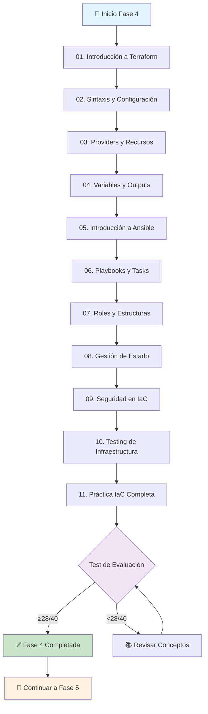
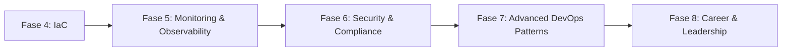

# Fase 4: Infraestructura como Código (IaC)


> **"La infraestructura debería ser expresable, versionable, testeable y reproducible"**

## 🎯 Objetivos de la Fase 4

Al completar esta fase serás capaz de:

✅ **Comprender los principios fundamentales de IaC**  
✅ **Dominar Terraform para aprovisionamiento**  
✅ **Implementar Ansible para gestión de configuración**  
✅ **Gestionar el estado de infraestructura de forma segura**  
✅ **Aplicar mejores prácticas de seguridad en IaC**  
✅ **Implementar testing para código de infraestructura**  
✅ **Crear pipelines CI/CD para infraestructura**  
✅ **Diseñar arquitecturas escalables y mantenibles**

## 📚 Contenido de la Fase 4

### 🏗️ **Módulo 1: Fundamentos de Terraform**

| Tema | Descripción | Duración |
|------|-------------|----------|
| [01. Introducción a Terraform](01-introduccion-terraform.md) | Conceptos básicos, instalación y primer proyecto | 3h |
| [02. Sintaxis y Configuración](02-sintaxis-terraform.md) | HCL, bloques, expresiones y funciones | 2h |
| [03. Providers y Recursos](03-providers-recursos.md) | Gestión de providers y creación de recursos | 2h |
| [04. Variables y Outputs](04-variables-outputs.md) | Parametrización y exportación de valores | 2h |

### ⚙️ **Módulo 2: Ansible para Gestión de Configuración**

| Tema | Descripción | Duración |
|------|-------------|----------|
| [05. Introducción a Ansible](05-introduccion-ansible.md) | Conceptos, inventarios y conexiones | 2h |
| [06. Playbooks y Tasks](06-playbooks-ansible.md) | Creación de playbooks y tareas automatizadas | 3h |
| [07. Roles y Estructuras](07-roles-ansible.md) | Organización y reutilización de código | 2h |

### 🔧 **Módulo 3: Gestión Avanzada**

| Tema | Descripción | Duración |
|------|-------------|----------|
| [08. Gestión de Estado](08-gestion-estado-terraform.md) | Remote state, locking y colaboración | 2h |
| [09. Seguridad en IaC](09-seguridad-iac.md) | Secrets, políticas y compliance | 3h |
| [10. Testing de Infraestructura](10-testing-iac.md) | Pruebas unitarias, integración y validación | 2h |

### 🚀 **Módulo 4: Proyecto Integrador**

| Tema | Descripción | Duración |
|------|-------------|----------|
| [11. Práctica IaC Completa](11-practica-iac-completa.md) | Proyecto completo con Terraform + Ansible | 4h |

**⏱️ Duración total estimada: 27 horas**

## 🗺️ Roadmap de Aprendizaje



## 🛠️ Tecnologías y Herramientas

### **Principales Herramientas de IaC**

| Herramienta | Propósito | Nivel |
|-------------|-----------|-------|
|  | Aprovisionamiento de infraestructura | Core |
|  | Gestión de configuración | Core |
|  | Proveedor de nube | Principal |
|  | Proveedor de nube | Alternativo |
|  | Proveedor de nube | Alternativo |

### **Herramientas de Soporte**

| Herramienta | Propósito | Uso |
|-------------|-----------|-----|
|  | Wrapper para Terraform | Avanzado |
|  | Creación de imágenes | Complementario |
|  | Gestión de secretos | Seguridad |
|  | Security scanning | Testing |

## 📋 Prerrequisitos

### **Conocimientos Requeridos**

- [x] **Completar Fase 3**: Contenedores y Orquestación
- [x] **Linux/Windows CLI**: Comandos básicos del sistema operativo
- [x] **YAML/JSON**: Sintaxis y estructuras de datos
- [x] **Networking**: Conceptos básicos de redes
- [x] **Cloud Basics**: Fundamentos de servicios en la nube

### **Herramientas a Instalar**

```bash
# Terraform
curl -fsSL https://apt.releases.hashicorp.com/gpg | sudo apt-key add -
sudo apt-add-repository "deb [arch=amd64] https://apt.releases.hashicorp.com $(lsb_release -cs) main"
sudo apt-get update && sudo apt-get install terraform

# Ansible
sudo apt update
sudo apt install software-properties-common
sudo add-apt-repository --yes --update ppa:ansible/ansible
sudo apt install ansible

# AWS CLI (si usas AWS)
curl "https://awscli.amazonaws.com/awscli-exe-linux-x86_64.zip" -o "awscliv2.zip"
unzip awscliv2.zip
sudo ./aws/install

# Azure CLI (si usas Azure)
curl -sL https://aka.ms/InstallAzureCLIDeb | sudo bash

# Git (para versionado)
sudo apt install git
```

### **Cuentas de Servicios Cloud**

- **AWS**: Cuenta gratuita con Free Tier
- **Azure**: Cuenta gratuita con créditos
- **GCP**: Cuenta gratuita con créditos iniciales

## 🎯 Metodología de Aprendizaje

### **Enfoque 70-20-10**

- **70% Práctica**: Laboratorios hands-on y proyectos reales
- **20% Interacción**: Discusiones, code reviews, pair programming
- **10% Teoría**: Conceptos fundamentales y mejores prácticas

### **Patrón de Cada Módulo**

1. **📖 Conceptos** (15 min)
2. **💻 Demo práctica** (30 min)
3. **🔨 Laboratorio guiado** (60 min)
4. **🚀 Ejercicio independiente** (45 min)
5. **✅ Verificación** (15 min)

## 🏆 Certificaciones Alineadas

### **Terraform**

- **Terraform Associate (003)** 
  - Duración: 1 hora
  - Preguntas: 57 múltiple opción
  - Costo: $70 USD

### **Ansible**

- **Red Hat Certified Specialist in Ansible Automation**
  - Duración: 4 horas
  - Tipo: Examen práctico
  - Costo: $400 USD

### **Cloud Providers**

- **AWS Certified Cloud Practitioner** (Fundamentos)
- **Azure Fundamentals AZ-900** (Fundamentos)
- **Google Cloud Digital Leader** (Fundamentos)

## 📊 Métricas de Progreso

### **Indicadores de Completado**

| Métrica | Objetivo | Seguimiento |
|---------|----------|-------------|
| Módulos completados | 11/11 | ⬜⬜⬜⬜⬜⬜⬜⬜⬜⬜⬜ |
| Laboratorios realizados | 15/15 | ⬜⬜⬜⬜⬜⬜⬜⬜⬜⬜⬜⬜⬜⬜⬜ |
| Proyectos entregados | 4/4 | ⬜⬜⬜⬜ |
| Test de evaluación | ≥28/40 | ⬜ |

### **Skills Desarrollados**

```
Terraform Proficiency    ████████░░ 80%
Ansible Mastery          ███████░░░ 70%
Cloud Architecture       ██████░░░░ 60%
Security Implementation  █████░░░░░ 50%
IaC Testing             ████░░░░░░ 40%
```

## 🎮 Gamificación

### **Sistema de Puntos**

- **📚 Completar módulo**: 100 puntos
- **💻 Laboratorio exitoso**: 150 puntos
- **🏗️ Proyecto funcional**: 300 puntos
- **🎯 Test aprobado**: 500 puntos
- **🏆 Certificación obtenida**: 1000 puntos

### **Niveles de Maestría**

| Nivel | Puntos | Título | Descripción |
|-------|--------|--------|-------------|
| 🌱 | 0-500 | Novato IaC | Comenzando el viaje |
| 🔧 | 501-1500 | Practicante | Dominando herramientas básicas |
| 🏗️ | 1501-3000 | Arquitecto | Diseñando infraestructuras |
| 🎯 | 3001-5000 | Experto | Implementando mejores prácticas |
| 🏆 | 5000+ | Maestro IaC | Liderando transformaciones |

## 📁 Estructura de Archivos

```
resources/fase4/
├── README.md                     # Este archivo
├── 01-introduccion-terraform.md  # Conceptos básicos de Terraform
├── 02-sintaxis-terraform.md      # HCL y sintaxis
├── 03-providers-recursos.md      # Providers y recursos
├── 04-variables-outputs.md       # Variables y outputs
├── 05-introduccion-ansible.md    # Fundamentos de Ansible
├── 06-playbooks-ansible.md       # Playbooks y tareas
├── 07-roles-ansible.md           # Roles y estructura
├── 08-gestion-estado-terraform.md # Gestión de estado
├── 09-seguridad-iac.md          # Seguridad en IaC
├── 10-testing-iac.md            # Testing de infraestructura
├── 11-practica-iac-completa.md  # Proyecto integrador
└── test.md                       # Test de evaluación
```

## 🚀 Cómo Empezar

### **Paso 1: Preparación del Entorno**

1. Instala Terraform y Ansible
2. Configura credenciales de cloud (AWS/Azure/GCP)
3. Clona el repositorio de prácticas
4. Verifica las instalaciones

### **Paso 2: Seguimiento Estructurado**

1. Lee cada módulo completamente
2. Realiza todos los laboratorios
3. Completa los ejercicios propuestos
4. Documenta tu progreso
5. Participa en la comunidad

### **Paso 3: Evaluación Continua**

1. Auto-evaluación después de cada módulo
2. Peer review de tus proyectos
3. Test intermedio en el módulo 7
4. Test final de certificación

## 🤝 Comunidad y Soporte

### **Recursos de Ayuda**

- **🎬 Videos explicativos**: Canal de YouTube del curso
- **💬 Discord**: Comunidad activa 24/7
- **📚 Documentación**: Wiki colaborativa
- **🤖 Bot de ayuda**: Asistente AI para dudas rápidas

### **Contribuye al Proyecto**

- **🐛 Reporta bugs**: Issues en GitHub
- **💡 Propón mejoras**: Pull requests welcome
- **📝 Comparte experiencias**: Blog posts y casos de uso
- **👥 Mentoriza**: Ayuda a nuevos estudiantes

## 📈 Perspectivas Laborales

### **Roles Objetivo Post-Fase 4**

| Puesto | Salario Promedio | Skills Clave |
|--------|-----------------|-------------|
| Infrastructure Engineer | $70,000 - $95,000 | Terraform, Ansible, Cloud |
| DevOps Engineer | $80,000 - $110,000 | IaC, CI/CD, Monitoring |
| Cloud Architect | $100,000 - $140,000 | Multi-cloud, Security, Design |
| Site Reliability Engineer | $90,000 - $125,000 | Automation, Monitoring, Performance |
| Platform Engineer | $85,000 - $115,000 | K8s, IaC, Developer Experience |

### **Empresas que Contratan**

- **Big Tech**: Amazon, Microsoft, Google, Meta
- **Cloud Native**: HashiCorp, Red Hat, Datadog
- **Startups**: Scales de infrastructure y DevOps
- **Enterprise**: Bancos, telecomunicaciones, retail
- **Consultoras**: Accenture, Deloitte, McKinsey

## 🔮 Roadmap Futuro

### **Próximas Fases**



### **Especializaciones Disponibles**

- **🔒 DevSecOps Track**: Seguridad integrada en DevOps
- **☁️ Multi-Cloud Track**: Estrategias multi-nube avanzadas
- **🤖 MLOps Track**: Machine Learning Operations
- **📱 Mobile DevOps Track**: CI/CD para aplicaciones móviles

## 📚 Recursos Adicionales

### **Libros Recomendados**

- **"Terraform: Up and Running"** - Yevgeniy Brikman
- **"Ansible for DevOps"** - Jeff Geerling
- **"Infrastructure as Code"** - Kief Morris
- **"Building Secure & Reliable Systems"** - Google SRE Team

### **Cursos Complementarios**

- **A Cloud Guru**: Terraform y Ansible paths
- **Linux Academy**: Cloud-specific IaC tracks
- **Udemy**: Cursos prácticos con proyectos
- **HashiCorp Learn**: Tutoriales oficiales

### **Podcasts y Contenido**

- **The Cloudcast**: Weekly cloud computing podcast
- **DevOps Chat**: Interviews with industry leaders
- **HashiCorp Blog**: Official updates and tutorials
- **Ansible Blog**: Best practices and use cases

---

## 🎯 Objetivo Final

Al completar la **Fase 4: Infraestructura como Código**, habrás desarrollado las habilidades necesarias para:

> **"Diseñar, implementar y gestionar infraestructuras modernas de forma automatizada, segura y escalable usando las mejores herramientas y prácticas de la industria"**

**¡Comencemos a construir el futuro de la infraestructura! 🚀**

---

**Próximo paso:** [01. Introducción a Terraform](01-introduccion-terraform.md)

**Fase anterior:** [Fase 3: Contenedores, Redes y Orquestación](../fase3/)

**Volver al inicio:** [DevOps Learning Path](../../README.md)