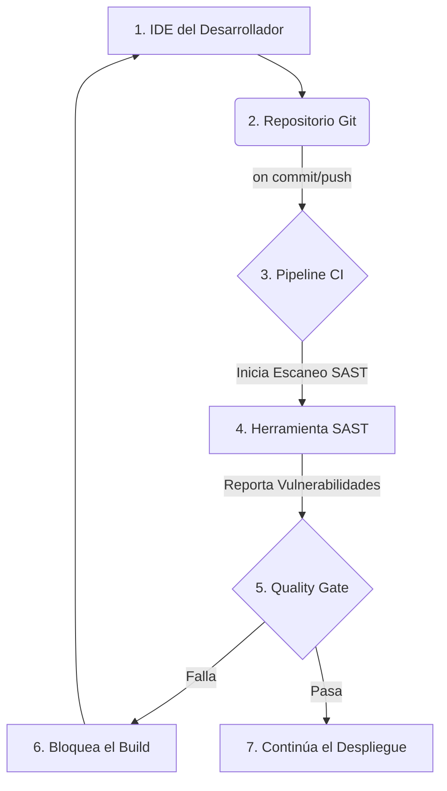

# Módulo 04: Análisis Estático de Seguridad de Aplicaciones (SAST)

## 🎯 Objetivos

- Comprender qué es SAST y cómo se integra en el ciclo de vida de desarrollo (Shift-Left).
- Aprender a configurar y ejecutar escaneos SAST con herramientas como SonarQube.
- Interpretar los resultados de un escaneo SAST y priorizar la corrección de vulnerabilidades.

## 📜 Contenido

### 1. ¿Qué es SAST?

- **Definición**: **Static Application Security Testing** (SAST) es una técnica de "caja blanca" que analiza el código fuente, el bytecode o el código binario de una aplicación en busca de vulnerabilidades de seguridad **sin ejecutar el código**.
- **Ventajas**:
  - **Detección Temprana**: Se puede ejecutar desde las primeras etapas del desarrollo, directamente en el IDE del desarrollador o en cada `git push`.
  - **Cobertura Completa**: Analiza el 100% del código base, incluyendo rutas de código que raramente se ejecutan.
  - **Identificación Precisa**: Puede señalar la línea exacta de código donde reside una vulnerabilidad.
- **Desventajas**:
  - **Falsos Positivos**: Puede generar un alto número de falsos positivos si no se configura correctamente.
  - **No detecta errores de configuración en tiempo de ejecución**: No puede encontrar vulnerabilidades que solo aparecen cuando la aplicación está en ejecución (ej. problemas de configuración del servidor).

### 2. Integración de SAST en el Pipeline de CI/CD (Shift-Left)

La clave de SAST es mover la seguridad a la izquierda en el ciclo de vida de DevOps.



- **Quality Gate (Puerta de Calidad)**: Es un conjunto de condiciones que el código debe cumplir para pasar la etapa de análisis. Por ejemplo:
  - Cero vulnerabilidades críticas.
  - Menos de 5 vulnerabilidades mayores.
  - Cobertura de pruebas unitarias superior al 80%.

### 3. Herramientas Populares de SAST

- **SonarQube**: Una de las plataformas más populares. Analiza calidad de código y seguridad. Soporta más de 25 lenguajes.
- **Snyk Code**: Se enfoca en la facilidad de uso y la integración con el IDE.
- **Checkmarx**: Solución comercial robusta con un motor de análisis potente.
- **Semgrep**: Herramienta de línea de comandos, ligera y personalizable, que usa reglas simples para encontrar patrones de código.

### 4. Interpretación de Resultados

Un reporte de SAST típicamente incluye:

- **Descripción de la Vulnerabilidad**: Qué es y por qué es un riesgo (ej. "SQL Injection").
- **Ubicación**: El archivo y la línea de código exactos.
- **Severidad**: Crítica, Alta, Media, Baja.
- **Ruta de Flujo de Datos (Taint Flow)**: Muestra cómo una entrada no confiable (la "fuente" o _source_) viaja a través del código hasta llegar a un punto vulnerable (el "sumidero" o _sink_).

## 🏢 Ejemplo Práctico: Escaneo con SonarQube en un Pipeline

1. **Configuración del Pipeline (GitHub Actions)**:

   ```yaml
   name: Build and SAST Analysis
   on:
     push:
       branches: [main]
   jobs:
     build:
       runs-on: ubuntu-latest
       steps:
         - uses: actions/checkout@v3
         - name: Set up JDK 11
           uses: actions/setup-java@v3
           with:
             java-version: '11'
             distribution: 'adopt'
         - name: SonarQube Scan
           uses: sonarsource/sonarqube-scan-action@master
           env:
             SONAR_TOKEN: ${{ secrets.SONAR_TOKEN }}
             SONAR_HOST_URL: ${{ secrets.SONAR_HOST_URL }}
   ```

2. **Análisis de Resultados**:
   - El desarrollador recibe una notificación si el Quality Gate falla.
   - En la interfaz de SonarQube, puede ver un panel con las nuevas vulnerabilidades, su severidad y la ubicación exacta.
   - SonarQube ofrece ejemplos de cómo solucionar el problema específico.

## ✍️ Ejercicio

1. Crea una cuenta gratuita en [SonarCloud](https://sonarcloud.io/).
2. Conecta un repositorio de GitHub personal que tenga un proyecto simple (puede ser en Python, Java, JavaScript, etc.).
3. Configura el análisis automático para que se ejecute en cada push.
4. Introduce deliberadamente una vulnerabilidad simple (ej. una contraseña hardcodeada) y haz un push.
5. Observa el reporte generado por SonarCloud. ¿Detectó la vulnerabilidad? ¿Qué severidad le asignó?
