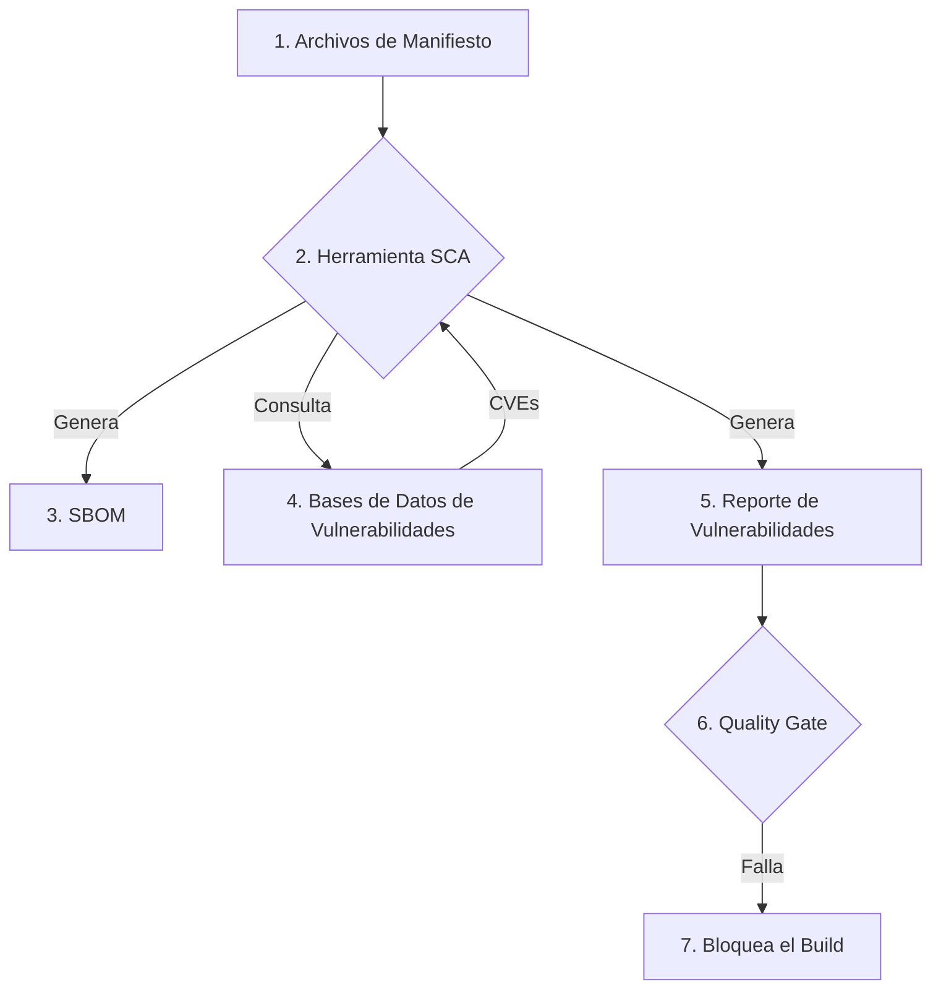

# Módulo 06: Análisis de Composición de Software (SCA)

## 🎯 Objetivos

- Comprender qué es SCA y por qué la seguridad de las dependencias es crítica.
- Aprender a generar un "Software Bill of Materials" (SBOM).
- Utilizar herramientas como Trivy y OWASP Dependency-Track para encontrar y gestionar vulnerabilidades en componentes de terceros.

## 📜 Contenido

### 1. ¿Qué es SCA?

- **Definición**: **Software Composition Analysis** (SCA) es el proceso de automatizar la visibilidad de las dependencias de código abierto (open source) en una aplicación. Su objetivo es identificar todas las librerías de terceros, sus versiones, licencias y, lo más importante, si tienen vulnerabilidades de seguridad conocidas (CVEs).
- **¿Por qué es crucial?**: Las aplicaciones modernas están compuestas en un 70-90% por código de terceros. Una vulnerabilidad en una sola dependencia puede comprometer toda la aplicación (ej. Log4Shell).

### 2. El "Software Bill of Materials" (SBOM)

- **Definición**: Un SBOM es un inventario formal y estructurado de todos los componentes de software, librerías y módulos que se utilizan para construir una pieza de software. Es como la lista de ingredientes de una receta.
- **Formatos Estándar**:
  - **CycloneDX**: Un formato ligero de SBOM promovido por OWASP.
  - **SPDX (Software Package Data Exchange)**: Un formato más detallado mantenido por la Fundación Linux.
- **Generación**: Las herramientas de SCA pueden generar automáticamente un SBOM a partir de los archivos de manifiesto de un proyecto (`package.json`, `pom.xml`, `requirements.txt`, etc.).

### 3. Proceso de un Escaneo SCA



- **Bases de Datos de Vulnerabilidades**: Las herramientas de SCA comparan los componentes del SBOM con bases de datos públicas y privadas de vulnerabilidades, como:
  - **NVD (National Vulnerability Database)**
  - **GitHub Advisory Database**
  - **Snyk Vulnerability Database**

### 4. Herramientas Populares de SCA

- **Trivy**: Una herramienta de código abierto muy popular de Aqua Security. Es simple, rápida y puede escanear no solo dependencias de proyectos, sino también imágenes de contenedores y sistemas de archivos.
- **OWASP Dependency-Check**: Un clásico de OWASP que se puede ejecutar como una herramienta de línea de comandos o un plugin de Maven/Gradle.
- **OWASP Dependency-Track**: Una plataforma que permite la ingesta continua de SBOMs para un monitoreo centralizado de vulnerabilidades y licencias a lo largo del tiempo.
- **Snyk Open Source**: Una solución comercial muy potente con una excelente base de datos de vulnerabilidades y una gran experiencia de desarrollador.

## 🏢 Ejemplo Práctico: Escaneo con Trivy en un Pipeline

Trivy es ideal para CI/CD por su velocidad y facilidad de uso.

1. **Escaneo de un Repositorio**:

   ```yaml
   - name: Run Trivy vulnerability scanner in repo mode
     uses: aquasecurity/trivy-action@master
     with:
       scan-type: "fs"
       ignore-unfixed: true
       format: "sarif"
       output: "trivy-results.sarif"
       severity: "CRITICAL,HIGH"
   ```

2. **Escaneo de una Imagen de Docker**:

   ```yaml
   - name: Build Docker image
     run: docker build -t my-app:latest .
   - name: Run Trivy vulnerability scanner on Docker image
     uses: aquasecurity/trivy-action@master
     with:
       image-ref: "my-app:latest"
       format: "table"
       exit-code: "1" # Falla el build si se encuentran vulnerabilidades
       ignore-unfixed: true
       severity: "CRITICAL"
   ```

## ✍️ Ejercicio

1. Instala [Trivy](https://github.com/aquasecurity/trivy) en tu máquina local.
2. Clona un proyecto de código abierto que te interese desde GitHub.
3. Ejecuta un escaneo de SCA sobre el repositorio con el comando:

   ```bash
   trivy fs .
   ```

4. Analiza los resultados:
   - ¿Cuántas vulnerabilidades de severidad `HIGH` o `CRITICAL` se encontraron?
   - Elige una vulnerabilidad `CRITICAL` y busca su CVE en la [NVD](https://nvd.nist.gov/vuln/search).
   - ¿Qué describe el CVE? ¿Qué recomendación se da para solucionarlo (generalmente, actualizar a una versión más nueva)?
