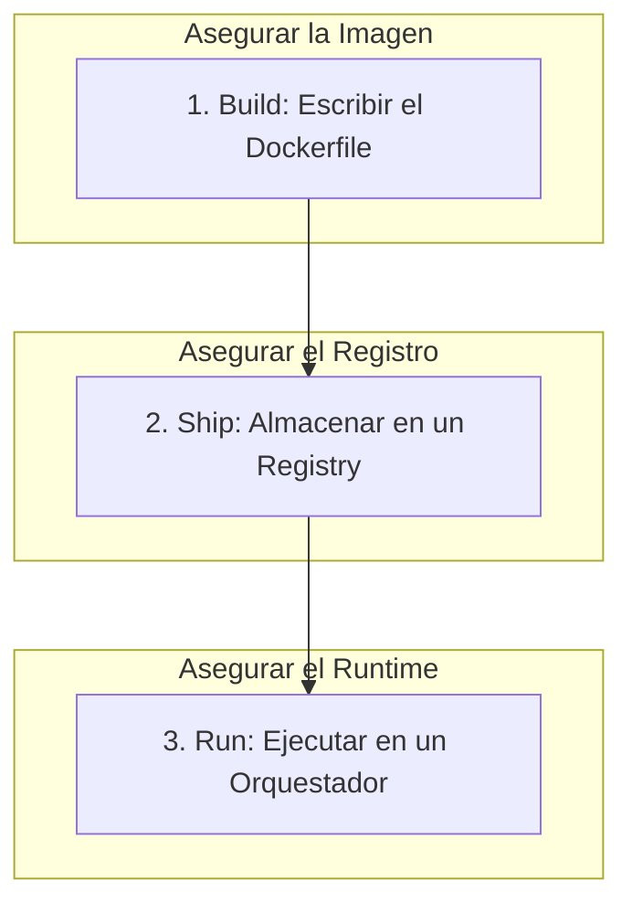

# Módulo 07: Seguridad de Contenedores (Docker & Kubernetes)

## 🎯 Objetivos

- Comprender los vectores de ataque en el ciclo de vida de un contenedor.
- Aprender a escanear imágenes de Docker en busca de vulnerabilidades.
- Implementar políticas de seguridad en tiempo de ejecución en Kubernetes (Pod Security, Network Policies).

## 📜 Contenido

### 1. El Ciclo de Vida de la Seguridad de Contenedores

La seguridad debe aplicarse en cada etapa:



### 2. Seguridad en la Fase de Build (Imagen)

- **Usar Imágenes Base Mínimas**: En lugar de `ubuntu`, usa `ubuntu-slim` o imágenes `distroless` o `alpine`. Menos componentes = menos superficie de ataque.
- **No ejecutar como Root**: Usa la instrucción `USER` en tu Dockerfile para cambiar a un usuario sin privilegios.
- **Escaneo de Vulnerabilidades (SCA)**: Usa herramientas como **Trivy**, **Clair** o **Snyk** para escanear la imagen en busca de CVEs en las librerías del sistema operativo y las dependencias de la aplicación.
- **Builds Multi-etapa (Multi-stage builds)**: Separa el entorno de compilación del entorno de ejecución para que la imagen final no contenga herramientas de compilación, código fuente o secretos.

**Dockerfile Seguro (Ejemplo):**

```dockerfile
# --- Etapa de Build ---
FROM maven:3.8-jdk-11 AS build
WORKDIR /app
COPY . .
RUN mvn package

# --- Etapa de Ejecución ---
FROM tomcat:9.0-jre11-slim
# Usar un usuario sin privilegios
RUN useradd -m -u 1001 -s /bin/false appuser
USER 1001
COPY --from=build /app/target/app.war /usr/local/tomcat/webapps/
```

### 3. Seguridad en la Fase de Ship (Registro)

- **Usar Registros Privados**: Almacena tus imágenes en registros privados como Docker Hub (privado), Azure Container Registry (ACR), Amazon ECR o Google Artifact Registry.
- **Control de Acceso**: Aplica permisos de mínimo privilegio sobre quién puede hacer `push` (escribir) y `pull` (leer) imágenes.
- **Escaneo en el Registro**: La mayoría de los registros cloud ofrecen escaneo automático de imágenes al subirlas.

### 4. Seguridad en la Fase de Run (Kubernetes)

- **Pod Security Standards (PSS)**: Kubernetes define tres perfiles de seguridad para los Pods:
  - `Privileged`: Sin restricciones. Muy inseguro.
  - `Baseline`: Mínimamente restrictivo, previene escaladas de privilegios conocidas.
  - `Restricted`: Altamente restrictivo, sigue las mejores prácticas de hardening.
- **Network Policies (Políticas de Red)**: Actúan como un firewall a nivel de Pod. Por defecto, todos los Pods en un clúster pueden comunicarse entre sí. Las Network Policies te permiten definir explícitamente qué tráfico de entrada (ingress) y salida (egress) está permitido para un grupo de Pods.

**NetworkPolicy (Ejemplo):**
Esta política permite que solo los Pods con la etiqueta `app: frontend` se comuniquen con los Pods `app: backend` en el puerto 8080.

```yaml
apiVersion: networking.k8s.io/v1
kind: NetworkPolicy
metadata:
  name: backend-allow-frontend
spec:
  podSelector:
    matchLabels:
      app: backend
  policyTypes:
    - Ingress
  ingress:
    - from:
        - podSelector:
            matchLabels:
              app: frontend
      ports:
        - protocol: TCP
          port: 8080
```

- **Runtime Security con Falco**: Herramientas como **Falco** monitorean el comportamiento del sistema en tiempo real (llamadas al sistema, acceso a archivos) y alertan sobre actividades sospechosas, como la ejecución de un shell en un contenedor o la escritura en un directorio inesperado.

## ✍️ Ejercicio

1. Toma un `Dockerfile` de un proyecto anterior o uno simple que encuentres en línea.
2. Instala **Trivy** si aún no lo has hecho.
3. Construye la imagen de Docker: `docker build -t mi-imagen-test .`
4. Escanea la imagen en busca de vulnerabilidades: `trivy image mi-imagen-test`
5. Analiza el resultado. ¿Encontró Trivy alguna vulnerabilidad `CRITICAL` o `HIGH`? ¿Qué librería o componente del sistema operativo es el culpable?
