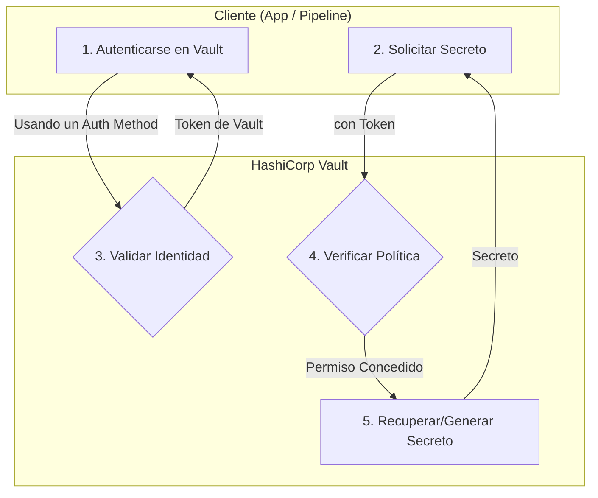

# Módulo 09: Gestión de Secretos

## 🎯 Objetivos

- Comprender por qué la gestión de secretos es un pilar fundamental de DevSecOps.
- Aprender a utilizar HashiCorp Vault para almacenar, acceder y rotar secretos de forma centralizada y segura.
- Integrar la recuperación de secretos en aplicaciones y pipelines de CI/CD.

## 📜 Contenido

### 1. ¿Qué es un Secreto y por qué es un Problema?

- **Definición**: Un secreto es cualquier pieza de información que otorga acceso a un sistema, como:
  - Contraseñas de bases de datos
  - Claves de API (API Keys)
  - Tokens de autenticación
  - Certificados TLS
  - Claves SSH
- **El Problema del "Secret Sprawl" (Proliferación de Secretos)**: En entornos tradicionales, los secretos están esparcidos por todas partes: archivos de configuración, variables de entorno, código fuente, wikis internas, etc. Esto hace que sea imposible auditarlos, rotarlos o revocarlos de manera efectiva.

### 2. Principios de la Gestión de Secretos

- **Centralización**: Todos los secretos deben almacenarse en un único lugar seguro.
- **Control de Acceso Estricto**: El acceso a los secretos debe basarse en la identidad (de una persona o una máquina) y políticas de mínimo privilegio.
- **Auditoría Completa**: Cada acceso, lectura o escritura de un secreto debe ser registrado.
- **Rotación y Revocación**: Los secretos deben tener un ciclo de vida corto (TTL - Time To Live) y poder ser rotados (cambiados) o revocados (invalidados) fácilmente.
- **Inyección Dinámica**: Las aplicaciones y los pipelines no deben conocer los secretos directamente. Un sistema debe inyectarlos en el momento justo en que se necesitan.

### 3. HashiCorp Vault: El Estándar de la Industria

- **¿Qué es?**: Vault es una herramienta de código abierto para gestionar secretos de forma segura. Actúa como una bóveda centralizada que las aplicaciones y los usuarios pueden consultar para obtener los secretos que necesitan, previa autenticación y autorización.
- **Conceptos Clave de Vault**:
  - **Storage Backends**: Dónde Vault almacena los secretos de forma cifrada (ej. Consul, un sistema de archivos, S3). Vault no almacena los secretos en texto plano.
  - **Secret Engines**: Módulos que generan, almacenan o cifran datos. Hay motores para bases de datos (genera credenciales dinámicas), AWS (genera claves de IAM), Key/Value, etc.
  - **Auth Methods**: Métodos para que los clientes (usuarios, máquinas, contenedores) se autentiquen en Vault (ej. Tokens, Usuario/Contraseña, AppRole, Kubernetes, AWS IAM).
  - **Policies**: Reglas que definen qué rutas (secrets) puede acceder un cliente autenticado y con qué permisos (crear, leer, actualizar, eliminar).

### 4. Flujo de Trabajo Típico con Vault



1. Una aplicación o un pipeline se **autentica** en Vault usando un método de autenticación (ej. un rol de Kubernetes).
2. Vault verifica la identidad y devuelve un **token de corta duración** con políticas asociadas.
3. La aplicación usa ese token para **solicitar un secreto** (ej. las credenciales de una base de datos).
4. Vault comprueba que las **políticas** del token permiten el acceso a esa ruta.
5. Si está permitido, el **motor de secretos** correspondiente genera una credencial dinámica (con un TTL de, por ejemplo, 1 hora) y se la devuelve a la aplicación.
6. La aplicación usa la credencial. Cuando el TTL expira, la credencial se revoca automáticamente.

## 🏢 Ejemplo Práctico: Inyectar un Secreto en un Pod de Kubernetes

Vault se puede integrar con Kubernetes para inyectar secretos directamente en los Pods sin que el desarrollador tenga que gestionarlos.

1. **Configuración**: Se despliega Vault en el clúster y se configura el método de autenticación de Kubernetes.
2. **Anotaciones en el Deployment**: El desarrollador solo necesita añadir anotaciones especiales a su manifiesto de Deployment.

   ```yaml
   apiVersion: apps/v1
   kind: Deployment
   metadata:
     name: my-app
   spec:
     template:
       metadata:
         annotations:
           vault.hashicorp.com/agent-inject: "true"
           vault.hashicorp.com/role: "my-app-role"
           vault.hashicorp.com/agent-inject-secret-database-config.json: "secret/data/database/config"
       spec:
         containers:
           - name: my-app-container
             # El secreto estará disponible en /vault/secrets/database-config.json
   ```

   El **Vault Agent Injector** intercepta la creación del Pod, se autentica en Vault usando la cuenta de servicio del Pod, recupera el secreto y lo monta como un archivo dentro del contenedor. La aplicación solo tiene que leer el archivo.

## ✍️ Ejercicio

1. Sigue la guía de "Getting Started" de HashiCorp Vault para [instalar Vault en modo de desarrollo](https://developer.hashicorp.com/vault/tutorials/getting-started/getting-started-install) en tu máquina local.
2. Inicia el servidor de desarrollo: `vault server -dev`
3. En otra terminal, exporta la variable de entorno con el token raíz: `export VAULT_ADDR='http://127.0.0.1:8200'` y `export VAULT_TOKEN="..."` (usa el token que te dio el comando anterior).
4. Escribe un secreto simple en la bóveda: `vault kv put secret/my-app/config api_key="my-secret-key"`
5. Lee el secreto de vuelta: `vault kv get secret/my-app/config`
6. Esto simula el ciclo básico de escritura y lectura de secretos.
