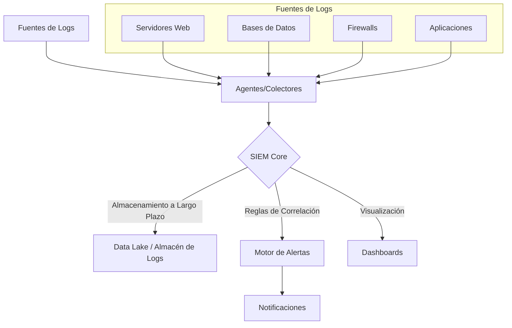

# Módulo 10: Monitoreo de Seguridad y SIEM

## 🎯 Objetivos

- Comprender la importancia del monitoreo continuo para la detección de amenazas.
- Aprender qué es un SIEM y cómo funciona.
- Utilizar herramientas como Wazuh o el stack de Elastic (ELK) para centralizar y analizar logs de seguridad.

## 📜 Contenido

### 1. ¿Qué es el Monitoreo de Seguridad?

- **Definición**: Es el proceso continuo de recopilar, analizar y correlacionar datos de múltiples fuentes (aplicaciones, servidores, redes, endpoints) para identificar actividades maliciosas o anómalas en tiempo real.
- **El Objetivo**: Reducir el "dwell time" (tiempo de permanencia), que es el tiempo que transcurre desde que un atacante compromete un sistema hasta que es detectado.

### 2. SIEM: El Cerebro de las Operaciones de Seguridad

- **Definición**: **Security Information and Event Management** (SIEM) es una solución de software que agrega datos de logs de toda la organización, los analiza en busca de patrones sospechosos y genera alertas para el equipo de seguridad.
- **Funcionalidades Clave**:
  1. **Agregación de Datos**: Recopila logs de firewalls, servidores, aplicaciones, sistemas de detección de intrusos (IDS), etc.
  2. **Normalización**: Parsea y formatea los logs de diferentes fuentes a un esquema común.
  3. **Correlación**: Aplica reglas para encontrar relaciones entre eventos aparentemente no conectados. (Ej: "Múltiples intentos de login fallidos desde una IP desconocida seguidos de un login exitoso").
  4. **Alertas**: Notifica al equipo de seguridad cuando una regla de correlación se activa.
  5. **Dashboards y Reportes**: Proporciona visualizaciones para el análisis de amenazas y la generación de informes de cumplimiento.

### 3. Arquitectura Típica de un SIEM

### 4. Herramientas Populares

- **Wazuh**: Una plataforma de código abierto para la detección de amenazas, monitoreo de seguridad y respuesta a incidentes. Es un fork de OSSEC con capacidades de SIEM y XDR (Extended Detection and Response).
  - **Componentes**: Agentes ligeros en los endpoints, un servidor central para análisis y el stack de Elastic (Elasticsearch, Kibana) para la visualización.
- **Elastic SIEM (ELK Stack)**: Utiliza el stack de Elastic (Elasticsearch, Logstash, Kibana) y le añade funcionalidades específicas de SIEM.
  - **Beats**: Agentes ligeros para enviar datos (Filebeat para logs, Metricbeat para métricas).
  - **Logstash**: Procesa y enriquece los datos antes de enviarlos a Elasticsearch.
  - **Elasticsearch**: Motor de búsqueda y análisis donde se almacenan los datos.
  - **Kibana**: Herramienta de visualización para crear dashboards y explorar los datos.
- **Splunk**: Una de las soluciones comerciales más potentes y populares del mercado.
- **Microsoft Sentinel / Google Chronicle**: Soluciones SIEM nativas de la nube.

## 🏢 Ejemplo Práctico: Detectar un Ataque de Fuerza Bruta con Wazuh

1. **Instalación de Agentes**: Se instala un agente de Wazuh en un servidor web.
2. **Recopilación de Logs**: El agente monitorea los logs de autenticación del sistema (ej. `/var/log/auth.log` en Linux).
3. **Envío al Servidor**: Cada evento de login (exitoso o fallido) se envía al servidor de Wazuh.
4. **Regla de Correlación**: Wazuh tiene una regla predefinida (ej. la regla 5712) que se activa si detecta "múltiples intentos de autenticación fallidos desde la misma IP de origen en un corto período de tiempo".
5. **Alerta**: Cuando la regla se dispara, Wazuh genera una alerta de alta severidad en el dashboard de Kibana.
6. **Respuesta Activa (Opcional)**: Se puede configurar una "respuesta activa" para que, al generarse la alerta, Wazuh ejecute un script que añada la IP atacante a una lista de bloqueo en el firewall del servidor.

## ✍️ Ejercicio

1. Imagina que tienes una aplicación web que genera logs en formato JSON cada vez que un usuario inicia sesión. El log incluye `timestamp`, `username`, `sourceIP`, y `status` ("success" o "failed").
2. Escribe una pseudo-regla de correlación para un SIEM que detecte el siguiente escenario: "Un usuario cuya cuenta ha estado inactiva por más de 90 días de repente intenta iniciar sesión desde una dirección IP que nunca antes se había visto para ese usuario".
3. ¿Qué campos necesitarías almacenar y correlacionar para que esta regla funcione?
