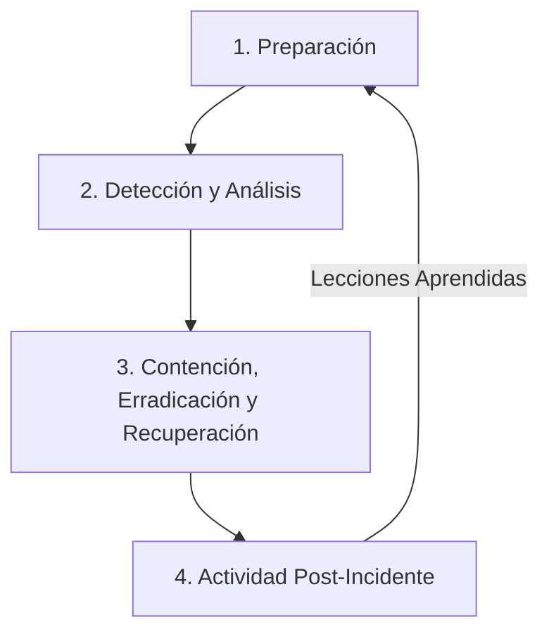

# Módulo 11: Respuesta a Incidentes (IR)

## 🎯 Objetivos

- Comprender las fases del ciclo de vida de la respuesta a incidentes.
- Aprender a crear y utilizar "playbooks" para estandarizar y automatizar la respuesta.
- Conocer herramientas de SOAR para orquestar la respuesta a incidentes.

## 📜 Contenido

### 1. ¿Qué es la Respuesta a Incidentes?

- **Definición**: Es el proceso organizado y estructurado que sigue una organización para gestionar las consecuencias de una brecha de seguridad o un ciberataque. El objetivo es limitar el daño, reducir el tiempo de recuperación y minimizar los costos.
- **Incidente vs. Evento**: Un **evento** es cualquier suceso observable en un sistema o red. Un **incidente** es un evento que viola (o amenaza con violar) las políticas de seguridad.

### 2. El Ciclo de Vida de la Respuesta a Incidentes (NIST)

El Instituto Nacional de Estándares y Tecnología (NIST) propone un ciclo de vida de cuatro fases:

1. **Preparación (Preparation)**:

   - **Qué es**: Todo el trabajo que se hace **antes** de que ocurra un incidente.
   - **Actividades**: Crear el plan de respuesta a incidentes, definir el equipo (CSIRT), adquirir y configurar herramientas (SIEM, EDR), realizar simulacros.

2. **Detección y Análisis (Detection & Analysis)**:

   - **Qué es**: Identificar que un incidente ha ocurrido y determinar su alcance y severidad.
   - **Actividades**: Analizar alertas del SIEM, investigar anomalías, determinar qué sistemas están afectados, quién es el atacante (atribución) y cuál es el vector de ataque.

3. **Contención, Erradicación y Recuperación (Containment, Eradication & Recovery)**:

   - **Contención**: Limitar el daño.
     - _Contención a corto plazo_: Aislar los sistemas afectados de la red.
     - _Contención a largo plazo_: Reconstruir sistemas limpios.
   - **Eradicación**: Eliminar la causa raíz del incidente (ej. parchear la vulnerabilidad, eliminar el malware).
   - **Recuperación**: Restaurar los sistemas a su estado normal de operación y verificar que funcionan correctamente.

4. **Actividad Post-Incidente (Post-Incident Activity)**:
   - **Qué es**: Aprender del incidente para mejorar la postura de seguridad.
   - **Actividades**: Realizar una reunión de "lecciones aprendidas", documentar el incidente, calcular el costo, actualizar el plan de respuesta y las políticas de seguridad.

### 3. Playbooks de Respuesta a Incidentes

- **Definición**: Un playbook es un manual paso a paso que define las acciones que debe tomar el equipo de seguridad para responder a un tipo específico de incidente (ej. "Playbook de Ransomware", "Playbook de Phishing").
- **Beneficios**:
  - **Consistencia**: Asegura que todos los incidentes se manejen de la misma manera.
  - **Velocidad**: Reduce el tiempo de respuesta al eliminar la necesidad de tomar decisiones bajo presión.
  - **Automatización**: Sirve como base para la automatización con herramientas SOAR.

### 4. SOAR: Orquestación y Automatización de la Respuesta

- **Definición**: **Security Orchestration, Automation, and Response** (SOAR) es una plataforma que permite integrar todas las herramientas de seguridad y automatizar los flujos de trabajo de respuesta a incidentes (los playbooks).
- **Ejemplo de Flujo de Trabajo SOAR para una Alerta de Phishing**:
  1. **Ingesta**: El SIEM envía una alerta de "email de phishing" al SOAR.
  2. **Enriquecimiento**: El SOAR automáticamente:
     - Extrae la IP del remitente y la busca en bases de datos de reputación (Threat Intelligence).
     - Extrae los hashes de los archivos adjuntos y los analiza en un sandbox (ej. VirusTotal).
     - Extrae las URLs del cuerpo del email y las analiza.
  3. **Decisión**: Si se confirma que es malicioso, el SOAR ejecuta la respuesta.
  4. **Respuesta Automatizada**:
     - Busca en el servidor de correo y elimina el mismo email de todos los buzones de la organización.
     - Bloquea la IP del remitente en el firewall.
     - Abre un ticket en el sistema de ticketing (ej. Jira) para el equipo de seguridad.

## ✍️ Ejercicio

Elige uno de los siguientes tipos de incidentes:

- Un ataque de Ransomware que ha cifrado un servidor de archivos.
- Una fuga de datos donde se ha exfiltrado una base de datos de clientes.

Describe 3 acciones clave que tomarías en cada una de estas fases del ciclo de vida de IR para ese incidente:

1. **Detección y Análisis**: ¿Cómo confirmarías el incidente?
2. **Contención**: ¿Cuál sería tu primera acción para evitar que el daño se extienda?
3. **Recuperación**: ¿Cómo volverías a la normalidad?
