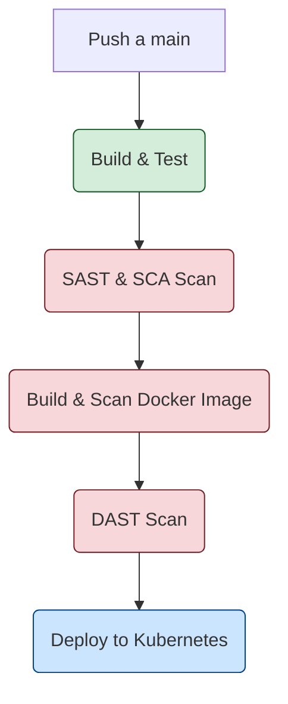

# Módulo 13: Laboratorio Final - Construcción de un Pipeline DevSecOps

## 🎯 Objetivo del Laboratorio

Construir un pipeline de CI/CD completo en GitHub Actions que integre múltiples capas de seguridad para una aplicación web simple. El pipeline deberá compilar, analizar, empaquetar y desplegar la aplicación, bloqueando el proceso si se detectan vulnerabilidades críticas.

## 🚀 Aplicación de Ejemplo

Para este laboratorio, utilizaremos la aplicación **OWASP Juice Shop**, que está diseñada para ser deliberadamente insegura, lo que la hace perfecta para probar herramientas de seguridad.

- **Repositorio**: `https://github.com/juice-shop/juice-shop`

## 🛠️ Requisitos Previos

- Una cuenta de GitHub.
- Una cuenta de Docker Hub para almacenar la imagen.
- Una cuenta en [SonarCloud](https://sonarcloud.io/) para el análisis SAST.
- Un clúster de Kubernetes para el despliegue (puede ser local como Minikube/Kind, o en la nube como AKS/EKS/GKE).

## 📋 Fases del Pipeline

El pipeline se construirá en un único archivo de workflow de GitHub Actions (`.github/workflows/devsecops.yml`) y constará de los siguientes jobs:

---

### **Job 1: Build & Unit Test**

- **Trigger**: En cada `push` a la rama `main`.
- **Pasos**:
  1. Hacer checkout del código de la aplicación (Juice Shop).
  2. Instalar las dependencias (`npm install`).
  3. Ejecutar las pruebas unitarias (`npm test`).
  4. Si las pruebas fallan, el pipeline se detiene.

---

### **Job 2: Análisis de Seguridad Estático (SAST & SCA)**

- **Dependencia**: Se ejecuta después de que `build-test` sea exitoso.
- **Pasos**:
  1. **Análisis de Composición de Software (SCA) con Trivy**:
     - Usar la action de Trivy para escanear los archivos de manifiesto (`package.json`) en busca de dependencias con vulnerabilidades conocidas.
     - Configurar Trivy para que falle el job si encuentra vulnerabilidades `CRITICAL`.
  2. **Análisis Estático de Código (SAST) con SonarCloud**:
     - Configurar la action de SonarCloud para analizar el código fuente.
     - El Quality Gate en SonarCloud debe estar configurado para fallar si hay nuevas vulnerabilidades críticas o "Bugs".

---

### **Job 3: Construcción y Escaneo de la Imagen Docker**

- **Dependencia**: Se ejecuta después de que `sast-sca-scan` sea exitoso.
- **Pasos**:
  1. Hacer login en Docker Hub usando un token de acceso.
  2. Construir la imagen de Docker de la aplicación.
  3. **Escaneo de la Imagen con Trivy**:
     - Usar la action de Trivy para escanear la imagen recién construida.
     - Configurar Trivy para que falle el job si encuentra vulnerabilidades `CRITICAL` en las librerías del sistema operativo base.
  4. Si el escaneo es exitoso, hacer `push` de la imagen a Docker Hub.

---

### **Job 4: Análisis de Seguridad Dinámico (DAST)**

- **Dependencia**: Se ejecuta después de que `build-docker-image` sea exitoso.
- **Pasos**:
  1. Desplegar la aplicación en un entorno de "staging" temporal (ej. usando Docker Compose dentro del runner de GitHub Actions).
  2. **Escaneo DAST con OWASP ZAP**:
     - Usar la action de ZAP Baseline Scan para ejecutar un escaneo pasivo contra la aplicación en ejecución.
     - Configurar ZAP para que falle si encuentra alertas de severidad `High`.

---

### **Job 5: Despliegue a Kubernetes (Producción)**

- **Dependencia**: Se ejecuta después de que `dast-scan` sea exitoso.
- **Pasos**:
  1. Configurar el acceso al clúster de Kubernetes (usando `kubeconfig` almacenado en los secrets de GitHub).
  2. Crear un manifiesto de despliegue de Kubernetes (`deployment.yaml`) para la aplicación.
  3. Aplicar el manifiesto usando `kubectl apply`.
  4. Verificar que el despliegue se ha completado correctamente.

## 📈 Diagrama del Pipeline

## ✍️ Tareas del Ejercicio

1. **Forkea el repositorio de OWASP Juice Shop**.
2. **Crea los Secrets necesarios** en tu repositorio de GitHub:
   - `DOCKERHUB_USERNAME`: Tu nombre de usuario de Docker Hub.
   - `DOCKERHUB_TOKEN`: Tu token de acceso de Docker Hub.
   - `SONAR_TOKEN`: El token de tu proyecto en SonarCloud.
   - `KUBECONFIG_BASE64`: Tu archivo `kubeconfig` codificado en Base64.
3. **Crea el archivo de workflow** `.github/workflows/devsecops.yml` y añade el código para cada uno de los jobs descritos. Puedes usar las actions pre-hechas de Trivy, SonarCloud y OWASP ZAP.
4. **Crea el manifiesto `deployment.yaml`** para Kubernetes.
5. **Haz un push** y observa cómo se ejecuta el pipeline.
6. **Introduce una vulnerabilidad** (ej. una dependencia notoriamente vulnerable en `package.json`) y observa cómo el pipeline se detiene en la fase de SCA.
7. **Corrige la vulnerabilidad** y verifica que el pipeline se completa con éxito.
